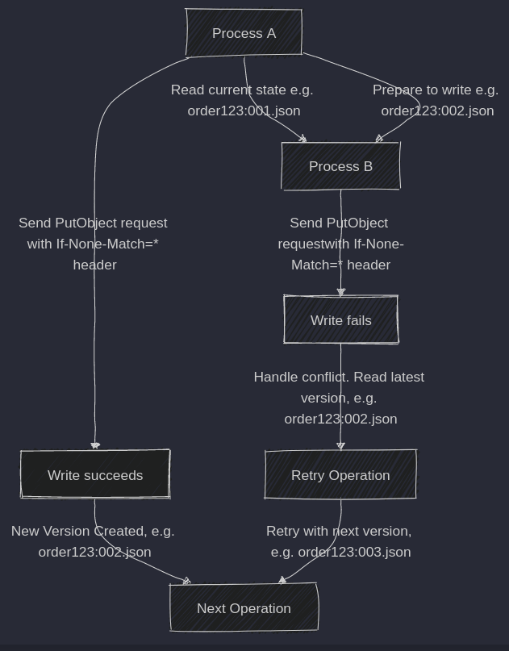
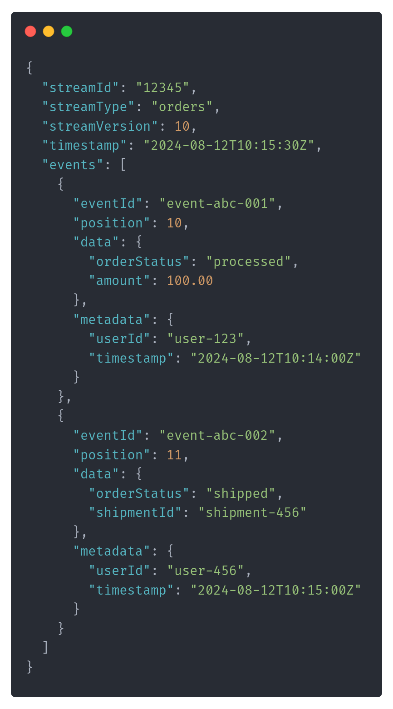
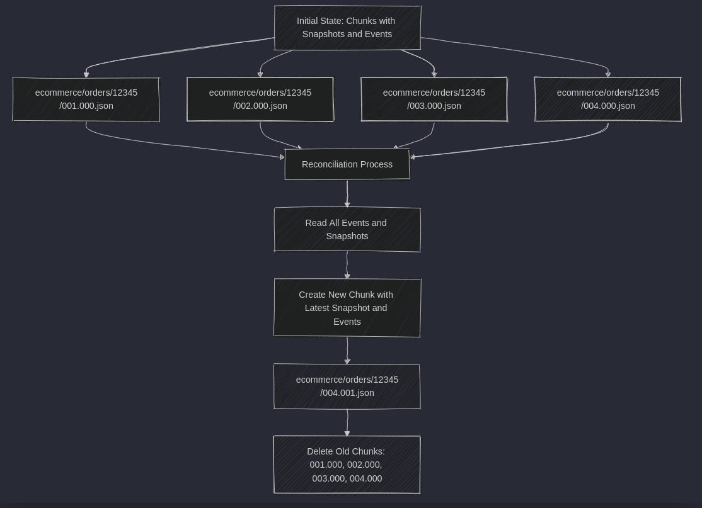

Welcome to the new week!

**Hype is strong in our industry, but the most powerful news usually comes surprisingly silent. That’s what happened with the latest AWS S3 update.** Such a humble update on introducing new features:

-   [Amazon S3 now supports conditional writes](https://aws.amazon.com/about-aws/whats-new/2024/08/amazon-s3-conditional-writes)

Okay, it didn’t go entirely silent. Gunnar Morling did a great write-up showing how you can now conduct a [Leader Election With S3 Conditional Writes](https://www.morling.dev/blog/leader-election-with-s3-conditional-writes/).

That already shows how powerful this can be, and I want to show you today another unexpected use case of that: so **building a strongly consistent event store using conditional writes for optimistic concurrency!**

* * *

Before I move on, I promised you that once per month, I’ll write an open article for all subscribers, and this article is like that. **There is no paywall today!**

Still, check articles and webinars from last month; I think they’re worth subscribing to:

-   [#189 - Mastering Database Connection Pooling](/en/architecture-weekly-189-mastering/)

-   [#190 - Queuing, Backpressure, Single Writer and other useful patterns for managing concurrency](/en/architecture-weekly-190-queuing-backpressure/)

-   [#191 - Is It Production Ready?](/en/architecture-weekly-191-is-it-production/)

-   [#192 - Talk is cheap, show me the numbers! Benchmarking and beyond!](/en/talk-is-cheap-show-me-the-numbers/)

-   [Webinar #21 - Michael Drogalis: Building the product on your own terms](/en/webinar-21-michael-drogalis-building/)

* * *

## S3 as More Than Just Storage

Let’s take a moment to appreciate just how far Amazon S3 has come since its debut. Initially, S3 was the place where you dumped your backups, logs, and static files—reliable and cheap but not exactly groundbreaking. Fast-forward to today, S3 has evolved into something far more versatile. It’s not just a storage service anymore; it’s a foundational piece of infrastructure enabling a new wave of distributed applications and services (e.g., [Turso](https://turso.tech/), [WarpStream](https://www.warpstream.com/), etc.).

Over the years, developers have realised that S3 can be used for much more than just file storage. It’s now being used to store database snapshots, as the backbone for event-driven architectures, and as a core component in serverless computing models. S3’s flexibility, scalability, and durability have made it a go-to service for architects looking to build robust, cost-effective systems.

Read also:

-   [Werner Vogels - Building and operating a pretty big storage system called S3](https://www.allthingsdistributed.com/2023/07/building-and-operating-a-pretty-big-storage-system.html)

However, as we push S3 into these new roles, we encounter challenges that weren’t part of its original design brief.

**One of the biggest challenges is managing concurrency—ensuring that multiple processes can read and write data without stepping on each other’s toes. This is where S3’s new conditional writes feature comes in.**

## Why Conditional Writes Matter

Conditional writes are a game-changer for anyone looking to use S3 in more complex scenarios. At its core, a conditional write is a way to ensure that an update only happens if the data hasn’t changed since you last read it. This might sound simple, but it’s incredibly powerful when you’re dealing with distributed systems, where multiple processes might try to update the same data simultaneously.

S3 didn’t have this capability for a long time, which meant you had to rely on external systems—like DynamoDB or even running your own databases—to handle this kind of concurrency control. This added complexity, cost, and operational overhead. With conditional writes, S3 can now manage this itself, making it a more attractive option for a broader range of applications.

So, what does this mean in practice? S3 can now serve as the foundation for a new generation of tools and services. Take Turso, for example, a service that uses a custom fork of SQLite to handle multi-region, low-latency data storage. Or Warp Stream, an event streaming service that benefits from the ability to store, process, and replay events in a distributed manner.

These tools are pushing the boundaries of what’s possible with cloud storage, and S3’s conditional writes are a key enabler. By allowing developers to implement optimistic concurrency directly in S3, these tools can offer strong consistency guarantees without the need for complex, external coordination mechanisms.

## Optimistic Concurrency and Conditional Writes: Why It Matters

Every system faces the challenge of concurrency. Imagine you’re managing an order system for an e-commerce platform. Orders come in from multiple sources, and various microservices interact with the same data. For example, one service processes payments while another updates the inventory. Both might attempt to update the same order simultaneously. Without proper concurrency control, race conditions and data corruption can occur.

**Optimistic concurrency is a strategy where we (optimistically) assume that a scenario will be rare when more than one person tries to edit the same resource (a record).** This assumption is correct for most system types. Having that, we can compare the expected record version (or timestamp) with the actual version in the database. If they match, then we perform the update. If the data has changed, the transaction is aborted, and the process can handle the conflict—often by retrying or alerting the user.

Read more details in my other articles:

-   [Optimistic concurrency for pessimistic times](/en/optimistic_concurrency_for_pessimistic_times/)

-   [How to use ETag header for optimistic concurrency](/en/how_to_use_etag_header_for_optimistic_concurrency/)

Optimistic concurrency and atomic writes ensure that our decisions are based on the latest state. This capability is also one of the most [important differences between databases and messaging tooling](/en/event_streaming_is_not_event_sourcing/).

**How do you implement something similar with Amazon S3, primarily designed for storing files, not managing transactions?**

Before S3 introduced conditional writes, implementing optimistic concurrency was tricky. S3 didn’t natively support the ability to check whether an object had been modified before writing an update, leaving developers to cobble together various workarounds. These workarounds often involved additional infrastructure, such as using DynamoDB to track versions or implementing custom locking mechanisms, adding complexity and cost.

### The First Attempt: Using S3 Without Version Control

Let’s start with the most common approach: storing each order as an object in S3 without any version control. For instance, you might store an order with the key _order123.json_.

When a process updates the order, it overwrites the existing _order123.json_ file with the new data (S3 cannot patch or append data to a file. Files in S3 are immutable).

If two processes try to update the order at the same time, the last one to finish will overwrite the changes made by the other, leading to potential data loss.

This approach clearly lacks the necessary controls to manage concurrency, as it doesn’t prevent overwriting data.

### Adding Version Numbers to Object Names

To address this, you might consider adding a version number to the object names, such as _order123:001.json_, _order123:002.json_, and so on. This way, each update creates a new version of the order.

When a process updates an order, it writes a new object with the following version number, like _order123:002.json_. While this prevents overwriting the previous version, there’s still no mechanism to ensure that the version being updated is the latest one. Two processes could still generate the same new version number, _order123:002.json_, leading to a race condition where one update overwrites the other.

### Why Not Use S3’s Native Versioning?

S3 has a built-in versioning feature, where you can enable versioning on a bucket, and S3 will automatically keep track of all versions of an object. However, this doesn’t solve the problem of optimistic concurrency because:

-   **No Conditional Checks**: S3’s native versioning doesn’t allow you to check which version of an object you’re updating conditionally. It simply stores every update as a new version, regardless of whether the object has been modified since you last read it. Essentially, the next version of a file is a different file, just sharing the file name, differentiating with the version number.

-   **Lack of Granular Control**: You can’t enforce a rule that says, “Only update this object if it’s still on version 001.” This lack of control means you can still face race conditions and data integrity issues.

## The Solution: Using Conditional Writes with Custom Versioning

Given these limitations, we can use S3’s conditional writes feature to implement a custom versioning strategy that supports optimistic concurrency. Here are the ingredients to make it work:

**1\. Naming Strategy**

We’ll use a structured naming convention for our objects, including the version number as part of the object key. For example, an order might be stored as _ecommerce/tenantA/orders/12345/001.json_.  

The \`001\` in the key represents the order's version. Every time the order is updated, a new object with an incremented version number (e.g., _12345:002.json_) is created.

**2\. Using \`If-None-Match\` for Conditional Writes:**

We use the _**If-None-Match=”\*”**_ header when updating an order. This tells S3 to only proceed with the write operation if an object with the specified key (e.g. _order123:002.json_) does not exist.  

This prevents two processes from creating the same version number, ensuring each update creates a new, unique version.

**3\. Handling Conflicts:**

If the _**If-None-Match=”\*”**_ condition fails (resulting in a _\`412 Precondition Failed\`_ response), it means another process has already created that version. The process can then reread the latest version, resolve the conflict, and retry the operation with the next version number.

For instance:



### The key to consistency is a proper key strategy

Yeah, it's a lame joke that I’m famous for, but that’s true. When working with S3 to implement optimistic concurrency, we need a structured and predictable file naming convention to manage versions effectively. The naming strategy we’ve chosen is:

_**{streamPrefix}/{streamtType}/{streamId}/{streamVersion}**_

We’re building an event store here. Event stores are (logically) key-value databases; the key is a record, and the value is an ordered list of events. In relational databases, records are called rows; in document databases: documents; in Event Sourcing, they’re called streams.  

I wrote about it longer in my [my article](/en/event_stores_are_key_value_stores/). I also explained how to build your own on relational database. In one hour!

`youtube: [Embedded video](https://www.youtube.com/watch?rel=0&autoplay=0&showinfo=0&enablejsapi=0&v=gaoZdtQSOTo)`

Here, we’re building an event store in one article! Huh!

Let’s break this down:

-   **Stream prefix:** This is an optional part of the path that can be used to organise your streams by system, module, tenant, or any other logical grouping. For example, if you’re working with a multi-tenant system, this prefix could be the tenant ID or name, allowing you to partition your data easily, e.g. by the tenant.

-   **Stream type:** This denotes the category of stream, such as orders, payments, or shipments (think process or entity type traditionally). It helps categorise the different types of data you’re storing, which is crucial when you have a complex system with multiple data streams.

-   **Stream id:** This is the unique identifier for the specific stream. For example, it could be the order ID in an order processing system.

-   **Stream Version:** This is crucial to managing concurrency. It’s an auto-incremented version number that represents the current state of the stream. Each time an update is made, this number increases by one, ensuring that each stream version is uniquely identifiable.

**Stream Version should be gapless and not tied to streams or operation events count.** This is important because if two processes tried to append events simultaneously, and if the version was tied to the number of events, they could generate the same version number, leading to data integrity issues. Using a gapless, auto-incremented version number ensures that each update has a unique version.

For example, consider two processes trying to append events to the same stream:

1.  **The stream initial stream version is** _**008**_**.** Process A tries to append 2 events, and Process B tries to append 1 event simultaneously.

2.  **Process** **A** would name the next chunk with **version** _**010**_ (_008_+2),

3.  **Process B** would name the next chunk with **version** _**009**_ (_008_+1)

4.  **This would lead to both updates being accepted,** as there were no files named like that and even with conditional writes, we wouldn’t be able to detect it (as they check if the file exists or not). That could mean an inconsistent state.

An autoincremented, gapless version based on the previous file name would not allow that, as both would try to append the file name with version _009_.

**Essentially, the stream version is a [logical timestamp](https://martinfowler.com/articles/patterns-of-distributed-systems/lamport-clock.html).**

### Finding the latest chunk

Such a key structure also allows for finding the latest chunk. We can use the [list objects API together with filtering](https://docs.aws.amazon.com/cli/v1/userguide/cli-usage-filter.html#cli-usage-filter-server-side) and determine the latest chunk by checking the LastModified timestamp provided by S3. For instance, using the AWS CLI:

```
aws s3api list-objects-v2 --bucket your-bucket-name --prefix 'ecommerce/tenantA/orders/12345/' --query 'Contents | sort_by(@, &LastModified)[-1].Key' --output text
```

This command lists all objects with the stream name prefix _ecommerce/tenantA/orders/12345/_ and sorts them by the built-in _LastModified_ timestamp This will work as we’re just doing append-only operations.

The _\[-1\]_ index retrieves the last item in the sorted list, corresponding to the most recently modified chunk.

**The filtering happens on the server side, but sorting on the client side poses a challenge, as if you have more than 1000 chunks, you’ll need to paginate the result.** If that happens, you can also keep the metadata file containing information about the last modified chank and update it once per few requests. Then you can add filtering param _\--start-after_ that skips over files that come before the specified key, potentially speeding up the listing process.

You can also reconcile old chunks, but we’ll discuss that later.

### Example chunk structure

The JSON file stored in S3 will contain metadata about the stream and the events. Here’s an example structure:



## The Write-Ahead Pattern: A Familiar Approach

Our outlined approach is strikingly similar to the write-ahead pattern used in databases. In traditional databases, a write-ahead log (WAL) ensures that any changes to the data are first recorded in a log before they’re actually applied to the database. This ensures that even in the event of a crash or failure, the database can recover by replaying the log and returning the system to a consistent state.

In our case, each stream operates similarly. We append new events to a chunk file in S3, with each version of the stream corresponding to a new update. This ensures that our event stream is always consistent, and if something goes wrong, we can trace back through the versions to recover the correct state.

**However, unlike traditional databases that might use a single log for the entire system, our approach involves multiple logs—one for each stream.** This logical grouping allows us to efficiently read and write data per stream, making it scalable across different use cases, like processing orders, payments, or shipments. Read more [in What if I told you that Relational Databases are in fact Event Stores?](/en/relational_databases_are_event_stores/)

While this approach ensures consistency and helps manage concurrency, it comes with **cost considerations that are particularly relevant when using S3 for event sourcing.** In a typical event sourcing scenario, every time you want to build the state of an entity (like an order), you need to read all the events in the stream from the beginning to the current state. This means every operation could potentially involve reading all the chunks associated with a stream.

And here’s where the S3 costs start to add up: S3 charges you for each GET request. If your stream is divided into multiple chunks, you’ll need to make multiple GET requests to read all the events. While each GET request might not be expensive on its own, the costs can accumulate quickly, especially as your streams grow and you have to read through more and more chunks.

## Snapshots to the rescue, yuk…

Here comes the part that I’m afraid of the most. I spend months explaining not to use snapshots. E.g. through articles:

-   [Keep your streams short! Temporal modeling for fast reads and optimal data retention](https://www.eventstore.com/blog/keep-your-streams-short-temporal-modelling-for-fast-reads-and-optimal-data-retention)

-   [Implementing Closing the Books pattern](/en/closing_the_books_in_practice/)

-   [Should you always keep streams short in Event Sourcing?](/en/should_you_always_keep_streams_short/)

-   [Event Streaming is not Event Sourcing!](/en/event_streaming_is_not_event_sourcing/)

Or in the talk:

`youtube: [Embedded video](https://www.youtube.com/watch?rel=0&autoplay=0&showinfo=0&enablejsapi=0&v=gG6DGmYKk4I)`

**TLDR. Snapshots are performance optimisation, a cache. As with each type of cache, they should be used with caution.** The idea of a snapshot is to periodically store a full representation of the current state of an entity so that you don’t have to replay all events from the beginning every time you need to rebuild the state. If you’re using a traditional database, this is most often premature optimisation, as events are small, and it doesn’t cost much to read events. Thanks to that, we’re not falling into cache invalidation issues and other mishaps I outlined in linked articles.

**Still, in our S3-based approach, snapshots can actually be a cost-effective solution.**

**By adding a snapshot to each chunk, we can dramatically reduce the number of GET requests** required to read the full state of an entity. Instead of reading all the events from the beginning, we can read the latest chunk containing the most recent snapshot and subsequent events. This way, even if the stream has hundreds or thousands of events, you only need to retrieve the latest chunk to get the current state.

**Since S3 charges per request rather than per data transfer** (assuming your infrastructure, like AWS Lambda or EC2, is also hosted within AWS), combining events and snapshots into a single chunk can lead to significant cost savings. You’re minimising the number of requests while still keeping your data access efficient.

**Of course, there’s a trade-off to this approach.** Each snapshot increases the size of your chunk files, slightly raising your S3 storage costs. If your snapshot becomes invalid—perhaps because of a schema change in your application—you’ll need to read all the events from the beginning of the stream to rebuild the state. This can negate the cost savings we’ve discussed, so managing this carefully is important.

**One way to mitigate this risk is by versioning your snapshot schema.** When you store a snapshot, include the schema version alongside it. Your application can then check if the stored snapshot’s schema version matches the current schema version in your code. If they match, you can safely use the snapshot. If they don’t, you’ll need to replay all events to rebuild the state and store a new chunk with the updated schema in the next chunk.

For that our chunk file name could be:

_**{streamPrefix}/{streamtType}/{streamId}/{streamVersion}.{chunkVersion}**_

Having the example series of chunks:

```
ecommerce/orders/12345/001.000.json
ecommerce/orders/12345/002.000.json
ecommerce/orders/12345/003.000.json
ecommerce/orders/12345/004.000.json
```

After merging those chunks and reconciliation, we’ll get a new file:

```
ecommerce/orders/12345/004.001.json
```

It’ll contain the rebuild snapshots and possibly all events from the previous chunks, allowing you to delete the old ones and reducing the storage cost.



Following this convention, you can quickly identify the latest chunk using the highest chunk version within the current stream version. This simplifies the process of retrieving and updating your data.

Yet, we also need to clear those unused chunks at some point, which means we need to do DELETE operations for each chunk file. We can also optimise the storage costs by benefiting from various storage classes like [S3 Intelligent-Tiering](https://docs.aws.amazon.com/AmazonS3/latest/userguide/intelligent-tiering-overview.html) and [S3 Glacier](https://aws.amazon.com/s3/storage-classes/glacier/), which allow us to move automatically not-accessed data to lower-cost storage (and old chunks won’t be accessed).

**Managing snapshots and handling schema migrations can add complexity to your system.** Storing snapshots increases your storage needs, but the reduced number of GET requests often offsets this. There’s no free lunch!

### Two points for ~Griffindor~ S3: Real-Time Notifications

One of Amazon S3's compelling features is its [ability to send notifications](https://docs.aws.amazon.com/AmazonS3/latest/userguide/EventNotifications.html) when objects are created or updated, making it an excellent fit for our case. When a new event or a batch of events is added to an S3 bucket, S3 can trigger notifications through Amazon SNS (Simple Notification Service) or Amazon SQS (Simple Queue Service). These notifications allow you to process new data in near real-time without needing to poll the S3 bucket constantly.

**When you upload a new chunk file—say,** _**ecommerce/orders/12345/002.000**_**—S3 can be configured to publish an event notification that a new object has been added.** This notification can trigger a Lambda function or send a message to an SQS queue, allowing your system to react to the new data immediately.

However, the S3 notification itself doesn’t contain all the event data. It simply informs you that a new object (or chunk) has been created or updated. You'll need to retrieve the object from S3 to access the actual events data.

Given that each chunk can include multiple events, snapshots, and metadata, it's often unnecessary to load the entire chunk, especially if you only need the latest events. This is where [S3 Select](https://docs.aws.amazon.com/AmazonS3/latest/userguide/selecting-content-from-objects.html) comes in handy. S3 Select allows you to query a subset of data from within an object, meaning you can pull only the specific events you need without downloading the whole file.

**In regular usage, when an application needs to rebuild an entity's current state, you can use S3 Select to load just the snapshot from the latest chunk.** This minimises the amount of data you need to load, as the snapshot already represents the latest state of the entity. When the snapshot is outdated or invalidated (for example, after a schema change). In that case, you can retrieve all events starting from the point after the last valid snapshot to rebuild the state accurately.

## Why Choose S3 Over Traditional Databases?

**Amazon S3 is known for its virtually unlimited scalability and 99.999999999% durability, which makes it an attractive option for building distributed syste**ms. Unlike traditional databases that may struggle with scaling up to handle massive amounts of data, S3 is built to handle enormous datasets efficiently. This makes it a strong foundation for event sourcing, where data grows over time.

**S3's ability to store data in various formats (JSON, Parquet, Avro) and integrate with other tools like AWS Lambda, AWS Glue, and DuckDB opens up a world of possibilities.** For example, DuckDB can efficiently scan through multiple Parquet files stored in S3, enabling complex analytics directly on your event data without the need to move it to another storage solution. This flexibility is why Turso chose S3 to back its globally distributed SQLite-based storage, leveraging S3's strengths to handle multi-region, low-latency data access.

## Cool stuff, but how much will it cost?

**S3 is incredibly cost-effective for workloads that involve large data volumes but relatively few requests, which aligns well with systems like Warp Stream.** As a streaming solution, Warp Stream can batch events, reducing individual PUT and GET requests. This batching, combined with S3's cost model, makes managing large-scale event streaming cheaper than traditional databases that might charge based on the number of transactions.

Our case is different tho, as we cannot easily batch operations. Event Store are databases, so they access and store granular data. We’ll have a lot of small files, which is not super optimal for the current S3 design.

While S3's new conditional writes open the door for optimistic concurrency control, how you structure your data, name your files, and manage versions will significantly impact both performance and cost.

While S3 has many advantages, there are scenarios where e.g. DynamoDB might be a better fit:

1.  **Real-Time Query Performance:** If your application requires low-latency, real-time queries with immediate consistency guarantees, DynamoDB is likely the better choice. DynamoDB's millisecond response times and support for complex queries make it ideal for use cases where performance is critical.

2.  **High-Frequency, Small Transactions:** DynamoDB is designed for high-frequency, small transactions. If your system performs a large number of small read/write operations, DynamoDB’s pricing model could be more cost-effective than S3. With S3, the cost per request can add up quickly, especially if you have many small, frequent transactions.

3.  **Built-In Concurrency Controls:** DynamoDB natively supports optimistic concurrency control with its _[ConditionalExpression](https://docs.aws.amazon.com/amazondynamodb/latest/developerguide/Expressions.ConditionExpressions.html)_ feature, which allows you to enforce constraints on updates to ensure that only one operation can succeed when multiple transactions are attempted simultaneously. This can be simpler to implement than S3, where you need to manually manage versioning and naming strategies.

We also need to do math, which is hard with the complex AWS pricing strategy. It may appear that, in your case, DynamoDB is actually cheaper.

Read also my detailed investigations in:

[

Architecture Weekly

Show me the money! Practically navigating the Cloud Costs Complexity

In my last article, I explored how Amazon S3’s new conditional writes feature can be used to implement a strongly consistent event store. I think that this feature opens up powerful architectural possibilities for distributed systems. But as much as we’d love to dive right into the code, there’s a bigger question to answer first: how much will it cost…

Read more

2 years ago · 1 like · Oskar Dudycz

](/en/show-me-the-money-practically-navigating/)

## Verdict: yay or nay?

**S3’s evolution from simple file storage to a robust, scalable backbone for distributed systems is driving a new wave of cloud-native tools.** Introducing conditional writes is a significant step forward, enabling more sophisticated use cases like optimistic concurrency control. While there are still limitations—such as the lack of an \`If-Match\` header—S3’s flexibility, scalability, and integration with other AWS services make it an increasingly attractive option for modern architectures.

We’re already seeing companies like Turso and Warp Stream take advantage of these capabilities, building innovative solutions that push the boundaries of cloud storage. As AWS continues to enhance S3’s feature set, we’ll likely see even more tools and platforms built on top of this versatile service, further pushing its role as a foundational piece of modern cloud infrastructure.

Whether you're building event-driven architectures, distributed databases, or advanced analytics platforms, understanding the nuances of S3’s capabilities and costs will be crucial. With the right strategies in place, S3 can offer both the performance and cost-effectiveness you need to build robust, scalable systems.

Still, seeing how S3 advances, we may see a next step, offering more advanced conditional writes and that can totally break the status quo. If S3 were to support an \`If-Match\` header, it would allow developers to implement true optimistic concurrency control, where updates are only applied if the current version matches the expected version. This would reduce the likelihood of conflicts and errors in distributed systems.

**With enhanced concurrency controls, we could see more cloud-native tools and platforms built directly on top of S3.** Tools like Turso and Warp Stream are already leveraging S3 for its scalability and flexibility, but additional features like \`If-Match\` could further solidify S3 as a core component in more sophisticated cloud architectures.

**I’m considering trying to implement such an event store with Emmett. I already support PostgreSQL and EventStoreDB, so why not try what I wrote above? If you’re curious about the effort, ping me! Especially if you’d like to use or sponsor such an event store!**

You don’t know what’s [Emmett](https://event-driven-io.github.io/emmett/getting-started.html)? Check [docs](https://event-driven-io.github.io/emmett/getting-started.html), and join our [Discord server](https://discord.gg/fTpqUTMmVa)!

If you’d liked this article, please subscribe; I’m doing such deep dives every week!

Cheers

Oskar

p.s. **Ukraine is still under brutal Russian invasion. A lot of Ukrainian people are hurt, without shelter and need help.** You can help in various ways, for instance, directly helping refugees, spreading awareness, putting pressure on your local government or companies. You can also support Ukraine by donating e.g. to [Red Cross](https://www.icrc.org/pl/donate/ukraine), [Ukraine humanitarian organisation](https://savelife.in.ua/pl/donate/) or [donate Ambulances for Ukraine](https://www.gofundme.com/f/help-to-save-the-lives-of-civilians-in-a-war-zone).
