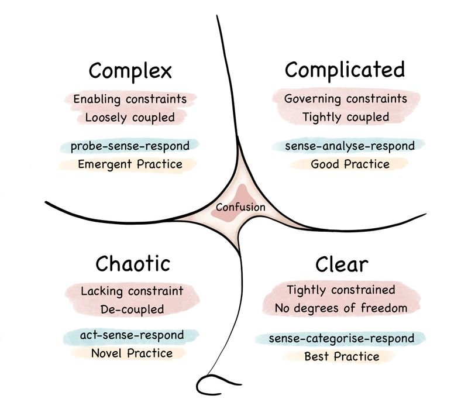
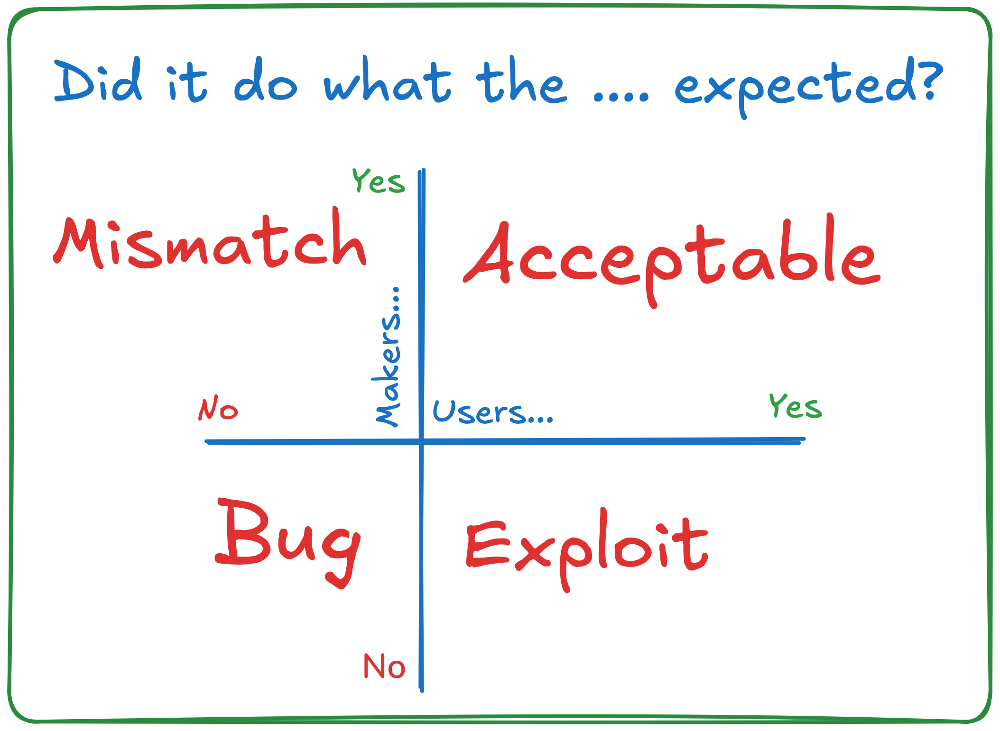

Welcome to the next week!

**Did you watch or listen to the last releases with our special guests?**

-   [On Performance Testing with Jarosław Pałka](/en/webinar-22-on-performance-testing/)

-   [Gojko Adzic on designing product development experiments with Lizard Optimization](/en/webinar-23-gojko-adzic-on-designing/)

Maybe you thought that they were sidetracks of the observability series, so the previous editions we did?

-   [Is It Production Ready?](/en/architecture-weekly-191-is-it-production/)

-   [When Logs and metrics are not enough: Discovering Modern Observability](/en/when-logs-and-metrics-arent-enough/)

-   [Making your system observability predictable](/en/making-your-system-observability/)

If you did, then that’s not quite the intention I had behind them. Ok, so what was it?

**I wanted to look on observability, measurements, and instrumentation from different perspectives.** Observability is not only about the technical CPU metrics or memory usage; it’s about getting insights into our system's behaviour. Moreover, those insights are not worth a penny if we cannot take benefit of them.

Before I tell you the story of my project, let’s see what our guests said.

Gojko highlighted that we live in an unpredictable world and need to accept it. We cannot predict everything, but we can prepare our systems by making them observable, which will at least give us tools for investigation.

> Some things, you will never be able to explain, like why people, I mean, why people are uploading MP3 files, I don't know. I've tried to get in touch with a few of them. They don't respond to my emails. Some of these things just happen.
>
> Some of these things are weird things that are caused by third-party browser extensions or things like that. **There's going to be a lot of noise. Any kind of exception tracking and error tracking, there will be a lot of noise and then The question is whether you want to dig into that and figure out something.** It's just one tool. It's not the only tool. It's not the best tool for everything. It's one tool that I thought would be interesting for people to learn about.
>
> **Primarily because I think when something like that happens and when we make a discovery like that, people usually attribute it to luck or serendipity.** And I think there's a process to make these kinds of lucky accidents systematic. I think lucky accidents happen to everybody, but you need to understand that a lucky accident happened to you.
>
> **And you need to understand the context of it to be able to benefit from it.** Otherwise, you're missing the opportunity. And I think that's kind of my lizard optimization is my attempt to make that systematic so that people can approach it in a more systematic way.

In my opinion, that also goes pretty well with **[Cynefin framework](https://en.wikipedia.org/wiki/Cynefin_framework)** .

## Knowns and unknowns

**It states that we have four types of decision-making contexts (or** _**domains**_**): clear, complicated, complex, and chaotic.** They also add confusion to the mix. And that sounds like a fair categorisation of the problems we face.

Clear issues we solve on autopilot, chaotic ones we tend to ignore, and complex ones sound like a nice challenge. And complicated problems? We call them tedious.

**Complex problems are called** _**unknown unknowns**_**.** This is the place where we feel creative; we do an explorer job. We probe sense and respond. The _design emerges_ and _Agile shines_. We solve it, and then we go further into the sunset scenery like a lonesome cowboy. Off we go to the next exciting problem.

**Complicated issues, on the other hand, are** _**known unknowns**_**.** They represent something that has to be done. If we have the expertise, we can sense it with our educated gut feeling, analyse it and respond with a solution. In other words, we usually know _what_ we need to do, but we need to find an exact _how_ to solve it. Unknowns are more tactical than strategic. (Read also more in my article [Not all issues are complex, some are complicated. Here's how to deal with them](/en/how_to_solve_complicated_problems/)).

While doing design sessions, building our user personas, and interviewing domain experts and potential users, we’re trying to discover as much as we can and make some predictions on the outcomes. By that, we’re trying to reduce our Complex and Chaotic problems into smaller, manageable, Clear or Complicated features.

**Still, as [Gojko nicely explained in his recent article](https://gojko.net/2024/09/30/from-bugs-to-beam/), there’s always a potential mismatch between our and users’ expectations:**

[https://gojko.net/2024/09/30/from-bugs-to-beam/](https://gojko.net/2024/09/30/from-bugs-to-beam/)

The best case is when we have alignment with our users and reach an acceptable outcome. The others are least preferable; we’re getting

-   a **bug** if, together with users, we observe the unexpected behaviour. That’s still easy, as we both agree that this is unexpected.

-   an **exploit** if users’ expectations are far from ours. This can be a security breach or abusing our system in an unpredictable way. This can either make our pricing strategy ineffective or even kill our business. The most famous is the [Knight Capital One case, where one mistake in deployment caused a $440 million loss in 45 minutes](https://en.wikipedia.org/wiki/Knight_Capital_Group).

-   a **mismatch** if what we expected is unexpected by users. That means that what we deliver is either not aligned with user needs or solving their needs incorrectly.

**We need data to understand whether our expectations about complexity and user needs match reality.** And here’s my story.

## A clickbait feature goes rogue

We were making a cloud version of our legacy product. By legacy, I mean that it was written in an old tech stack but still used and paid for by the users. It was the system used to manage, share and exchange big project files (one file could have over a few gigabytes).

The project solved the needs of a specific niche business domain. New customers were asking for a cloud solution. They didn’t want to install software on-premise. Also, some current clients wanted easier remote access to their on-premise systems (e.g., through mobile, web interface, etc.). Still, the majority was fine with the current system, and persuading them to move to the cloud was hard.

For the company, the intention was to, of course, follow the Pareto rule and deliver 20% of features that give 80% of benefits for the current users, getting lower maintenance costs and more flexibility to move forward.

**The product and sales team decided to bait the current customers by exposing full-text capabilities for the on-premise files through the cloud.** Teams added a small change that briefly pushed parsed files (meta)data from on-premise to the cloud. Then, it was indexed in Elasticsearch and exposed in Web and Mobile through the API.

Then boom bada bing, bada boom. Big announcement to all on-premise customers that they can enable that for free and use it through new Cloud services. Of course, most of the customers enabled it. For free is a decent price, right?

**So, great success? Not!**

**At some point, management wasn’t happy with the costs of our cloud solution.** Although only a few companies were using it, the spending was high, so an investigation started.

We gathered some metrics, and it appeared that most spending is on Elasticsearch. Yet, we didn’t know why, as there was no proper instrumentation. Elasticsearch was used in a few places in our system.

**After adding proper observability, it appeared that our full-text indexing of on-premise files caused around 90% (or more) of spending.** Then we compared it with the business usage of the Cloud search feature, and you know where is it going.

**Only one customer was using it, and rarely.** Before I close the curtain, I’ll add that when we asked them if they were fine with removing this feature, they immediately waved their hands and said: yeah, kill it; we don’t need it.

* * *

That was a lesson that mismatches can be extremely harmful; the same goes for exploits.

That’s why I’m recommending now to:

-   define the expected **measurable** outcome of our feature, ensuring that we produce enough data to measure it. This can be regular business data, telemetry, or events in the analytics system. Whatever works for us.

-   build the metrics and verify the proceeding in some time,

-   review and recap how it is going, whether we need to pivot or even kill a feature.

Still, by that, we’re covering known knowns and unknown unknowns. We need to produce data and gather error reports to analyse those unknowns. That’s why I like the idea of [Lizard Optimization](https://leanpub.com/lizardoptimization/c/i12lFE3oPrg9.). It allows us to provide systematic experiments to gain more insights into the complex, chaotic world.

* * *

## Mechanical sympathy and Observability

**Looking from a purely technical perspective, our classical measurements, metrics, alarms, etc., represent either known knowns or known unknowns—things** that we can predict.

**Known knowns?** For instance, we can predict that our disk space may become filled up. We can set up alarms to inform us when our disk space is reaching the limit. We can schedule the archiving process and clean up space periodically.

**Known unknowns?** We know that, technically, our CPU may reach 100% or that we have some memory leak that will cause our RAM to fill up. Of course, if we know that our code may cause memory leaks or overflows, we should fix that issue, right? Right? [Right Boeing](https://www.i-programmer.info/news/149-security/8548-reboot-your-dreamliner-every-248-days-to-avoid-integer-overflow.html)?

Still, failures will happen. We’re not perfect, and we need to understand that we know the possible outcome. But we may not know the reason in advance.

And the most dangerous parts are also related to unknown unknowns, especially in the complex domain or technical solutions.

**We can also map those two quadrants to technical solutions.** Cynefin, I think that’s obvious. The expectations? Think about our expectations and the reality of how our systems behave. I’m sure you had cases where the technology, framework, and deployment environment behaved much differently than we expected.

**In that case, we’re the users and cloud providers, and the tools creators are the authors. We’re just switching places, but the consequences are similar.**

## Costs of observability

Yet, we need to be real. Everything has its costs. Not all companies are in such an excellent situation to [lightheartedly pay $65M/year for observability](https://blog.pragmaticengineer.com/datadog-65m-year-customer-mystery/). None of those I was working on were, and I bet that yours also is.

That’s why we must think about the strategy and try different ways to build our observability strategy.

**Jarek Pałka gave such a recommendation on strategy for balancing the load test costs:**

> I would start with a high-level end-to-end test. And then use regressions.
>
> For example, if you find regression and identify that this code path caused it, then say, "Okay, I will write a specific benchmark for this specific because we know this code already regressed."
>
> You can put some criteria, for example, like, okay, if it regresses three times over like, you know, six months, it means, okay, there's a lot of changes probably going in this code, people are constantly changing, or the requirements are changing, whatever reason for changes.
>
> So then you use this high-level test to say, okay, which things need to be covered with benchmarks, like more specific. So I would go from, like, you know, top-level end-to-end because they will give you a better safety net.

That makes sense because you already get hints on what to focus on without spending too much time. And we all know that performance is not a priority unless it starts to be a priority.

**Taking that back to a higher level makes our system observable. We can start with known-knowns and known unknowns.** Metrics are cheap, as they’re snapshots of the last known system state. If we focus on the business metrics and analyse our product in terms of complexity and user needs, we can use them to reflect known known and known unknowns.

Yet, we should not stop on that. We must provide granular and rich observability data so that traces and events capture technical and product contexts.

**How can we make detective work if our system leaves no traces?**

We need to correlate data, dice and roll it, as I showed in [When Logs and metrics are not enough: Discovering Modern Observability](/en/when-logs-and-metrics-arent-enough/).

To limit costs, we should define our observability pipeline, which includes filtering, retention policy, sampling and other tools that can make our data meaningful enough but also cost-effective.

**But that I’ll try to cover in the next editions.**

What are your thoughts and approach to measuring unmeasurable?

**And I’d like to know what’s interesting and what’s not.**

**Your thoughts mean much to me, and I'd like to make this newsletter useful for you! Please respond to this email, comment, or fill out this short survey: [https://forms.gle/1k6MS1XBSqRjQu1h8](https://forms.gle/1k6MS1XBSqRjQu1h8)!**

Cheers!

Oskar

p.s. **Ukraine is still under brutal Russian invasion. A lot of Ukrainian people are hurt, without shelter and need help.** You can help in various ways, for instance, directly helping refugees, spreading awareness, and putting pressure on your local government or companies. You can also support Ukraine by donating e.g. to [Red Cross](https://www.icrc.org/pl/donate/ukraine), [Ukraine humanitarian](https://savelife.in.ua/pl/donate/) organisation or [donate Ambulances for Ukraine](https://www.gofundme.com/f/help-to-save-the-lives-of-civilians-in-a-war-zone).
