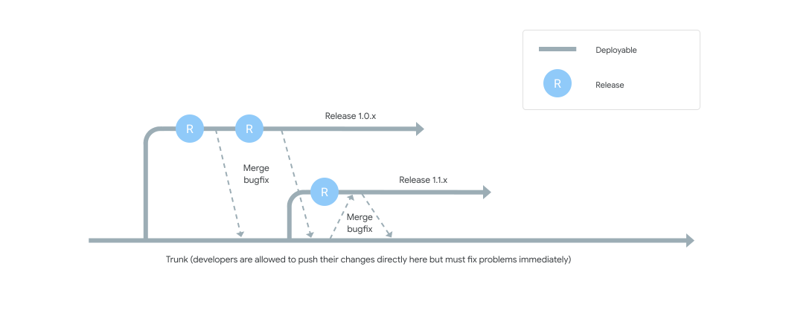

Welcome to the new week!

**We're searching for simple answers to hard problems. We scroll through social media, getting 10-30 seconds of "life hacks.".** Just like in the James Bond movies, the message disappears right after it is read. And that's a good thing, as it'd be more dangerous if we actually try to apply them in practice.

I think we're in times when we're getting more often edutainment rather than actual education. Our dopamine is boosted by taking a dose of those quick answers. We get the feeling, "hey, I just learned something new!". But do we?

The advice-givers usually don't have bad intentions. Most of the time, they believe that's great advice, as it worked in their one or two projects. Quite often in none, as it describes their thought experiments.

The shortness of social media posts or short videos also does not help. To reach a wider audience, it has to be kiss, kiss, bang, bang. And if you believe your message is right, then you should try to reach wide audience, right? When in Rome, do as the Romans do.

**But that's a trap. The trap of overselling and changing your message into snake oil: a magical cure for everything.** It's even easier to fall into that if you spend too much time thinking about it or have financial incentives.

Martin Fowler, in his great article ["Advocate, educator, and authorial stance"](https://martinfowler.com/articles/authorial-stance.html), wrote:

> I see this as part of the difference between an advocate and an educator. The advocate wants the reader to agree with them, they succeed when the reader uses the technique that's being advocated. I prefer the role of an educator, I succeed if the reader makes a well-informed decision, even if the reader chooses a different path to the one that I would choose in their situation. (This also means that if the reader does the exact same thing I would have done, but does it just because "Martin said so ", not understanding the trade-offs properly - then I've failed.)

That's one of those articles I get back quite a lot as a reminder of where I should also be in my work. Am I succeeding? Dunno, you tell me.

What I know, though, is that there are leitmotifs in my bubble that I see as harmful and misleading. Not because they're wrong per se but because of how they're presented. They oversell the idea without explaining to people what they're signing for. And that's dangerous.

## Trunk-Based Development

One of those oversold motifs is [Trunk-Based Development](https://trunkbaseddevelopment.com/). One branch to rule them all.

What's Trunk-Based Development? From the [DORA website](https://dora.dev/capabilities/trunk-based-development/):

> There are two main patterns for developer teams to work together using version control. One is to use feature branches, where either a developer or a group of developers create a branch usually from trunk (also known as main or mainline) and then work in isolation on that branch until the feature they are building is complete. When the team considers the feature ready to go, they merge the feature branch back to trunk.
>
> The second pattern is known as trunk-based development, where each developer divides their own work into small batches and merges that work into trunk at least once (and potentially several times) a day. The key difference between these approaches is scope. Feature branches typically involve multiple developers and take days or even weeks of work. In contrast, branches in trunk-based development typically last no more than a few hours, with many developers merging their individual changes into trunk frequently.
>
> The following diagram shows a typical trunk-based development timeline:
>
> 

A similar definition can be found in other places.

**In a nutshell, Trunk-Based Development is "just" a branching strategy.** Focused on minimising the lifetime of changes made outside the main branch. That can be done by either committing directly to the main branch or having some short-living branches.

**Clearly, this definition doesn't forbid the branches, reviews, pull requests, etc.** Yet most of the time, trunk-based development is shown as the opposite of them. Too often, we're being pushed with absolutes like:

-   pull requests are the root of all evil,

-   just do pair reviews,

-   no trunk-based development - no continuous integration,

-   pair and mob programming and trunk-based development are the only ways to deliver good and fast.

**Don't get me wrong; I like to keep branches short-living, I like to pair, and I'm not a fan of nitpicking in pull request reviews or delivering slowly.** I'm all for that, but with the right proportions and embracing that different organisations are on different levels of "process maturity." Not all can just throw away their current practices and turn them upside down, even if the new ones are considered "best practices."

Giving advice is not as simple as:

-   make small and short Pull Requests,

-   write simple code,

-   use trunk-based development.

**Those are thank-you-for-nothing pieces of advice that are not actually actionable.** All of that represents the outcome of our development process, not the process itself. What does that even mean, short, small, simple? Ask your colleagues; I guess that each person will give a different answer. Applying such simple recipes applied in isolation will not change the overall picture.

**I would prefer to see real studies on how to approach organisational evolution, when and how to do it. And when** **to say "enough is enough".** Of course, I don't want reports like the [(in)fameous McKinsey report on developer productivity](https://www.mckinsey.com/industries/technology-media-and-telecommunications/our-insights/yes-you-can-measure-software-developer-productivity). I don't want to see reports focusing on the differences in the exact code lines or minutes spent metrics. Most of those I saw are missing the point, not understanding the difference between correlation and causation.

**Being in the industry for over 17 years is a privilege.** I remember how it looked when I started. Those were days before StackOverflow existed. They were weird and dark times. I saw the initial trunk-based development and remember why [Git Flow](https://nvie.com/posts/a-successful-git-branching-model/) and Pull Requests became popular. There was a reason for that.

Gilbert Chesterton wrote about this type of change using the metaphor of a fence:

> There exists in such a case a certain institution or law; let us say, for the sake of simplicity, a fence or gate erected across a road. The more modern type of reformer goes gaily up to it and says, "I don't see the use of this; let us clear it away." To which the more intelligent type of reformer will do well to answer: "If you don't see the use of it, I certainly won't let you clear it away. Go away and think. Then, when you can come back and tell me that you do see the use of it, I may allow you to destroy it.

So, if we want to throw away the fence of code reviews and pull requests, we should understand why they were created and what problem they're trying to solve.

**When I started my career, code repositories weren't even a standard in the industry.** Of course, most companies used some code versioning systems, but not all cared enough. The standard was [SVN](https://en.wikipedia.org/wiki/Apache_Subversion). Each company had to keep its own system. SVN had a main branch called trunk, thus "The initial trunk-based development," as I call it.

It was a nightmare. SVN didn't have local branches like Git. So you were actually forced to always push your changes to remote. Of course, you could push it to the remote non-main branch, but the branching merging was a nightmare. Quite often, the team had a person who was called to do the merges, as it required a specific craft not to break the main branch.

**Most just didn't use any branches. In one of my projects, we had a dedicated Skype group to say that we were about to merge a new commit and then send a follow-up to our colleagues asking them to get new changes as fast as possible.** Without that, you would constantly be hitting merge conflicts. And then, you had to call _"the Conflict Resolution Maestro"_ to help it. Or if you were keeping this title (as I did), then you were constantly distracted going to help others.

In addition, unit and automated testing weren't so common. There was no GitHub or Gitlab, and most companies ignored continuous integration and continuous development practices. That somehow worked sometimes. As the projects were smaller and not distributed, people sat together. And no, it's not a point for "back to office" practices. The quality was just terrible compared to now.

No, it wasn't as pictured now, that if you use trunk-based development, you'll immediately get better collaboration. Most people didn't care about that; they were just delivering more code. There were just more arguments about "Who broke my code?!". People are people.

Then, our industry expanded, teams became bigger and more distributed, Git came, and better CI/CD tooling, code reviews, and agile practices became popular. They were meant to deal somehow with growing complexity and the terrible quality of the delivery.

## Pull Requests are also not perfect

**Pull Requests and Code reviews obviously have their problems.** As with everything, they're just tools. We all saw bikeshedding, arguments about formatting, etc. We were all tired after keeping our branches for too long or having trouble getting feedback from our colleagues.

**However, from my experience, these are usually organisational problems that manifest themselves precisely in them.**

For example,

-   lack of trust in colleagues,

-   lack of understanding of the process (some programmers believe that issuing a PR is the end of their work),

-   not recognizing a review (any review) as something that is part of their job,

-   lack of commitment to cooperation with others.

Those issues come directly with problems with work organisation and issues in interpersonal cooperation.

I think that if we don't trust our collaborators, it's a big problem in general. Applying, especially literally, rigid rules around Pull Requests can be one of the symptoms. We often do it to have control. But what we usually get instead is a false sense of control.

Of course, we can say that pair programming or trunk-based development can replace it and that their reasonable implementation will help the process.

**That’s true, but if we don’t fix the organisation and communication, just changing the branching model won’t help. Conway’s Law is inevitable.**

[

Architecture Weekly

Papers We Love #2 - How do committees invent? (Melvin E. Conway)

Hey! 😀…

Listen now

2 years ago · 6 likes · Oskar Dudycz

](https://www.architecture-weekly.com/p/papers-we-love-2-how-do-committees?utm_source=substack&utm_campaign=post_embed&utm_medium=web)

In many organisations, people can take the _“drop pull requests”_ literally as an encouragement to rush and ignore the quality. It can be understood simply as _"we're rushing to the main branch"_. Just like in the old days.

To make the change permanent, people need to understand why it's being introduced and how it relates to other organisational changes (hence the reference to Chesterton's fence). It should be part of the program, not the only change. It’s never just do X.

## Is it “just”?

I don't like easy recipes because they only seem simple. Usually, a long tail of other things follows them.

**For instance, we hear "throw away Pull requests", and when we try to apply them, we start hearing:**

-   _and you know,_ you actually have to have feature flags so that you don't push unfinished things to production to clients,

-   _and you know,_ you need to have a continuous delivery/deployment setup,

-   _and you know,_ you also have to have the possibility of a quick rollback if something goes wrong,

-   _and you know,_ you have to have telemetry and metrics to assess whether you haven't broken something,

-   _and you know,_ you need to set up the whole environment and test all modules before pushing your code, because once you do, you may break other people's work,

-   _and you know,_ it's not that we don't do reviews; we just don't do them in GitHub,

-   _and you know,_ now we have to do pair programming,

-   _and you know,_ it would be great if we had mono repo,

-   _and you know,_ we need to have a proper folder strategy not to have constant conflicts on the rebases,

-   _and you know,_ we need to use semantic git commits as we're committing so often and integrating to understand the correlation,

-   _and you know,_ sometimes we do branches, when? It depends,

-   _and you know,_ you need to understand the testing pyramid and where each tests are called,

-   etc.

**Of course, all these directions are justified, and we should strive for them; they should be our "North Stars". We should aim to deliver proper outcomes and processes that help us with that.**

But if our process is far from that then it's not easy, and it requires time, common agreement in the organisation, careful mentoring and onboarding.

**I have the impression that many materials do not say anything about this additional package of things that are needed. Some organizations really start from the ground level.**

Different work environments require different tools and different forms of cooperation. Some people need more rigid guidelines, others quite the opposite. It depends a lot on the team itself.

The most important thing is to establish common practices and agree on them. Of course, we need to be flexible and open to change, but only when the team agrees on it. We also need to be careful about picking our battles. In many organisations, any change takes time, and we need to understand what we're signing for to make a realistic modernisation effort aligned with our state-of-the-art.

**I hope you don't take this article as "don't do trunk-based development" but rather as an encouragement to go beyond the simple advice and be sceptical of the easy answers.**

It's not only about people giving easy answers but also about us who seek them.

Some of us may consider a simple prescription a "slap on the wrist”, confirming that we don't have to invest in quality; we just throw out any review.

Some will mean well, but they won't be aware of the next steps and will throw the baby out with the bathwater.

I don't worry about the first group because they will find a way to do it wrong anyway (although it's nice to "interfere" with it a bit... ).

I'm worried about the second one.

**As architects, leaders, and educators, we should [take a "trade-off stance", as Martin Fowler nicely phrased it](https://martinfowler.com/articles/authorial-stance.html):**

> In this I assume that this promising technique has advantages compared with the alternatives, but also some weaknesses. My aim as an author is to ensure the reader takes into account all of these factors when deciding whether they want to use the technique themselves. Anything we write has lots of readers (we hope), who each have their own particular context. It’s up to them to evaluate whether a technique that worked well for us will transplant effectively to their context. By priming them with all the factors we know about, we increase the chances of them making a wise decision.

**As advice takers, we cannot take things for granted; we should do our homework and understand what's hiding behind the advice.**

Every change carries a cost and trade-offs.

And sorry, I won’t give you an easy answer in the last sentence. I’m hoping that you’ll do your homework.

If you have done it already, please reply or leave a comment. I’m curious about your thoughts and experience!

Cheers!

Oskar

**p.s. I’d like to know what’s interesting and what’s not.** Your thoughts mean much to me, and I'd like to make this newsletter useful for you! I’d be grateful for filling out this short survey: [https://forms.gle/1k6MS1XBSqRjQu1h8](https://forms.gle/1k6MS1XBSqRjQu1h8).

**p.s.2.** **Ukraine is still under brutal Russian invasion. A lot of Ukrainian people are hurt, without shelter and need help.** You can help in various ways, for instance, directly helping refugees, spreading awareness, and putting pressure on your local government or companies. You can also support Ukraine by donating e.g. to [Red Cross](https://www.icrc.org/pl/donate/ukraine), [Ukraine humanitarian](https://savelife.in.ua/pl/donate/) organisation or [donate Ambulances for Ukraine](https://www.gofundme.com/f/help-to-save-the-lives-of-civilians-in-a-war-zone).
