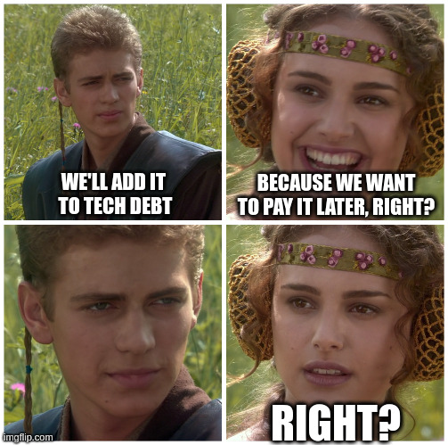
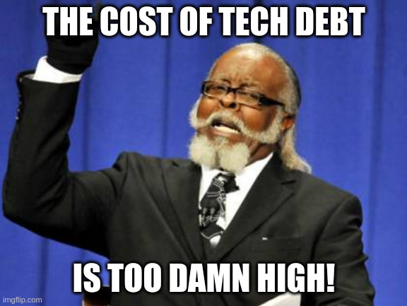

Welcome to the next week!

**I laughed hard right after entering the room. During the call, my friend Arek told someone:** _**“We’ll add it to tech debt.”**_ It was years ago, and I probably heard that term for the first time. I was in my sarcastic heyday and thought it was a good joke. But Arek didn’t make a joke. He was serious about it being in the planning meeting.

Technical debt. Reread it. It even sounds silly.

It's a term that gets tossed around a lot in our industry. We mention it in meetings, bring it up during code reviews, and use it to justify refactoring efforts. I believe that technical debt, as most people understand it, doesn't really exist. It's a convenient label that lets us acknowledge issues without actually addressing them. I’ll try to justify my bold claim in today’s edition.

## The Illusion of Technical Debt

We've all been there: tight deadlines, management pressure, and the temptation to cut corners to get something out the door. [Ward Cunningham introduced it in 1992 at the OOPSLA conference](http://c2.com/doc/oopsla92.html). He said:

> _Another, more serious pitfall is the failure to consolidate. Although immature code may work fine and be completely acceptable to the customer, excess quantities will make a program unmasterable, leading to extreme specialization of programmers and finally an inflexible product. Shipping first time code is like going into debt. **A little debt speeds development so long as it is paid back promptly with a rewrite.** Objects make the cost of this transaction tolerable. **The danger occurs when the debt is not repaid.** Every minute spent on not-quite-right code counts as interest on that debt. Entire engineering organizations can be brought to a stand-still under the debt load of an unconsolidated implementation, object- oriented or otherwise._

The classic idea of technical debt suggests that we can take a shortcut now and "pay it back" later, like borrowing time from the future. But once code is written and shipped, it's part of our reality. There's no magical account where we can deposit future work to settle the debt.

[Lannisters always pay their debts](https://www.youtube.com/watch?v=WPjXPRNQopo), and developers also do, right?

Imagine a team pushing hard to deliver a new feature. To meet the deadline, they skip writing unit tests, promising themselves they'll add them later. The feature ships on time, but the tests never get written as months pass. Is it an issue?

Some can say, _“sure: it’s a tech debt”_.

**But why is it an issue?**

Or giving you a hint: **when will it become an issue?".**

Cutting quality corners will obviously increase the likelihood of bugs and security issues. When we surface them without tests, we’ll have a harder time diagnosing and fixing them.

**But if I told you that the team were:**

-   building a proof of concept,

-   delivering an internal tool supporting the process,

-   setting up a one-time user reporting tool,

-   bumping dependencies in the legacy system,

-   doing the first change since a few years ago to the old system.

Would that change the perspective? Would you still call it a tech debt?

The quality corners could have the same scale, but the consequences would be more or less severe. Tech debt is not an issue by itself; the consequences of our decisions can become an issue.

**By labelling the absence of tests as technical debt, we postpone the real issue.** We do not acknowledge that we made a trade-off: speed over quality. The term becomes a crutch, allowing us to feel okay about not addressing the underlying problem. It’s an easy excuse.

_“I’ll just put this over here, with the rest of the fire”._

I've seen that so many times, and I’m fed up with that narrative.

We know where tech debt lands, in the dark place called the end of the Jira backlog.

## Trade-Offs: The Reality of Software Development

Software development is a series of trade-offs. Every decision we make has consequences, some immediate and some that manifest over time. Framing these decisions as "technical debt" oversimplifies the complex reality and obscures our real choices.

**When discussing the significance of tech debt, I often hear that the maintenance cost becomes bigger if we have lower quality.** I wrote in [Removability over Maintainability](/en/removability_over_maintainability/) that maintainability is pictured as an ultimate goal in our industry.

Let me tell you something: **Your system may never reach the phase where maintainability is essential.**

How come? Unfortunately, most of our systems are either moderately successful or not at all. On my own, I worked on systems that were built for a few years without even having real production usage. Unfortunately, waste of time is a big issue in our work. We’re not wasting time coding too slowly; we’re wasting time doing stuff that doesn’t matter. Also, regarding maintaining code, it should have just been removed or the systems rewritten.

**Not many of us want to work in legacy systems.** They look to us as a bad rap. They're seen as outdated, cumbersome, and in need of replacement. But these systems have been battle-tested. They've evolved over time to handle real-world scenarios that new systems might not anticipate.

Sometimes, we’re disgusted by the 10-year-old code written by numerous people. We don’t want to touch those obsolete tech stacks. We say that the tech debt is so high that we need to rewrite it, most of the time, keeping the whole system in mind. When our management asks us for justification, we try to repeat this smartly sounding statement. Then, we’re frustrated with the brutal reality check. Management says no. Why?

## Trade-off Analysis Checklist

Too often, we don’t do our homework and check if the old code and old tech stack are an issue on their own. We just want to make the change to make our life easier. But the sad truth is that it’s not an argument per se.

**What do I mean by homework?** **For instance, answering the following checklist:**

-   How often does that code change?

-   When was the last time someone touched this code?

-   How long did it take to make the last change?

-   How long do I expect my new change to take?

-   Is there a big difference between those delivery times?

-   Why is it big?

-   Can someone else with higher familiarity do it?

-   Can we do it together?

-   What’s the actual cost of change?

-   What worse can happen if I make a bug in this code?

-   How much can this mistake cost?

-   What are the other potential issues?

-   What’s the likelihood of them happening?

-   Are there features with similar issues?

-   How do we solve them?

-   Can we solve this case differently?

-   What’s the fastest way to solve this use case?

-   What’s the cheapest way to solve it?

-   Can we not make this change?

-   Would it be cheaper to pay some employees to do this task manually?

-   What’s the impact if we do this change?

-   What’s the impact if we don’t do this change?

-   How do we measure it?

-   etc.

This is the real analysis and questions we should ask ourselves, our business, and our colleagues. By gathering answers, we can make an educated decision with proper justification.

**Now, we’re talking!**

That’s what we can hear from the business after providing the outcomes of this analysis instead of blank statements like:

## Cost of change

**Ward Cunningham introduced the term "technical debt" to help explain to non-technical stakeholders the cost of incomplete or immature code.** It was meant as a metaphor, not an accounting practice. But when we start treating it as a quantifiable debt that can be managed like financial debt, we run into problems.

Unlike financial debt, code doesn't get worse on its own over time. It doesn't accrue interest. The challenges arise when we need to change or extend that code. The difficulty isn't a function of time but of context—new requirements, different team members, evolved understanding.

**And hey, Ward Cunningham coined this term in 1992!** 32 years ago. I was 7 years old at that time. [Boyz II Men’s “End Of The Road”](https://www.youtube.com/watch?v=zDKO6XYXioc&list=PLYosk6VjN4iZ1mytCFb0ON350G3YT70Fp&index=1) was the hottest musical single. That didn’t stand the mark of time, but technical debt did?

**Most of the projects at that time were digital transformation and automatisation.** We had a clear split between business and IT. At that time, this metaphor could sound good enough to bridge the understanding. But now IT is a business, we should find a better language to discuss our issues.

A legacy system might be labelled as technical debt because it's hard to work with. But that system might be stable, reliable, and fulfilling its original purpose well. The difficulty comes when adapting it to new needs without fully understanding its intricacies. We should not reason based on our gut feeling or any feeling.

**It may appear that:**

-   it’s cheaper to write a procedure that someone manually performs the task,

-   cancel the feature and do it differently,

-   do a one-time update, even if the cost of change is high, but it’s happening once per year, and the rewrite cost will be much higher.

**It may also appear that we need to rewrite the whole feature instead of adding yet another checkbox.** That happened to me. I was working on the employee management system. I was responsible for the module handling the legal part of hiring and handling employment. I had to add one more checkbox. Yet, it appeared that:

-   documentation was sparse and distributed all around,

-   I didn’t find any of the original developers that created it,

-   I didn’t find anyone from the current employee who would explain to me the process I was responsible for,

-   I did my notes on understanding and potential consequences. No one from the business could confirm or deny if I understood that correctly.

-   The risk of wrong change and legal consequences were so severe that we couldn’t afford the risk of making it wrong.

**I explained that I could make the “simple”, literal change but then could not take responsibility for the consequences.** Businesses also didn’t want to take responsibility for that. I also presented alternatives with the focused refactoring with the minimum scope. I outlined the plan, starting from the analysis and working closely with the business to validate my assumptions as I got. I also worked for some time in the business, which earned their trust. I let them decide, and they chose wisely to do this refactor.

It was successful, but that was not because we reduced tech debt. It was business motivation backed by precise analysis and cooperation in weighing the trade-offs.

We should acknowledge the value of the existing system and then choose to refactor and modernise parts of it incrementally rather than replace it wholesale. I haven’t ever seen a successful rewrite that would try to design a new system 1:1.

**We should always focus on the [Pareto Principle](https://en.wikipedia.org/wiki/Pareto_principle) and try to find the 20% of features that give 80% of the business value.** That should be our priority. Not the vague technical debt.

## The Sunk Cost Fallacy

Seth Godin in his article [”Ignore Sunk Costs”](https://seths.blog/2009/05/ignore-sunk-costs/), wrote:

> You have tickets to the Springsteen concert. They were really hard to get. You spent four hours surfing StubHub until you found the perfect seats for $55 each.
>
> On your way into the event, a guy offers you $500 cash for each ticket. Should you sell?
>
> It turns out the amount of time you spent getting the tickets is irrelevant. If you wouldn’t be willing to PAY $500 for these tickets (and you weren’t, or you would have) then you should be willing to sell them for $500. Spend $250 on dinner and go buy better tickets for tomorrow night’s show.
>
> Or say you make a mistake and go to the concert instead of selling (those seats are $500 seats now). But Bruce is sick and Manfred Mann is substituting for him. You don’t like him so much. But you paid $500 for the seats! Should you stay?

The sunk cost fallacy occurs when we continue investing in a decision based on the cumulative prior investment—time, money, or effort—even when the current costs outweigh the benefits.

Seth wrote that:

> When making a choice between two options, only consider what’s going to happen in the future, not which investments you’ve made in the past. The past investments are over, lost, gone forever. They are irrelevant to the future.

**That’s also why tech debt doesn't exist.** There's simply no such thing. It's virtual.

**You have the current state of the art. The rest is just sunk cost fallacy: your memory of what you did before.**

Understanding the past context is essential; that’s why we should do [Architecture Decision Records](https://www.cognitect.com/blog/2011/11/15/documenting-architecture-decisions). Yet, we should make decisions based on the current state because that’s our reality.

Measuring virtual debt is a waste of time. We should not focus on categorising the past and measuring it. We should measure and optimise the real impact, such as delivery speed, outcomes, etc.

Usually, tech debt is some backlog and an easy excuse for people that they're doing something with low-quality code.

**And what does “low-quality code” even mean?** You can have terrible code; if there's no need to change it, it doesn't negatively affect delivery.

Talking about tech debt is a surrogate conversation for me, which allows us to feel good because "we're moving" and not talk specifically about what's wrong with our process.

But if our process is flawed, we should improve it, not because we have "technological debt" but because, for example, we deliver slower or of lower quality, which translates into finances.

I’m happy that’s changing, and more and more projects are writing down their design decisions. But the main problem still remains. We don’t explain alternative choices we discarded, and most importantly, **we don’t include the "expiration date" or "expiration parameters" in our decision.**

For instance, we could write:

> I assume that if we exceed the assumed traffic by X and that Y, it will be necessary to rewrite/change the technology, let's evaluate it when we get close to such a X or Y threshold.

Thanks to that, we’re giving our future selves hints on when to evaluate our past assumptions. Decisions are never good or bad, but the outcomes of the decisions can be such.

Of course, we can also make a mistake. Writing things down if not a full metal jacket. It won't protect us, but at least we can have a reasonable discussion with specific data about what we should do and not about tech debt—that is, about what we didn't do.

## Communication with Stakeholders

**Simply stating that it is necessary to address technical debt doesn't resonate with non-technical stakeholders.** They care about outcomes—performance, reliability, and user satisfaction—not the cleanliness of the code.

Instead of saying:

> We need to refactor this module because of technical debt.

Frame it in terms of impact:

> Improving this feature will reduce page load times by 50%, enhancing user experience and increasing retention.

Or:

> By optimising our database queries, we can save on infrastructure costs and improve scalability.

**One can say, “but how do I know that?!”.** Only by talking with your peers and business people and doing homework. Saying that “we have technical debt” is an excuse. No excuses; be accountable. No one said that’s going to be easy. That’s why we’re here for. Of course, that requires our effort to quantify benefits. We may gather data and metrics to back up claims. But…

Thanks to that, stakeholders see the direct value. You’re becoming a partner for them, as you’re providing them with data to make decisions. You’re taking the burden out of them, joining your technical expertise with the business goals. That’s what we discussed with Gojko Adzic in the webinar:

[

Architecture Weekly

Webinar #23 - Gojko Adzic on designing product development experiments with Lizard Optimization

Welcome to the next week…

Listen now

2 years ago · 4 likes · Oskar Dudycz and Gojko Adzic

](/en/webinar-23-gojko-adzic-on-designing/)

Effective communication bridges the gap between technical teams and business stakeholders, ensuring everyone is aligned on priorities.

## Continuous Improvement

We should integrate improvement efforts into our regular workflow rather than deferring work under the tech debt banner.

Do you want to make a “refactoring sprint”? Or maybe make “zero sprint for architecture”?

We should try to make small, consistent improvements as part of everyday development. This avoids the need for massive overhauls later and keeps the codebase healthier over time. Those small, precise, and consistent changes will stack and gradually build your culture and have a big impact. Check out [James Clear’s “Atomic Habits” book](https://jamesclear.com/atomic-habits); it will help you with that.

Always keep business value in mind. Focus on where it matters. Work smart, not hard. As I mentioned earlier, this will help you build trust with business people.

### Tech debt is dead; it really is

Let’s check how [Ward Cunningham explained his tech debt metaphor later on](http://wiki.c2.com/?WardExplainsDebtMetaphor):

> A lot of bloggers at least have explained the debt metaphor and confused it, I think, with the idea that you could write code poorly with the intention of doing a good job later and thinking that that was the primary source of debt.
>
> I'm never in favor of writing code poorly, but I am in favor of writing code to reflect your current understanding of a problem even if that understanding is partial.
>
> You know, if you want to be able to go into debt that way by developing software that you don't completely understand, you are wise to make that software reflect your understanding as best as you can, so that when it does come time to refactor, it's clear what you were thinking when you wrote it, making it easier to refactor it into what your current thinking is now.
>
> In other words, the whole debt metaphor, let's say, the ability to pay back debt, and make the debt metaphor work for your advantage depends upon your writing code that is clean enough to be able to refactor as you come to understand your problem.

So, in other words, tech debt wasn’t meant to be a rotten compromise that we do to deliver faster with lower quality. It was about delivering based on our best understanding of the current situation. That view may be flawed, but we should embrace it.

Still, the focus is on the future. We only see the outcome of our past choices if we made them; what’s more, they will be unrelated if we don’t need to make another decision based on them.  

So please, please, please…

Stop using this bloated tech debt metaphor.

We should do our homework. Accept the current state, ignore the sunk cost, and improve our design by properly analysing and showing adequate business arguments to your peers.

There's no easy fix or magic formula. It requires ongoing effort, clear and direct communication, and a willingness to confront challenges. But by doing so, we build better software and deliver value.

**What's Your Take?**

I'd love to hear your experiences and thoughts on this topic. Have you found the concept of technical debt helpful or hindering in your projects? How do you approach making trade-offs and prioritising work?

Check also my other articles:

-   [Removability over Maintainability](/en/removability_over_maintainability/)

-   [Follow the money to get a better design](/en/follow_the_money/)

-   [Why are we afraid of our decisions?](/en/why_are_we_afraid_of_our_decisions/)

-   [The risk of ignoring risks](/en/why_are_we_afraid_of_our_decisions/)

-   [What do the British writer and his fence have to do with Software Architecture?](/en/chesterton_fence_and_software_architecture)

-   [A few words on communication](/en/a_few_words_on_communication/)

Cheers!

Oskar

**p.s. I’d like to know what’s interesting and what’s not.** Your thoughts mean much to me, and I'd like to make this newsletter useful for you! I’d be grateful to fill out this short survey: https://forms.gle/1k6MS1XBSqRjQu1h8.

**p.s.2. Ukraine is still under brutal Russian invasion. A lot of Ukrainian people are hurt, without shelter and need help.** You can help in various ways, for instance, directly helping refugees, spreading awareness, and putting pressure on your local government or companies. You can also support Ukraine by donating, e.g. to the [Ukraine humanitarian](https://savelife.in.ua/en/donate/) organisation, [Ambulances for Ukraine](https://www.gofundme.com/f/help-to-save-the-lives-of-civilians-in-a-war-zone) or [Red Cross](https://redcross.org.ua/en/).
