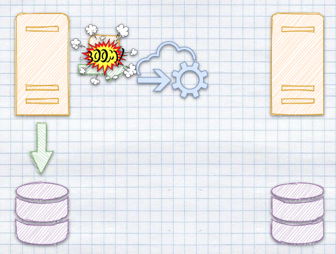
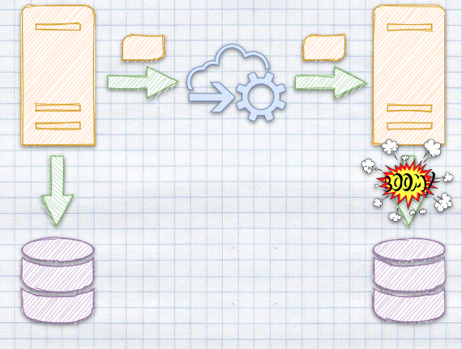
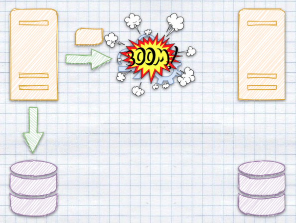
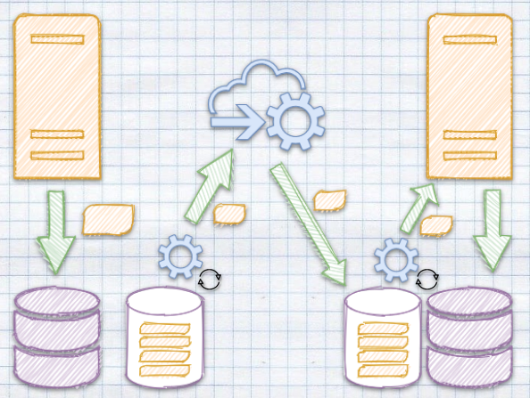

**Last week, [we discussed how to use queuing to guarantee idempotency](/en/ordering-grouping-and-consistency/). What’s idempotency?** It’s when we ensure that no matter how often we run the same operation, we’ll always end up with the same result. In other words, duplicates won’t cause inconsistency. Read more details in [Idempotent Command Handling](/en/idempotent_command_handling/).

Duplication is inevitable in distributed systems. Message can be sent multiple times due to retries, a broker crashes and starts redelivery, or redundancy is introduced by high-availability mechanisms.

**Deduplication is the process of identifying and eliminating duplicate messages to ensure systems handle them only once.** On paper, it seems like a straightforward solution to a common problem. In practice, it involves trade-offs that influence scalability, performance, and reliability. It is not a cure-all but a piece of a larger trade-off puzzle.

In this article, we’ll discuss the complexities of deduplication. We’ll see how it’s implemented in technologies like Kafka and RabbitMQ and discuss why **exactly-once delivery** is a myth. We’ll also explore **exactly-once processing**—the achievable goal that lies at the intersection of deduplication and idempotency.

Again, as in this article series, we’ll showcase that on simple but real code!

**It’s a free edition this time, so there's no paywall!**

* * *

-   [Mastering Database Connection Pooling](/en/architecture-weekly-189-mastering/)

-   [Queuing, Backpressure, Single Writer and other useful patterns for managing concurrency](/en/architecture-weekly-190-queuing-backpressure/)

-   [Is It Production Ready?](/en/architecture-weekly-191-is-it-production/)

-   [Ordering, Grouping and Consistency in Messaging systems](/en/architecture-weekly-191-is-it-production/)

**Plus all the webinars, [check them out here](https://www.architecture-weekly.com/p/webinars).**

Sounds fair, isn’t it? For FREE is always a decent price!

Feel free to share the link with your friends so they can also benefit!

* * *

Ok, enough of the commercial break! Let’s get back to duplication!

## **Why Do Duplicate Messages Occur?**

Duplication in distributed systems is not a bug; it is an expected side effect of ensuring reliability and fault tolerance. Let’s discuss the most common scenarios for messaging systems.

### **Retries Without Acknowledgment**

Let’s start with network retries. Suppose an IoT system sends messages with device status updates to a general processing system located in the cloud. It’s common for such scenarios to be temporarily disconnected. Due to a temporary network issue, the broker's acknowledgement doesn’t arrive to the message producer within the expected time frame. The producer is designed to ensure reliability. It caches the message and retries delivery to the broker. As a result, the broker receives the same message twice.



**This scenario shows a fundamental trade-off: while retries improve reliability, they also introduce the potential for duplicates.** Without deduplication mechanisms, the same message might be processed multiple times, potentially triggering duplicate actions and/or inconsistent state.

### **Failures During Processing**

Even when a message is successfully delivered, failures during processing can lead to duplicates. For instance, imagine a task queue system where a consumer retrieves and begins processing a message. The consumer crashes before completing the task and sending an acknowledgement to the broker. When the broker doesn’t receive the acknowledgement, it assumes the task wasn’t processed and redelivers the message to another consumer—or the same one after recovery.



**In this case, the broker fulfils its promise of at-least-once delivery. However, without safeguards, the system risks performing the same operation twice, such as issuing a refund or updating a shared state.**

### Internal resiliency in messaging tools

Messaging systems are internally built to be resilient; they should survive internal failures. While recovering from them, they may be doing retries to ensure that messages are delivered.



**To do that, they often employ redundancy to ensure fault tolerance.** Message is usually redistributed between multiple nodes. Usually, a single node is used as a leader to orchestrate the message delivery. But what if a leader fails? What if it restarts or another becomes a leader? Even in such cases, messages should be delivered. All the strategies to deal with that can cause duplicate handling.

These examples illustrate that duplication isn’t a bug—it’s a consequence of distributed systems prioritizing reliability over strict delivery guarantees.

**That’s why it’s essential to understand patterns like Outbox and Inbox. I wrote about them longer in [Outbox, Inbox patterns and delivery guarantees explained](/en/outbox_inbox_patterns_and_delivery_guarantees_explained/).** They are tools to get the at-least-once delivery and exact-once processing guarantees.



Today, though, we’ll discuss how and if queues can help us handle duplicates to understand how reliable those mechanisms are.

## **Where Can Deduplication Happen?**

Deduplication can occur at various points in the message flow, each with its own advantages, trade-offs, and implementation complexities.

### **Producer-Side Deduplication**

One way to address duplication is at the source: the producer. By ensuring that each message has a globally unique identifier, producers allow downstream systems to detect and discard duplicates. For example, a producer might use a combination of a UUID and a timestamp to create a unique key for each message.

This approach works well in systems where the producer has sufficient control over message creation and retry logic. For example, a financial trading system could assign a unique transaction ID to every trade message. Even if the trade is retransmitted, downstream systems can use the transaction ID to identify and ignore duplicates.

**However, producer-side deduplication isn’t the Holy Grail.** The broker must support deduplication logic that leverages these unique identifiers. Additionally, the producer must store the identifiers of sent messages until they receive confirmation that they’ve been processed, adding state management overhead.

### **Broker-Side Deduplication**

Some messaging systems, such as RabbitMQ Streams and Azure Service Bus, provide built-in deduplication mechanisms. When a message arrives, the broker compares its identifier against a deduplication cache. If the identifier matches one in the cache, the message is discarded. Otherwise, it’s processed, and the identifier is added to the cache.

**Broker-side deduplication offloads the responsibility of producers and consumers, simplifying their implementations. However, it comes with its own trade-offs.** Maintaining a deduplication cache consumes memory or storage, especially in high-throughput systems. To prevent unbounded growth, brokers typically impose a time-to-live (TTL) on deduplication entries, meaning duplicates arriving outside this window won’t be detected.

For example, RabbitMQ’s message deduplication relies on message IDs stored in an in-memory cache. This works well for short-lived messages in task queues but struggles with long-running processes or high-cardinality workloads.

### **Consumer-Side Deduplication**

**When the producer or broker doesn’t handle deduplication, it falls to the consumer.** [Consumers can maintain their own deduplication stores,](/en/idempotent_command_handling/#generic-idempotency-handling) often using databases or distributed caches like Redis to track processed messages. Before processing a message, the consumer checks whether its identifier exists in the store. If it does, the message is skipped. If not, the consumer processes the message and adds its identifier to the store.

For example, a fraud detection system might log every processed transaction ID in a Redis set. If a duplicate transaction ID arrives, the system can detect and ignore it.

This approach provides flexibility but adds complexity. Consumers must balance deduplication store durability and performance. For instance, using an in-memory store like Redis offers fast lookups but requires periodic persistence to avoid data loss during crashes.

### **Trade-Offs and Challenges of Deduplication**

Deduplication isn’t free. Each implementation choice involves trade-offs that influence system behavior:

-   **Performance Overhead**: Deduplication mechanisms, whether in the producer, broker, or consumer, introduce additional computational and storage costs. Checking for duplicates requires maintaining and querying caches or databases.

-   **Scalability Limits**: High-throughput systems, especially those with high-cardinality workloads, can overwhelm deduplication caches. Memory usage increases with message volume, requiring careful TTL tuning or eviction policies.

-   **TTL Constraints**: Deduplication caches often operate within fixed time windows. Messages arriving after their identifiers have been evicted from the cache may be treated as new, reintroducing duplicates.

-   **System Complexity**: Each layer involved in deduplication adds complexity. For example, producer-side deduplication requires state management, while consumer-side deduplication relies on external stores that need to scale with the system.

## **How Popular Systems Handle Deduplication**

Deduplication is a feature where the approach and depth vary significantly among messaging systems. Each system designs its handling of duplicates to balance scalability, fault tolerance, and throughput. Let’s explore how systems like **RabbitMQ**, **SQS**, **Azure Service Bus** and **Kafka** address deduplication, including the trade-offs inherent in their approaches.

Let’s also try to modify _QueueBroker_ implementation to see how it’d change if we’d like to handle similar strategies.

### **SQS FIFO: Deduplication with Message Grouping**

Amazon SQS FIFO offers deduplication through **message group IDs**. Messages with the same group ID are deduplicated and processed in order.

**[SQS FIFO uses a deduplication ID derived from a user-provided ID or the message body.](https://docs.aws.amazon.com/AWSSimpleQueueService/latest/SQSDeveloperGuide/using-messagededuplicationid-property.html)** If the same token is received within a deduplication window (up to five minutes), the message is ignored.

##### **Trade-Offs**

-   **Limited TTL**: SQS FIFO’s deduplication window is fixed. Messages outside the window are treated as new.

-   **Throughput Limitations**: FIFO queues sacrifice throughput for strict ordering and deduplication.

How would our implementation look like if we tried to add deduplication capabilities? Let’s wrap our queue broker with additional code:

```typescript
class SQSDeduplicationQueueBroker {
  private deduplicationCache: DeduplicationCache;

  constructor(
    private broker: QueueBroker,
    deduplicationWindowMs: number,
  ) {
    this.deduplicationCache = new DeduplicationCache(deduplicationWindowMs);
  }

  async enqueue<T>(
    task: QueueTask<T>,
    options?: QueueTaskOptions & { deduplicationId?: string },
  ): Promise<T | undefined> {
    return this.broker.enqueue(async (context) => {
      const deduplicationId = options?.deduplicationId;

      if (!deduplicationId) return task(context);

      const now = Date.now();

      if (this.deduplicationCache.has(deduplicationId)) {
        context.ack(deduplicationCache.get<T>(deduplicationId));
        return;
      }
      const result = task(context);

      this.deduplicationCache.cache(deduplicationId, {
        result,
        processesAt: now,
      });

      return result;
    }, options);
  }
}
```

Our queue broker ensures that tasks are run sequentially, so we wrap task processing with a deduplication code. We check if the Deduplication cache has the ID and return the cached result if it does. Otherwise, we run the task and cache it.

The dummy duplication cache implementation can look as follows (warning: it’s not thread-safe, but as we have sequential processing within a message group, then it should work fine).

```typescript
class DeduplicationCache {
  private deduplicationCache: Map<
    string,
    { result: object; cachedAt: number }
  > = new Map();
  private deduplicationWindowMs: number;

  constructor(deduplicationWindowMs: number) {
    this.deduplicationWindowMs = deduplicationWindowMs;
  }

  public has(deduplicationId: string): boolean {
    return this.deduplicationCache.has(deduplicationId);
  }

  public get<T>(deduplicationId: string): T {
    return this.deduplicationCache.get(deduplicationId) as T;
  }

  public cache(deduplicationId: string, result: object): void {
    this.deduplicationCache.set(deduplicationId, {
      result,
      cachedAt: Date.now(),
    });
  }

  // This should be run periodically
  public cleanupCache(currentTime: number): void {
    const toDelete = [...this.deduplicationCache.entries()]
      .filter(
        ([_, { cachedAt: processesAt }]) =>
          currentTime - processesAt > this.deduplicationWindowMs,
      )
      .map(([id]) => id);

    for (const id of toDelete) {
      this.deduplicationCache.delete(id);
    }
  }
}
```

Of course, in the messaging systems, we wouldn’t be caching the processing result, but just message IDs. We’re doing here an in-memory task processing, so that’s a bit different case. We’ll discuss in further editions how to make a real message out of it.

#### **RabbitMQ: Memory-Based Deduplication**

RabbitMQ does not natively provide built-in deduplication for its traditional queues, but deduplication can be achieved using the [RabbitMQ Message Deduplication Plugin](https://github.com/noxdafox/rabbitmq-message-deduplication) or [RabbitMQ Streams](https://www.rabbitmq.com/blog/2021/07/28/rabbitmq-streams-message-deduplication).

### RabbitMQ Deduplication plugin

The RabbitMQ Message Deduplication Plugin is an add-on that enables deduplication for exchanges or queues based on message IDs. This plugin can keep message IDs in an in-memory cache or store them on a disk. They will be kept for a configurable time-to-live (TTL). Messages with duplicate IDs are discarded during the deduplication window.

#### **How It Works**

1.  Producers must include a unique message ID with each message header.

2.  RabbitMQ maintains an in-memory cache of recently seen IDs.

3.  When a duplicate ID is detected, the message is ignored.

This approach is simple and effective for short-lived workloads, such as task queues, but it has limitations:

-   **TTL Constraints**: If a duplicate arrives after its ID has been evicted from the cache, RabbitMQ treats it as new.

-   **Memory Overhead**: Storing message IDs for high-cardinality workloads (e.g., IoT systems with thousands of devices) consumes significant memory.

-   **No Persistent Tracking**: If RabbitMQ restarts, the deduplication cache is cleared, allowing duplicates to slip through.

The potential use case could be a batch processing system. It could use RabbitMQ to manage tasks submitted by multiple sources. Each task includes a unique ID. Deduplication ensures that retries due to source failures don’t lead to duplicate task execution.

RabbitMQ’s deduplication plugin is lightweight but limited. It’s effective for workloads where duplicates are rare or occur within short time windows. However, such caching can become a bottleneck for long-lived or large-scale workloads.

### RabbitMQ Streams deduplication

RabbitMQ Streams, introduced in newer RabbitMQ versions, were added to keep up the competition with streaming solutions like Kafka, Pulsar, etc. [It is designed for high-throughput, durable message streaming and includes native support for deduplication](https://www.rabbitmq.com/blog/2021/07/28/rabbitmq-streams-message-deduplication).

#### **How It Works**

1.  Producers send messages with a unique `publish-id`.

2.  RabbitMQ Streams use the `publish-id` to detect and discard duplicates at the broker level.

It persists in deduplication state durable. Even after a broker restart, the system retains knowledge of processed `publish-ids`, ensuring robust deduplication. Deduplication is tailored for continuous event processing, such as IoT telemetry or log aggregation.

#### **Streams vs Plugin**

The plugin can also store duplication cache, but it’s recommended to be used in memory. Deduplication state persists across restarts, eliminating the risk of processing duplicates after a failure. Streams are designed for large-scale workloads, with built-in support for high throughput and partitioning.

RabbitMQ Streams is not compatible with traditional queues. It requires clients to support the streaming protocol. Streams are more suited for event-driven systems than for task-based queuing.

#### Queue Broker implementation

Still, logically, those two implementations will be similar to what you saw in the SQS query broker wrapper. Streams would keep the id as part of task without the need for TTL.

### **Azure Service Bus: Session-Based Deduplication**

**Azure Service Bus sessions are a feature that allows grouping and ordered processing of related messages.** Sessions provide a stateful and sequential processing mechanism for scenarios where multiple messages are related to the same context (e.g., a specific customer, device, or order). This feature is handy for ensuring strict ordering and exclusive handling of messages for a given context.

**Azure Service Bus session deduplication works logically close to SQS deduplication, but it’s much more sophisticated:**

1.  **Duplicate Detection**: Azure Service Bus tracks message IDs in a deduplication store seen during a configured time window (default: 10 minutes). If a message with the same MessageId is received within this window, it is acknowledged as successfully received but discarded from further processing.

2.  **TTL Flexibility**: The deduplication window can be configured, allowing for long-lived message deduplication. The deduplication store retains MessageIds for a configurable window ranging from 20 seconds to 7 days.

    A smaller window reduces memory overhead and improves throughput.

3.  **Sessions**: When sessions are enabled, deduplication occurs within the context of the SessionId.When partitioning is enabled, deduplication uses the combination of MessageId and PartitionKey.

**What would our QueueBroker implementation look like following Azure Service Bus implementation?** There you have it!

```typescript
class AzureServiceBusDedublicationQueueBroker {
  private sessionCache: SessionCache;

  constructor(
    private broker: QueueBroker,
    sessionCleanupIntervalMs: number,
  ) {
    this.sessionCache = new SessionCache(sessionCleanupIntervalMs);
  }

  async enqueue<T>(
    task: QueueTask<T>,
    options?: QueueTaskOptions & { sessionId?: string; messageId?: string },
  ): Promise<T | undefined> {
    return this.broker.enqueue(async (context) => {
      const { sessionId, messageId } = options || { messageId: randomUUID() };

      if (!sessionId)
        return task(context); // Skip deduplication if no sessionId

      if (this.sessionCache.hasMessage(sessionId, messageId)) {
        context.ack(sessionCache.get<T>(sessionId, messageId));
        return;
      }

      const result = await task(context);

      this.sessionCache.cache(sessionId, messageId, result);

      return result;
    }, options);
  }
}
```

The session cache will look as follow:

```typescript
class SessionCache {
  private sessionData: Map<
    string,
    { messageIds: Map<string, object>; lastCleanup: number }
  > = new Map();
  private sessionCleanupIntervalMs: number;

  constructor(sessionCleanupIntervalMs: number) {
    this.sessionCleanupIntervalMs = sessionCleanupIntervalMs;
  }

  public hasMessage(sessionId: string, messageId: string): boolean {
    const session = this.sessionData.get(sessionId);
    return session ? session.messageIds.has(messageId) : false;
  }

  public cache(sessionId: string, messageId: string, result: object): void {
    if (!this.sessionData.has(sessionId)) {
      this.sessionData.set(sessionId, {
        messageIds: new Map(),
        lastCleanup: Date.now(),
      });
    }

    const session = this.sessionData.get(sessionId)!;
    session.messageIds.set(messageId, result);
  }

  public cleanupSession(sessionId: string, currentTime: number): void {
    const session = this.sessionData.get(sessionId);
    if (!session) return;

    if (currentTime - session.lastCleanup > this.sessionCleanupIntervalMs) {
      session.messageIds.clear();
      session.lastCleanup = currentTime;
    }
  }
}
```

It's not that far from our RabbitMQ-like implementation, just adding a second level of caching. So, see, there is a pattern here!

### **Kafka: Delegating Deduplication to Consumers**

Kafka, the high-throughput event streaming platform, takes a minimalist approach to deduplication. Its design prioritizes scalability and performance over broker-side message tracking, which means deduplication is left to the consumers.

#### **Offsets as a Control Mechanism**

Kafka relies on offsets to achieve idempotent processing. Every Kafka partition processes messages sequentially, and each consumer tracks its offset—the position of the last message successfully processed. When a consumer restarts, it resumes processing from the last stored offset.

Offsets serve as a lightweight mechanism to prevent reprocessing, but they don’t address all cases of duplication:

-   Duplicates occur if a message is replayed intentionally (e.g., by resetting offsets for debugging or analytics).

-   If a consumer crashes before committing an updated offset, Kafka may redeliver the last processed message.

#### **Idempotent Producers**

For critical use cases, Kafka provides **idempotent producer** functionality. When enabled, Kafka ensures each message sent by a producer to a broker is assigned a unique sequence number. This prevents duplicates caused by retries during producer-broker communication. However, idempotent producers come with restrictions:

-   They require unique producer IDs.

-   They only work within the scope of a single producer session, limiting cross-session guarantees.

Kafka can’t do broker-based deduplication, as it batches messages into records. Then, it just passes the whole batch between the producer, broker and consumer. It doesn’t deserialise them or do any additional processing until it’s got in the consumer client. That’s why some people say that Kafka is not a real messaging system. Essentially, it _just_ shovels data from one place to another.

**Kafka’s approach offloads complexity to consumers.** This design achieves scalability, but developers must implement their own deduplication or idempotency at the consumer level. For high-throughput systems, this trade-off can be fine.

The consumer-based deduplication, you could use techniques like:

-   [Business logic check](/en/idempotent_command_handling/#handling-duplicates),

-   [Inbox pattern](/en/outbox_inbox_patterns_and_delivery_guarantees_explained/),

-   [Idempotent store](/en/idempotent_command_handling/#generic-idempotency-handling).

## **Exactly-Once Delivery vs. Exactly-Once Processing**

The concept of exactly-once delivery—the idea that a message is delivered to a consumer only once—is a broken promise of messaging tools marketing. Failures, retries, and network partitions make it impossible to guarantee that a message won’t be delivered multiple times. Instead, the focus should shift to **exactly-once processing**, which ensures that the effects of processing a message are applied only once.

**As discussed earlier, failure can happen at each part of the delivery pipeline, timeouts may occur, and retires may be needed.** The producer retries if the broker receives the message but loses the acknowledgement. The broker now has two copies of the same message. If a broker crashes after delivering a message but before recording the delivery, it may redeliver the message upon recovery. If the consumer crashes or just times out and doesn’t accept the message delivery, the broker will also retry.

[The CAP theorem (Consistency, Availability, Partition Tolerance)](https://towardsdatascience.com/cap-theorem-and-distributed-database-management-systems-5c2be977950e) highlights the trade-offs: distributed systems must tolerate failures but can’t simultaneously guarantee strict consistency. Exactly-once delivery sacrifices availability, which is often unacceptable in real-world systems.

### **Achieving Exactly-Once Processing**

Exactly-once processing acknowledges that while duplicates may occur, their effects should only be applied once. Achieving this requires combining deduplication with idempotency and transactional guarantees.

#### **Idempotency**

Consumers must ensure that repeated processing of the same message produces the same result. For example:

-   A payment system checks a transaction ID against a database before applying charges.

-   A state machine avoids re-executing a completed step by checking its current state.

#### **Transactional Outbox**

The **transactional outbox pattern** ensures atomicity between database operations and message publishing. For example:

1.  A payment service writes a transaction record to an outbox table in the same database transaction as updating the user’s balance.

2.  A background process reads the outbox and publishes messages to a broker.

This pattern eliminates inconsistencies caused by partial updates or message delivery failures.

#### **Distributed Locking**

Distributed locks can enforce mutual exclusion, ensuring that only one instance of a consumer processes a given message. While effective for strict sequencing, locks add latency and require careful handling to avoid deadlocks.

## **Conclusion**

Deduplication is critical in distributed systems, but it’s only one part of the solution. It’s always a best-effort. It can decrease the scale of duplicate message delivery, but it may also happen.

By understanding the trade-offs of technologies like Kafka, RabbitMQ, and Azure Service Bus and combining deduplication with patterns like idempotency and transactional outboxes, architects can design systems that achieve exactly-once processing.

**You should always think about making your consumer idempotent to handle message processing correctly.**

Cheers

Oskar

**p.s. Ukraine is still under brutal Russian invasion. A lot of Ukrainian people are hurt, without shelter and need help.** You can help in various ways, for instance, directly helping refugees, spreading awareness, and putting pressure on your local government or companies. You can also support Ukraine by donating, e.g. to the [Ukraine humanitarian](https://savelife.in.ua/en/donate/) organisation, [Ambulances for Ukraine](https://www.gofundme.com/f/help-to-save-the-lives-of-civilians-in-a-war-zone) or [Red Cross](https://redcross.org.ua/en/).
