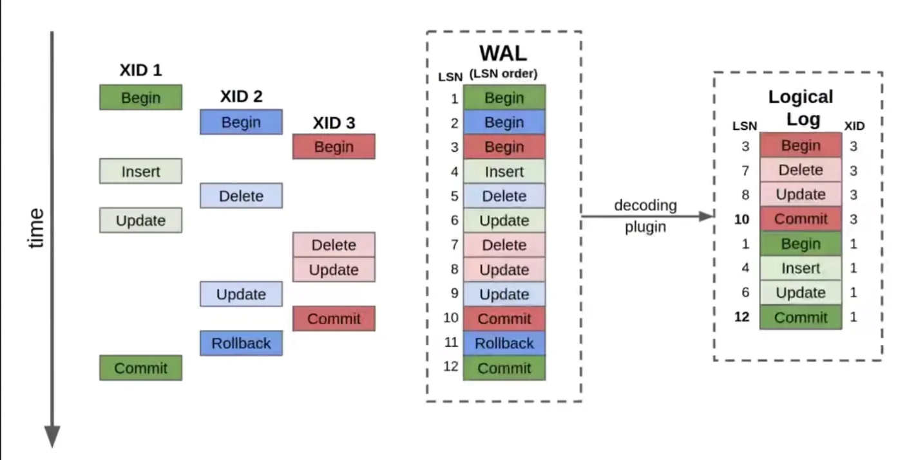
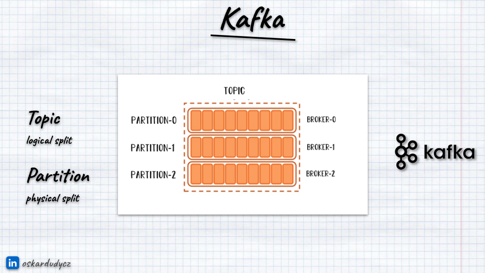
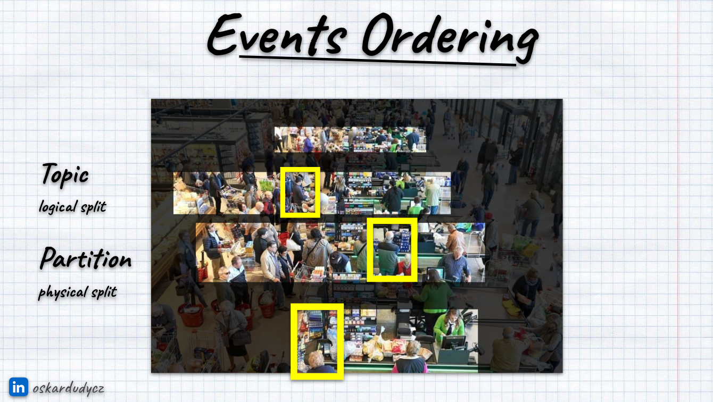
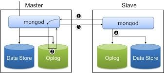

**I want to talk with you today about the Write-Ahead Log concept.** Why?

**Last month, I gave the “PostgreSQL Superpowers” talk again twice at .NET meetups.** And I had random thoughts on databases and .NET developers:

-   most of them don't do SQL, just EF,

-   don't use Explain to analyse query plans,

-   MSSQL is still the go-to,

-   PostgreSQL is still seen only as a no-cost alternative,

-   DB is just a bag for data for them.

-   They don't use specific features an exact db gives them (but still choose MSSQL),

-   most haven't seen stored procedures and while loop in SQL for some time (if at all),

-   rarely use views and even rarer materialised views,

-   **don’t remember what Write-Ahead Log and Transaction Log are.**

Some of those are inherently related to the Microsoft community (preferences for MS tooling), but the rest align with the general state of the art. Of course, those observations are anecdotal evidence, but I noticed that in multiple places and countries, so I think that they’re close to the point.

The observations were a bit disappointing, but I don’t want to complain; I want to be proactive and help you and your colleagues improve. Step by step.

**Today, let’s take the first step to close the knowledge of one of the most underrated concepts in distributed systems and databases: Write-Ahead Log.**

## The Challenge: Reliability

**Distributed systems, databases, and message brokers must manage the state reliably. The challenge remains whether you’re dealing with PostgreSQL, Kafka, or MongoDB.** You must ensure a system can recover from crashes, maintain durability, and replicate changes efficiently without compromising performance. State management in such systems is filled with complexities—updates can fail midway, nodes can crash unexpectedly, and networks can introduce delays or partitioning. In a nutshell: [Fallacies of distributed computing](https://en.wikipedia.org/wiki/Fallacies_of_distributed_computing).

To tackle these challenges, most reliable systems rely on **Write-Ahead Logs (WALs)**. The idea is straightforward but essential: **you never make a change directly; instead, you first append the change to a durable log.** This guarantees that no matter what happens, the system can always recover or replicate its state.

In this article, we’ll explore the core principles behind the Write-Ahead Log. We’ll explain why the WAL is indispensable, how it solves problems like durability, consistency, and replication, and how its implementation differs across PostgreSQL, Kafka, and MongoDB. Yes, all of those different tools use it!

* * *

## **What is a Write-Ahead Log (WAL)?**


A write-ahead log follows a basic principle: **before applying any changes to the main data store, the system writes the changes to an append-only log.** The log serves as a sequential, persistent record of every operation. If the system crashes midway through applying a change, the WAL can be replayed to restore the system to a consistent state.

**Imagine a database table where a row is being updated.** Without a WAL, the database might overwrite the row in the main storage. If the server crashes halfway through writing the new data during this operation, the old and the new data could be corrupted, leaving the system in an inconsistent state. The update is neither “committed” nor safely recoverable.

The WAL solves this by ensuring the following sequence of events:

1.  **Log First:** The system writes the change (e.g., “update row X with new value”) to the write-ahead log. This log entry is **sequentially appended** and written for durable storage, such as disks. **That’s why the structure is called Write-Ahead Log, as we’re writing new entries ahead of others.**

2.  **Apply Later:** The system applies the change to the actual data structures (e.g., tables or indexes) only after the WAL entry has been safely persisted. This step can be asynchronous and may happen with some delay since the log already guarantees the change is not lost.

3.  **Crash Recovery:** If the system crashes after writing the log but before applying the change, the WAL can be replayed on restart. This ensures the operation is eventually applied. The log serves as the source of truth, allowing the system to apply any uncommitted changes and restore a consistent state.

This mechanism guarantees two critical things:

-   **Durability:** Changes are not “lost” once they are logged.

-   **Consistency:** If a crash occurs, the system can always replay the WAL to apply incomplete operations and recover to a consistent state.

The write-ahead log is at the core of modern systems because it satisfies critical properties for ACID transactions, replication, and fault tolerance. It allows systems to trade off complexity in favour of simplicity—sequential appends are far easier, faster, and more reliable than attempting scattered random writes directly to a data store.

For example, imagine this process in practice with a database:

**Step 1:** A user transaction updates the balance column of a user’s table. The system writes a WAL entry like this:

```text
{
  offset: 34958,
  transaction_id: 123,
  operation: {
    type: "UPDATE",
    table: "users",
    set: "balance=100",
    where: "id=1"
   }
}
```

This entry is appended to the WAL file and flushed to disk. Each operation can gather a different set of metadata (update will be different than insert or delete).

**Step 2:** The system updates the _users_ table in its data files. If this step is interrupted (e.g., due to a power outage), the log ensures that step 1 is already durable.

**Step 3:** On recovery, the system reads the WAL file, identifies uncommitted changes (like transaction 123), and reapplies them to the table.

Each entry has its monotonic offset. Thanks to that, the WAL Processor can keep the position of the last handled offset and know which entries have not yet been processed.

* * *

## **Why Write-Ahead Logs Are Everywhere**

Write-ahead logs solve some of the hardest and most fundamental problems in systems that manage state. Their ubiquity in modern databases, messaging systems, and distributed systems is no coincidence. Let’s unpack the reasons why WALs are essential:

### 1\. **Durability**

Durability ensures that once a system acknowledges a change, that change will persist—even in the face of crashes or failures. WALs make this possible by first appending changes to a persistent log. Because appends are **sequential writes**, they are faster and less prone to data corruption than scattered random writes.

For example, in PostgreSQL, the system will not acknowledge a transaction as “committed” until the corresponding WAL entry is safely flushed to disk. This guarantees that no committed transaction will ever be lost, even if the server crashes.

### 2\. **Crash Recovery**

Systems can fail at any point—hardware faults, software bugs, power outages, you name it. A crash could leave the system in an inconsistent state without a reliable recovery mechanism. By writing changes to the WAL before applying them, systems can recover gracefully:

-   Upon restart, the system replays the WAL to “catch up” on any logged but not applied operations.

-   Since the WAL is append-only and sequential, replaying it is fast and deterministic.

This approach allows systems to recover within seconds, even after catastrophic failures.

### 3\. **Replication**

Replication is the process of propagating changes from one system to another, often for high availability, fault tolerance, or read scalability. Logs are the perfect tool for replication because they provide a **linear, ordered history of changes**. Replicas can replay the WAL to stay in sync with the primary system.

[In MongoDB, for instance, the](https://www.mongodb.com/docs/manual/core/replica-set-oplog/) **[oplog](https://www.mongodb.com/docs/manual/core/replica-set-oplog/)** (from _operations log -_ MongoDB’s version of the WAL) propagates changes from the primary node to the secondary nodes. The same happens in PostgreSQL replication.

### 4\. **Performance and Efficiency**

Appending to a log is far more efficient than making scattered random writes to a database. Storage systems—whether spinning disks or SSDs—are optimized for sequential writes. The WAL takes advantage of this by batching and appending changes, resulting in:

-   Faster writes.

-   Lower I/O overhead.

-   Simplified recovery mechanisms (logs are compact and linear).

**Let’s discuss a few examples of using Write-Ahead Log in different systems: PostgreSQL, Kafka and MongoDB.**

* * *

## **PostgreSQL: WAL for ACID Transactions and Replication**

**PostgreSQL’s WAL is at the core of its durability, crash recovery, and replication mechanisms.** It guarantees that no committed transaction is lost, even in the face of system crashes or unexpected failures, while enabling efficient replication for high availability.

It follows the same principles we mentioned before:

### **How It Works**

When a transaction in PostgreSQL modifies data:

1.  **Log First**: PostgreSQL writes the intended changes as **WAL records** to an append-only log file before modifying any database files (heap or indexes). This includes granular details like the operation type (`INSERT`, `UPDATE`, or `DELETE`), the modified page, and before-and-after states if necessary. Each WAL entry is sequentially appended to the log file.

2.  **Flush to Disk**: Before PostgreSQL marks the transaction as **committed**, it flushes the WAL to disk using `fsync`. This guarantees durability: even if the system crashes before applying the changes to the main database files, the WAL ensures the transaction can be recovered.

3.  **Apply Changes Later**: PostgreSQL applies the changes to the data files asynchronously during a process called **checkpointing**. At each checkpoint, the dirty pages in memory (modified data) are written back to the storage to reduce reliance on WAL during recovery.

    If a crash happens between the WAL flush and the data file update, PostgreSQL can use the WAL to "redo" the operations that occurred after the last checkpoint.

This two-step process—logging first, applying later—ensures that no committed transaction can ever be lost.



Source: https://materialize.com/blog/connecting-materialize-directly-to-postgresql-via-the-replication-stream/

The WAL is divided into **16 MB segment files**, which are stored in the `pg_wal` directory. PostgreSQL rotates and archives old WAL files to manage storage efficiently. Key components of the WAL include:

-   **Redo Records**: Detailed operations describing changes to be replayed.

-   **Transaction IDs**: Unique identifiers to group WAL entries belonging to the same transaction.

-   **Commit Markers**: Flags indicating the end of a transaction.

PostgreSQL also supports **archiving WAL segments** for disaster recovery and **point-in-time recovery (PITR)**, where the database can be restored to a specific state by replaying archived WAL files.

### **Crash Recovery**

Crash recovery in PostgreSQL relies entirely on the WAL. When PostgreSQL restarts after a crash:

1.  It scans the WAL sequentially from the last **checkpoint**. Checkpoints act as recovery starting points and reduce the WAL size that needs to be processed during recovery.

2.  Any **unapplied or partial changes** recorded in the WAL are replayed to bring the database back to a consistent state.

3.  Because the WAL is append-only and sequential, recovery is deterministic and efficient—even for large databases.

For example, if a transaction updated multiple rows and crashed halfway, PostgreSQL can detect the incomplete state and replay all changes in the WAL that occurred after the last checkpoint.

### **Replication**

PostgreSQL leverages its WAL for two primary types of replication: **physical and logical**.

#### **1\. Physical Replication (Streaming Replication):**

In physical replication, WAL segments are streamed directly from the **primary node** to the replica nodes. Replicas replay the WAL records to maintain an exact copy of the primary data at the block level.

This method is fast, efficient, and ideal for high-availability setups. However, it requires the primary and replicas to have identical database structures and PostgreSQL versions.

**Synchronous replication** ensures zero data loss by requiring replicas to acknowledge WAL entries before transactions are marked as committed.

#### **2\. Logical Replication**

Logical replication decodes WAL records into **logical change events** like SQL-level operations (e.g., `INSERT`, `UPDATE`, or `DELETE`). Instead of raw block-level data, these changes are replicated to subscribers more flexibly.

PostgreSQL creates a **logical replication slot**, which decodes WAL records into logical operations. These operations are streamed to **subscribers** that can apply them selectively or transform them as needed.

Logical Replication allows partial replication, such as replicating only specific tables or rows. You can replicate between databases with different schemas or PostgreSQL versions.

**Most importantly, it can enable integration with other systems like Kafka, event processors, or analytical platforms,** which can simplify data migration and real-time change data capture (CDC). I wrote about it extensively in [Push-based Outbox Pattern with Postgres Logical Replication](/en/push_based_outbox_pattern_with_postgres_logical_replication/).

Logical replication is a unique feature of PostgreSQL. Other relational databases (e.g. MSSQL transaction log) are treating WAL as ephemeral structure that can be deleted after transaction is committed.

If you want to Nerd-snip on PostgreSQL WAL, check [Hironobu Suzuki - The Internals of PostgreSQL](https://www.interdb.jp/pg/pgsql09.html).

Read also more in:

-   [PostgreSQL Write-Ahead Logging (WAL)](https://www.postgresql.org/docs/current/wal-intro.html)

-   [MSSQL transaction log](https://learn.microsoft.com/en-us/sql/relational-databases/logs/the-transaction-log-sql-server?view=sql-server-ver15)

-   [SQLite Write-Ahead Logging](https://www.sqlite.org/wal.html)

-   [MySQL: New Lock free, scalable WAL design](https://dev.mysql.com/blog-archive/mysql-8-0-new-lock-free-scalable-wal-design/)

* * *

## **Kafka: Logs as the System**

Kafka is built entirely around the concept of logs. In Kafka, the write-ahead log isn’t just an implementation detail—it **is the system**. Kafka uses logs as its core abstraction to provide durability, ordering, and replication guarantees. The append-only nature of Kafka’s logs enables high throughput, fault tolerance, and efficient data storage.

**Kafka has two splits of message sequences: logical and physical:**

-   **Logical split is represented by** _**topics**_ that can group messages based on the modules, entity types, tenants or any preferred logical split

-   **Partitions represent physical splits.** Once you set up topics, you must define the partitioning inside them. Each of them is the physical append-only log.



### **How It Works**

Kafka repeats the same logical pattern known from previous paragraphs:

1.  **Log First:** Kafka producers append messages to a specific partition in a topic. Each partition is a WAL where new messages are appended at the end.Partitions are immutable—once a message is written, it cannot be modified. Each message in a partition is assigned a monotonic offset, which acts as a unique position marker.

2.  **Flush to Disk:** Kafka ensures durability by persisting messages to disk before acknowledging the write to the producer. Each Kafka broker flushes log entries to disk periodically (configurable via _[flush.messages](https://kafka.apache.org/documentation/#topicconfigs_flush.messages)_ or _[flush.ms](https://kafka.apache.org/documentation/#topicconfigs_flush.ms)_). For stronger guarantees, Kafka producers can request acknowledgements from multiple brokers (e.g., _[acks=all](https://kafka.apache.org/documentation/#producerconfigs_acks)_), ensuring data is replicated before the write is acknowledged.

3.  **Apply Changes Later:** Consumers read messages from the topic’s partition sequentially, starting from a specific offset. The position of a consumer within a partition is called the offset. Consumers commit their offsets to Kafka or external stores to keep track of their progress. This model allows Kafka to achieve high throughput: sequential reads and writes are fast and efficient on modern storage hardware. Consumers are responsible for state management (e.g., [deduplication](/en/deduplication-in-distributed-systems/) or applying the messages), which keeps Kafka lightweight.

### **Replication**

**Kafka achieves scalability by partitioning topics into multiple independent logs.** Each partition is a standalone WAL, and Kafka distributes partitions across brokers in a cluster. Partitioning enables Kafka to scale horizontally, as producers and consumers can simultaneously operate on different partitions.

**Messages within a partition are strictly ordered.** The offset ensures that consumers process messages in the same order in which they were appended. There’s no guarantee of the ordering between partitions. You can think about partitions as queues to the cashier in the department store. You can only know the order of customers handling withing a queue, but not between them.



Of course, the other rule is that the one you’re standing on will go the slowest. The cashier shift will change, the paper will finish, and someone will forget the PIN of their credit card. You know the drill!

Kafka distributes partitions across multiple brokers, allowing it to handle very high volumes of data. Kafka replicates its logs across multiple brokers for fault tolerance. Each partition has:

-   **A leader:** The broker that handles, writes, and serves consumers.

-   **Followers:** Brokers that replicate the log.

If the leader fails, one of the followers can seamlessly take over. Again, that’s why [Kafka uses the Single Writer pattern](https://www.architecture-weekly.com/i/147613456/single-writer-pattern)! I hope that you see things coming together!

* * *

## **MongoDB: The Oplog for Replication**

[MongoDB uses a write-ahead log called the](https://www.mongodb.com/docs/manual/core/replica-set-oplog/) **[oplog](https://www.mongodb.com/docs/manual/core/replica-set-oplog/)**. It’s a core component for durability and replication. It’s an append-only structure that records all operations modifying the data. The oplog enables MongoDB to maintain copies of data across nodes, recover from failures, and ensure eventual consistency in a cluster.

<strong>MongoDB organizes its oplog into a logical rolling log stored as a special capped collection (</strong>_**local.oplog.rs**_**).** It provides a compact and efficient way to propagate changes while guaranteeing idempotency—operations can be safely replayed multiple times without altering the final state.

It’s only available for clustered configurations. It doesn’t work for single instances, as no replication is needed there. The goal is not an audit log. It’s tailored for replication and recovery in [replica sets](https://www.mongodb.com/docs/manual/replication/). The _oplog_ is critical for ensuring **eventual consistency**, enabling high availability, and supporting MongoDB’s asynchronous replication model.

_Oplog_ works similarly to PostgreSQL WAL in terms of logical replication. It records **high-level operations** such as inserts, updates, and deletes, ensuring idempotency.



Source: https://www.linkedin.com/pulse/how-increase-oplog-size-replica-set-mongo-32-garima-masand/

### **How It Works**

MongoDB’s _oplog_ follows a familiar pattern:

1.  **Log First:** when a write operation occurs (e.g., an insert, update, or delete), MongoDB writes a logical description of the change to the _oplog_. For example:

    ```
    {
      "ts": Timestamp(1626900000, 1),  // Time of the operation
      "op": "i",                      // 'i' indicates an insert
      "ns": "users.profile",          // Namespace (db.collection)
      "o": { "_id": 1, "name": "Alice" } // Document being inserted
    }
    ```

    Each entry is timestamped and immutable, ensuring order and durability.

2.  **Apply Later:** The _oplog_ is persisted alongside MongoDB’s data files to ensure durability. If the primary node crashes, the _oplog_ allows the database to recover by replaying the operations sequentially.

3.  **Replication:** Secondary nodes continuously pull new _oplog_ entries from the primary. These entries are applied in the same order as they were written, ensuring the secondary remains an up-to-date copy of the primary. If a secondary disconnects temporarily, it can catch up using older _oplog_ entries if they are still within the _oplog_ size.

### **Oplog and Durability**

The oplog ensures that data remains consistent and recoverable even when nodes fail:

-   **Durability**: Every write operation is first recorded in the _oplog_ before being applied to the main database. If a node crashes, MongoDB can **replay the** _**oplog**_ to restore a consistent state—much like rewinding changes step by step.

-   **Replication Lag**: Secondaries keep up by copying changes from the primary’s _oplog_. But if a secondary falls too far behind, it risks missing entries once the _oplog_ overwrites older operations. When this happens, the node becomes **stale** and requires a full resync.

This asynchronous model ensures high availability with minimal impact on write performance. However, MongoDB introduces flow control to throttle the write rate if secondaries start to lag, preventing them from falling too far behind.

* * *

### **Oplog Size and the Window of Recovery**

MongoDB’s oplog has a **fixed size**—by default, about **5% of free disk space**. It works like a **circular buffer**: new operations overwrite the oldest entries when the oplog fills up. The time span between the oldest and newest entries is called the **oplog window**.

Why does this matter?

-   A **larger oplog** means a longer recovery window. Secondaries can catch up even after extended downtime.

-   Heavy write workloads, like bulk updates or frequent deletes, can consume oplog space faster, reducing the window and increasing the risk of stale nodes.

You need to be careful, as each small change, even tiny atomic incrementation, generates oplog entries. If your oplog is too small, these frequent updates will quickly push older operations out of the log.

* * *

## **TLDR**

**The write-ahead log (WAL) is everywhere.** The simple idea powers reliability in databases, messaging systems, and distributed systems. PostgreSQL uses it to guarantee ACID compliance and keep replicas in sync. Kafka takes it further, making the log the entire system, scaling through partitions and replication. MongoDB’s _oplog_ follows the same principle but focuses on propagating high-level operations to maintain consistency across nodes.

At the core, they all follow the same rule: log first, apply later. This guarantees that no matter what—crashes, failures, or delays—systems can recover, replicate, and keep their state intact. Whether it’s replaying changes after a crash, distributing events to consumers, or syncing data across a cluster, the log makes it possible.

Knowing how this pattern works—and how tools like PostgreSQL, Kafka, and MongoDB implement it—isn’t just trivia. It’s the key to understanding how modern systems handle failures, scale writes, and ensure data consistency. If you’re building anything reliable, you’re already building on this concept—it’s time to know it well.

Cheers!

Oskar

**p.s. Ukraine is still under brutal Russian invasion. A lot of Ukrainian people are hurt, without shelter and need help.** You can help in various ways, for instance, directly helping refugees, spreading awareness, and putting pressure on your local government or companies. You can also support Ukraine by donating, e.g. to the [Ukraine humanitarian](https://savelife.in.ua/en/donate/) organisation, [Ambulances for Ukraine](https://www.gofundme.com/f/help-to-save-the-lives-of-civilians-in-a-war-zone) or [Red Cross](https://redcross.org.ua/en/).
