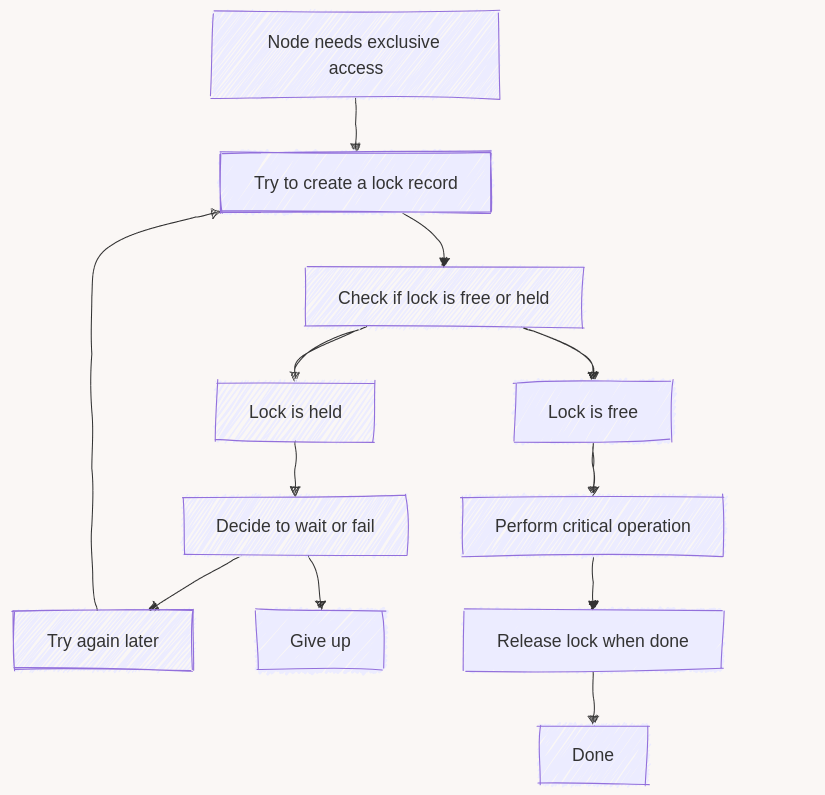
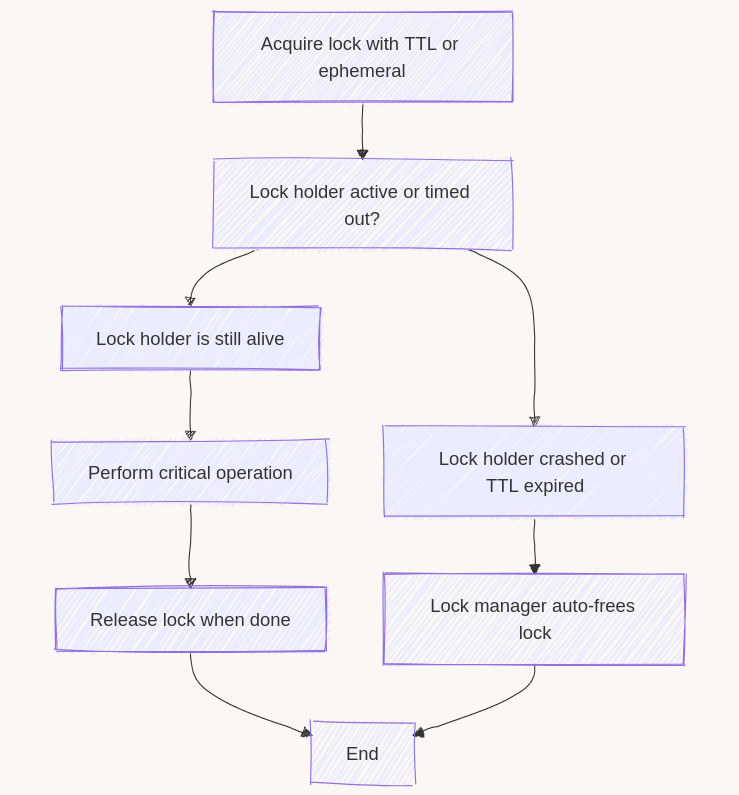
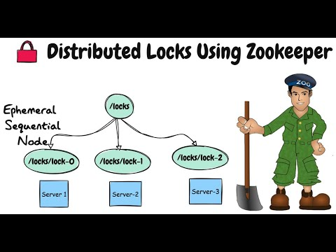

**Was your data ever mysteriously overwritten? No? Think again. Have you noticed conflicting updates to the same data?** Still nope? Lucky you! I had cases when my data changed, and it looked like Marty was travelling back to the future. Once it was correct, then it was wrong, then correct again. Most of the time, twin services were writing to the sample place.

**In distributed systems, coordination is crucial.** Whenever you have multiple processes (or services) that could update or read the same data simultaneously, you risk data corruption, race conditions, or unwanted duplicates. The popular solution is to use distributed locks - a mechanism ensuring only one process can operate on a resource at a time.

**A distributed lock ensures that if one actor (node, service instance, etc.) changes a shared resource—like a database record, file, or external service—no other node can step in until the first node is finished.** While the concept is straightforward, implementing it across multiple machines requires careful design and a robust failure strategy.

Today, we’ll try to discuss it and:

1.  **Explain** why distributed locking is needed in real-world scenarios.

2.  **Explore** how popular tools and systems implement locks (Redis, ZooKeeper, databases, Kubernetes single-instance setups, etc.).

3.  **Discuss** potential pitfalls—like deadlocks, lock expiration, and single points of failure—and how to address them.

By the end, you should have a decent grasp of distributed locks, enough to make informed decisions about whether (and how) to use them in your architecture.

* * *

## 1\. Why Distributed Locks Matter

When you scale an application to multiple machines or microservices, each one might update the same resource simultaneously. That can lead to writers overwriting each other. It’s the classic concurrency problem: **who’s in charge of updating shared data?** Without a strategy to coordinate these updates, you risk inconsistent results.

For example, you might have:

-   **Multiple Writers are updating the same table row.** One process believes it has the latest data and changes, but another process overwrites it moments later.  
    **That’s a common issue when updating read models.** We need to ensure a single subscriber for a specific read model. When multiple microservices listen to an event stream but only one should update a secondary database, a lock ensures they don’t collide.

-   **At-Least-Once Messaging** leading to repeated deliveries of the same message, with multiple consumers each processing it as if it were unique.

-   **A Global Resource** that can only support one writer at a time, such as a large file or an external API endpoint.

-   **Scheduled jobs:** If you schedule a job on multiple nodes to ensure reliability, you still want only the first node that grabs the lock to run it, preventing duplicates.

A **distributed lock** is the simplest way to say, “Only one node can modify this resource until it’s finished.” Other nodes wait or fail immediately rather than attempting parallel writes.

**It can also be seen as** _**[Leader Election Lite](https://en.wikipedia.org/wiki/Leader_election)**_**:** If you only need “one node at a time” for a particular task, a plain lock is sometimes enough - there is no need for a full-blown leader election framework.

Without locks, you can get unpredictable states - like a read model flipping from correct to incorrect or a file partially overwritten by multiple workers. Locks sacrifice a bit of parallelism for the certainty that no two nodes update the same resource simultaneously. In many cases, that’s the safest trade-off, especially if data correctness is paramount.

There are other ways to handle concurrency (like [idempotent actions](/en/idempotent_command_handling/) or [write-ahead logs](/en/the-write-ahead-log-a-foundation/)). Still, a distributed lock is often the most direct solution when you truly need to avoid simultaneous writes.

## 2\. How Locks Typically Work

1.  **Lock Request**  
    A node determines it needs exclusive access to a shared resource and communicates with a lock manager (e.g., Redis, ZooKeeper, or a database) that supports TTL or ephemeral locks.

2.  **Acquire Attempt**

    -   If no lock currently exists, the node creates one, for instance by setting a Redis key with a time-to-live or by creating an ephemeral zNode in ZooKeeper.

    -   If another node is holding the lock, this node either waits, fails immediately, or retries, depending on your chosen policy.

3.  **Critical Operation**  
    After acquiring the lock, the node proceeds with the operation that must not be run in parallel—such as updating a database row, writing to a shared file, or sending a limited external API request.

4.  **Standard Release**  
    Once finished, the node explicitly removes the lock record (e.g., deleting the Redis key or calling an unlock function). At this point, other contenders are free to acquire the lock.

5.  **Crash or Automatic Release**  
    If the node fails or loses its session, the TTL expires, or the ephemeral mechanism detects the node’s absence. The lock manager then removes the lock, automatically merging into the same path as a standard release so a new node can acquire it. This avoids leaving the system stuck with a “zombie” lock that never gets freed.

The basic flow would look like:



The general lock acquisition workflow

And the acquisition part with TTL handling:



## 3\. Tools for Distributed Locking

There are many tools for distributed locking; let's check the most popular for certain categories.

-   **[Redis](https://redis.io/)** (and clones): You store a “lock key” in Redis with a time limit attached. If the lock key doesn’t exist, you create it and claim the lock. Once your task finishes, you remove the key. If your process crashes, Redis removes the key after the time limit expires, so no one stays locked out forever. This method is quick and works well if you already rely on Redis, but you should be cautious about network splits or cluster issues.

-   **[ZooKeeper](https://zookeeper.apache.org/) / [etcd](https://etcd.io/)**: These tools consistently keep data across a group of servers. You write a small record saying, “I own this lock,” and if you go offline, the system notices and removes your record automatically. ZooKeeper and etcd are often used for more advanced cluster coordination or leader election, so they’re more complex to set up than Redis. However, they offer strong consistency guarantees.

-   **Database Locks**: If you have a single database (like Postgres or MySQL) where all your data lives, you can let the database control concurrency. You request a named lock, and the database blocks any other request for that same lock name until you release it. It’s convenient if you already use a single DB for everything, but it may not scale well across multiple databases or regions, and frequent locking could cause contention.

-   **Kubernetes Single-Instance**: Instead of coordinating multiple replicas, you literally run only one replica of your service. Because there’s only one service process, you avoid concurrency altogether at the application level. It’s the simplest approach - no lock code is needed. The downside is that you lose parallel processing and can’t spin up more replicas for high availability or scaling.

Distributed locks all share a common goal: ensure only one node does a particular thing at any given time. However, each tool mentioned approaches the problem with distinct designs, strengths, and failover behaviours.

Let’s look at each tool’s big-picture purpose—why you’d even consider it—then move on to how it implements (or approximates) a lock. Lastly, let’s discuss a few technical details that matter once you start coding or troubleshooting.

### 3.1 Redis (In-Memory Data Store with TTL-Based Locking)

**Redis runs all commands in a single thread, so there is no risk of two commands interfering partway through.** It provides atomic commands to “claim” a key only if it doesn’t exist and supports a time-to-live (TTL). Redis allows multiple nodes to coordinate around a shared key space. Essentially, if one node sets a “lock key” successfully, that key signals to everyone else that the lock is taken.

**Redis runs all commands in a single thread, so there is no risk of two commands interfering partway through.** If two clients try to create the same lock key simultaneously, Redis processes them in strict sequence: either the first wins or the second does, but never both.

To create a lock, you need to create a “lock key” using a Redis command, for instance:

```text
SET lockKey node123 NX EX 30
```

That looks cryptic, but let’s see what’s happening behind the scenes:

1.  **Atomic Key Creation with NX.** The **NX** option in the `SET` command means “set the key only if it does not already exist.” Redis checks the key’s existence and creates it if none is found. This is all done atomically, so if another client tries the same operation, one will succeed, and the other will fail.

2.  **Time-to-Live with EX.** The **EX** option (short for “expire after X seconds”) tells Redis to remove the key automatically after the specified number of seconds. If the client (the lock holder) crashes, once the EX timer hits zero, Redis deletes the key. This prevents the lock from staying locked forever.

3.  **Lock Ownership.** When a client sets the key (for example, `SET lockKey node123 NX EX 30`), if Redis replies with **OK**, that client is considered to “own” the lock. If Redis replies with **nil** or an empty response, it means another client already owns it.

4.  **Renewals.** If you need more time, say your operation runs longer than the initial 30 seconds, you can extend the lock by calling something like `PEXPIRE lockKey newTTL`, which resets the timer. Alternatively, you could run another `SET lockKey node123 NX EX 30` if you do it carefully (although the recommended pattern is to check that you still own the lock before renewing).

5.  **Releasing the Lock.** Once finished, the client **deletes** the key, typically with `DEL lockKey`. This frees the lock immediately so other nodes can acquire it. It’s crucial to verify that you are indeed the one who set the key (sometimes done by storing a unique value in the key, then checking it before deleting).

6.  **Handling Network Partitions.** In a simple single-node Redis, a partition can lead to confusion if the lock holder is cut off but still thinks it holds the lock. On the other hand, Redis might expire the key after the TTL, and another client might acquire the lock. To address these edge cases in larger clusters, you can use the [Redlock algorithm](https://redis.io/docs/latest/develop/use/patterns/distributed-locks/), which coordinates across multiple Redis instances to reduce the chance of conflicting lock ownership during network splits.

This approach suffices for a **“best effort”** distributed lock in most daily scenarios. However, if your environment is prone to frequent network partitions or requires extremely strict guarantees, more advanced configurations or tools might be necessary.

Choosing Redis may be a good option if you already run a Redis cluster for caching or need a lightweight solution that’s easy to integrate.

Performance is generally good, though absolute consistency under partitions can require more complex setups.

* * *

### 3.2 ZooKeeper / etcd (Strongly Consistent Key-Value Stores with Ephemeral Nodes)

**ZooKeeper and etcd each run as a cluster of nodes that keep data consistent across a majority of them (a quorum).** When you write a small record saying, “I own this lock,” that record is replicated so every node in the cluster knows about it. This consistency helps avoid confusion if one node is temporarily out of sync.



source: https://youtube.com/watch?v=a-zatYN1Lx0

**You create something like** `/locks/lockKey` **in ZooKeeper or a key in etcd.** If there is no record, you can successfully claim the lock. If it already exists, you either wait or fail, depending on your locking recipe.

#### Releasing Lock

**When you’re done, you delete the ephemeral node or lease key, signalling that source is available.** Since it’s ephemeral, the node is removed if you just disconnect cleanly. But if you do explicit cleanup, that’s more predictable.

Other clients can “watch” that lock path. If the lock holder crashes, ZooKeeper or etcd detects the session loss and removes the node, instantly notifying watchers that the lock is free again. This allows any waiting client to move in and grab the lock right away.

If a node is isolated from the quorum, ZooKeeper or etcd eventually considers that session dead and removes the ephemeral node. This auto-frees the lock. The newly updated cluster state reflects that the lock is available, so another node can pick it up.

#### Why would you Choose ZooKeeper or etcd?

If your environment already depends on them for cluster metadata or leader election, reusing them for locks is natural. They replicate data across multiple servers, so updates to the lock state are consistent, reducing the risk of split-brain scenarios. The ephemeral mechanism automatically frees locks if a session dies, so you don’t end up with “zombie” locks after crashes.

**They offer stronger consistency guarantees at the cost of heavier operational overhead compared to Redis.** Setting up a ZooKeeper or etcd cluster is more complex than a single Redis node. They also come with higher operational overhead, so they’re often chosen by teams already using these tools for other cluster metadata.

* * *

### 3.3 Database Advisory Locks (Using Your Existing Relational DB)

Sometimes you’d rather avoid setting up additional infrastructure, like Redis or ZooKeeper, and simply rely on the single relational database you already use. Many SQL databases—PostgreSQL, MySQL, SQL Server, and others—provide built-in locking features that can help you coordinate concurrency directly in your existing environment. There are generally two ways to handle locks in a relational database:

-   row-level locks (like `SELECT ... FOR UPDATE`)

-   advisory locks (like `pg_advisory_lock` or `GET_LOCK`)

They serve different needs, but both let you say, _“I want exclusive access to something”_ using your existing database.

Below is **Section 3.3** in a style **matching** the Redis or ZooKeeper/etcd examples. It keeps the **same structure**, including a **“big picture”** intro, a **step-by-step** explanation of how locks work, and a **conclusion** about **when** you’d choose this approach.

* * *

### 3.3 Database Locks (Monolithic or Single-DB Setup)

Sometimes, you’d rather avoid setting up extra infrastructure like Redis or ZooKeeper. If your entire application relies on a single relational database (e.g., PostgreSQL, MySQL, SQL Server), you can often leverage **built-in locking** features to manage concurrency. Many databases provide **two** main methods:

1.  **Row-Level Locks** (e.g., `SELECT ... FOR UPDATE`)

2.  **Advisory Locks** (e.g., `pg_advisory_lock` in Postgres, `GET_LOCK` in MySQL, `sp_getapplock` in SQL Server)

They serve different needs, but both let you say, “I want exclusive access to something,” using your existing DB.

#### Row-Level Locks with `SELECT ... FOR UPDATE`

You can lock specific rows in a table by issuing something like:

```sql
BEGIN;
SELECT * FROM locks WHERE lock_id = @loc_key FOR UPDATE;
/* make changes */
COMMIT;
```

That looks cryptic, but here’s what’s happening.

You wrap the SQL command with the transaction (BEGIN/COMMIT). The query includes `FOR UPDATE`, which tells the database: _“Lock this row so nobody else can modify it until I’m done.”_ If someone else tries to update the same row, they’ll have to wait.

**The lock lasts until you commit or roll back the transaction.** At commit, the lock is released, letting other transactions proceed.

You may also use regular rows instead of a dedicated locks table. It’s natural if your concurrency problem revolves around specific table rows. For others you need to define key that would represent the scope of locking

#### Advisory Locks (e.g., `pg_advisory_lock` or `GET_LOCK`)

Instead of tying a lock to a specific row, you can lock an **arbitrary** identifier:

```sql
-- PostgreSQL
SELECT pg_advisory_lock(12345);
/* do something exclusive */
SELECT pg_advisory_unlock(12345);
```

```sql
-- MySQL
SELECT GET_LOCK('readModel', 10);
/* do something exclusive */
SELECT RELEASE_LOCK('readModel');
```

You pass an integer (`12345`) or string (`'readModel'`) to request a lock from the database’s internal lock manager. If it’s “free”, you acquire it; if it’s already taken, you wait or fail (depending on the timeout).

**Locks are session-bound.** The lock belongs to your current DB session. The lock is freed automatically if that session ends due to a crash or normal exit. The downside is that the lock might remain locked if your session hangs around in a weird state.

Those locks can be much lighter than row-level locks (e.g. [PostgreSQL Advisory Locks](https://www.postgresql.org/docs/current/explicit-locking.html#ADVISORY-LOCKS)). Yet, some of them may require passing integers, so you may need to map the string to a number, which can require some consistent hashing algorithm.

**If you want the reference implementations of PostgreSQL Advisory Locks, [check mine in Pongo](https://github.com/event-driven-io/Pongo/blob/main/src/packages/dumbo/src/postgres/core/locks/advisoryLocks.ts).**

#### Why would you use database locks?

In many cases, database locks require minimal setup. There’s no need to spin up Redis or ZooKeeper if you already trust a single relational DB for everything. You can use familiar SQL, which can benefit many developers. You get transaction integrations.

**Still, they’re tight to a single database scope.** They don’t help if you have multiple databases or multi-region replication.

**The other downside is lock contention.** A busy system constantly grabbing locks could block queries and reduce performance.

**You also can get deadlocks** if multiple transactions lock rows or advisory locks in different orders. Monitoring is crucial.

* * *

### 3.4 Kubernetes Single-Instance Deployments (An Operational Constraint)

Sometimes, you don’t need a distributed lock at all—you just need to ensure there’s no possibility of concurrency. In Kubernetes, you can tell the cluster to run exactly one replica of your service. With only one pod, you don’t risk two pods writing to the same resource simultaneously. This approach is straightforward but also very limiting.

#### **How It Works in Terms of Locking**

-   **No Actual Lock**: Technically, you don’t lock anything. You simply rely on the fact that setting `replicas: 1` in your Deployment or [StatefulSet](https://kubernetes.io/docs/concepts/workloads/controllers/statefulset/) ensures the scheduler never spawns more instances. You specify exactly one replica for your service. Kubernetes never spawns a second one, so concurrency can’t occur at the application level.

-   **One Pod, One Writer**: If that single pod is alive, it’s the only one doing the work. If it crashes, Kubernetes restarts it, but you might have downtime.

-   **No Concurrency**: Because there’s literally just one instance, you don’t need to coordinate or lock anything. You’re effectively sidestepping the whole locking problem

-   **No Parallelism or scaling**: If you eventually need multiple pods, you’ll have to switch to an actual lock approach. If traffic spikes or you want high availability, you can’t spin up more pods without moving to a distributed locking mechanism.

**Funnily enough, Kubernetes stores all cluster data in [etcd](https://etcd.io/).** [etcd](https://etcd.io/) keeps the entire cluster’s state: Deployments, Services, ConfigMaps, and so on. However, the cluster doesn’t perform ephemeral lock logic for a single-instance Deployment. It merely stores “replicas: 1” and lets the controller keep the Pod count in sync with that number.

Kubernetes doesn’t use the _lock record_ as described before with Zookeeper/etcd section. The Deployment/Stateful Set controller periodically checks how many Pods are currently running for that Deployment. If there are zero (e.g., the Pod crashed), the controller starts a new Pod to reach the desired count of one. If there’s already one Pod, the controller does nothing—it matches the desired state.

**In Kubernetes, the mechanisms and controllers designed to manage the number of pods are quite robust, but in highly dynamic or unusual situations, there might be brief moments where conditions could lead to more than one pod being created temporarily.** However, such occurrences are generally rare and usually quickly corrected by Kubernetes' control loops. For instance:

-   **Rapid Scale-Up and Scale-Down:** If you rapidly change the replicas count up and then back down (or vice versa), it might lead to the Kubernetes scheduler and the replica set controller temporarily creating more pods than desired. This can occur in highly dynamic environments where scripts or operators frequently adjust the replica counts.

-   **Controller Delays:** Kubernetes controllers periodically reconcile the desired state with the actual state. If there’s a delay or lag in the controller's loop (due to cluster load or other disruptions), you might briefly see more pods than expected.

-   **Network Partitions or etcd Availability Issues:** If parts of the cluster cannot communicate with each other or with etcd (where the desired state is stored), different nodes might make different decisions. For example, one node might not know that a new pod has already been scheduled elsewhere and might schedule another.

**Why You’d Choose Single-Instance in Kubernetes?**

If you just need to enforce that there’s a single instance processing background job (read model handling, job processing) and you have Kubernetes set up, then it’s a decent choice. You remove the concurrency at all. You don’t spin up Redis or ZooKeeper just to handle locks.

**Still, the race conditions can be dangerous for high traffic or important cases. It’s not fully reliable.** So, it’s a decent choice for **rarely Triggered Tasks**: If you have a once-a-day job and don’t care about parallelism or availability, one pod might be enough.

* * *

### 3.5 TLDR on locking tooling choice

Here’s my recommended decision-making scheme for locking mechanism:

1.  **If you have a single relational DB handling all app state, advisory locks might suffice** (and require no extra moving parts and minimal infrastructure). Many ready-made packages provide that. Inside modules locks or monolithic apps using a single DB instance are good use cases here. Beware: database locks are harder to scale across multiple DB nodes. They can become a contention point if locks are frequent.

2.  **If your environment already includes a Redis cluster for caching and you want a simpler ephemeral lock, Redis is a natural fit.** If you want an application-level lock across multiple services, Redis is a decent candidate. Remember that it can bring a potential edge case under network partitions; multi-node setups may require Redlock for stronger safety.

3.  **If concurrency is never desired or is completely out of scope for a specific microservice, AND you’re using already Kubernetes a single-instance Kubernetes approach may be acceptable.** However, it clearly sacrifices high availability and scaling. It’s not really a distributed lock at all, just an operational limit of “one pod.”

4.  **If your microservices need advanced coordination (like leader election, watchers, or strongly consistent state), consider ZooKeeper or etcd.** It’s the most configurable option and the most scalable. Yet it’s heavier to operate than a simple single Redis or DB solution. It’s also another service to operate. And pretty complex one.

* * *

## 4\. Potential Pitfalls and Best Practices

### 4.1 Deadlocks and Lock Ordering

If your system needs to acquire multiple locks at once, you risk deadlocks (e.g., process A has Lock1 and wants Lock2; process B has Lock2 and wants Lock1). The best practice is to lock in a consistent order globally or use carefully designed transaction boundaries. I’ll show you next week how you could use queuing and single writer for that.

### 4.2 Lock Contention

Locks serialize access. If too many services fight for the same lock, your system effectively becomes single-threaded. To avoid bottlenecks, lock only the smallest critical sections. If concurrency at some granularity is acceptable, consider sharding or partitioned locks.

### 4.3 Crash Handling (TTL, Ephemeral Sessions)

What if the lock holder dies mid-operation? This is the classic reason for **TTL** or ephemeral sessions:

-   **TTL**: If the process doesn’t extend the TTL, the lock is auto-freed. Another node can proceed.

-   **Ephemeral**: The ephemeral node is removed if the session disappears (like in ZooKeeper).

Without these, you risk **permanent blocking** if someone forgets to release or if the holder abruptly goes offline.

### 4.4 Single Point of Failure

If you rely on a single Redis instance or a single ZooKeeper node, your lock manager can fail. Always consider using a clustered or highly available setup, such as Redis with sentinel or cluster mode or a ZooKeeper ensemble of three or five nodes.

### 4.5 Clock Skew and Network Partitions

Systems like Redlock try to handle partial failures, but no distributed lock can be 100% guaranteed if your network is severely partitioned (CAP theorem territory). You might end up with multiple holders, each believing they’re the only one. Proper design, timeouts, and conflict detection help reduce these edge cases.

* * *

## Conclusion

Distributed locks are a fundamental tool for **coordinating concurrency** across systems. Whether you choose Redis (with TTL-based locks), ZooKeeper (ephemeral nodes), database locks, or even just run a single replica in Kubernetes, the core principle remains: only one party can operate on a resource at a time. Handling **failures** (crashed holders) is crucial, which is why ephemeral or time-based mechanisms are standard. Each approach has trade-offs in complexity, performance, and fault-tolerance.

**Key Takeaways** for senior engineers and architects:

1.  **Try to avoid distributed locking if you can.** Usually, they’re a good sanity checkpoint to validate why you got here and if you really need it.

2.  **Use locks carefully**: Over-locking can degrade concurrency, but it’s critical when data corruption or double-processing must be prevented.

3.  **Choose the right store**: Redis is often the simplest if you already run it. ZooKeeper suits advanced coordination. DB locks can be fine for single-region or monolithic architectures.

4.  **Plan for failure**: Implement TTL/ephemeral locks to avoid “zombie” or stuck locks.

5.  **Zero concurrency?**: Setting `replicas: 1` in a StatefulSet or Deployment, concurrency is removed but multi-replica scaling is forfeited. It’s not a distributed lock—just an operational constraint.

6.  **Understand trade-offs**: If your scenario is straightforward, a lock-based single subscription might be simpler than full leader election. For advanced cluster coordination, leader election or a robust distributed approach might be more robust.

Distributed systems will always have complexities, but a well-implemented distributed lock (or a strategic single-instance approach) can tame the chaos of concurrency—keeping your data consistent and your architecture stable.

**What are your experiences, use cases, and challenges with distributed locking?**

And hey, all the best for Christmas if you celebrate it. If you don’t, try to also get the chance to rest a bit. And if you don’t want to, that’s fine, as long as you’re happy!

Cheers!

Oskar

**p.s. Ukraine is still under brutal Russian invasion. A lot of Ukrainian people are hurt, without shelter and need help.** You can help in various ways, for instance, directly helping refugees, spreading awareness, and putting pressure on your local government or companies. You can also support Ukraine by donating, e.g. to the [Ukraine humanitarian](https://savelife.in.ua/en/donate/) organisation, [Ambulances for Ukraine](https://www.gofundme.com/f/help-to-save-the-lives-of-civilians-in-a-war-zone) or [Red Cross](https://redcross.org.ua/en/).
