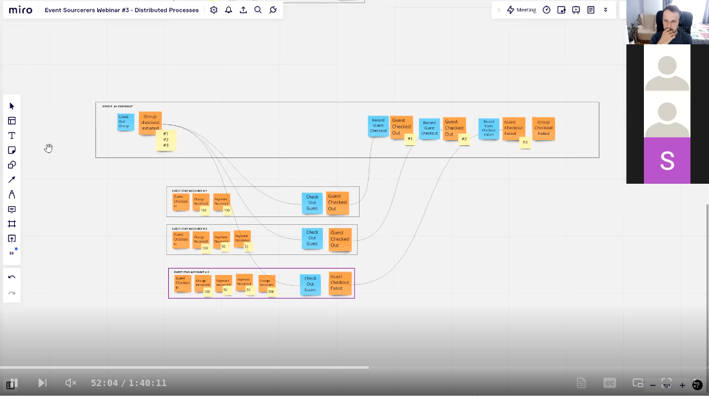

[Last week, we discussed Distributed Locking](/en/distributed-locking-a-practical-guide/). Today, we’ll continue with locking but doing it differently: with a full backflip.

We’ll discuss how to implement a simple in-process lock. What’s special about it? We’ll use the queue broker we delivered in [Ordering, Grouping and Consistency in Messaging systems](/en/ordering-grouping-and-consistency/). And explain why. Then, we’ll take it back to a higher level, showing you how your business application can benefit from it.

Does it sound intriguing? I hope it does, as we aim to learn and have fun.

## A quick recap about locking

**Last week, we learned that locking is the simplest way to handle exclusive access to the resource.** Using it, the actor says, _“Until I finish, no other actor can access this resource!“_. Others will need to wait or fail immediately. Who’s the actor? Think: user, service, node, processor, etc.

Without locks, you can get unpredictable states - like a read model flipping from correct to incorrect or a file partially overwritten by multiple workers. Locks sacrifice a bit of parallelism and performance for the certainty that no two actors update the same resource simultaneously. In many cases, that’s the safest trade-off, especially if data correctness is a key factor.

The basic flow looks like this:


## Lock definition

Let’s now define a high-level API for locking. I’ll use TypeScript again because I like it, and I have to choose some language.

It can look as follows:

```typescript
interface Lock {
  acquire(options: LockOptions): Promise<void>;
  tryAcquire(options: LockOptions): Promise<boolean>;
  release(options: LockOptions): Promise<boolean>;
  withAcquire: <Result = unknown>(
    handle: () => Promise<Result>,
    options: LockOptions,
  ) => Promise<Result>;
}

type LockOptions = { lockId: string };
```

It has four methods:

-   **acquire** - either get access to the resource or wait if the lock is already held,

-   **tryAcquire** - either acquire lock or returns false if the lock is already held,

-   **release -** mark locked resource as available for others,

-   **withAcquire** - wrapper that will run a specific code wrapped with _acquire_ and _release_ method calls.

All methods take options with a specific lock identifier. It can represent the locked resource id or any other arbitrary text format.

Of course, we could be more creative and add more options, such as timeouts, but let’s keep it focused.

## Challenges with implementing locking

When implementing locking, we need to be sure we’ll acquire a specific lock for the single resource. That’s vulnerable to race conditions. We must also make it thread-safe, ensuring safety when multi-threads try to lock the same record.

The last part is simpler in TypeScript, as it uses a [JavaScript event loop](https://developer.mozilla.org/en-US/docs/Web/JavaScript/Event_loop) and is single-threaded. Node.js authors thought handling tasks sequentially (if done well) could be faster than handling and managing multiple threads. Per [MDN](https://developer.mozilla.org/en-US/docs/Web/JavaScript/Event_loop):

> _A very interesting property of the event loop model is that JavaScript, unlike a lot of other languages, never blocks. Handling I/O is typically performed via events and callbacks, so when the application is waiting for an [IndexedDB](https://developer.mozilla.org/en-US/docs/Web/API/IndexedDB_API) query to return or a_ `fetch()` _request to return, it can still process other things like user input._

So if you’re doing a more classical approach like C#, Java, be aware that you’d need to use thread-safe constructions like [ConcurrentDictionary](https://learn.microsoft.com/en-us/dotnet/api/system.collections.concurrent.concurrentdictionary-2?view=net-9.0), [ConcurrentHashMap](https://docs.oracle.com/javase/8/docs/api/java/util/concurrent/ConcurrentHashMap.html).

Luckily, in [Ordering, Grouping and Consistency in Messaging systems](/en/ordering-grouping-and-consistency/), we implemented the Queue Broker capable of handling a single task per group of tasks. [We used it to handle idempotency](/en/ordering-grouping-and-consistency/), which is a similar, but slightly different goal.

To recap, our Queue Broker allows multiple tasks to be enqueued and handled asynchronously. It works similarly as [Amazon SQS FIFO](https://docs.aws.amazon.com/AWSSimpleQueueService/latest/SQSDeveloperGuide/sqs-fifo-queues.html) ensures task with the same task group ID are processed in the strict order.

Groups are independent, so tasks for one group don’t block tasks in another. The other tasks from the same group will wait in the queue to be processed. Our Queue Broker uses a [single-writer pattern](https://www.architecture-weekly.com/i/147613456/single-writer-pattern) to ensure that scheduling happens sequentially. We can enqueue multiple tasks, but they’re not processed immediately; the background queue processing processes them. Thanks to that, we can control the concurrency.

Let’s use it in our case!

## Implementing Locks

Let’s use what we learn so far, starting with the Lock setup:

```typescript
function InProcessLock(): Lock {
  const taskProcessor = new QueueBroker({
    maxActiveTasks: Number.MAX_VALUE,
    maxQueueSize: Number.MAX_VALUE,
  });

  // Map to store ack functions of currently held locks: lockId -> ack()
  const locks = new Map<string, () => void>();

  return {
    // (...) implementation will go here
    // acquire: (...),
    // tryAcquire: (...),
    // release: (...),
    // withAcquire: (...)
  }
}
```

We defined the _InProcessLock_ function that will generate a new Lock. It has a queue broker without any limits on parallel processing. The only concurrency limit that we want to enforce is for the specific lock id.

We’re also keeping the currently held locks in map cache.

### Acquiring Lock

Now, let’s implement the acquire function:

```typescript
async acquire({ lockId }: LockOptions): Promise<void> {
  await new Promise<void>((resolve, reject) => {
    taskProcessor
      .enqueue(
        ({ ack }) => {
          // Entering the locked scope.
          // Cache the ack function for the lock id
          locks.set(lockId, ack);
          resolve();
          return Promise.resolve();
        },
        { taskGroupId: lockId },
      )
      .catch(reject);
  });
},
```

**If the lock is already held, we just queue up another task in the same group. QueueBroker ensures tasks in the same group run one at a time. We’re passing the lock id as the task group id.**

When the task starts, it means the previous lock (if any) was released and now we have exclusive access.

The queue broker completes task, when _ack_ callback is called. In _acquire_ we’re not calling it, as it should be called when we call _release_ method explicitly. To be able to do it, we cache the _ack_ callback in for the lock id in the previously defined locks map.

Try acquire will look similarily, we can reuse the acquire function here:

```typescript
async tryAcquire({ lockId }: LockOptions): Promise<boolean> {
  // If lock is already held, fail immediately
  if (locks.has(lockId)) {
    return false;
  }

  await this.acquire({ lockId });

  return true;
},
```

If the lock is already held we return _false_ immediately. Otherwise we call acquire method. If there’s a race condition and after doing the check other task also tries to access lock, then nothing wrong will happen. Just the first one will get the access, and the other will need to wait. Returning _false_ here is “best effort”.

## Releasing Lock

If we’re calling the _acquire_ and _release_ functions explicitly, then we’re assuming that we're know what we’re doing. **That means, that release will be called after we finished the processing on the resource we wanted to lock.** Having that the release function can look as follows:

```typescript
release({ lockId }: LockOptions): Promise<boolean> {
  const ack = locks.get(lockId);
  if (ack === undefined) {
    return Promise.resolve(true);
  }

  locks.delete(lockId);
  ack();

  return Promise.resolve(true);
},
```

The logic is simple, we’re getting cached _ack_ handle for the specified lock. We’re calling this _ack_ informing queue broker that the task processing has finished. That means, that it’ll allow queue broker to take the next task for that lock id.

## Locking Scope

Let’s finish implementation with locking scope created in _withAcquire_ to easier handle locking scenarios.

```typescript
async withAcquire<Result = unknown>(
  handle: () => Promise<Result>,
  { lockId }: LockOptions,
    ): Promise<Result> {
      return taskProcessor.enqueue(
        async ({ ack }) => {
          locks.set(lockId, ack);

          try {
            return await handle();
          } finally {
            locks.delete(lockId);
            ack();
          }
        },
        { taskGroupId: lockId },
      );
    },
  };
```

Not much to explain, as you know all of that. Such syntax makes it just easier and safer to handle race conditions and not forget to release lock. It’ll be automatically released after running the handle callback.

Example usage? Sure, for instance, if you’d like to ensure that only a single Test Container initialisatisation happens in parallel, this could look as follows:

```typescript
let container: EventStoreDBContainer | null = null;
let startedContainer: StartedEventStoreDBContainer | null = null;
let startedCount = 0;
const lock = InProcessLock();

const getSharedEventStoreDBTestContainer = () =>
  lock.withAcquire(
    async () => {
      if (startedContainer) return startedContainer;

      if (!container)
        container = new EventStoreDBContainer(EVENTSTOREDB_DEFAULT_IMAGE);

      startedContainer = await container.start();
      startedCount++;

      container.withLogConsumer((stream) =>
        stream
          .on('data', (line) => console.log(line))
          .on('err', (line) => console.error(line))
          .on('end', () => console.log('Stream closed')),
      );

      return startedContainer;
    },
    { lockId: 'SharedEventStoreDBTestContainer' },
  );
```

This function comes from [Emmett Test Containers helpers](https://github.com/event-driven-io/emmett/blob/main/src/packages/emmett-testcontainers/src/eventStore/eventStoreDBContainer.ts).

You can also find the implementations for:

-   [QueueBroker (renamed to TaskProcessor)](https://github.com/event-driven-io/emmett/blob/b5518834595e819443e0f8c6fd62ca41af12d89e/src/packages/emmett/src/taskProcessing/taskProcessor.ts),

-   [InProcessLock](https://github.com/event-driven-io/emmett/blob/b5518834595e819443e0f8c6fd62ca41af12d89e/src/packages/emmett/src/utils/locking/index.ts).

## Cool, but why would you care?

**If you’re wondering, why would you try to implement queue or lock on your own** as you have such abstractions available in most of the dev environments then you’re on the right track: typically you should not!

**Still, the goal of those articles is to show you, how understanding how the foundational patterns like queuing, single-writer, concurrency handling can help you in understanding tools you use. And how to compose them together.**

There’s also an interesting observation to have you here. If you’re using queues with the ordering guarantee (mentioned AWS SQS FIFO, but also Kafka, etc.) then you can design the message passing in a way to steer concurrency of the processing.

For instance, if you want to coordinate the processing of the specific distributed business processes, then you should ensure that they’re put into the same queue/partition.

For instance, if you’re doing distributed processing like we did in:



[

Architecture Weekly

Webinar #3 - Implementing Distributed Processes

Distributed processes with an event-driven approach embrace the impossibility of the two-phase commit in distributed transactions. Instead of trying to make a big transaction across modules and databases, it does a sequence of microtransactions…

Read more

4 years ago · 6 likes · 4 comments · Oskar Dudycz

](https://www.architecture-weekly.com/p/webinar-3-implementing-distributed?utm_source=substack&utm_campaign=post_embed&utm_medium=web)

So Group Guest checkout coordinating a multiple single processing, then if we orchestrate it to have the messages for group checkout in a single queue/partition/stream then we’re getting the linearity of processing. Especially if we keep there both:

-   **commands** - informing on our intention to run a specific flow (e.g. performing a guest checkout).

-   **events** - informing on the stuff that happened (e.g. that guest checkout completed or failed).

If all of them will be processed sequentially, then we’re essentially locking the access for the particular process for a single handler.

Of course, that has pros and cons. The more we put into the same queue, the lower throughput we get but stronger consistency. The less we put in the queue, the weeker consistency guarantees are.

Still, with a proper modelling, and tradeoff analysis we can design our partitioning strategy to handle our scenario good enough. Some of that we already tackled in the webinar linked above.

**If you’d like me to expand on that in the next editions, please respond or leave a comment!**

If you don’t want, then please also do it, telling me on your preferences!

Cheers!

Oskar

**p.s. Ukraine is still under brutal Russian invasion. A lot of Ukrainian people are hurt, without shelter and need help.** You can help in various ways, for instance, directly helping refugees, spreading awareness, and putting pressure on your local government or companies. You can also support Ukraine by donating, e.g. to the [Ukraine humanitarian](https://savelife.in.ua/en/donate/) organisation, [Ambulances for Ukraine](https://www.gofundme.com/f/help-to-save-the-lives-of-civilians-in-a-war-zone) or [Red Cross](https://redcross.org.ua/en/).
