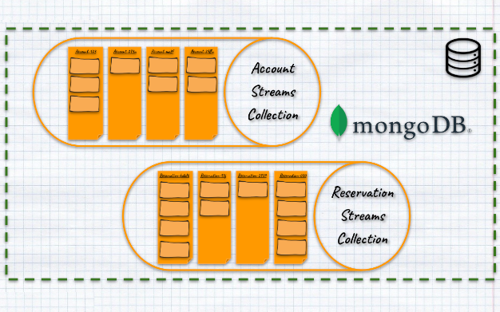
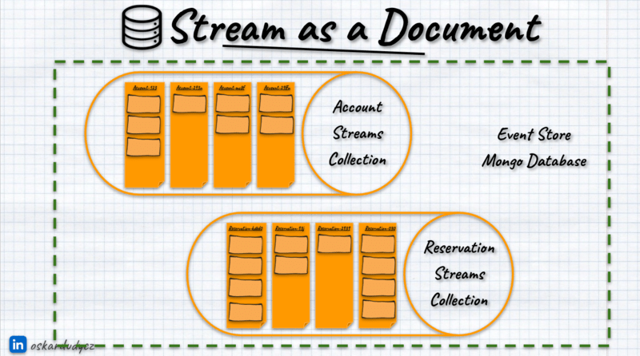

**I have always said that MongoDB is not the best choice for event storage, and guess what?** I [just released](https://github.com/event-driven-io/emmett/releases/tag/0.23.0) the stable version of the MongoDB event store in [Emmett](https://github.com/event-driven-io/emmett). 

**And let me explain today how to do it.** It'll be a detailed article, but I think it's an interesting piece, so fasten your seat belts!

A few things are needed for that. The first and most important thing is to have a motivated contributor! 

**I was lucky to have such with [Alexander Lay-Calvert](https://www.linkedin.com/in/alexander-lay-calvert-2179501b4/).** He did most of the hard work; I was helping conceptually and with final touches. So, what you read today is a summary of our conjoined effort with a majority made by Alex.

What else is needed? Let's discuss that today!

## Event stores as key-value stores

**In this article, we'll use the canonical definition of event sourcing.**

**Event Sourcing is about making decisions**, capturing their outcomes (so events) and using them to make further decisions (so events are the state). **Event Streaming is about moving information from one place to another** and integrating multiple components. Read more about in [Event Streaming is not Event Sourcing!](/en/event_streaming_is_not_event_sourcing/).

Event stores are not messaging tools. They may have similar capabilities as Event Streaming solutions, but the focus is different: 
- event stores on consistency, durability and quality of data, 
- event streaming solutions (like Kafka) are focused on delivery, throughput and integration.

**[Event stores are key-value databases](/en/event_stores_are_key_value_stores)** At least logically. In relational databases, records are called rows; in document databases, documents; in Event Sourcing, they're called streams.

In event stores, the stream is built from:
- **the key** represents a record identifier (e.g. order id, invoice number, car license plate number, etc.), 
- **the value** represents a sequence of business events that happened for the specific record (e.g. _OrderInitiated_, _ShipmentScheduled_, _OrderCompleted_). 

Simple as that, still, most of the time, we were taught that event stores are append-only logs looking more or less like that:


**Indeed, physically, most of them are append-only logs.** See: [Emmett PostgreSQL storage](/en/emmett_postgresql_event_store/), [EventStoreDB](https://developers.eventstore.com/), [Marten](https://martendb.io/), [Axon Server](https://www.axoniq.io/products/axon-server). But well, [the same can be said for the relational databases](/en/relational_databases_are_event_stores/). Internally, each operation (INSERT/UPDATE/DELETE) is appended to the [Write-Ahead/Transaction Log](https://www.architecture-weekly.com/p/the-write-ahead-log-a-foundation). Then, upon transaction commit, they're applied to specific tables.

I haven't seen many (if at all) introductions to relational databases explaining them as append-only logs, and that's fine, as it wouldn't be accessible. We should also stop doing that for event stores.

Again, even if internally, our event stores are append-only logs, then still each event is logically mapped to specific streams:


So again, logically, our event stores are key-value databases:


And that's great, as it's much easier to reason about the guarantees we should expect from our store after realising that.

Plus, it allows us to implement event stores on top of _a bit more exotic_ storage like MongoDB, DynamoDB, CosmosDB or Blob Storage.

Ok, enough intro! Let's discuss how to do it using the MongoDB example!

## Basic Event Stream Definition

Let's try to make the definition of our event stream more formal. Formal? Yes, let's create the code with type definitions to express our requirements more precisely. [Prototyping is an underestimated design skill](/en/prototype_underestimated_design_skill/).

I'll use TypeScript because it's a decent language for that. I won't use much fancy structure, so it should be understandable. If not, paste it into the ChatGPT and translate it into your favourite language. That's how we code today, aye?

**We said that the event store is a key-value database and that records are called streams.** Let's write that down then:

```ts
type Stream = unknown;

type StreamName = unknown;

type EventStore = Map<StreamName, Stream>;
```

It reflects our knowledge; the shape of _Stream_ and type of _Stream Name_ are unknown to us, but we already know that _Event Store_ is a database, a map where _Stream Name_ is a key and _Stream_ is a value.

Let's now describe the Stream: it represents a sequence of business events that happened for a specific record.

```ts
type Event = unknown;

type Stream = Event[];

type StreamName = unknown;

type EventStore = Map<StreamName, Stream>;
```

Easy peasy, boom! We're done! 

Ok, not quite. Let's do a reality check with...

## Requirements for event store

What are the requirements, then? In my opinion, at least:
- **Appending event at the end of the stream.** We need to be able to record new business facts for a specific entity,
- **Reading all events from the stream.** That's a must to [get the current entity state from events](/en/how_to_get_the_current_entity_state_in_event_sourcing/). We read all recorded events and apply them to get the current state.
- **The guarantee of the ordering within the stream.** It's important to know the order of events in our process. Both in getting the state and integrating it with other workflows.
- **Being able to read your writes.** As event stores are databases, you should get the new events right after you append them.
- **Strong-consistent, atomic writes and [optimistic concurrency](/en/optimistic_concurrency_for_pessimistic_times/).** It's a must to know whether we're making a decision based on the latest state and whether conflicting changes have been detected. In other words, ensuring we won't end up in the wrong state.
- **Store both event data and metadata.** Event data is obvious; it gathers all information related to the business fact that happened. Metadata is needed for the generic handling, such as [telemetry data](/en/set_up_opentelemetry_wtih_event_sourcing_and_marten/).

The 2nd tier of event stores features (so great to have but not must-haves):
- **Being able to subscribe to notifications about newly appended events (best if it's push-based). Also, having [at-least once delivery guarantee](/en/outbox_inbox_patterns_and_delivery_guarantees_explained/).** That's important for integrating different business workflows from different streams.
- **Built-in projections for building read models**. We need to have performant queries. Reading all events from the stream is fine for business logic but not good enough for querying.
- **Global ordering of events.** It's both useful for building read models from multiple streams and integrating workflows.
- **[Streams archiving.](/en/gdpr_in_event_driven_architecture/#archive-data)** So, being able to move the obsolete events (e.g. from completed workflows) to some _cold storage_. The fact that we record all business information doesn't mean that we need to keep them forever.

We could expand our Event Store definition into:

```ts
interface EventStore {
  readStream(streamName: StreamName): Event[];

  appendToStream(streamName: StreamName, events: Event[]): void;
}
```

And show pseud-code implementation as:

```ts
function getEventStore(): EventStore {
  const streams = new Map<StreamName, Stream>();

  const appendToStream = (streamName: StreamName, events: Event[]): void => {
    const currentEvents = streams.get(streamName) ?? [];

    streams.set(streamName, [...currentEvents, ...events]);
  };

  const readStream = (streamName: string): Event[] => {
    return streams.get(streamName) ?? [];
  };

  return {
    appendToStream,
    readStream,
  };
}
```

Now, let's validate how that fits into the MongoDB capabilities.

## MongoDB specifics

[Document databases are key-value databases whose values ​​have a defined structure](/en/key-value-stores/). That is why they are called documents. We can compare them to paper applications we send to some government departments. Documents, just like paper ones, can hold various fields and types of data. Usually, they are stored as JSON-like objects.

**MongoDB is a document database. Documents are organised into collections, which are similar to tables in relational databases but without a fixed structure.** That means that each document in a collection can have a different set of fields, allowing for a more adaptable and dynamic data model. By storing related data in a single document, MongoDB reduces the need for complex joins, making data retrieval faster and simpler for many applications.

**As I wrote in [my other article](/en/strategy_on_migrating_relational_data_to_document_based/), contrary to common belief, document data is structured but just less rigidly.** We should define the schema. It should be denormalised, and it is best not to contain cross-document references. It can have relations but not be enforced strictly in a relational way.

Of course, this lack of a fixed schema can also be seen as a downside when maintaining advanced data consistency and integrity, as there are fewer built-in constraints than in relational databases. Relational databases might be more suitable for applications that demand strict data relationships and complex transactions.

## Storing event as a document

**The first idea could be to store events as documents in the events collection.** 


That could work, as each event type will help a different data set. You should expect different information in _EmployeeOnboardingCompleted_ and _RoomReservationRejected_. MongoDB's flexible schema would benefit us.

When appending events, we would insert a new document. We could nest data and metadata inside the document payload. 

How would we read the events from the specific stream? We could keep the reference for the stream name in the event metadata. [MongoDB allows indexing documents](https://www.mongodb.com/docs/manual/indexes/), so technically this could work.

We could type our event as:

```ts
type Event = {
  type: string,
  data: unknown,
  metadata: {
    streamName: StreamName
  }
}
```

Still, even with indexes, it's not an optimised way to use MongoDB; we'll be storing thousands or millions of events, and most of them will have different stream names. That means [high cardinality of values](https://docs.honeycomb.io/get-started/basics/observability/concepts/high-cardinality/), which is not optimal for indexing. 

Also, how would we enforce the consistency and concurrency guarantees? How would we enforce optimistic concurrency so that when two conflicting events append, the first succeeds and the other fails? [MongoDB allow conditional checks](https://www.mongodb.com/docs/manual/reference/method/db.collection.update/#std-label-update-query) when storing new data, but only for a single document.

Relational databases can handle that better, as they're designed to handle such relations and multi-record transactions. So, for relational databases, a single table with events as rows works pretty well, but not here. See more in:

`youtube: https://www.youtube.com/watch?v=gaoZdtQSOTo`

**Storing an event as a document will not give us proper guarantees and performance, so it's a no-go.** Document databases work best if we access them by document id. That's how we can enforce consistency and concurrency and make it performant. 

What if we were...

## Storing event stream as a document

Let's look again at our type definition:

```ts
type StreamName = string;

type Event = {
  type: string;
  data: unknown;
  metadata: {
    streamName: StreamName;
  };
};

type Stream = Event[];
```

What if we just stored the Stream as a document containing events? We could also store additional metadata like:
- stream type (e.g. _Room Reservation_, _User Onboarding_ etc.), 
- stream position representing the number of events in the stream; this could also be used for the optimistic concurrency check,
-  diagnostic information like when the stream was created, when it was last updated, etc.


Having that, we could redefine our stream type definition into:

```ts
type Stream = {
  events: Event[];
  metadata: {
    streamType: string;
    streamPosition: number;
    createdAt: Date;
    updatedAt: Date;
 };
};
```

Let's adjust our dummy Event Store implementation, as it'll keep our focus on the design discussion without additional noise. No worries, we'll get to the real MongoDB. 

```ts
function getEventStore(): EventStore {
  const streams = new Map<StreamName, Stream>();

  const appendToStream = (streamName: StreamName, events: Event[]): void => {
    const now = new Date();

    // 1. Get the current stream or set the default
    const stream = streams.get(streamName) ?? {
      events: [],
      metadata: {
        streamType: undefined!, // 🤔 how to get it?
        createdAt: now,
        streamPosition: 0,
      },
    };

    const streamExists = stream.metadata.streamPosition > 0;

    // 2. Append events
    stream.events.push(...events);
    /// and update stream metadata
    stream.metadata.streamPosition += events.length;
    if (streamExists) stream.metadata.updatedAt = now;

    streams.set(streamName, stream);
  };

  const readStream = (streamName: StreamName): Event[] => {
    return streams.get(streamName)?.events ?? [];
  };

  return {
    appendToStream,
    readStream,
  };
}
```

Not surprisingly, we now need to use the nested structure. When appending events, we create a new stream if it doesn't exist. Then, we append events to the nested collection and update metadata. That sounds good, but how do we get the stream type?

## Stream Type

There are multiple ways to do it:
- we could add additional options parameters that'd contain the name,
- if we're using languages like C# or Java, we could add the generic parameter with type and get its name,
- we can change the first parameter to be an object containing stream name and stream type,
- we can use the [URN-bases](https://en.wikipedia.org/wiki/Uniform_Resource_Name) format of Stream Name to include a stream type, e.g. "{streamType}:{streamId}".

All of them can be valid, but my personal preference is the last one. Why? Again, event stores are key-value databases. For them, [the key to consistency is a proper key strategy](https://www.architecture-weekly.com/p/using-s3-but-not-the-way-you-expected). 
We'd like to enforce our stream's uniqueness for each type of stream. It's okay if different stream types share the same id (e.g., the date when a reservation was made or an order was placed) as long as the combined stream name is unique.

We could then redefine our stream name to:

```ts
type StreamType = string;
type StreamName<T extends StreamType = StreamType> = `${T}:${string}`;
```

I use the nice TypeScript feature called [Literal Types](https://www.typescriptlang.org/docs/handbook/2/template-literal-types.html). Essentially, it allows us to define the strongly typed keys of a certain format. Thanks to that, the TypeScript compiler won't let us provide stream names that don't follow our format.

Now, we can add the function to parse our formatted stream name:

```ts
function fromStreamName<T extends StreamType>(
  streamName: StreamName<T>,
): StreamNameParts<T> {
  const parts = streamName.split(':') as [T, string];
  return {
    streamType: parts[0],
    streamId: parts[1],
  };
}

type StreamNameParts<T extends StreamType = StreamType> = {
  streamType: T;
  streamId: string;
};
```

We could use this function in our append method to get the stream type. Let's skip that and focus on the final part, which is related directly to MongoDB.

## Stream Id

**If our stream name is a string of a specific format, potentially allowing any string as stream ID, then how would we fit into [MongoDB ObjectID](https://www.mongodb.com/docs/manual/reference/bson-types/#std-label-objectid), which is used as document id?**

From MongoDB docs:

> ObjectIds are small, likely unique, fast to generate, and ordered. ObjectId values are 12 bytes in length, consisting of:
> - A 4-byte timestamp, representing the ObjectId's creation, measured in seconds since the Unix epoch.
> - A 5-byte random value generated once per process. This random value is unique to the machine and process.
> - A 3-byte incrementing counter, initialised to a random value.
 
ObjectId doesn't allow the provision of any string, so we need to work around it. We can add the property with the stream name and index it. It won't be perfect, but it will be fine for most cases.

Our adjusted type definition will look as follows:

```ts
type Stream<
  Type extends StreamType = StreamType,
  Name extends StreamName<StreamType> = StreamName<StreamType>,
> = {
  streamName: Name;
  events: Event[];
  metadata: {
    streamId: string;
    streamType: Type;
    streamPosition: number;
    createdAt: Date;
    updatedAt?: Date;
 };
};
```

As you can see, this clearly shows that our stream has its type and the name derived from it.

The updated dummy implementation will look as follows:

```ts
function getEventStore(): EventStore {
  const streams = new Map<StreamName, Stream>();

  const appendToStream = <T extends StreamType = StreamType>(
    streamName: StreamName<T>,
    events: Event[],
  ): void => {
    const now = new Date();

    const { streamId, streamType } = fromStreamName(streamName);

    // 1. Get the current stream or set the default
    const stream = streams.get(streamName) ?? {
      streamName,
      events: [],
      metadata: {
        streamId,
        streamType: streamType,
        createdAt: now,
        streamPosition: 0,
      },
    };

    const streamExists = stream.metadata.streamPosition > 0;

    // 2. Append events
    stream.events.push(...events);
    /// and update stream metadata
    stream.metadata.streamPosition += events.length;
    if (streamExists) stream.metadata.updatedAt = now;

    streams.set(streamName, stream);
  };

  const readStream = (streamName: StreamName): Event[] => {
    return streams.get(streamName)?.events ?? [];
  };

  return {
    appendToStream,
    readStream,
  };
}
```

We're almost there: finally implementing it in MongoDB! The final decision remains to be made.

## Streams Collection layout

Ok, we already know what our Stream-as-a-Document representation should look like, and we're feeling comfortable with it. Let's discuss which collection we should store it in.

The most obvious choice would be to have a single collection with all streams. That should work, as Mongo works well with even a large number of documents.

**Still, as we already know that streams have types, we could keep all the streams of the specific type in dedicated collections.** That should help to optimise stream usage, potentially apply precise indexing strategies, and make other optimisations. 



**We could also allow custom collection resolution.** For instance, if you'd like to separate storage per application module.


Or separate storage for each customer?


Or maybe use a single database but combine the stream type with the customer name, or use another sharding strategy. Why not? 


Moreover, we can also allow users to select different Mongo databases for storage and logical separation.

**I recommend using collection per stream type as the default choice**, but two other approaches are also valid depending on the needs, so why not allow them all? Let's do it!

We'll start by defining the options that users can provide to select our storage layout:

Here are the single collection options:

```ts
type CollectionPerStreamTypeStorageOptions = {
  type: 'COLLECTION_PER_STREAM_TYPE';
  databaseName?: string;
};
```

Collection per stream type:

```ts
type SingleCollectionStorageOptions = {
  type: 'SINGLE_COLLECTION';
  collectionName?: string;
  databaseName?: string;
};
```

And a bit more advanced custom resolution

```ts
type CustomStorageOptions = {
  type: 'CUSTOM';
  collectionFor: <T extends StreamType>(streamType: T) => CollectionResolution;
};

type CollectionResolution = {
 databaseName?: string;
  collectionName: string;
};
```

We allow the user to provide the function that will return the database name and collection name based on a defined algorithm.

Let's group it in the single union type marking that the need to provide one of those options:

```ts
type StorageOptions =
  | SingleCollectionStorageOptions
  | CollectionPerStreamTypeStorageOptions
  | CustomStorageOptions;
```

The collection resolution could look as follows:

```ts
function resolveCollectionAndDatabase<T extends StreamType>(
  streamType: T,
  options: StorageOptions,
): CollectionResolution {
  switch (options.type) {

    case 'SINGLE_COLLECTION':
      return {
        collectionName: options.collectionName ?? defaultCollectionName,
        databaseName: options.databaseName,
      };

    case 'COLLECTION_PER_STREAM_TYPE':
      return {
        collectionName: streamType,
        databaseName: options.databaseName,
      };

    case 'CUSTOM':
      return options.collectionFor(streamType);
  }
}

const defaultCollectionName = 'streams';
```

I think that's straightforward, but to recap:
- **For single collection storage**, we resolve the collection name based on the provided value or the default name.
- **For collection per stream type**, we use the stream type name as the collection name.
- **For custom resolution**, we take whatever the user's creativity gives us.

What would you say if we finally use MongoDB? 

## Implementing MongoDB event store

Let's define the function that will provide us with the real MongoDB connection. It can look as follows:

```ts
function collectionFor<T extends StreamType>(
  streamType: T,
  client: MongoClient,
  options: StorageOptions,
): Collection<Stream<T>> {
  const { collectionName, databaseName } = resolveCollectionAndDatabase(
    streamType,
    options,
  );

  const db = client.db(databaseName);

  return db.collection<Stream<T>>(collectionName);
}
```

We use stream type and MongoDB client to resolve the database and return collection based on the storage resolution.

Of course, we could add caching, automatic indexing on stream name, etc. [Emmett](https://github.com/event-driven-io/emmett) does all of that, but let's keep it out of this for brevity.

With the collection resolution, we can update our event store implementation so that it is no longer dummy and use MongoDB.

As we'll be doing now a serious database operation, let's change the Event Store definition into:

```ts
interface EventStore {
  readStream(streamName: StreamName): Promise<Event[]>;

  appendToStream(streamName: StreamName, events: Event[]): Promise<void>;
}
```

Yes, I just changed the result types to return Promise, making our operations asynchronous.

Now, let's define our event store setup. We'll need to take MongoDB client and storage options.

```ts
type MongoDBEventStoreOptions = {
  client: MongoClient;
  storage: StorageOptions;
};

function getEventStore(options: MongoDBEventStoreOptions): EventStore {
  const { client, storage } = options;

  // (...) the rest of the code. We'll get here
}
```

Here, we assume that the injected client is connected. Of course, that's a simplified version; in [Emmett](https://github.com/event-driven-io/emmett), we support passing clients in any state, providing the connection string, and handling the client lifetime internally.

### Reading stream from MongoDB document

Let's see what our updated read stream will look like:

```ts
function getEventStore(options: MongoDBEventStoreOptions): EventStore {
  const { client, storage } = options;

  const readStream = async <T extends StreamType = StreamType>(
    streamName: StreamName<T>,
  ): Promise<Event[]> => {
    const { streamType } = fromStreamName(streamName);

    // Resolve collection
    const collection = collectionFor<T>(streamType, client, storage);

    // Read events from the stream document
    const stream = await collection.findOne<WithId<Pick<Stream<T>, 'events'>>>(
      {
        streamName: { $eq: streamName },
      },
      {
        // just reading events
        projection: {
          events: 1,
        },
      },
    );
    return stream?.events ?? [];
  };

  // (...) appendToStream

  return {
    appendToStream,
    readStream,
  };
}
```

As you can see, it looks the same as our dummy implementation. The difference is that we're using the MongoDB API. As we just want to read events, we can benefit from [projection](https://www.mongodb.com/docs/manual/reference/operator/projection/positional/) that allows us to select only events without all stream metadata. It is a small but nice performance improvement.


### Appending to the stream in the MongoDB document

Let's now implement our append method! It'll look as follows:

```ts
function getEventStore(options: MongoDBEventStoreOptions): EventStore {
  const { client, storage } = options;

  const appendToStream = async <T extends StreamType = StreamType>(
    streamName: StreamName<T>,
    events: Event[],
  ): Promise<void> => {
    const now = new Date();

    const { streamId, streamType } = fromStreamName(streamName);

    // Resolve collection
    const collection = collectionFor<T>(streamType, client, storage);

    // Append events upserting the document
    await collection.updateOne(
      {
        streamName: { $eq: streamName },
      },
      {
        // append events
        $push: { events: { $each: events } },
        // increment stream position
        $inc: {
          'metadata.streamPosition': events.length,
        },
        // set default metadata
        $setOnInsert: {
          streamName,
          'metadata.streamId': streamId,
          'metadata.streamType': streamType,
          'metadata.createdAt': now,
        },
        // update metadata
        $set: {
          'metadata.updatedAt': now,
        },
      },
      { upsert: true },
    );
  };

  // (...) readStream

  return {
    appendToStream,
    readStream,
  };
}
``` 

Again, logically it works as our dummy implementation. The difference is in using MongoDB API. As we make append-only changes, we don't need to read anything from the stream.

We're using [updateOne](https://www.mongodb.com/docs/manual/reference/method/db.collection.updateOne/) to do an upsert. MongoDB has a nice way of making atomic updates, such as appending to an array or incrementing a value. Thanks to that all of those changes will be applied to our document as a single atomic operation.

### Optimistic Concurrency

The final bit to provide the proper consistency guarantees is optimistic concurrency. You can read my [general introduction](/en/optimistic_concurrency_for_pessimistic_times/) and [technical implementation guidance](/en/how_to_use_etag_header_for_optimistic_concurrency/). 

We want to detect conflicting updates and race conditions. In other words, it handles concurrency correctly. 

**Optimistic concurrency is called optimistic, as we assume that conflict situations will be rare.** A conflict arises when two users try to change the same record at the same time. In our case, that means appending an event to a stream. When this happens, we will only allow the first user to update the state. All other appends will be rejected. 

For detection of whether the conflicting change was made, we'll use a stream version as it is incremented with each append.

What does an optimistic concurrency implementation look like?
1. Return the current stream position while reading events.
2. Append the event, sending the current position as the expected one.
3. Check if the position in the stream equals the expected position sent in the append operation.
4. If they match, allow appending and set a new entity stream position.
5. If not, throw or return an error.

To be able to do it, we need to modify our event store definition:

```ts
interface EventStore {
  readStream(streamName: StreamName): Promise<ReadStreamResult>;

  appendToStream(
    streamName: StreamName,
    events: Event[],
    options?: AppendToStreamOptions,
  ): Promise<AppendToStreamResult>;
}

type ReadStreamResult = { currentStreamPosition: number; events: Event[] };

type AppendToStreamOptions = { expectedStreamPosition: number };
type AppendToStreamResult = { nextStreamPosition: number };
```

We added result types and extended them with the expected stream position information. We also added an optional parameter to provide the expected position during the append operation.

Let's now apply that to our read stream method:

```ts
function getEventStore(options: MongoDBEventStoreOptions): EventStore {
  const { client, storage } = options;

  const readStream = async <T extends StreamType = StreamType>(
    streamName: StreamName<T>,
  ): Promise<ReadStreamResult> => {
    const { streamType } = fromStreamName(streamName);

    // Resolve collection
    const collection = collectionFor<T>(streamType, client, storage);

    // Read events from the stream document
    const stream = await collection.findOne<
      WithId<Pick<Stream<T>, 'events' | 'metadata'>>
    >(
      {
        streamName: { $eq: streamName },
      },
      {
        // just reading events
        projection: {
          events: 1,
          'metadata.streamPosition': 1,
        },
      },
    );
    return {
      events: stream?.events ?? [],
      currentStreamPosition: stream?.metadata.streamPosition ?? 0,
    };
  };

  // (...) appendToStream 

  return {
    appendToStream,
    readStream,
  };
}
```

Not much has changed; we're just reading the stream position and returning it (defaulting to 0).

How would the append to stream method change?

```ts
function getEventStore(options: MongoDBEventStoreOptions): EventStore {
  const { client, storage } = options;

  const appendToStream = async <T extends StreamType = StreamType>(
    streamName: StreamName<T>,
    events: Event[],
    options?: AppendToStreamOptions,
  ): Promise<AppendToStreamResult> => {
    const now = new Date();

    const { streamId, streamType } = fromStreamName(streamName);

    // Resolve collection
    const collection = collectionFor<T>(streamType, client, storage);

    let expectedStreamPosition: number;
    if (options?.expectedStreamPosition) {
      // 1.a. Use provided expected stream position, or...
      expectedStreamPosition = options.expectedStreamPosition;
    } else {
      // 1.b. Get the current stream version
      const currentStream = await collection.findOne<
        WithId<Pick<Stream<T>, 'metadata'>>
      >(
        { streamName: { $eq: streamName } },
        {
          // just reading the stream position
          projection: {
            'metadata.streamPosition': 1,
          },
        },
      );

      // and use it as the expected one
      expectedStreamPosition = currentStream?.metadata.streamPosition ?? 0;
    }

    const nextStreamPosition = expectedStreamPosition + events.length;

    // 3. Append events upserting the document
    const updatedStream = await collection.updateOne(
      {
        streamName: { $eq: streamName },
        'metadata.streamPosition': expectedStreamPosition,
      },
      {
        // append events
        $push: { events: { $each: events } },
        // set default metadata
        $setOnInsert: {
          streamName,
          'metadata.streamId': streamId,
          'metadata.streamType': streamType,
          'metadata.createdAt': now,
        },
        // update metadata
        $set: {
          'metadata.streamPosition': nextStreamPosition,
          'metadata.updatedAt': now,
        },
      },
      { upsert: true },
    );

    // 3. In case of expected version mismatch, throw an error
    if (updatedStream.upsertedCount === 0) {
      throw new Error(`Stream version doesn't match`);
    }

    return { nextStreamPosition };
  };

  return {
    appendToStream,
    readStream,
  };
}
```

A bit more is happening here. After we resolve the collection by the stream type, we either take the provided expected position from options (if it was provided) as the current one or read it from the stream document. 

Once we have it, we pass it on to the update statement. 

**If the document with a specified stream name and position wasn't found, that means the stream doesn't exist or the stream position is different.** Even though MongoDB will try to insert the document, it'll fail as we have the unique index constraint on the stream name. If no document was upserted, then that means that there was an optimistic concurrency conflict, and we can throw an error. 


A bit more is happening here. After we resolve the collection by the stream type, we either take the provided expected position from options (if it was provided) as the current one or read it from the stream document. 

Once we have it, we pass it on to the update statement. 

**If the document with a specified stream name and position wasn't found, that means the stream doesn't exist or the stream position is different.** Even though MongoDB will try to insert the document, it'll fail as we have the unique index constraint on the stream name. If no document was upserted, then that means that there was an optimistic concurrency conflict, and we can throw an error. 

**Together with atomic updates, that gives strong guarantees to our MongoDB event store.** Of course, we should consider adding retries in case of concurrency error, but you can read about it [in my other article](/en/idempotent_command_handling/#idempotency-and-optimistic-concurrency).


## Tradeoffs

While we showed that it’s perfectly doable to build an event store on top of MongoDB, there are some caveats worth highlighting. 

First, MongoDB’s atomic updates and transactions work best on single documents, so if you rely on cross-document or multi-stream consistency, you’ll need to coordinate or accept weaker guarantees carefully. That's not a huge issue for appends, as we should keep our event streams denormalised and focused on business process. See more in my talk:

`youtube: https://www.youtube.com/watch?v=gG6DGmYKk4I`

**Still, that becomes an issue for updating read models: no global ordering out of the box.** Our single-document-per-stream approach ensures ordering within one stream, but nothing enforces a globally monotonic event sequence across all streams. You could try to simulate a global ordering by tapping into MongoDB’s [oplog](https://www.mongodb.com/docs/manual/core/replica-set-oplog/) or [Change Streams](https://www.mongodb.com/docs/manual/changeStreams/), but it’s still more complex (and less straightforward) than dedicated event stores that offer a built-in global offset.

**In Emmett, we provided the option to have [_inline_ projections](https://github.com/event-driven-io/emmett/blob/e8e0b3c8f9620dc42c4888f9dccbf4fd3e69d384/src/packages/emmett-mongodb/src/eventStore/projections/mongoDBInlineProjection.ts#L147) stored in the stream document, together with events.** That allows atomic updates in the same operation as events append. I'll expand on it in the follow-up post.

**There's also a valid concern [raised by Robert Kawecki](https://www.reddit.com/r/node/comments/1hy5n9t/comment/m6etazv). The maximum size of the MongoDB document is 16MB.** This is, actually, more than the raw JSON size, as BSON used in MongoDB is a binary format. If we keep our streams short, that should be sufficient for most cases. The stream per document will need to be chunked into multiple documents. The proposed structure could be expanded to include chunk numbers and setting a unique index on streamName and chunk number. That will allow moving events to the new document once the size is reached. We may also need to use [snapshots](https://www.eventstore.com/blog/snapshots-in-event-sourcing). I'll cover this _2nd-day issue_ in the dedicated blog article.

Lastly, from a durability perspective, past [Jepsen tests](https://jepsen.io/analyses/mongodb-4.2.6) have flagged edge cases under certain configurations and failover scenarios, indicating you’ll want to pay close attention to cluster setup and operational practices. None of that rules MongoDB out—it just means that if you absolutely need a strict global ordering or bulletproof multi-document consistency, a specialized event store (or a fully ACID relational system) might be a better fit.

Otherwise, if per-stream concurrency and ordering suffice, this MongoDB-based strategy can still be a solid choice.

## TLDR

I'd still use [PostgreSQL event store](/en/emmett_postgresql_event_store/) as the default choice, but MongoDB implementation appeared surprisingly good.

Despite MongoDB limitations, many real-world applications do not require global event ordering or the highest levels of transactional consistency. If your workloads are primarily focused on per-stream ordering and optimistic concurrency within a single document, the described MongoDB strategy can be surprisingly effective. 

You can achieve a decent event store solution without deploying an entirely new infrastructure by treating each stream as a document, using upserts for atomic event append operations, and relying on MongoDB’s flexible schema. 

**If MongoDB is already part of your tech stack and the outlined constraints are not deal-breakers, this approach can deliver a pragmatic, production-friendly solution that balances performance, simplicity, and developer familiarity.**

I hope that this guide showed you how to design a proper event store on top of a document and a key-value database. Still, even with that it requires additional work to make it properly performant, reliable and accessible.

If you're in the Node.js space, don't reinvent the wheel; just run:

```shell
npm install @event-driven-io/emmett-mongodb
```

And use it.

**You can also check the fully working WebApi sample using it.** You'll find it [here](https://github.com/event-driven-io/emmett/tree/main/samples/webApi/expressjs-with-mongodb). 

If you're not in Node.js land and want me to help you build it [contact me](mailto:oskar@event-driven.io), I'll try to help. You can have a look at [Emmet's implementation](https://github.com/event-driven-io/emmett/tree/main/src/packages/emmett-mongodb/src/eventStore).

**Please also share with me your thoughts, and share the article with your friends if you enjoyed it!** That'd be much appreciated, as writing it took me a hellova time.

If you liked this article, you may also find those interesting:
- [Event stores are key-value databases!](/en/event_stores_are_key_value_stores)
- [Event Streaming is not Event Sourcing!](/en/event_streaming_is_not_event_sourcing/)
- [Let's build event store in one hour!](/en/lets_build_event_store_in_one_hour/)
- [Using S3 but not the way you expected. S3 as strongly consistent event store](https://www.architecture-weekly.com/p/using-s3-but-not-the-way-you-expected)
- [Let's talk about positions in event stores](/en/lets_talk_about_positions_in_event_stores/)

Cheers!

Oskar

p.s. **Ukraine is still under brutal Russian invasion. A lot of Ukrainian people are hurt, without shelter and need help.** You can help in various ways, for instance, directly helping refugees, spreading awareness, putting pressure on your local government or companies. You can also support Ukraine by donating e.g. to [Red Cross](https://www.icrc.org/pl/donate/ukraine), [Ukraine humanitarian organisation](https://savelife.in.ua/pl/donate/) or [donate Ambulances for Ukraine](https://www.gofundme.com/f/help-to-save-the-lives-of-civilians-in-a-war-zone).
