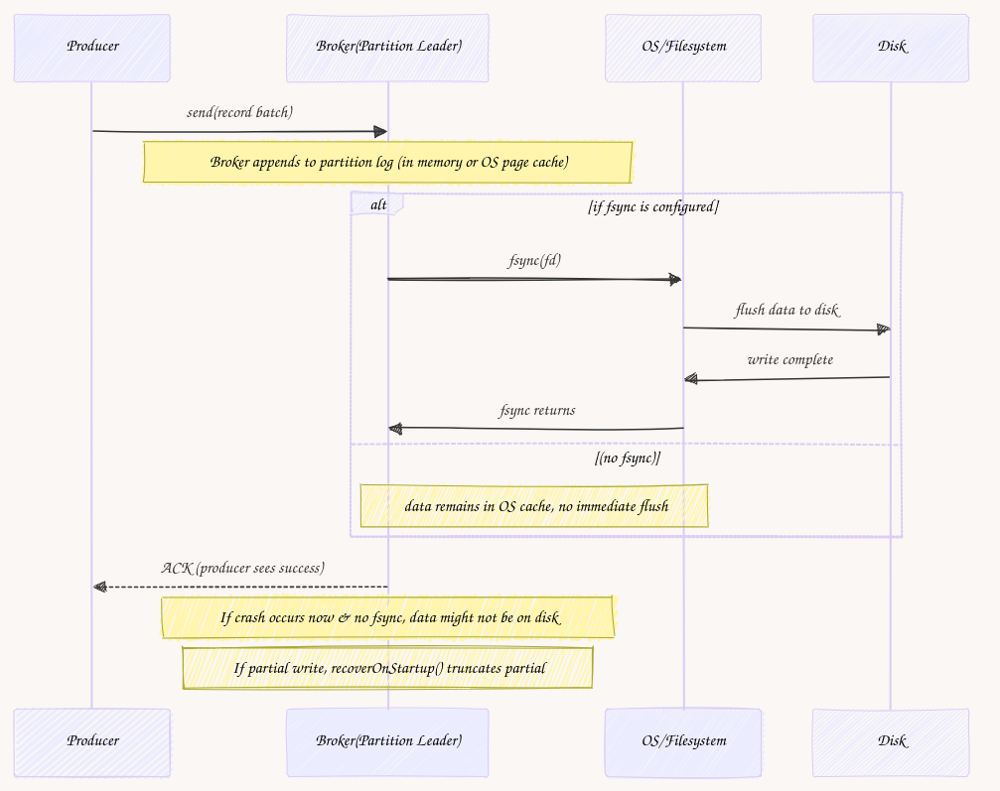

Imagine you’re sending a message to Kafka by calling something simple like:

```
producer.send(new ProducerRecord<>("someTopic", "Hello, Kafka!"));
```

**We often treat this like a “black box”. We put messages on one side and get them on the other.** The message leaves the producer, goes through the broker, and eventually appears in a consumer. This sounds straightforward, but behind the scenes, the technical implementation is a bit more complex.

**Kafka uses an append-only log for each partition, storing messages in files on disk.** We discussed that in detail in [The Write-Ahead Log: The underrated Reliability Foundation for Databases and Distributed systems](/en/the-write-ahead-log-a-foundation/). Thanks to that, if the process crashes mid-write, Kafka detects partial data (via checksums) and discards it upon restart.

As I got positive feedback on mixing the pseudocode (no-offence TypeScript!) with the concept explanation, **let’s try to show that flow today!**

Of course, we won’t replicate all real Kafka complexities (replication, huge batch format, time-based files rolling, etc.), but we try to be close enough logically to explain it and get closer to the backbone.

By the end, we’ll have:

1.  A minimal **producer** that batches messages in memory.

2.  A **segmented** **log** class that writes these batches in an **append-only** manner.

3.  A small **fsync** toggle to ensure data is physically on disk (or rely on OS caching).

4.  A **recoverOnStartup** method that checks for partial writes if a crash occurred and truncates them.

We’ll also discuss **why** each piece exists and how that gives you a closer look at tooling internals.

If you’re not into Kafka, that’s fine. This article can help you understand how other messaging tools are using disk, WAL, to keep their guarantees!

* * *

Before we jump into the topic, a short sidetrack. Or, actually, two.

First, **I invite you to join my online workshop, Practical Introduction to Event Sourcing.** I think you got a dedicated email about it, so let me just link here to the [page with details](https://ddd.academy/event-sourcing-practical-introduction/) and **a special 10% discount for you. It’s available through this link: [https://ti.to/on3/dddacademy/discount/Oskar](https://substack.com/redirect/066f3347-b53b-4bb1-a8fc-157a3ea85982?j=eyJ1IjoiY2xkOXcifQ.JRRIcqpqbYszBYF6OnKY_6vgEnwbcsI9a4rZvTiX-0Q).** Be quick, as the workshop will happen in precisely 2 weeks!

* * *

**Secondly, we [just released](https://github.com/event-driven-io/emmett/releases/tag/0.23.0) the stable version of the MongoDB event store in [Emmett](https://github.com/event-driven-io/emmett).** I wrote a detailed article explaining how we did it and how you can do it. Since you’re here, you’ll surely like such [nerd sniping](https://www.explainxkcd.com/wiki/index.php/356:_Nerd_Sniping).

**See: [https://event-driven.io/en/mongodb\_event\_store/](/en/mongodb_event_store/)**

Making it consistent and performant was challenging, so I think that's an interesting read. If you're considering using key-value databases like DynamoDB and CosmosDB, this article can outline the challenges and solutions.

My first choice is still on PostgreSQL, but I'm happy with the MongoDB implementation we came up with.

If MongoDB is already part of your tech stack and the constraints outlined in the article are not deal-breakers, this approach can deliver a pragmatic, production-friendly solution that balances performance, simplicity, and developer familiarity.

Ok, going back to our Kafka thing!

* * *

## Producer Batching: The First Step

When your code calls _producer.send_, real Kafka doesn’t instantly push that single message to the broker. Instead, it accumulates messages into **batches** to reduce overhead.

For example, if _[batch.size](https://docs.confluent.io/platform/current/installation/configuration/producer-configs.html#batch-size)_ is set to 16 KB, Kafka’s producer library tries to fill up to 16 KB of messages for a particular partition or wait until the time defined in _[linger.ms](https://docs.confluent.io/platform/current/installation/configuration/producer-configs.html#linger-ms)_ it’s not full, so before sending them as one record batch, this drastically improves throughput, though it can add slight latency.

Below is a pseudocode that demonstrates **why** we do batching at all—**not** storing anything on disk or network, but collecting messages until we decide to flush:

```
class SimpleInMemoryProducer {
  private buffer: Buffer[] = [];
  constructor(private broker: Broker, private maxBatchSize: number) {}

  send(msg: Buffer): void {
    if (this.buffer.length + message.length > this.maxBatchSize) {
      this.flush();
    }
    this.buffer.push(msg);
  }

  flush(): void {
    if (this.buffer.length === 0) return;

    broker.send(this.buffer);

    this.buffer = [];
  }
}
```

In real Kafka, we’d have compression, partitioner logic, etc. But the concept stands: **accumulate** messages → send them in bigger chunks.

Brokers are responsible for coordinating the data transfer between producer and consumers and ensuring that data is stored durable on disk.

This is important for “under the hood” log writes because the broker typically writes entire batches, possibly compressed, to disk in a single append. That’s one of the essential things to know about why Kafka is performant. After the message is sent to the broker, it’s just stored in the log and transferred to consumers. No additional logic happens.

As [explained in the article about WAL](/en/the-write-ahead-log-a-foundation/). Kafka follows the classical WAL pattern:

1.  **Log First:** Kafka producers append messages to a specific partition in a topic. Each partition is a WAL where new messages are appended at the end. Partitions are immutable—once a message is written, it cannot be modified. Each message in a partition is assigned a monotonic offset, which acts as a unique position marker.

2.  **Flush to Disk:** Kafka ensures durability by persisting messages to disk before acknowledging the write to the producer. Each Kafka broker flushes log entries to disk periodically (configurable via _[flush.messages](https://kafka.apache.org/documentation/#topicconfigs_flush.messages)_ or _[flush.ms](https://kafka.apache.org/documentation/#topicconfigs_flush.ms)_). For stronger guarantees, Kafka producers can request acknowledgements from multiple brokers (e.g., _[acks=all](https://kafka.apache.org/documentation/#producerconfigs_acks)_), ensuring data is replicated before the write is acknowledged.

3.  **Apply Changes Later:** Consumers read messages from the topic’s partition sequentially, starting from a specific offset. The position of a consumer within a partition is called the offset. Consumers commit their offsets to Kafka or external stores to keep track of their progress. This model allows Kafka to achieve high throughput: sequential reads and writes are fast and efficient on modern storage hardware. Consumers are responsible for state management (e.g., [deduplication](/en/deduplication-in-distributed-systems/) or applying the messages), which keeps Kafka lightweight.

* * *

## Single File Append: The Simplest Broker-Side Implementation

If we were to implement the broker side in a naive manner, we could keep a **single** file for all messages. Whenever a batch arrives, we append it to the end of that file, storing it in the following format:

```
[ offset: 4 bytes | dataLength: 4 bytes | data: N bytes ]
```

Where:

-   offset - a logical position in the long,

-   data length - how big is our record, in other words, how many bytes does the record data contain,

-   data - the payload

Using Node.js _[fs (File System)](https://nodejs.org/api/fs.html)_ built-in library, we could code the basic append to log logic as:

```
import * as fs from 'fs';

class SingleFilePartitionLog {
  private fd: number;
  private nextOffset = 0;

  constructor(filePath: string) {
    // Open the file in append mode
    this.fd = fs.openSync(filePath, 'a+');
  }

  append(messages: Buffer[]): number[] {
    const offsets: number[] = [];
    for (const msg of messages) {
      offsets.push(this.nextOffset);

      const header = Buffer.alloc(8);
      header.writeInt32BE(this.nextOffset, 0);
      header.writeInt32BE(msg.length, 4);

      fs.writeSync(this.fd, header);
      fs.writeSync(this.fd, msg);

      this.nextOffset++;
    }
    return offsets;
  }
}
```

Then, the broker can transfer this binary log data to consumers and

**Why** does Kafka do an append-only approach? Because it’s:

1.  **Fast**: sequential writes are efficient.

2.  **Crash-friendly**: if you crash mid-write, only the tail is incomplete.

3.  **Recovery**: you can discard partial writes at the end if they’re incomplete, preserving older data.

However, a single monolithic file eventually becomes huge, making retention or partial scanning painful. Also, if we wanted to ensure data is physically on disk, we’d call [fsync](https://pubs.opengroup.org/onlinepubs/009695399/functions/fsync.html), which we’ll see is a performance trade-off.

**Next, we’ll fix the “giant file” issue by splitting data into segments.**

* * *

## Segment Rolling: Why Kafka Doesn’t Use One Giant File

It might balloon to tens or hundreds of GB if you keep appending to a single file. As we’re doing the Write-Ahead Log to make our solution resilient, deleting old data in the middle is not an option. Scanning the entire file on a crash restart is slow, and so forth.

**Kafka solves this with [segment rolling](https://docs.confluent.io/platform/current/installation/configuration/topic-configs.html#retention-bytes).** Once the current segment hits a specific size (like 1GB) or an elapsed time, Kafka “rolls” to a new segment. The old segment is “sealed” and can be safely truncated (deleted) once it’s beyond the retention window. Searching also becomes more straightforward since only the active segment needs detailed scanning on the crash, and older segments can be more thoroughly indexed or eventually dropped.

**Hence,** the notion of:

1.  A list of segments.

2.  Each segment has a base offset (the offset of its first message) and a file descriptor.

3.  When the active segment grows beyond a maximum number of bytes, the broker closes it and opens a new file.

We’ll reflect that in the code next.

* * *

## Crash Consistency: `fsync` and Partial-Write Detection

Usually, writing to a file means the OS eventually flushes data to disk, but if the machine loses power, that data might vanish. Calling _fsync(fd)_ forces the OS to flush all pages for that file descriptor to stable storage. That means once _fsync_ returns, if the process crashes, we’re confident the data is physically on disk (barring hardware-level issues).

**In most UNIX-like operating systems, file descriptors are process-specific handles.** Even if two processes open the same physical file, each has its own file descriptor. When each process calls _fsync(fd)_, the kernel serializes disk I/O at the block-device layer. In other words, concurrent _fsync_ calls on the same underlying file don’t corrupt data; they simply cause the OS to ensure all pending writes for that file descriptor reach stable storage. If a second _fsync_ call happens while the first is still flushing, the second may have to wait or might become a near no-op if the previous _fsync_ one has already flushed everything.

**In Kafka’s actual design, each partition has a single broker that’s its leader. That means it owns a given log file at a time, so we rarely see two processes simultaneously calling on the same file.** The [single-writer principle](https://www.architecture-weekly.com/i/147613456/single-writer-pattern) means only one broker/partition leader actively appends data to that file, so concurrency for _fsync_ is basically not an issue. But if, hypothetically, you had two separate processes sharing the same file descriptor, the OS and kernel’s VFS layer would still handle concurrency safely—though it might degrade performance if both processes repeatedly call _fsync_.

### How fsync Works (in a Nutshell)

When you call _fsync (fd)_, the system call instructs the OS to:

1.  **Flush any dirty buffers** associated with the file descriptor `fd` to physical disk.

2.  **Wait until the disk I/O is confirmed** (or stable enough) so that, once _fsync_ returns, data is guaranteed to survive a power loss or crash (to the best of the hardware’s ability).

On modern systems, the OS tracks which pages in memory are “dirty” for that file. _fsync_ forces them out of memory into the actual storage device. If another process calls _fsync_ concurrently for the same file, either:

-   It will also wait, but the data might be on disk effectively once the first _fsync_ completes.

-   The OS handles locking internally so that partial flushes do not cause corruption or race conditions.

Hence, multiple _fsync_ calls on the same file are safe but can reduce performance if done frequently.

* * *

### How Kafka Typically Does _fsync_

**As fsync is expensive if done frequently, in Kafka, the leader of a partition does not necessarily have to** _**fsync**_ **data immediately for every write.** When a producer sends data to the leader, the leader writes it to its log (typically in memory or in the OS page cache, not yet on disk). Simultaneously, the leader propagates this data to its replicas (followers). The key point is that the ACK sent back to the producer does not require the leader to `fsync` the data to disk. Instead, Kafka relies on the replicas to form a redundancy group.

For example:

1.  The leader appends the batch to its log but doesn't immediately flush it to disk with `fsync`. Instead, it waits for enough followers (based on the [min.insync.replicas](https://kafka.apache.org/documentation/#brokerconfigs_min.insync.replicas) setting) to confirm that they've also received and appended the data.

2.  The leader sends an ACK to the producer only after receiving these confirmations. The assumption is that even if the leader crashes, one of the followers will still have the data.

**The idea is that replication provides redundancy, so durability is distributed across multiple brokers instead of relying on one broker’s disk persistence.** Even if the leader crashes without _fsyncing_, the replicas can step in to ensure no data is lost. So, if one broker crashes, the data still exists on the followers. This approach allows Kafka to prioritize throughput by avoiding frequent fsync calls while maintaining durability through replication.

**Replication doesn't entirely eliminate the need for fsync but reduces its criticality for performance-sensitive workloads.** This trade-off is a cornerstone of Kafka’s design.

**What Happens If Replication Fails?** If not enough replicas are available to confirm the write (e.g., due to network issues or broker failures), Kafka cannot rely solely on replication. In such cases, you might need the leader to fsync its data more frequently to ensure durability. This is why single-node setups (or scenarios with insufficient replicas) require more aggressive fsync configurations to protect against data loss.

[Kafka also does have configurations like:](https://kafka.apache.org/08/documentation.html#brokerconfigs)

-   _log.flush.interval.messages_ - After how many messages to force a flush.

-   _log.flush.interval.ms_ - after how many milliseconds do to force a flush.

By default, these are typically set to “disable immediate flush” and let the OS manage flushing. Kafka also has a background thread that can flush at intervals. So, in single-broker scenarios (e.g., test/development), you might lose a small data window if the OS never physically wrote it. In multi-broker production, replication is the real safety net.

**If you have only one broker and want strong durability, you can set log.flush.interval.messages=1 or log.flush.interval.ms=0, but you’ll pay a big performance cost.**

* * *

## Implementing Segmented Log

We’ll construct a “SegmentedPartitionLog” that:

1.  Maintains multiple Segment objects.

2.  Rolls to a new segment if the active one exceeds the maximum segment bytes.

3.  Writes each batch with a “magic, CRC, recordCount, data” header.

4.  Optionally calls fsync after writing for durability.

5.  On startup, can parse the last segment’s tail to discard partial writes.

### Segment and Record structure

Let’s define the structure of our log segment and the record. Record will look as follows

```
interface SingleRecord {
  relativeOffset: number;
  timestamp: number;
  payload: Buffer;
}
```

It has:

-   _relativeOffset_ - captures the message’s offset within the current batch. It’s helpful when storing multiple messages together and reconstructing their offsets later.

-   _timestamp_ - records when the message was created or appended, useful for debugging or potential time-based handling.

-   _payload_ - holds the actual binary data (the message’s content). Since Kafka treats messages as raw bytes, our code does the same.

The segment will look:

```
interface Segment {
  fileFd: number;
  filePath: string;
  baseOffset: number;
  nextOffset: number;
  startPos: number;
}
```

It has:

-   _fileFd -_ is the open file descriptor for writing to disk.

-   filePath - is which file we’re actually appending to.

-   _baseOffset -_ marks the global offset of the first record in this segment.

-   _startPos_ tracks how many bytes we’ve already written so we know where to append the next batch.

-   _nextOffset_ tells us which global offset for that segment that we’ll assign next if we keep writing.

### Partial Writes and Cyclic Redundancy Check (CRC)

Even if data is fully on disk (via OS flush or _fsync_), you can get only a partial batch if a crash hits mid-write. Kafka includes a CRC in the batch header. On startup, Kafka reads the tail of the active segment; if it can’t parse a full batch or the CRC fails, it truncates that partial data. This ensures that incomplete writing never pollutes valid messages.

We’ll make a simplified approach: embed a small “magic byte,” a 4-byte CRC, and a record count (plus the compressed data). If we can’t read the entire batch or the CRC doesn’t match on startup, we truncate it. Let’s see how we code that “WAL” concept in segments.

```
function computeCRC(buf: Buffer): number {
  // Real Kafka: specialized CRC32C. We'll do MD5 => integer
  const md5 = crypto.createHash('md5').update(buf).digest('hex');
  return parseInt(md5.slice(0, 8), 16);
}

function compressData(buf: Buffer): Buffer {
  return buf; // no-op
}
```

### Building the Batches (Magic, CRC, Count)

We define a function to turn an array of SingleRecord into a single binary chunk. Real Kafka also includes a “batch length,” “timestamp type,” “attributes,” etc. We keep it minimal.

**The flow looks as follows:**

1.  For each record, we construct the binary with offset, timestamp, and data length and append it to the binary buffer together with the payload.

2.  We’re merging that into a single buffer and compress it.

3.  We’re building the batch header with magic number, CRC number, batch records count, etc.

4.  Returning the merged batch buffer with header and data.

See:

```
function buildBatchBuffer(records: SingleRecord[]): Buffer {
  const rawParts: Buffer[] = [];
  for (const r of records) {
    // 1. Build record header for each record
    // [ relativeOffset(4), timestamp(8), payloadLen(4), payload... ]
    const recHeader = Buffer.alloc(4 + 8 + 4);
    recHeader.writeInt32BE(r.relativeOffset, 0);
    recHeader.writeBigInt64BE(BigInt(r.timestamp), 4);
    recHeader.writeInt32BE(r.payload.length, 12);
    rawParts.push(recHeader, r.payload);
  }
  // 2. Merge record into batch
  const rawRecordsBuf = Buffer.concat(rawParts);
  // Compress it
  const compressed = compressData(rawRecordsBuf);

  const recordCount = records.length;
  // 3. Build the batch header
  // [ magic(1), CRC(4), recordCount(4), data... ]
  const header = Buffer.alloc(1 + 4 + 4);
  header.writeUInt8(2, 0); // say magic=2
  header.writeInt32BE(0, 1); // placeholder for CRC
  header.writeInt32BE(recordCount, 5);

  const partial = Buffer.concat([header, compressed]);
  const c = computeCRC(partial.slice(5));
  header.writeInt32BE(c, 1);

  // 4. Return the buffer containing
  // batch header and compressed records
  return Buffer.concat([header, compressed]);
}
```

### The Segmented Log

Now we define the class that orchestrates everything: multiple segments, rolling, optional _fsync_, etc. We’ll also add a `recoverOnStartup()` method next to handle partial writes. First, the skeleton:

```
class SegmentedPartitionLog {
  private segments: Segment[] = [];
  private activeSegment!: Segment;
  private currentOffset = 0;
  private maxSegmentBytes = 512 * 1024;
  private doFsync = false;

  constructor(private partitionId: number, private baseDir: string) {
    if (!fs.existsSync(baseDir)) fs.mkdirSync(baseDir, { recursive: true });
    this.createSegment(0);
  }

  public appendBatch(records: SingleRecord[]): number[] {
    // We'll fill in
  }

  public recoverOnStartup(): void {
    // We'll fill in
  }

  private rollSegment(): void {
    // We'll fill in
  }

  private createSegment(baseOffset: number) {
    // We'll fill in
  }
}
```

We assume we only do size-based rolling. Real Kafka is also time-based.

#### Step 3.1: Creating/Rolling Segments

When creating a segment, we open the segment file for reading and writing (so _a+)_. The data being written will be inserted at the end of the file. If the file doesn’t exist, it’ll be created. We track the base offset.

```
private createSegment(baseOffset: number): void {
  const filePath = path.join(this.baseDir, `partition-${this.partitionId}-${baseOffset}.log`);
  const fd = fs.openSync(filePath, 'a+');

  const seg: Segment = {
    fileFd: fd,
    filePath,
    baseOffset,
    nextOffset: baseOffset,
    startPos: fs.fstatSync(fd).size,
  };

  this.segments.push(seg);
  this.activeSegment = seg;
  this.currentOffset = baseOffset;
}
```

If the active segment surpasses maximum segment bytes, we close it, and create a new one with _rollSegment_ method:

```
private rollSegment(): void {
  fs.closeSync(this.activeSegment.fileFd);
  this.createSegment(this.currentOffset);
}
```

#### Appending Batches (Including `fsync`)

When a batch of records is ready to be appended, we:

1.  **Check for Empty Batch**: If there are no records, exit early.

2.  **Check Segment Size**: If the active segment is full, roll over to a new segment.

3.  **Assign Base Offset**: Note the starting offset for this batch.

4.  **Serialize and Prepare Batch**: Convert records to a binary format suitable for disk storage.

5.  **Write to Disk**: Append the serialized batch to the active segment's file.

6.  **Optional Durability**: Flush the data to disk if _fsync_ is enabled. Instead of relying solely on fsync, Kafka ensures durability by replicating data across multiple brokers. This approach balances performance and reliability.

7.  **Update State**: Move the file position forward and update offsets.

8.  **Assign Offsets**: Allocate and return unique offsets for each record in the batch. Kafka meticulously tracks offsets to maintain message order and ensure accurate consumption.

```
public appendBatch(records: SingleRecord[]): number[] {
  if (records.length === 0) return [];

  if (this.activeSegment.startPos > this.maxSegmentBytes) {
    this.rollSegment();
  }

  const baseOffset = this.currentOffset;
  const batchBuf = buildBatchBuffer(records);

  const seg = this.activeSegment;
  const filePos = seg.startPos;
  fs.writeSync(seg.fileFd, batchBuf, 0, batchBuf.length, filePos);

  if (this.doFsync) {
    fs.fsyncSync(seg.fileFd);
  }

  seg.startPos += batchBuf.length;
  const lastOffset = baseOffset + records.length - 1;
  this.currentOffset = lastOffset + 1;
  seg.nextOffset = this.currentOffset;

  const offsets: number[] = [];
  for (let i = 0; i < records.length; i++) {
    offsets.push(baseOffset + i);
  }
  return offsets;
}
```

* * *

### Crash Recovery: Partial Batches

What if the broker or OS crashes mid-write, leaving half a batch? On the restart, we parse the last segment’s tail, read the batch header (magic, CRC, record count, etc.), read the data, and verify the CRC.

**If we can’t, we truncate.** This ensures incomplete data is never recognized as valid messages.

The basic flow looks as follows:

1.  **Identify the Last Segment**: Since only the last segment is likely to contain incomplete or corrupted data after a crash, the method focuses on it.

2.  **Starting from the tail, check batches.** Do this by reading the header and validating it. Check the magic byte to ensure the batch format is correct. Then, based on the data length from the header, check batch completeness to ensure that the entire batch data is present. After that, compute the batch data's CRC and compare it to the stored CRC in the header to ensure data integrity. If the batch is okay, stop processing; if not, go to the next batch.

3.  **If any of the above checks fail, truncate the log file in its current position, removing the corrupted or incomplete batch and any following data.**

4.  After successfully truncating the log, recalculate the current offset, ensuring that new records are appended correctly.

Why do we need it? We need to recover from a broker crash to ensure data integrity. If we do not discard partial writes, we might interpret broken data as messages. The WAL approach says, “append, then check on startup; discard incomplete tails.”

I’ll skip the implementation for brevity; you can try implementing it, or I can expand it in the next article.

Kafka incorporates additional layers of complexity and robustness, such as:

-   advanced metadata in batch headers,

-   efficient CRC implementations,

-   time-based segment rolling,

-   comprehensive indexing for data retrieval and replication across multiple brokers for enhanced durability and fault tolerance,

These features collectively enable Kafka to handle high-throughput, distributed, and resilient messaging scenarios beyond the simplified model presented.

* * *

## TLDR on the flow



1.  **Producer**: Gathers messages, picks a partition, and forms a record batch in memory. Depending on settings like _batch.size, linger.ms_, it ships that batch to the broker.

2.  **Broker**: The partition leader receives the batch and appends it to the active segment in an append-only fashion. By default, it does not call fsync each time; it gets help from replication. Once enough replicas have the batch in their page caches; the leader returns an ACK to the producer.

3.  **Crash**: If the broker crashes mid-write, on the restart, it checks the tail of the last segment, verifying each batch’s CRC and length. If incomplete, it **truncates** those bytes.

4.  **Retention**: Kafka eventually deletes older segments entirely if they exceed your retention window or log size limit. This is easy since each segment is a separate file.

* * *

## Conclusion: A WAL-Like Architecture for Distributed Streams

**We built a dummy Kafka-like partition log design from a naive single-file approach to a segmented, CRC-checked one that can handle partial writes by truncation.** We also explained how _fsync_ ties in, why real Kafka typically doesn’t rely on it for each write, and how concurrency for fsync is managed safely.

This approach lets Kafka scale to billions of messages while ensuring that once a message is acknowledged, it’s stored in multiple brokers, so partial or incomplete writes on one node’s disk can’t cause data corruption. Single-node dev scenarios might configure more frequent flushes, but that’s typically not done in multi-broker production.

**Either way, the WAL principle—append data, use checksums to detect partial tails, and optionally sync to disk if needed—is key to how Kafka ensures reliability and performance in a distributed environment.**

Again, [that’s also why we should not treat Kafka as a database but as a messaging system.](/en/event_streaming_is_not_event_sourcing/) As you can see, it leans toward optimising throughput rather than consistency.

I hope that helps you understand how Kafka and other messaging systems deal physically with getting proper delivery guarantees and performance.

**Please pass me your feedback if you’d like me to continue this implementation in the next few articles. I can explain the next elements of the pipeline or explore those topics further.**

Cheers!

Oskar

**p.s. Ukraine is still under brutal Russian invasion. A lot of Ukrainian people are hurt, without shelter and need help.** You can help in various ways, for instance, directly helping refugees, spreading awareness, and putting pressure on your local government or companies. You can also support Ukraine by donating, e.g. to the [Ukraine humanitarian](https://savelife.in.ua/en/donate/) organisation, [Ambulances for Ukraine](https://www.gofundme.com/f/help-to-save-the-lives-of-civilians-in-a-war-zone) or [Red Cross](https://redcross.org.ua/en/).
