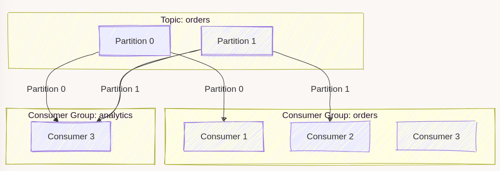
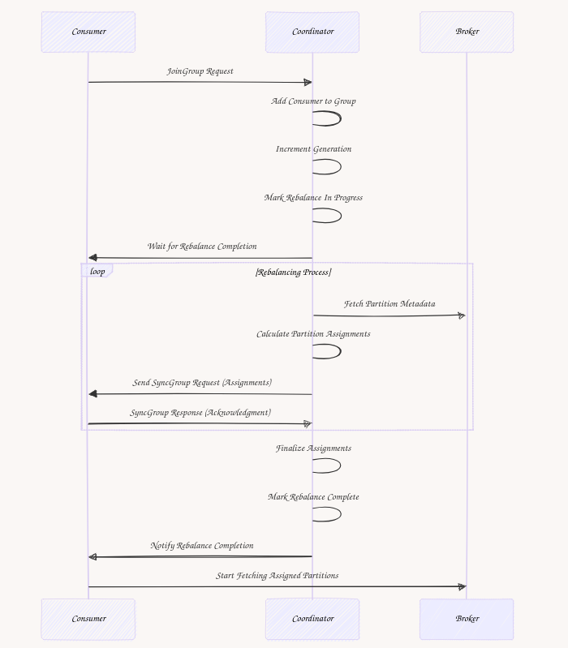

**[Last week, we discussed how Kafka producers work](/en/how-a-kafka-like-producer-writes/) and how Kafka stores data.** We discussed details like [fsync, crash resiliency](/en/how-a-kafka-like-producer-writes/) and why it’s better to flush data on disk rarely. That was a bit of [nerd sniping](https://www.explainxkcd.com/wiki/index.php/356:_Nerd_Sniping). But of course, not only. The main goal was to explain how messaging systems do the work and understand their capabilities and limitations. You cannot cheat physics; you need to pick your poison and know whether you optimise for throughput or consistency.

**The feedback was positive, and [Michał asked me to expand on the Kafka Consumers](https://www.architecture-weekly.com/p/how-a-kafka-like-producer-writes/comment/86700784).** So I do today!

**Consuming messages might seem straightforward when working with Kafka: You subscribe to a topic and receive the messages asynchronously as notifications.**

Let’s stop for a moment to consider what asynchronous means here. We too often believe that we get push notifications magically. **And actually, behind each push notification, there’s a pulling somewhere—just hidden behind the scenes.**

That’s how it works with Kafka; as users, we see those messages falling into one side of the pipe and falling out on the other. Puff! But technically, it’s based on polling the messages from partitions (so [Kafka’s Write-Ahead Log](https://www.architecture-weekly.com/i/152749693/kafka-logs-as-the-system)).

**In this article, I’ll explain Kafka’s message consumption process, focusing on how it handles partition assignments, fault tolerance, and the trade-offs involved.** While consuming messages in Kafka might seem as simple as subscribing to a topic, the underlying mechanics—like managing consumer groups and rebalancing partitions—are not precisely like that!

We’ll explore:

-   **Consumer Groups**: How Kafka assigns partitions to consumers in a group to ensure parallel processing without overlaps.

-   **Rebalancing**: The process of redistributing partitions when consumers join or leave and the impact this has on message processing.

-   **Practical Challenges**: Real-world implications of Kafka’s design, like pauses during rebalancing, handling uneven workloads, and storage overhead.

By the end, you’ll better grasp how Kafka consumers work, what trade-offs are involved, and how those might influence your design decisions.

## Consumers and Topics: A Quick Recap

**In Kafka, a topic is a logical abstraction used to organize messages. For example, a topic named** _**orders**_ **might store all order events.** Each topic is divided into partitions to scale Kafka’s storage and processing capacity. Partitions are the physical storage units where Kafka messages are stored as append-only logs. Each message in a partition is identified by its offset, a monotonically increasing number.

Partitions allow Kafka to distribute data across brokers and provide parallelism. Each partition can be processed independently, enabling horizontal scalability.


* * *

### **What Are Consumers?**

A **consumer** is an application instance that connects to Kafka, reads messages from specific topic partitions, and processes them. Each consumer works with one or more partitions, pulling messages in sequence starting from a specific offset.

* * *

### **What Are Consumer Groups?**

**A consumer group is a collection of consumers that work together to consume messages from a topic.** The key idea behind consumer groups is parallelism with partition exclusivity:

-   **Each partition in a topic is assigned to only one consumer within a group.** This ensures that no two consumers in the group process the same partition simultaneously. Thanks to that, we won’t have race conditions.

-   **Consumers can be assigned to multiple partitions if there are more partitions than consumers.**

-   **If there are more consumers than partitions, some consumers will remain idle.**

**Consumers in different groups can consume the same partitions independently. For example:**

-   An _order_ consumer group might read messages about the orders to process orders.

-   Another group named _analytics_ could independently consume the same topic for analytics purposes.



This isolation enables multi-use messaging: different systems can consume the same data independently while maintaining offsets and processing logic.

**That fulfils the foundational assumption behind event-driven solutions: an event can have multiple subscribers.** It also provides a technical solution for decoupling from producer to consumer. The producer sends the event (or other type of message) to a topic, and multiple subscribers can trigger their flows based on that.

## **Partition Assignment: How It Works**

**The assignment of partitions to consumers is managed dynamically.** When a consumer joins or leaves the group, partitions are reassigned automatically. For example, a topic with six partitions and a consumer group of three consumers will result in each consumer being assigned two partitions. If one consumer fails, its partitions are reassigned to the remaining consumers.

**Partition assignment within a consumer group is handled by the Group Coordinator,** a special broker designated for managing group membership.

Here’s how it works:

1.  A _JoinGroup_ request is sent to the Group Coordinator when a consumer joins the group.

2.  The coordinator collects information about all active consumers in the group and the partitions of the subscribed topic.

3.  The coordinator distributes partitions among the consumers using a partition assignment strategy (e.g., [round-robin](https://en.wikipedia.org/wiki/Round-robin_item_allocation) or range-based).

4.  Each consumer receives a _SyncGroup_ response with its assigned partitions.

5.  If a consumer crashes or leaves the group, the Group Coordinator triggers a rebalance, redistributing the partitions among the remaining consumers.

**To see this process in action, the naive implementation could look as follows:**

```typescript
class GroupCoordinator {
  // tracking asignment of consumer to partitions
  private assignments: Map<string, number[]> = new Map();

  assignPartitions(consumers: string[], partitions: number[]): void {
    this.assignments.clear();
    partitions.forEach((partition, index) => {
      const consumer = consumers[index % consumers.length];
      if (!this.assignments.has(consumer)) {
        this.assignments.set(consumer, []);
      }
      this.assignments.get(consumer)!.push(partition);
    });
  }

  getAssignment(consumer: string): number[] {
    return this.assignments.get(consumer) || [];
  }
}
```

Of course, that’s just an illustration. In reality, you wouldn’t like to recreate the assignment each time. You’d like to keep it consistent and reduce the chance of breaking the flow by reassignment. And that’s also why Kafka has a more sophisticated way of handling it.

While dynamic partition and (re)assignment ensures fault tolerance, it comes with trade-offs:

1.  **Temporary Pauses**: During rebalancing, consumers pause processing until partitions are reassigned.

2.  **Offset Considerations**: Reassignments rely on offsets to ensure that a new consumer can resume from the correct position.

Kafka allows fine-tuning of rebalancing behaviour with parameters like:

-   `session.timeout.ms`: Determines how long a consumer can remain inactive before being considered dead.

-   `max.poll.interval.ms`: Ensures consumers are actively polling messages to avoid being marked as inactive.

-   `rebalance.timeout.ms`: During a rebalance, if a consumer doesn’t respond within the defined rebalance timeout, it’s removed, and the rebalance is restarted.

## How Kafka Tracks Active Consumers

**Kafka needs to know which consumers are still part of the group to manage rebalances effectively.** This is where heartbeats come in.

A heartbeat is a lightweight signal sent by a consumer to the Group Coordinator at regular intervals. Think of it as the consumer saying, _“[I'm Still Standing!](https://www.youtube.com/watch?v=ZHwVBirqD2s)”._ If the Group Coordinator doesn’t receive a heartbeat from a consumer within a certain time (defined by `session.timeout.ms`), it assumes the consumer is dead and triggers a rebalance.

**Every time a rebalance occurs, Kafka increments the generation number for the group. This number uniquely identifies the group's current state**. Consumers include the generation number in their requests to the coordinator (like heartbeats or partition fetch requests). If a request uses an outdated generation, Kafka rejects it.

For example:

-   A consumer joins the group during generation 1 and starts processing messages.

-   A rebalance happens, moving the group to generation 2. The consumer now needs to include generation 2 in its requests. If it mistakenly uses generation 1, Kafka knows the request is invalid and ignores it.

This ensures that only consumers aware of the latest group state can participate, preventing stale or conflicting actions.



The pseudo-code showcasing heartbeats handling can look as follows:

```typescript
type ConsumerHealth = { lastHeartbeat: number; consumerGeneration: number };

class GroupCoordinator {
  private generation: number = 0;
  private consumers: Map<string, ConsumerHealth> = new Map();

  // All partitions in the topic
  private partitions: number[] = [];

  private heartbeatTimeout: number = 5000;
  private isRebalancing: boolean = false;
  private intervalHandle: NodeJS.Timeout | null = null;

  constructor(partitions: number[]) {
    this.partitions = partitions;

    // Start monitoring for consumers
    this.startHeartbeatMonitoring();
  }

  private startHeartbeatMonitoring(): void {
    this.intervalHandle = setInterval(() => {
      const now = Date.now();
      this.consumers.forEach(({ lastHeartbeat }, consumerId) => {
        if (now - lastHeartbeat > this.heartbeatTimeout) {
          console.log(`Consumer ${consumerId} timed out. Removing from group.`);
          this.leaveGroup(consumerId);
        }
      });
    }, 1000);
  }

  private stopHeartbeatMonitoring(): void {
    if (this.intervalHandle) {
      clearInterval(this.intervalHandle);
      this.intervalHandle = null;
    }
  }

  // Consumer sends a heartbeat
  sendHeartbeat(consumerId: string, consumerGeneration: number): void {
    if (!this.consumers.has(consumerId)) {
      console.log(`${consumerId} is not part of the group.`);
      return;
    }

    const consumerState = this.consumers.get(consumerId)!;
    if (consumerGeneration !== this.generation) {
      console.log(
        `Heartbeat from ${consumerId} rejected. Consumer generation ${consumerGeneration} is outdated (current: ${this.generation}).`
      );
      return;
    }

    // Update last heartbeat timestamp
    consumerState.lastHeartbeat = Date.now();
    console.log(`Heartbeat from ${consumerId} accepted.`);
  }
}
```

**Heartbeats also serve another purpose: they let consumers detect when a rebalance is happening.** During a rebalance, consumers stop sending heartbeats until the process is completed. If a consumer tries to send a heartbeat during this time, the coordinator rejects it, signalling the consumer to wait.

## Tracking Consumers and assignments revisited

Having all of that, the more real-world code showing how the assignment works looks as follows:

```typescript
class GroupCoordinator {
  // Partition assignments
  private assignments: Map<string, number[]> = new Map();

  joinGroup(consumerId: string): void {
    if (this.isRebalancing) {
      throw new Error("Rebalance already in progress. JoinGroup denied.");
    }

    if(this.cosumer.has(consumerId)) {
      console.log(`${consumerId} already joined!`);
      return;
    }

    this.consumers.set(consumerId, {
      lastHeartbeat: Date.now(),
      generation: this.generation
    });

    this.startRebalance();
  }

  leaveGroup(consumerId: string): void {
    if (this.isRebalancing) {
      throw new Error("Rebalance already in progress. LeaveGroup denied.");
    }

    if (!this.consumers.has(consumerId)) {
      console.log(`${consumerId} not part of the group.`);
      return;
    }

    this.consumers.delete(consumerId);

    this.startRebalance();
  }
}
```

Both joining and leaving consumers force Kafka to ensure that partitions are distributed and that there are no orphaned ones.

## **Consumer Groups: Ensuring Unique Partition Processing**

At its core, Kafka’s consumer group model ensures that every message in a topic is processed once, while scaling workloads across multiple consumers. Each partition in a topic is assigned to exactly one consumer in the group, but no more than one.

This sounds simple enough, but distributed systems rarely make anything simple. Consumers join and leave groups dynamically, networks fail, and reassigning work introduces delays. Kafka’s **Group Coordinator** handles these challenges, dynamically managing assignments and ensuring partitions aren’t left idle.

* * *

### **How Partition Assignment Works**

Partition assignment is managed by the **Group Coordinator**, a special broker designated to handle a specific group. When a consumer joins the group:

1.  The consumer sends a `JoinGroup` request.

2.  The coordinator assigns partitions to all active consumers in the group.

3.  Each consumer is notified of its assigned partitions.

Let’s see this in action with a simple round-robin assignment:

```typescript
class GroupCoordinator {
  private assignments: Map<string, number[]> = new Map();

  assignPartitions(consumers: string[], partitions: number[]): void {
    this.assignments.clear();
    partitions.forEach((partition, index) => {
      const consumer = consumers[index % consumers.length];
      if (!this.assignments.has(consumer)) {
        this.assignments.set(consumer, []);
      }
      this.assignments.get(consumer)!.push(partition);
    });
  }

  getAssignment(consumer: string): number[] {
    return this.assignments.get(consumer) || [];
  }
}
```

This round-robin assignment ensures an even distribution of partitions among consumers. Kafka also supports **range-based assignment**, which keeps consecutive partitions together for fewer consumers.

* * *

## **Consumers Assignment Rebalancing**

Rebalancing is at the core of Kafka’s consumer group design, enabling dynamic partition assignment when group membership changes. As noted earlier, rebalancing occurs whenever the group membership changes:

-   A new consumer enters the group.

-   A consumer crashes or is shut down.

-   The topic is reconfigured, adding or removing partitions.

There are three main phases:

-   starting rebalancing,

-   actual rebalancing,

-   completing rebalance.

Understanding why Kafka takes these steps is important to understanding the logical order and its consequences is essential. You can read the full information in [KIP-848: The Next Generation of the Consumer Rebalance Protocol](https://cwiki.apache.org/confluence/display/KAFKA/KIP-848%3A+The+Next+Generation+of+the+Consumer+Rebalance+Protocol). I’ll try to provide you with a logical understanding of how rebalancing works.

### **1\. Starting Rebalancing**

In this logical step, Kafka ensures the consumer group does not make another rebalancing.

Kafka guarantees that no two rebalances occur simultaneously. If multiple events (e.g., a consumer joins and another fails) trigger a rebalance simultaneously, they will conflict without proper locking.

Imagine a consumer group processing a topic with two partitions: \[0, 1\]. If a rebalance starts because consumer2 fails while consumer3 joins, overlapping updates would create inconsistent assignments. Singleton run of starting rebalancing ensures one change is fully processed before another begins.

In our simple implementation, we could set the _isRebalancing_ flag and [use the TaskProcessor known from previous articles](/en/locks-queues-and-business-workflows/).

This method is triggered by events like:

```text
private startRebalance(): void {
  if (this.isRebalancing) {
    throw new Error("Rebalance already in progress.");
  }

  // Lock the rebalance
  this.isRebalancing = true;

  // Increment generation number
  this.generation += 1;

  this.rebalance();
}
```

The increment of the generation number is essential for synchronization. It marks a fresh state for the group, and all consumers must operate within this new context. Outdated consumers are excluded from further processing.

* * *

### **2\. Rebalancing and redistributing Partitions**

This is the phase where the actual redistribution of partitions happens. This involves removing stale assignments, recalculating new ones, and ensuring all active consumers are notified.

```typescript
private rebalance(): void {
  const consumerList = Array.from(this.consumers.keys());

  if (consumerList.length === 0) {
    this.assignments.clear();
    this.completeRebalance();
    return;
  }

  // Identify unassigned partitions
  const assignedPartitions = Array.from(this.assignments.values()).flat();

  const unassignedPartitions = this.partitions.filter(
    (partition) => !assignedPartitions.includes(partition)
  );

  // Filter out assignments for inactive consumers
  this.assignments = new Map(
    Array.from(this.assignments.entries()).filter(([consumer]) =>
      this.consumers.has(consumer)
    )
  );

  // Redistribute unassigned partitions
  unassignedPartitions.forEach((partition, index) => {
    const consumer = consumerList[index % consumerList.length];
    const currentAssignments = this.assignments.get(consumer) || [];
    this.assignments.set(consumer, [...currentAssignments, partition]);
  });

  // Notify consumers of their new assignments
  this.syncGroup();
  this.completeRebalance();
}
```

**Rebalancing enforces exclusivity:** every partition is assigned to exactly one consumer in the group. This avoids duplication and ensures that no two consumers process the same messages. Kafka tries to distribute partitions as evenly as possible.

If a consumer leaves, its partitions must be redistributed to remaining consumers to avoid unprocessed data. If a consumer joins, the additional capacity is utilized to spread the workload more evenly.

If a consumer group is processing a high-throughput topic, ensuring partitions are reassigned promptly during failures minimizes downtime. For instance, if consumer1 is processing partition `[0]` but fails, rebalancing ensures its messages are reassigned quickly to avoid delays.

* * *

### **3\. Completing Rebalance**

Once the partition assignments are calculated and communicated to consumers, `Kafka` wraps up the process, you can think of it as the second step of a two-phase commit or [releasing the lock](/en/distributed-locking-a-practical-guide/).

```text
private completeRebalance(): void {
  this.isRebalancing = false; // Unlock the rebalance
  console.log(`Rebalance completed. Generation: ${this.generation}`);
}
```

Kafka unlocks the group and signals that it is stable and ready to handle processing again. At this point, all active consumers know their partition assignments and processing resumes without further interruptions. New membership changes (e.g., additional joins or leaves) can trigger fresh rebalances.

* * *

## The Downsides of Kafka’s Rebalancing

While Kafka’s rebalancing mechanism ensures dynamic partition assignments when consumers join, leave, or fail, it introduces several challenges and tradeoffs. These can impact performance, scalability, and resource utilization, especially in uneven or dynamic workloads.

* * *

### **1\. Uneven Partition Loads and Processing Skew**

**Kafka assumes that partitions are evenly loaded, but this isn’t always true in practice.** Some partitions can carry significantly more data than others, leading to uneven consumer workloads.

**For instance, in a topic tracking user activity, a partition key based on user ID could result in one user generating far more events than others.** If a single consumer is assigned this "hot" partition, it can become overloaded while other consumers remain underutilized. This imbalance impacts throughput and latency, with slower consumers delaying the overall processing pipeline.

Kafka doesn’t natively split or rebalance workload within a single partition. Once a partition is assigned, the consumer must handle it entirely, making it hard to address such imbalances without re-partitioning the topic—a disruptive and often impractical operation in production.

In contrast, some systems like Apache Pulsar allow splitting partitions into smaller logical ranges, distributing these across consumers for finer-grained load balancing. This flexibility makes it easier to handle skewed workloads without repartitioning.

* * *

### **2\. Processing Pauses During Rebalances**

Kafka pauses processing for all consumers during a rebalance. This happens because the system locks the consumer group while recalculating assignments. During this time, no consumer can fetch messages, even if the changes only affect a subset of the group.

If a rebalance occurs frequently, such as in environments with auto-scaling consumers or frequent failures, these pauses can compound, leading to noticeable delays. This can create bottlenecks for systems with strict latency requirements. A rebalance triggered by a single consumer joining or leaving disrupts the entire group, even if only one partition is being reassigned.

Other systems, such as Pulsar, avoid this by assigning partitions directly on the client side. Instead of locking the entire group, each consumer negotiates with the broker for available partitions. This means unaffected consumers can continue processing, minimizing the impact of changes.

* * *

#### **3\. Frequent Updates to Offset Storage**

Kafka stores consumer offsets in a special topic called `__consumer_offsets`. Every time a rebalance occurs, the offsets for all partitions in the group must be updated. In environments with frequent rebalances, this can cause a spike in write operations to `__consumer_offsets`, increasing storage and network usage.

For example, consider a group with 50 consumers processing 100 partitions. If the group frequently rebalances due to dynamic scaling, Kafka repeatedly updates the offsets for all partitions, even if only a few are reassigned. This adds unnecessary load to the cluster and can degrade performance.

The retention of offsets in `__consumer_offsets` also creates challenges for ephemeral consumer groups. If offsets aren’t cleaned up properly, they can accumulate, increasing storage usage. This overhead becomes especially problematic in multi-tenant Kafka clusters where multiple consumer groups coexist.

* * *

#### **4\. Handling Workload Changes Inefficiently**

Kafka’s approach to partition assignment is rigid. If a partition generates more traffic than others, it remains tied to a single consumer. Adding more consumers doesn’t help because Kafka doesn’t allow splitting partitions or distributing their workload across multiple consumers. Instead, the only option is to increase the number of partitions at the topic level—a decision that impacts all consumers and producers.

This rigidity can create inefficiencies in real-world scenarios. For example, in systems with bursty workloads, Kafka can’t dynamically adjust partition assignments based on traffic patterns. A consumer stuck with a high-volume partition will continue to struggle, while others remain idle.

* * *

#### **5\. Rebalance Churn in Dynamic Environments**

In environments where consumer group membership changes frequently—such as Kubernetes clusters with auto-scaling—Kafka’s rebalance mechanism can struggle. Each join or leave event triggers a full rebalance, pausing all consumers. If these events happen in rapid succession, the group can spend more time rebalancing than processing messages.

For instance, imagine an auto-scaling setup where consumer instances are added and removed based on traffic. Every time an instance joins or leaves, the group is locked, partitions are reassigned, and processing halts temporarily. This inefficiency makes Kafka less suited for highly dynamic environments than systems like Pulsar, where partition reassignment is localized and doesn’t require global pauses.

* * *

#### **6\. Storage Implications of Rebalancing**

Frequent rebalances also impact Kafka’s storage layer. Consumers must fetch their assigned data from the brokers as partitions are reassigned. If a consumer previously cached data for a partition it no longer owns, that cache becomes invalid. The new consumer must fetch data from scratch, increasing disk and network IO.

This creates additional load on the brokers, particularly in clusters with large partitions or high churn. The issue is compounded in scenarios where rebalances occur frequently, as consumers constantly discard and re-fetch data.

## TLDR: Honest Summary and Trade-Off Analysis

**Kafka’s consumer architecture is designed to scale horizontally, ensuring messages are processed reliably and efficiently across distributed systems.** By dividing topics into partitions and assigning them to consumers within a group, Kafka balances throughput and fault tolerance while maintaining exclusivity for each partition. This design enables predictable performance in high-throughput environments.

**However, this approach isn’t without its limitations.** The reliance on rebalancing ensures fault tolerance when consumers join or leave, but it introduces pauses that can disrupt real-time processing pipelines. While necessary for consistency, these pauses can create bottlenecks in dynamic environments with frequent membership changes, such as those involving auto-scaling or ephemeral consumers.

**Offset management, though durable and reliable thanks to Kafka’s internal** _**\_\_consumer\_offsets**_ **topic, can become a source of overhead in systems with high churn.** Frequent updates to offset storage increase storage and network demands, especially in multi-tenant environments where many consumer groups coexist.

**Kafka’s static partitioning model, while simple and effective for balanced workloads, struggles with uneven data distribution.** A consumer assigned to a "hot" partition can become a bottleneck, with no easy way to dynamically rebalance the load within a single partition. This rigidity is a trade-off in favor of predictable scaling but requires careful planning and partitioning during topic design.

Compared to other messaging systems like Apache Pulsar, Kafka’s approach prioritizes simplicity and high throughput but sacrifices flexibility. Pulsar’s more dynamic partitioning and assignment mechanisms address many of Kafka’s limitations but at the cost of additional complexity.

Understanding these trade-offs allows you to make informed decisions about how to use Kafka effectively. It shines in scenarios where high throughput, durability, and predictable scalability are crucial. However, its limitations can become significant hurdles in environments with burst workloads, skewed data distribution, or strict low-latency requirements.

By tuning Kafka’s configuration and aligning your use case with its strengths, you can achieve reliable and efficient processing while mitigating its weaknesses.

Next week, we’ll discuss how offsets are stored and how data is transferred.

**As always, please tell me how you liked it and what I could improve in the follow-up releases!**

Cheers!

Oskar

**p.s. Ukraine is still under brutal Russian invasion. A lot of Ukrainian people are hurt, without shelter and need help.** You can help in various ways, for instance, directly helping refugees, spreading awareness, and putting pressure on your local government or companies. You can also support Ukraine by donating, e.g. to the [Ukraine humanitarian](https://savelife.in.ua/en/donate/) organisation, [Ambulances for Ukraine](https://www.gofundme.com/f/help-to-save-the-lives-of-civilians-in-a-war-zone) or [Red Cross](https://redcross.org.ua/en/).
