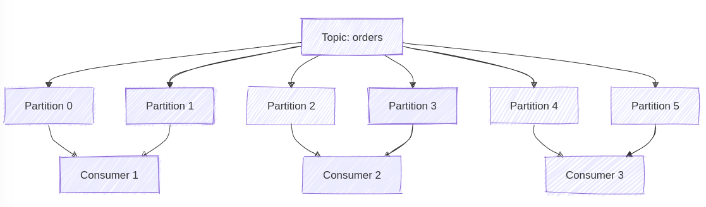
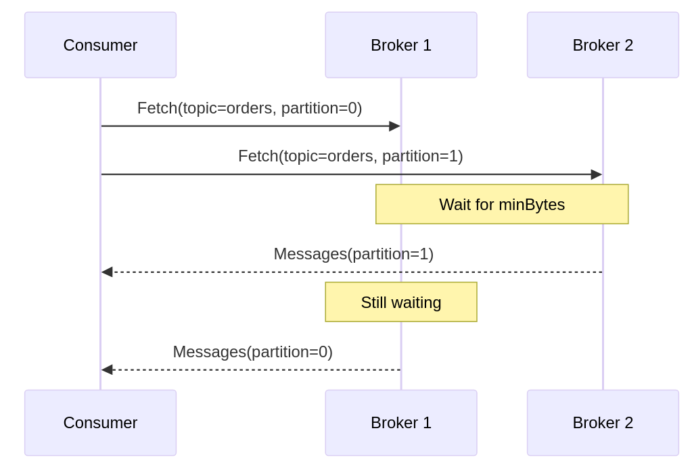

**Last week, we explored how Kafka consumers work in consumer groups and how rebalancing ensures partition distribution.** [That sparked an interesting question](https://www.architecture-weekly.com/p/kafka-consumers-under-the-hood-of/comment/87695871) about how consumers actually communicate with brokers and detect rebalancing needs. Thanks, Michał. The question is again on point, as that’s what I wanted to expand on!

Again, communication sounds simple. Consumers just get messages from brokers, right? As I’m writing about it, you may already guess that behind the scenes, it’s not that simple.

**Today, we'll explore the communication protocol between Kafka consumers and brokers.**

We'll see how what appears to be a simple "push" system is actually an elegant pull-based protocol and how rebalancing notifications occur through clever use of error codes rather than explicit push notifications.

## Consumer Groups: Why We Need Them and How They Work

Before we jump right into the protocol details, let's discuss a fundamental problem in message processing: how do you scale message consumption across multiple applications? Imagine you're running an e-commerce platform processing thousands of orders per second. A single application instance couldn't handle that load—you need to distribute the work somehow.

This is where consumer groups come in. The concept is beautifully simple: instead of having a single consumer handle all messages, you can have multiple consumers work together, each handling a portion of the messages.

**One more powerful aspect of consumer groups is having multiple groups independently processing the same topic.** For example:

-   One group might process orders for fulfillment

-   Another group might analyze orders for business intelligence

-   A third group might archive orders for compliance

Each group maintains its own view of which messages have been processed, allowing different applications to work at their own pace.

Think of it like a team of workers in a warehouse - instead of one person trying to process all incoming packages, you have multiple workers, each handling their own set of packages.

### The Basic Idea: Dividing Work

At its core, a consumer group is just what it sounds like - a group of consumers working together. When you create a consumer in Kafka, you assign it to a group:

```typescript
const consumer = kafka.consumer({
  groupId: 'order-processing'
});

await consumer.subscribe({ topic: 'orders' });
```

But how does Kafka ensure these consumers work together efficiently? The magic lies in how Kafka divides work using partitions. Remember that each Kafka topic is split into partitions - these become our units of work distribution. Kafka ensures that each partition is assigned to exactly one consumer in the group.

This simple rule has powerful implications:

1.  Work is naturally distributed across consumers

2.  Message ordering is preserved within each partition

3.  Consumers can work independently without coordination

### How Work Gets Divided: Partition Assignment

[We discussed that part in detail in the last edition](https://www.architecture-weekly.com/i/155239200/partition-assignment-how-it-works), but let’s recap it and see how this works in practice.

Imagine you have a topic with siz partitions and three consumers in a group. Kafka will distribute the partitions like this:



This distribution isn't random - it's managed by a special broker called the Group Coordinator. Think of the Group Coordinator as a supervisor, ensuring work is fairly distributed. It keeps track of:

-   Which consumers are currently active

-   Which partitions are assigned to each consumer

-   When assignments need to change

Consumer groups also handle the changes ensuring that work is distributed when:

-   A new consumer joins the group.

-   A consumer crashes or becomes unresponsive.

-   Network issues cause temporary disconnects.

-   New partitions are created.

**This is where the concept of rebalancing comes in. When any change occurs in the group, Kafka triggers a rebalancing process to redistribute partitions among the remaining consumers.** It's like a warehouse supervisor reassigning work when workers come or go.

The rebalancing process follows a careful sequence:

1.  The Group Coordinator notices a change (new consumer, failed consumer, etc.)

2.  It pauses all message processing

3.  It gathers information about available consumers

4.  It redistributes partitions among them

5.  Processing resumes with new assignments

### Making It Reliable: Handling Failures

Now, we're getting to the more complex aspects of consumer groups. In a distributed system, lots of things can go wrong:

-   Consumers can crash

-   Network connections can fail

-   Processes can become slow or unresponsive

**[Consumers regularly send heartbeat messages to the Group Coordinator](https://www.architecture-weekly.com/i/155239200/how-kafka-tracks-active-consumers), saying,** _**"I'm still here and working!"**_**.** If a consumer stops sending heartbeats, the coordinator knows something's wrong and can trigger a rebalance.

Each time the group membership changes, Kafka assigns a new "generation ID" to the group. This is crucial for preventing _"split-brain"_ scenarios, where different consumers have different ideas about who should be processing what.

Think of the generation ID as a group membership version number. When it changes:

-   All consumers must get new partition assignments

-   Old assignments become invalid

-   Consumers can't process messages until they join the new generation

We could model Consumer Group metadata to keep track of it as:

```typescript
interface ConsumerGroupMetadata {
  groupId: string;
  generationId: number; // ⬅️ Increments with each membership change
  consumers: Map<string, ComsumerMetadata>;
  leader: string;
}
```

**When the consumer joins the group, the session is created.** The session is, in other words, a specific connection to a group. Staying in our warehouse work example represents the employee shift. Kafka needs to track active consumers in the group to distribute load and ensure reliable processing correctly.

It allows the provided settings to detect how long the consumer group should wait for an answer from the consumer and also how long the consumer should wait to end rebalancing. In other words, employees can go home if there’s no work for them as stocktaking is happening.

```typescript
const consumer = kafka.consumer({
  groupId: 'order-processing',

  // How long can a consumer be silent before it's considered dead?
  sessionTimeout: 30000,

  // How long to wait during rebalancing?
  rebalanceTimeout: 60000

});
```

These timeouts help Kafka distinguish between temporary hiccups and actual failures.

Now that we have recapped consumer groups and why we need them, let's examine how the protocol actually implements all this functionality.

## The Protocol Foundation: The Dance of Requests and Responses

**When you write seemingly simple code to consume messages from Kafka, a complicated dance is happening behind the scenes.** Every interaction between consumers and brokers follows a strict protocol designed to handle the complexities of distributed systems.

Let's start with something that might seem mundane but is actually fascinating: the request header. Every single message between a consumer and broker starts with this structured header:

```typescript
interface RequestHeader {

  apiKey: number;        // Identifies request type

  apiVersion: number;    // Protocol version used

  correlationId: number; // Request tracking

  clientId: string;      // Consumer identifier

}
```

This isn't just bureaucratic overhead - each field is crucial to reliable distributed communication. The _[apiKey](https://kafka.apache.org/0101/protocol.html#protocol_api_keys)_, for instance, isn't just a number - it's part of a carefully designed protocol that supports operations like:

-   Fetching messages _(apiKey = 1)_

-   Joining consumer groups _(apiKey = 11)_

-   Sending heartbeats _(apiKey = 12)_

-   Leaving groups _(apiKey = 13)_

-   Syncing group state _(apiKey = 14)_

**But what makes this design truly elegant is how it handles version compatibility.** The _apiVersion_ field allows Kafka to evolve its protocol while maintaining backward compatibility. When a consumer connects to a broker, they first perform a version handshake—the consumer says:

> "Here are the protocol versions I support"

and the broker responds,

> "Cool, and here are the protocol versions I support."

They then use the highest version they both understand.

This might seem like overengineering, but imagine you're running a large Kafka cluster. You want to upgrade your brokers to a new version with protocol improvements, but you can't upgrade all your consumers simultaneously. This version negotiation allows for rolling upgrades without downtime - old consumers can talk to new brokers using old protocol versions, while new consumers can take advantage of new protocol features.

## The Bootstrap Process: Finding Your Way in a Distributed World

**Before a consumer can start receiving messages, it needs to navigate the Kafka cluster.** This bootstrap process is necessary because it solves a fundamental distributed systems problem: how do you find the correct servers to talk to in a dynamic system where things can change over time?

**When a consumer connects, it doesn't immediately try to fetch messages.** Instead, it goes through a careful bootstrap process:

1.  First, it needs to find the consumer group coordinator.

2.  Then, it needs to join its consumer group

3.  Finally, it needs to get its partition assignments

Let's look at how finding the coordinator works.

You might think, "Well, just pick a broker from the bootstrap list", but it's more sophisticated than that. The group coordinator isn't randomly assigned—it's determined by a consistent hashing algorithm based on the group ID. This ensures that all consumers in the same group talk to the same coordinator while different groups' coordinators are distributed across the cluster.

Here's what the process looks like:

```typescript
class KafkaConsumer {
  private coordinator: Broker | null = null;
  private isGroupLeader: boolean = false;

  constructor(private groupId: string) { }

  public async bootstrap(): Promise<void> {

    this.coordinator =
      await this.findConsumerGroupCoordinator(this.groupId);

    const joinResult = await this.joinGroup(
      this.coordinator, this.groupId);

    this.isGroupLeader = joinResult.isLeader;

    // If we're not the leader,
    // the group leader will gather member info
    // and we need to sync to get our final assignments.
    if (!this.isGroupLeader) {
      await this.syncGroup(this.coordinator, this.groupId);
    }

    this.startHeartbeat(this.coordinator, this.groupId);
  }

}
```

When a consumer needs to locate the Group Coordinator for a given group ID, it sends a _FindCoordinator_ request to any broker. Internally, Kafka hashes the group ID and uses a modulus operation against the partition count of the internal _\_\_consumer\_offsets_ topic. The partition leader for that resulting partition becomes the Group Coordinator.

While sometimes referred to as [consistent hashing](https://en.wikipedia.org/wiki/Consistent_hashing) it’s actually a less complex [modular hashing](https://www.cs.cornell.edu/courses/cs312/2008sp/lectures/lec21.html)—less complex. It is _“consistent”_ because the same group ID will always map to the same partition (and thus the same coordinator), but it’s not the full ring-based scheme some might expect.

Here’s how you might see it in pseudo-code:

```typescript
class KafkaConsumer {
  private offsetsTopicPartitionCount = 50; // Example count

  private findConsumerGroupCoordinator(groupId: string): Broker {
    const hash = this.hashFunction(groupId);
    const partition = hash % this.offsetsTopicPartitionCount;
    return this.lookupLeaderForOffsetsPartition(partition);
  }
}
```

But this simple code hides the complexity of what's happening. When finding the coordinator, the consumer sends a _FindCoordinator_ request to any broker. The request includes the group ID, and the broker uses the consistent hash to tell the consumer which broker is the coordinator for that group. This design ensures that coordinator selection is deterministic and distributed evenly across the cluster.

## The Heartbeat Dance: How Consumers Stay Alive

One of the most elegant aspects of Kafka's consumer protocol is how it handles consumer health checking and rebalancing notifications. Rather than having separate mechanisms for these two concerns, Kafka combines them through the heartbeat protocol.

**Every consumer in a group periodically sends heartbeat requests to the group coordinator.** These heartbeats serve multiple purposes:

1.  They tell the coordinator that the consumer is still alive and processing messages

2.  They provide a channel for the coordinator to notify consumers about group changes

3.  They help maintain consistent group membership

The clever part is how rebalancing notifications works. **Instead of having a separate push notification system, the coordinator simply responds to heartbeat requests with an error code when a rebalance is needed.** When a consumer gets a _REBALANCE\_IN\_PROGRESS_ error (code 27), it knows it needs to stop processing messages and rejoin the group.

This design is smart in its simplicity. By piggybacking notifications on the existing heartbeat mechanism, Kafka avoids the need for additional connections or complex push notification systems.

**It's a pull-based solution to what might seem like a push problem.**

The [heartbeat protocol](https://kafka.apache.org/protocol#The_Messages_Heartbeat) looks like this:

```typescript
interface HeartbeatRequest {
  apiKey: 12;
  apiVersion: 4;
  correlationId: number;
  groupId: string;
  generationId: number;
  memberId: string;
}

interface HeartbeatResponse {
  throttleTimeMs: number;
  errorCode: number;  // This is key!
}
```

But what makes this really interesting is how it handles various failure scenarios. For example, what happens if a consumer crashes and stops sending heartbeats? The coordinator has a session timeout (configured via _[session.timeout.ms](https://kafka.apache.org/documentation/#consumerconfigs_session.timeout.ms)_) - if it doesn't receive a heartbeat within this period, it considers the consumer dead and initiates a rebalance.

This timeout needs to be carefully tuned. Setting it too low might trigger unnecessary rebalances due to temporary network issues or GC pauses. Set it too high, and your system takes longer to recover from actual failures.

**Kafka provides detailed [consumer group metrics](https://kafka.apache.org/documentation/#consumer_group_monitoring) to help you tune this, for instance:**

-   _last-heartbeat-seconds-ago_ - The number of seconds since the last controller heartbeat

-   _heartbeat-rate_ - The average number of heartbeats per second

-   _heartbeat-response-time-max_ - The max time taken to receive a response to a heartbeat request

## The Fetch Protocol: More Than Just Getting Messages

At the heart of Kafka's consumer protocol lies the fetch mechanism. While it might seem straightforward - after all, we're just getting messages, right? - the reality is a sophisticated protocol designed to optimize throughput, minimize latency, and handle various edge cases.

Let's look at what a fetch request actually looks like:

```typescript
interface FetchRequest {

  replicaId: number;        // -1 for consumers

  maxWaitMs: number;        // Long polling timeout

  minBytes: number;         // Minimum data to return

  maxBytes: number;         // Maximum data to return

  isolationLevel: number;   // Read committed/uncommitted

  topics: TopicFetchRequest[];
}

interface TopicFetchRequest {

  topic: string;

  partitions: PartitionFetchRequest[];

}

interface PartitionFetchRequest {

  partition: number;

  fetchOffset: number;      // Where to start reading

  logStartOffset: number;   // Earliest available offset

  maxBytes: number;         // Max bytes for partition

}
```

This structure might look complex, but each field tells an interesting story about how Kafka optimizes message delivery. Take _maxWaitMs_ and _minBytes_, for example. Together, they implement a clever optimization called ["long polling"](/en/long_polling_and_eventual_consistency/). Instead of immediately returning if no data is available, the broker will wait up to _maxWaitMs_ for at least _minBytes_ of data to accumulate.

**This solves a common problem in messaging systems: how do you balance latency with efficiency?** If consumers poll too frequently when no data is available, they waste network resources and CPU cycles. If they poll too infrequently, they add latency to message processing. Long polling provides an elegant solution - consumers can maintain low latency when data is available while avoiding wasteful polling when it's not.

Here's how it works in practice:

```typescript
class KafkaConsumer {
  private async fetch(): Promise<FetchResponse> {
    const request = {
      maxWaitMs: 500,       // Wait up to 500ms for data
      minBytes: 1024,       // Wait for at least 1KB
      maxBytes: 5242880,    // Don't return more than 5MB
      topics: this.buildTopicFetchRequests()
    };

    // Broker holds request until data available or timeout
    return await this.sendRequest(request);
  }
}
```

But that's just the beginning. The fetch protocol also includes sophisticated batching and parallel fetching capabilities. Since partitions might be on different brokers, consumers can fetch from multiple brokers simultaneously:



This parallel fetching is crucial for performance but introduces its complexities. What happens if one broker is slower than others? What if a broker fails during a fetch? These scenarios need careful handling.

## Error Handling: When Things Go Wrong

**In distributed systems, failures are not just possible - they're inevitable.** The true measure of a protocol's robustness is how it handles these failures. Kafka's consumer protocol includes sophisticated error-handling mechanisms for various failure scenarios.

**Let's start with one of the most common failures: leader changes.** When a partition leader changes (due to broker failure or rebalancing), consumers need to discover the new leader:

```typescript
private async handleLeaderChange(
  topic: string,
  partition: number
): Promise<void> {
  // Refresh metadata to find new leader
  const metadata = await this.fetchMetadata([topic]);

  const newLeader = metadata.topics[topic].partitions[partition].leader;

  // Update our connection pool
  if (!this.connections.has(newLeader)) {
    await this.establishConnection(newLeader);

  }

  // Update our partition assignment map
  this.updateLeaderForPartition(topic, partition, newLeader);
}
```

But leader changes are just one type of failure. Network partitions, for instance, require a different handling strategy:

```typescript
private async handleNetworkPartition(): Promise<void> {
  // Stop heartbeats during partition
  this.pauseHeartbeats();

  // Try to reconnect with exponential backoff
  let retries = 0;

  while (!await this.tryReconnect()) {
    await sleep(
      Math.min(
        100 * Math.pow(2, retries),
        30000  // Max 30 second wait
      )
    );

    retries++;
  }

  // After reconnect, we need to rejoin group
  await this.rejoinGroup();

}
```

Notice the exponential backoff in the reconnection logic. This isn't just a nice-to-have - it's crucial for preventing thundering herd scenarios where many consumers simultaneously try to reconnect to a recovering broker.

Coordinator failures present yet another challenge. When a group coordinator fails, all its consumers need to find a new coordinator:

```typescript
private async handleCoordinatorFailure(): Promise<void> {
  while (true) {
    try {

      // Find new coordinator
      const coordinator = await this.findCoordinator();

      // Establish connection
      await this.connectToCoordinator(coordinator);

      // Rejoin group with new coordinator
      await this.joinGroup();

      return;

    } catch (error) {
      // If finding coordinator fails, back off and retry
      await sleep(this.retryBackoffMs);
    }
  }
}
```

## Configuration Deep Dive: The Art of Tuning

Understanding Kafka's consumer protocol is one thing - tuning it for optimal performance is another. Let's explore how different configurations affect behaviour and performance.

### Low Latency Profile

When you need messages processed as quickly as possible:

```typescript
const lowLatencyConfig = {
  // Quick failure detection
  'session.timeout.ms': 10000,
  'heartbeat.interval.ms': 2000,

  // Fast fetching
  'fetch.min.bytes': 1,
  'fetch.max.wait.ms': 100,

  // Smaller batches
  'max.partition.fetch.bytes': 262144  // 256KB

};
```

This configuration prioritizes speed over efficiency. Small fetch sizes and short wait times mean messages are processed quickly but at the cost of more network traffic and higher broker load.

### High Throughput Profile

When you need to process large volumes of data efficiently:

```typescript
const highThroughputConfig = {
  // More tolerant of delays
  'session.timeout.ms': 30000,
  'heartbeat.interval.ms': 10000,

  // Larger batches
  'fetch.min.bytes': 1048576,  // 1MB
  'fetch.max.wait.ms': 500,

  // More data per fetch
  'max.partition.fetch.bytes': 5242880  // 5MB

};
```

These settings maximize throughput but might increase latency. Larger batch sizes mean more efficient network usage but longer waits for processing to begin.

### Heartbeat Management

One common mistake is setting the heartbeat interval too close to the session timeout:

```typescript
// 👎 Risky timing
const riskyConfig = {
  'session.timeout.ms': 10000,
  'heartbeat.interval.ms': 9000  // Too close!

};

// 👍 Safe timing
const safeConfig = {
  'session.timeout.ms': 10000,
  'heartbeat.interval.ms': 3000  // 1/3 rule

};
```

The problem with the risky configuration is that even a minor network hiccup or GC pause could trigger a rebalance. The safe configuration provides more buffer for temporary issues.

## Wrapping Up

Kafka's consumer protocol is a sneaky distributed system design. Through clever protocol design and configuration options, it balances competing concerns—consistency vs. availability, latency vs. throughput, simplicity vs. flexibility—to achieve balance.

**I hope that understanding these mechanisms helps you:**

-   Debug issues more effectively

-   Configure consumers appropriately

-   Handle errors robustly

-   Design better Kafka-based systems

Again, drop me comments and send me your feedback; as you see, I’m listening!

_Let’s also talk on Discord; ping me if you didn’t get the invitation yet._

Cheers!

Oskar

**p.s. Ukraine is still under brutal Russian invasion. A lot of Ukrainian people are hurt, without shelter and need help.** You can help in various ways, for instance, directly helping refugees, spreading awareness, and putting pressure on your local government or companies. You can also support Ukraine by donating, e.g. to the [Ukraine humanitarian](https://savelife.in.ua/en/donate/) organisation, [Ambulances for Ukraine](https://www.gofundme.com/f/help-to-save-the-lives-of-civilians-in-a-war-zone) or [Red Cross](https://redcross.org.ua/en/).
