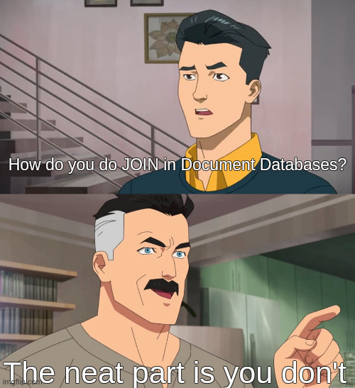

Welcome to the new week!

**The biggest challenge in understanding new technology or practices isn't the time needed to learn them.**

**A much bigger challenge is unlearning the practices we've been using so far.**

Learning new technology can be challenging for many reasons. Complex APIs, unfamiliar patterns, tricky concepts, etc. But that's not really it. The real problem is that our brains are wired with years of solutions that worked before. We've built intuitions, developed gut feelings about what's _"right"_, and gotten comfortable with certain ways of solving problems.

**When a new approach contradicts these intuitions, our first reaction is usually resistance:  
**

> _"That can't be right"_

or

> _"There must be a better way"_

We waste time trying to make the new technology work like our old tools instead of understanding what makes it different.

**Too often, when we see** _**new,**_ **we think** _**hard.**_

## The Challenge of Unlearning

Let's take document databases as an example. Many developers coming from a relational database background immediately ask:

> _"How do I do joins?"_

The real answer is simple but uncomfortable:

> _“The neat part is that you don't.”_



**And this realization should lead to deeper questions.** Instead of thinking about joins, think about access patterns. Who's reading this data? How often? What parts do they need together?

**Consider a game matchmaking system.** In a relational world, players, teams, matches, and game stats would be in separate tables, joined together for each query. The traditional mindset tells us this is the "correct" way. We should normalize everything and avoid redundancy at all costs. But let's challenge this thinking.

In a document database, you might store the match document with embedded team compositions, player stats, and match outcomes. Yes, player data is duplicated. Yes, updating a player's username means updating multiple match documents.

**But let's think about what actually happens in real games.** How often do players change their usernames? Even in games that allow it, it's a relatively rare event. When it happens, it's acceptable to take a few seconds to update historical matches - because that mirrors the reality of how games work. Players care about finding their match history, analyzing their performance trends, and seeing their progression over time. They don't care if their old username takes a moment to update in historical matches.

**This isn't just about technical choices; it's about matching our data model to reality.** When players browse their match history or when you're analyzing game patterns, you have all the context in one place. Each match document tells a complete story: who played, what happened, and how the game unfolded. This natural alignment with real-world usage patterns often leads to simpler, more maintainable systems.

## The Art of Gradual Transition

The process of unlearning doesn't mean throwing away everything we know. When we try to force our old habits into new technologies and practices, we often end up hurting ourselves.

Take Event Sourcing. It's a simple pattern, almost primitive. Instead of overwriting the state, we record a new event. When we need to execute business logic, we fetch previously recorded events, interpret them, make a decision, and record another fact.

An [event store is really just a key-value database](/en/event_stores_are_key_value_stores/) in which the key is the record identifier, and the value is a list of events.

That's it.

**But this simplicity opens up so many possibilities and potential integrations.** Suddenly, it feels like our brain might explode. The old way was comfortable and we could run on autopilot. Here, we have to think, analyze, consider, and keep learning.

Let me share another journey: I used to be a JavaScript and TypeScript hater. I came from a C# and Java background. I tried to use them precisely, like C# and Java. The syntax looked similar enough that it seemed natural to apply the same patterns. The result? Pain and frustration.

**The breakthrough came when I realized that JavaScript, despite its superficial similarities to C# and Java, is fundamentally different - and much more suited to functional programming approaches.**

This realization highlights a common pitfall. Some people (and the tools they build) attempt to blindly transplant patterns from other environments without considering the local ecosystem. While they might offer a quick start for developers coming from specific backgrounds, they often stop at that first iteration without truly embracing the platform's natural conventions. It's like forcing square pegs into round holes - it might work initially, but it creates friction in the long run.

## Starting Where You Are

**The key is to begin your journey from familiar territory and then iterate based on real experiences.** In our matchmaking system, when starting with microservices, don't feel pressured to break everything into tiny services immediately. Start with a single matchmaking service that handles the core logic of putting players together. Get comfortable with that service boundary, understand its communication patterns with the game servers, and let the architecture evolve naturally.e key is to start with natural boundaries in your domain. In our matchmaking system, think about what actually needs to be separate: matchmaking logic has different scaling needs than player profiles, match history queries are different from active match management. Start by separating these based on real technical or business needs, not theoretical abstractions.

Don't create artificial boundaries or ceremonial interfaces just for the sake of "clean architecture". If match creation needs player data, it needs player data - adding interfaces or abstractions won't change that fundamental dependency. Instead, focus on keeping the data flow clean and explicit. This makes it easier to understand and change the system when real needs arise.

Look for similarities between what you already know and what you're learning. When moving to document databases, you'll notice that a document is like a denormalized view of your data - something you've probably created before with JOINs. The difference is that now you're storing it that way. Or in event sourcing, if you've ever used database triggers or audit logs to track changes, you're already thinking about events - you're just making them the primary source of truth now.

**For document databases, start by thinking about how you'd create a view of your data for a specific use case.** Your initial structure might mirror your current relational model - separate documents for players, matches, and teams. That's okay. As you work with this model, you'll start seeing where this doesn't fit: maybe you're constantly joining match data with team data in your queries. These pain points guide you toward better document structures, like embedding team data within match documents.

**In event sourcing, look for places where you're already tracking changes:** _PlayerCreated_, _MatchStarted_ and _TeamFormed_. These are probably lurking in your audit logs or status fields. Now, you're just making them explicit. Keep your existing business logic at first, but start expressing it with events. Instead of updating a status field to "_InProgress_", you're recording a _MatchStarted_ event. The business logic is the same - you're just approaching it from a different angle.

The key is recognizing that new patterns often have parallels in what you're already doing. Find these familiar elements and use them as bridges to understand the new concepts. This makes the transition feel more natural and helps you avoid the temptation to force old patterns where they don't belong.

## The Simplicity Paradox

Sometimes what seems like the most straightforward solution isn't actually the simplest. Our instinct is to solve problems directly: store the current state? Just update a field in the database. Need history? Add a status log table. Need to track changes? Add some timestamps.

This direct approach feels natural at first. But as requirements grow, we keep adding more and more patches: audit logs, status histories, temporal queries, analytics tables. Each addition seems reasonable on its own, but they pile up into a complex mess.

Take our matchmaking system. In a traditional approach, you'd store the current match state. Straightforward, right? But then:

-   You need to know why matches take so long to form → Add a _formation\_time_ field

-   Product wants to know why players decline matches → Add a _decline\_reason_ field

-   Analytics needs player acceptance patterns → Create a _match\_responses_ table

-   Support needs to debug matching issues → Add logging and tracing

-   ML team wants to improve matching → Create analytics tables

Each addition makes sense alone, but together, they create a tangled web of data.

Now, look at event sourcing. It follows a natural pattern - just write down what happened:

```text
PlayerQueuedForMatch

SkillLevelAssessed

TeamCompositionProposed

PlayerDeclinedMatch

TeamCompositionProposed

PlayerAcceptedMatch

MatchStarted
```

Just by recording these events in sequence, you get:

-   Formation time analysis (check timestamps between Queue and Start)

-   Decline patterns (they're right there in the events)

-   Player behavior (acceptances, declines, timing)

-   Debug data (the full sequence shows what happened)

-   Analytics data (everything's in the event stream)

What seemed like extra work actually eliminated a whole category of problems.

**That's the paradox: the less obvious path sometimes leads to radical simplicity.**

By simply writing down what happened, we get capabilities that would have required multiple add-ons in the traditional approach.

The power of this approach becomes even clearer when you need to add new features. Want to analyze why certain matches take longer to form? The events show the complete formation process. Need to understand patterns in player acceptance rates? The event stream tells the story. Want to implement better skill matching based on historical performance? Again, the events provide the perfect foundation.

**This pattern repeats across technology choices. What looks like the "simple, obvious solution" often carries hidden complexity that only reveals itself over time.** Meanwhile, approaches that might initially make us pause - because they're unfamiliar or seem to require more upfront thinking - can eliminate entire categories of problems.

The trick is learning to spot these patterns, to recognize when the "simple" solution will paint us into a corner, and when a different approach might open up new possibilities.

**It's not about choosing complexity but recognizing when apparent simplicity is deceiving.** Sometimes, what feels like a step away from simplicity is a step toward it.

## The Trap of Familiar Patterns

**When developers first encounter distributed matchmaking systems, they often try to make them behave like single-server implementations.** They try to maintain perfect consistency: every player must always see the same lobby state, team formations must be atomic, and skill ratings must be immediately consistent. This leads to complex synchronization mechanisms and fragile timing dependencies.

A fresh perspective accepts that different players might momentarily see slightly different lobby states. Instead of fighting against network latency, design the system to work with it. Show local changes immediately, reconcile differences gradually, and focus on what matters: quickly getting players into balanced, fun matches.

## Understanding Your Real Motivations

Before diving into new technology, take a step back and ask yourself some honest questions: What problems are you actually trying to solve? Not the theoretical ones or the ones you read about in blog posts, but your actual, day-to-day pain points. If you're considering event sourcing, is it because you need better audit trails and temporal queries or because it's the hot new thing?

You can do it with the following steps:

### 1\. Assessing Your Current State

-   What's actually broken in your current approach?

-   Which parts of your system cause the most maintenance headaches?

-   Where do you spend most of your debugging time?

-   What features are hard to implement with your current architecture?

### 2\. Evaluating Team Readiness

Your team's context matters more than you might think:

-   How much bandwidth does your team have for learning and experimentation?

-   What's your deadline pressure like?

-   Who on the team has experience with similar technologies?

-   How will you handle the knowledge transfer?

### 3\. Reality Checks

Before making big changes, consider:

-   Can you start with a small, contained part of your system?

-   What's the minimum change that would solve your immediate problems?

-   How will you measure whether the change is successful?

-   What's your rollback strategy if things go wrong?

After you do it and understand both your motivations and limitations, you can start…

## Setting Your Paranoia Level

**I call this finding your "paranoia level" - we must set it to keep ourselves sane.** Your paranoia level will change depending on your project's phase and context. Let's break it down into practical stages:

### Finding Your Footing

Start from what you know. Your initial paranoia should be low now; focus on:

-   Identifying patterns in your current approach that are similar to the new one,

-   Understanding what problems the new approach is actually trying to solve

-   Looking for small, safe places to try the new approach alongside the familiar one

-   Recognizing which parts of your existing knowledge transfer and which might lead you astray

You're not jumping into the deep end. You're building bridges between what you know and what you're learning. This helps you spot both opportunities and potential pitfalls early.

### Building Confidence

As your understanding grows, your paranoia shifts. Now you start seeing:

-   Where the approach naturally fits and where it doesn't

-   Which problems it solve elegantly and which it makes harder

-   What trade-offs you're making

-   Where you need to be extra careful

This is when you start recognizing patterns and anti-patterns from experience, not just theory.

### Mature Understanding

At this point, your paranoia becomes more nuanced. You develop:

-   A clear sense of what can go wrong and what's unlikely to be an issue

-   Understanding of which parts need extra attention,

-   Confidence in making trade-off decisions,

-   Recognition of when to keep things simple vs when to add sophistication.

**Your paranoia level isn't about being more or less careful; it's about being more precise in where you focus your attention, like a lens focusing on what matters most at each stage of your learning journey.**

A pragmatic approach means knowing when to ramp up your paranoia.

Coming back to our Event Sourcing example. When you're first exploring it, and your system isn't in production yet, don't worry about versioning - focus on getting your event model right. But as you get closer to production and other teams start depending on your events, that's when you need to build your versioning muscles. Start thinking about how changes to your events will impact consumers, how you'll handle schema evolution, and what your migration strategy will look like.

**The key is timing: too early, you'll build complexity you don't need yet, too late, and you risk breaking other teams' code.**

## Learning Through Controlled Experiments

Before committing to a new technology stack for your system, create a "spike" project that tests your riskiest assumptions. Build a minimal prototype that handles concurrent player queues. Model your most complex team formation patterns. These experiments should be throwaway code, but they'll teach you more than any amount of reading.

Do precise benchmarks and load tests, ensuring the riskiest assumptions are correct.

The key is to focus these experiments on your actual pain points. Don't test generic scenarios - test your specific challenges. How does your chosen technology handle sudden spikes in player queue joins? How does it manage team formation across different skill tiers? How does it handle players dropping out mid-formation?

## Aren’t we adding technical debt?

You already know that [I believe that technical debt doesn’t exist, but tradeoffs do](/en/tech-debt-doesnt-exist-but-trade/).

Sometimes, what looks like a subpar solution from one perspective is actually a pragmatic solution from another, e.g.:

-   Duplicated player data in match documents isn't technical debt if it serves your access patterns well.

-   A monolithic matchmaker isn't technical debt just because microservices exist.

**The key is being intentional about your choices and documenting your reasoning.**

This is where your paranoia level becomes crucial. High paranoia might lead you to treat every deviation from "best practices" as technical debt that must be fixed immediately. Lower paranoia might help you recognize that some supposed best practices don't matter for your case.

Also, most importantly, high paranoia can make you put into analysis paralysis and stop you from even trying new approaches. Read also more in [Why are we afraid of our decisions?](/en/why_are_we_afraid_of_our_decisions/)

## Moving Forward

The beauty of this approach is that it scales with your experience. As you encounter more real-world scenarios, your paranoia level naturally adjusts. You learn where simplicity serves you well, and additional complexity is needed. The goal isn't to eliminate all risks but to understand which ones matter for your specific context.

**Remember: Every architectural decision is a trade-off. The trick isn't finding the perfect solution - it's understanding the trade-offs well enough to make informed decisions.** Try implementing things in practice, build up some muscle memory, and then revisit whether your paranoia level is too high or too low.

**Your paranoia level isn't just about being careful - it's about understanding where that care is most needed.** Looking at new technologies means finding the balance between respecting their power and not being afraid to use them. The patterns that worked before aren't wrong - they're just part of your journey to understanding when different approaches make sense.

**The key isn't to become less paranoid as you learn - it's to become more precisely paranoid.** To know exactly which parts need your careful attention and which parts can flow naturally from your chosen patterns. That's how you grow not just in knowledge but in judgment.

**What's your usual paranoia level?**

Cheers!

Oskar

**p.s. Ukraine is still under brutal Russian invasion. A lot of Ukrainian people are hurt, without shelter and need help.** You can help in various ways, for instance, directly helping refugees, spreading awareness, and putting pressure on your local government or companies. You can also support Ukraine by donating, e.g. to the [Ukraine humanitarian](https://savelife.in.ua/en/donate/) organisation, [Ambulances for Ukraine](https://www.gofundme.com/f/help-to-save-the-lives-of-civilians-in-a-war-zone) or [Red Cross](https://redcross.org.ua/en/).
