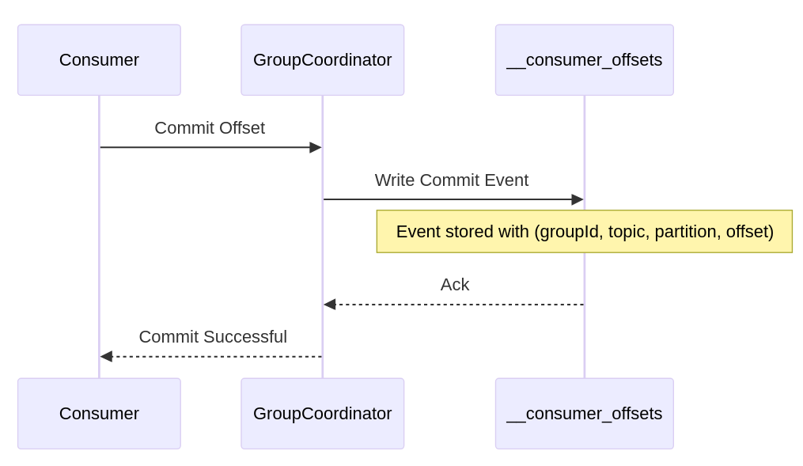

**Let’s say it’s Friday. Not party Friday, but Black Friday. You’re working on a busy e-commerce system that handles thousands of orders per minute.** Suddenly, the service responsible for billing processing crashes. Until it recovers, new orders are piling up. How do you resume processing after the service restart?

**Typically, you use the messaging system to accept incoming requests and then process them gradually.** Messaging systems have durable storage capabilities to keep messages until they’re delivered. Kafka can even keep them longer with a defined retention policy.

**If we’re using Kafka, when the service restarts, it can resubscribe to the topic. But which messages should we process?**

One naive approach to ensure consistency might be reprocessing messages from the topic's earliest position. That might prevent missed events, but it could also lead to a massive backlog of replayed data—and a serious risk of double processing. Would you really want to read every message on the topic from the very beginning, risking duplicate charges and triggering actions that have already been handled? Wouldn’t it be better to pick up exactly where you left off, with minimal overhead and no guesswork about what you’ve already handled?

**Not surprisingly, that’s what Kafka does: it has built-in offset tracking. What’s offset?** Offsets let each consumer record its precise position in the messages stream (logical position in the topic portion). That ensures that restarts or redeployments don’t force you to re-ingest everything you’ve ever consumed.


Services that consume message streams can restart or be redeployed for countless reasons: you might update a container in Kubernetes, roll out a patch on a bare-metal server, or autoscale in a cloud environment.

In this article, we’ll look at how Kafka manages offsets under the hood, the failure scenarios you must prepare for, and how offsets help you keep your system consistent—even when services are constantly starting and stopping. We’ll also see how other technologies tackle a similar challenge.

As always, we take a specific tool and try to extend it to the wide architecture level.

Check also previous articles in these series:

-   [How Kafka Producer Works internally](/en/how-a-kafka-like-producer-writes/)

-   [Kafka Consumers: Under the Hood of Message Processing](/en/kafka-consumers-under-the-hood-of/)

-   [Understanding Kafka's Consumer Protocol: A Deep Dive into How Consumers Talk to Brokers](/en/understanding-kafkas-consumer-protocol/)

* * *

Let’s do the thought experiment. Stop now for a moment and consider how you would implement offset storage for a messaging system. Remember your findings, or better yet, note them down.

Are you ready? Let’s now discuss various options we could use, and check how Kafka offset storage evolved and why.

## 1\. Early Attempts at Storing Offsets

**Database Storage.** A straightforward way to track what a consumer has processed is to store the last processed message ID in a relational database or key-value store. This can be fine if you have a single consumer, but you run into trouble as soon as you introduce multiple consumers. Each consumer must update the same record, raising the risk of race conditions, [distributed locking](/en/distributed-locking-a-practical-guide/) or expensive transactions. Plus, if one consumer crashes mid-update, another might not know which offset is the latest.

**Local Files.** Another idea is to write the current offset to a local file on the machine running the consumer. This might spare you the overhead of a database, but it quickly becomes unmanageable if the machine dies or you need to scale out. Each new consumer instance has its own file, and there’s no easy way to keep them all consistent.

As soon as you have more than one consumer—or if you want failover without losing track of progress these approaches break down. **That’s why Kafka uses a different model.**

## 2\. From ZooKeeper to _special_ topic

**Historically, Kafka itself used [Apache ZooKeeper](https://zookeeper.apache.org/) to store consumer offsets.**

**ZooKeeper is a distributed key-value store with additional coordination features.** It allows distributed systems to store and retrieve data across multiple servers. It acts like a centralized database that helps different parts of a system share and manage configuration information and state. Unlike a simple key-value store, it provides features like atomic writes, watches (notifications), and hierarchical naming, making it particularly useful for configuration management and synchronization in distributed computing environments.

**Using Zookeeper to store offsets might have worked fine when you had only a few consumer groups or infrequent commits, but it wasn’t designed to handle the constant stream of updates in larger deployments.** Every offset commit triggered writes to ZooKeeper, and as the number of consumer groups and partitions grew, those writes multiplied, creating performance bottlenecks and stability concerns. ZooKeeper was never intended for high-throughput offset tracking, so teams running sizable Kafka clusters began encountering scaling issues—ranging from slower commit latencies to potential coordination timeouts—when offset commits overloaded ZooKeeper.

To solve these problems, Kafka introduced the `__consumer_offsets` topic in version 0.9. This internal topic made offset management an integral part of Kafka rather than an external concern. By storing offset commits in a Kafka topic, you benefit from the following:

-   **Replication** across brokers: If one broker fails, another has the offset data.

-   **Natural ordering** of commits: Commits appear in the topic in the exact order they happen.

-   **Compaction**: Kafka discards older offset commits for the same consumer-group-partition key, controlling the topic size.

[Version 0.9 still allowed using Zookeeper through the](https://kafka.apache.org/090/documentation.html#oldconsumerconfigs) _[offsets.storage=zookeeper](https://kafka.apache.org/090/documentation.html#oldconsumerconfigs)_ [setting but made it obsolete.](https://kafka.apache.org/090/documentation.html#oldconsumerconfigs) Then, Zookeeper implementation was dropped. Let’s discuss in detail why the topic for offsets was superior design.

## 3\. How offsets topic works

Although `__consumer_offsets` might look like any other Kafka topic from the outside, but it’s specifically optimized to track consumer positions. Let’s unpack its structure and flow:

### Topic Structure and Partitioning

By default, it’s partitioned into a fixed number of partitions (often 50), with each partition managing offset commits for a subset of consumer groups. This design ensures that offset storage can scale horizontally—no single partition is overloaded by too many commits.



In this simplified flow, a consumer sends an offset commit to the Kafka broker, which appends a commit event to the appropriate partition in `__consumer_offsets`. That commit event is then replicated to follower brokers, and finally, the broker acknowledges success back to the consumer. Such replication across multiple brokers helps to protect against broker failures. When one broker dies, the cluster can still keep up with information on the others.

**You should always consider how frequently you commit offsets to get the desired performance.** Committing after every message assures minimal replays but burdens the broker with frequent writes. Committing in larger batches cuts down on overhead but means a crash could reprocess a bigger chunk of messages. Monitoring metrics like consumer lag, commit latency, and rebalance frequency helps you tune these factors for your workloads.

### Message Format

Under the hood, each offset commit is stored as a small message. While the actual format is internal to Kafka, you can think of it in a simplified TypeScript-esque interface:

```typescript
interface OffsetCommit {
  groupId: string;         // e.g. 'payment-service'
  topic: string;           // e.g. 'transactions'
  partition: number;       // e.g. 0
  offset: number;          // last processed offset
  metadata?: string;       // optional metadata
  commitTimestamp: number; // epoch time for commit
}
```

The **message key** includes the consumer group, topic, and partition, while the **value** holds the offset (and potentially some metadata like a commit timestamp or user-defined string). Kafka uses these keys for log compaction, ensuring older commits are cleaned up over time.

### Compaction Behavior

Unlike normal topics that rely on a retention period, `__consumer_offsets` is a **compact** topic. Unlike standard Kafka topics that might retain data for a certain number of days, compaction means Kafka continually cleans up older commits for the same key, so only the most recent offset for each consumer-group-partition remains in the long term. This prevents the topic from growing endlessly while still retaining enough history for short-term debugging.

### Consumer Interaction

When a consumer group coordinator needs to figure out where a consumer left off, it looks up the most recent commit in `__consumer_offsets`. This is how a newly started consumer—or one that has recovered from a crash—knows exactly which offset to resume from. Meanwhile, if you need to diagnose an issue or replay events, you can inspect the commit messages to see offset commits' progression over time. This event-log structure makes debugging offset-related problems far easier than an opaque external store. Seeing log of changes can also help to detect conflicting writes and fix the offset position.

Another important nuance is how these offset commits are tied to consumer groups. Each consumer group has a unique identifier, and each group can read different partitions from the same topics without interfering with other groups. The coordinator keeps track of which group-member owns which partitions, and uses the `__consumer_offsets` topic to store their progress. If one member fails or a rebalance occurs, another member can safely continue from the same offsets.

Under the hood, offset commits flow through Kafka’s normal produce pipeline. The consumer’s commit request is routed to the appropriate partition leader for `__consumer_offsets`, replicated to its followers, and acknowledged back to the coordinator and consumer once it’s durably stored. With this approach, Kafka enforces the ordering of offset commits at the partition level. If multiple commits arrive quickly, the later ones override the earlier ones for the same key.

Ultimately, the `__consumer_offsets` topic is less about storing data that users consume directly and more about being the backbone of Kafka’s robust consumer model. It combines the scalability of partitioned logs, the safety of replication, and the efficiency of log compaction—giving you a single, durable source of truth about how far each consumer has progressed in reading the stream. In practice, this means you don’t have to cobble together external databases or local files to track offsets, and you can recover from typical failures (like pod restarts or broker outages) without losing track of which messages have been handled.

By centralizing offset data in Kafka itself, you avoid external bottlenecks like databases or ZooKeeper. You also gain built-in fault tolerance because offsets are replicated, so a broker crash doesn’t wipe out your progress. Compaction keeps the topic lean, and the partitioned design scales with more consumer groups.

In practice, this design means you can:

-   Recover quickly after a crash without replaying the entire topic.

-   Scale to hundreds or thousands of consumer groups without saturating a single store.

-   Inspect or debug offset commits by peeking into the `__consumer_offsets` log.

## 3\. Failure Handling

Kafka’s offset mechanism is designed to help in real-world failure scenarios. Let’s look at how it handles the most common ones:

### 3.1 Service Restart

Imagine a consumer that crashes mid-message. When it comes back (maybe via a Kubernetes pod restart), the consumer rejoins its consumer group. The group coordinator queries `__consumer_offsets` to find the last committed offset, handing the consumer a starting point that avoids reprocessing the entire backlog.

-   **Last Committed Offset**: The consumer knows exactly which messages are safe to skip.

-   **In-flight Messages**: If a message is being processed but isn’t committed, Kafka replays it. [Under at-least-once semantics, this might lead to duplicates, but exactly-once processing can avoid that](/en/outbox_inbox_patterns_and_delivery_guarantees_explained/).

-   **Rebalancing Impact**: If the crashing consumer had partitions assigned, those partitions might be moved temporarily to other consumers, and then moved back once it rejoins.

### 3.2 Network Partition Case

If a consumer becomes isolated from the broker or the group coordinator, it can’t commit offsets. After restoring the network, the coordinator may have assigned the partitions to a different consumer. Any offsets that weren’t successfully committed are effectively lost, meaning some messages may be processed again. This scenario is preferable to losing data entirely, and you can further reduce duplicates by using idempotent or transactional settings.

### 3.3 Leader Failover

The `__consumer_offsets` topic is partitioned and replicated like any other Kafka topic. If a broker that leads one of these partitions fails:

-   **Offset Consistency During Change**: Replicas already have the offset commit data, so a new leader can step in.

-   **Replication Impact**: The system updates its metadata, and the newly elected leader takes over offset writes.

-   **Consumer Behavior**: Consumers keep sending offset commits to the coordinator, which routes them to the new leader automatically.

These mechanisms together ensure that consumers rarely (if ever) lose track of which messages they’ve processed, even in the face of common distributed-systems failures.

## 4\. Troubleshooting

For day-to-day operations, offset management can make or break your troubleshooting experience. If consumers lag behind, you may need to investigate whether they’re processing messages too slowly or whether the commit frequency is too low. If you see repeated rebalances, session timeouts could be misconfigured. Duplicates might indicate missed commits or transaction timeouts.

Most production Kafka clusters monitor these metrics:

-   **Consumer lag**: If lag grows indefinitely, you need more consumers or faster processing.

-   **Commit rates**: Low commit rates risk losing more progress on failure; too high a rate can overload the broker.

-   **Rebalance frequency**: Frequent rebalances disrupt processing.

* * *

## 5\. How are others doing offset tracking?

Comparing offset management across different systems highlights how design choices, performance goals, and operational needs shape their approaches. Kafka’s in-topic offset tracking is just one solution; here are several other well- examples and references you can explore for more insights.

### MongoDB Oplog

MongoDB’s replication relies on an **oplog** (operations log) that records all write operations in a replica set ([MongoDB docs](https://www.mongodb.com/docs/manual/core/replica-set-oplog/)). Each secondary node applies changes from the oplog in order, ensuring eventual consistency. Although it’s not strictly an offset model, the oplog shares some similarities:

-   **Chronological Record**: Operations are stored in an append-only manner, allowing secondaries to catch up after downtime.

-   **Primary Use Case**: Database replication, rather than event streaming.

-   **Trade-offs**: While it works well for MongoDB replication, it’s not designed for arbitrary consumer groups or application-level offsets. If you need to coordinate multiple consumers processing the same data stream, MongoDB’s oplog alone won’t fully address that scenario.

Read also more in [The Write-Ahead Log: The underrated Reliability Foundation for Databases and Distributed systems](/en/the-write-ahead-log-a-foundation/).

### EventStoreDB’s Two Models

[EventStoreDB is a database, not a streaming solution](/en/event_streaming_is_not_event_sourcing/), still it has streaming capabilities. It gives you the option to subscribe to notifications about new events. It offers two main subscription patterns:

-   **Persistent Subscriptions**: The server tracks checkpoints, distributing events to multiple consumers. This is handy if you want the server to manage concurrency and ensure that no event is processed by more than one competing consumer at a time. Still, it doesn’t give you ordering guarantees in case of retries, plus puts more burden on the database.

-   **Catch-up Subscriptions**: The client controls its own offset (or “position”) in the stream. This model provides more flexibility—like starting from older events or re-subscribing at a particular point in history—but also increases responsibility on the application to handle offset storage and recovery. Typically, you store offsets in another database.

Read more in [Persistent vs catch-up, EventStoreDB subscriptions in action](/en/persistent_vs_catch_up_eventstoredb_subscriptions_in_action/).

### RabbitMQ

RabbitMQ is a message broker that uses **acknowledgements** to confirm message handling (RabbitMQ docs). Once a consumer processes a message, it sends an ack to the server, which can then remove the message from the queue. Key points:

-   **Per-Queue Ack State**: RabbitMQ expects an ack for each delivery instead of tracking offsets in a log.

-   **Scaling**: Multiple workers can consume each queue, but the broker decides how messages are distributed.

-   **Trade-offs**: It’s simpler to configure for smaller setups. However, at very large scales or in multi-datacenter contexts, coordinating queue states and handling failover can become more complicated than Kafka-style offset logs.

### Apache Pulsar

Pulsar decouples **storage** and **serving** by keeping data in **BookKeeper** and storing consumer positions in a metadata system (often ZooKeeper) ([Pulsar subscription docs](https://pulsar.apache.org/docs/en/concepts-messaging/#subscription)). Pulsar calls these positions “cursors,” which function similarly to Kafka’s offsets:

-   **Cursors**: Each consumer or subscription maintains its own cursor, indicating how far it has read.

-   **Horizontal Scaling**: Because BookKeeper manages data storage separately, Pulsar can scale storage and compute layers independently.

-   **Trade-offs**: This approach can excel at very high volumes, but operating BookKeeper and ZooKeeper adds complexity. Understanding multiple layered components is crucial for stable long-term use.

As you compare these approaches, consider the following:

-   **Throughput Requirements**: How many commits or acks do you expect per second?

-   **Failure Model**: Which failure modes—node crashes, network splits, etc.—must you handle automatically?

-   **Operational Complexity**: Are you comfortable operating multiple components (e.g., BookKeeper, ZooKeeper)? Do you have the capacity for advanced configuration?

-   **Data Access Patterns**: Do you need fine-grained event replays, transactional guarantees, or simple queue semantics?

* * *

## 6\. TLDR

I wanted to show how offset tracking can be critical in maintaining consistent data processing across distributed systems. By keeping offsets in the `__consumer_offsets` topic, Kafka lets each consumer continue precisely where it left off after crashes, rebalances, or even data centre failovers. In the e-commerce example, that means you don’t have to replay every historical orders if a service restarts, significantly reducing the risk of duplicate processing.

Naive solutions—like local files or database records for offsets—may work under limited conditions but become cumbersome when you have multiple consumers or need to scale. Kafka’s built-in offset model solves many of these complexities by using replication, compaction, and an internal event log to track what has been processed.

In any large-scale system, verifying how offsets are stored, committed, and recovered is key to practical failure handling, especially if your systems are distributed. Understanding these trade-offs is essential for designing, monitoring, and troubleshooting real-time event-driven applications.

**What are your thoughts? Did you like the article? Shall I continue this series or start something new?**

Cheers!

Oskar

**p.s. Ukraine is still under brutal Russian invasion. A lot of Ukrainian people are hurt, without shelter and need help.** You can help in various ways, for instance, directly helping refugees, spreading awareness, and putting pressure on your local government or companies. You can also support Ukraine by donating, e.g. to the [Ukraine humanitarian](https://savelife.in.ua/en/donate/) organisation, [Ambulances for Ukraine](https://www.gofundme.com/f/help-to-save-the-lives-of-civilians-in-a-war-zone) or [Red Cross](https://redcross.org.ua/en/).
