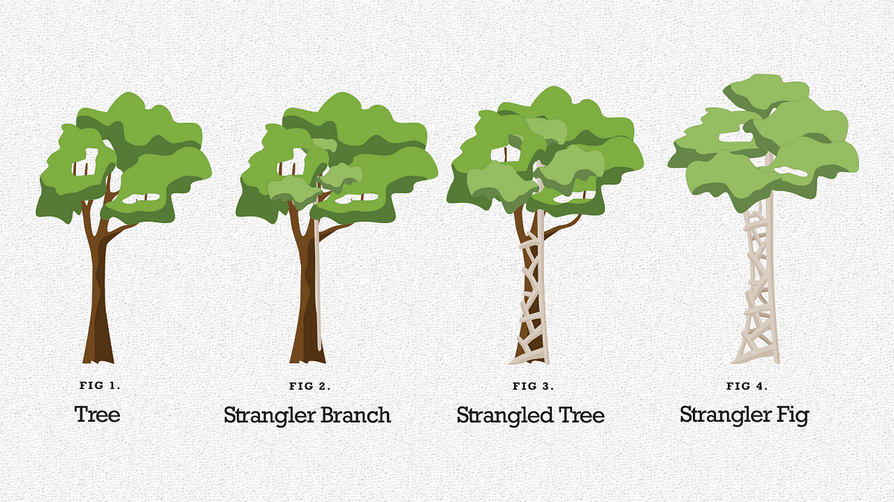

**I've been involved in several projects that tried to break down a legacy monolith.** Some were successful, but most were not. Even those moderately successful had a common, painful experience. I burned my fingers and saw other teams struggle with this challenge. Not because they lacked skills, but often because their approach was too ambitious.

After recently discussing monolith-to-microservices migrations, I decided to let you learn from my and other people’s mistakes. And spare you some _unwanted_ fun.

Let me share what I've seen work and learned. That’s my experience, so filter that through yours, but I hope this will be a good food for thoughts.

Source: https://en.wikipedia.org/wiki/List\_of\_largest\_monoliths

## Be Realistic About What Stays in the Monolith

Yes, that’s the title, and it is not a mistake. If you believe you’ll be able to rewrite everything, I’m sorry, but you’re probably wrong. I was wrong like that multiple times.

**It’s anecdotal evidence, but I haven't seen a complete monolith migration succeed.** Most were left in the middle of transition after going far above the planned time for rewrite.

**Some finished the migration, but replaced the old legacy with the new legacy after rushing the deadline.**

Some didn’t even manage those phases, as they sunk product and budget and were thrown away.

**So, the safe assumption is that some part of the old system will remain and continue running.**

And that's perfectly fine. The goal shouldn't be completely eliminating the monolith, but extracting the parts that benefit from independence.

Consider a video editing suite with project management, rendering pipeline, effects processing, and asset management. After extracting the performance-critical rendering pipeline and the frequently updated effects processing, you might find the core project management and stable asset management work perfectly fine in the original monolith. Keeping them there could save significant effort without compromising the migration's benefits.

### When to Keep Functionality in the Monolith

Sometimes it makes sense to keep certain functionality in the monolith when:

-   **It rarely changes** (like so authentication logic that follows well-established standards)

-   I**t's deeply connected to other monolith components** (like a complex pricing engine with many internal dependencies)

-   **The extraction cost exceeds the benefits** (like a reporting module used by only a few internal users)

-   **The team lacks experience with distributed systems** (like a team of domain experts who primarily work with business logic)

A financial system might benefit from extracting the high-volume transaction processing and notification services while keeping the complex compliance and audit engines in the monolith because they are computationally intensive and tightly coupled.

## Focus on Business Value First

I think that when planning migrations, we should start by talking with product people to identify which parts of the system deliver the most value or cause the most pain. We should [follow the money](/en/follow_the_money/). As cynical as it may seem, finding out who’ll be paying us money is as helpful. That’s critical in selecting the right tradeoffs. Example?

Let’s say that we’re maintaining a SaaS platform like Shopify:

-   **Who’s our customer?** A shop that’ll be paying for our subscriptions.

-   **Who will use our platform the most?** People who will buy goods in online shops. Will they be paying us? No, our **customer**.

-   **Who should we optimise for?** Our clients, so subscription payers.

We should ask ourselves questions when discussing our features:

-   When will our customer be sad?

-   When will our user be sad?

-   Will the fact that our user is sad eventually make our customer sad?

-   Will that be more disappointment, sadness or despair?

Of course, we should try to make both users and customers happy. Still, we need to fulfil the needs of our customers first, then do that for other users. That may sound cynical, but it’s not. If we don’t satisfy our paying customers, then we won’t make our work sustainable, and other users will eventually be also harmed by that.

**So I suggest focusing on business value for our customers and thus the money-flow for us:**

1.  Pick a specific functionality that gives clear business value

2.  Get it to production relatively quickly

3.  Learn from that real-world experience

4.  Adjust further plans based on what they learned

For example, consider a team initially planning to extract the user management component because it seems technically straightforward. However, after discussions with the business, they might discover that improving the order processing system would deliver more immediate value to customers experiencing delays. By pivoting to that area, they could show benefits much faster and build momentum for the broader migration.

This iterative approach works better than those "grand migration" plans that extend for years without delivering interim value.

## Define Specific, Measurable Metrics (Not Just Goals)

**Teams that succeed in migrations typically align with business stakeholders on specific, measurable metrics before starting - not just vague goals.** There's a critical difference here that's often overlooked.

For instance, teams might start with business goals like:

> For a game development studio, improving the player matchmaking experience

> For a video streaming platform like Netflix, handling traffic spikes during new releases

> For a photo sharing app like Instagram, enhancing content moderation effectiveness

**But these aren't measurable metrics - they're aspirational goals.** To drive effective decision-making, you need to translate these into concrete, measurable metrics:

> Instead of _"improving matchmaking experience"_, use: _**"Reduce matchmaking wait time from 45 seconds to under 15 seconds"**_ and _**"Increase matchmaking accuracy (players of similar skill) by 20%",**_

> Instead of _"handling traffic spikes"_, use: _"**Maintain 99.99% availability during 3x normal traffic events"**_ and _**"Keep response time under 200ms during peak load"**._

> Instead of _"enhancing content moderation"_, use: _**"Reduce time-to-detection for policy violations from 30 minutes to under 5 minutes"**_ and "Decrease false positive rate from 8% to under 3%".

### Connect Metrics to Business Impact - With Evidence

Even more important: for each metric, you must clearly articulate WHY achieving this target matters to the business. Without this connection, you're just chasing numbers for their own sake.

But be careful - don't fall into the trap of making up impressive-sounding impact estimates without solid evidence. I've seen too many people come up with statements like:

> _"Reducing matchmaking wait time to under 15 seconds will increase player retention by an estimated 18%, translating to approximately $0.5M in additional annual revenue"_

While this sounds convincing, if you can't back it up with real data, it's just a guess that will eventually undermine your credibility.

Instead, ground your impact in one of these sources (in order of preference):

1.  **Actual measurements from your current system**  
    "Our current data shows that for every 10-second reduction in matchmaking time, we see a 7% decrease in session abandonment"

2.  **Results from similar changes in your organization**  
    "When we improved checkout speed by 30% last year, conversion rates improved by 12%"

3.  **Industry benchmarks from credible sources:**  
    "According to industry research, streaming platforms typically lose 5.8% of viewers for each additional second of buffering time"

4.  **Small-scale experiments**  
    "In a limited test with 5% of users, we saw a 9% increase in engagement when content recommendations were personalized"

If you don't have any of these, be honest about it and start smaller:

> "We currently lack data on the exact impact of moderation speed, so we propose starting with a small extraction to gather this data before committing to a full migration"

We also discussed the importance of business metrics with Gojko Adzic in:

[

Architecture Weekly

Webinar #23 - Gojko Adzic on designing product development experiments with Lizard Optimization

Welcome to the next week…

Listen now

2 years ago · 4 likes · Oskar Dudycz and Gojko Adzic

](/en/webinar-23-gojko-adzic-on-designing/)

### Be Skeptical of Customer Feedback

**Another pitfall: don't rely solely on customer interviews or surveys to justify your metrics.** People are naturally polite and will often express interest in features they'll never actually use. I've witnessed countless projects justified by enthusiastic customer feedback that resulted in features nobody used.

**Let me share a personal experience that illustrates this issue. I was once working on rebuilding a legacy document management system.** The original system used on-premise custom storage. It was a decent implementation in its heydays, but it required modernisation and integration with new cloud features. The product team wanted to allow attach multiple cloud file storage. One of it was SharePoint Online integration, which would allow users to connect our system to their files and manage them.

As much as I hate SharePoint, that made me suspicious. I was curious how many users would like to pay additional money for it, as SharePoint already handles some of the flow mechanisms.

When I met with the Product Owner, I asked some basic questions:

> _"Did you ask users if they actually want a new UI for SharePoint?"_

> _"SharePoint's API requires granting our application admin permissions in their tenant - did you check if enterprise customers are okay with that security requirement? Enterprises are usually mad about that stuff."_

The answer to the first question was, "Yes, they said they like it" - which already raised a red flag for me.

Saying they "like" something in a conversation differs greatly from committing to use it. Thus I also asked if customers would actually use this feature and pay for it.

The uncomfortable silence that followed told me everything I needed to know. The team had taken polite interest as validation and was about to start on a significant technical effort without confirming if anyone would actually use the feature, let alone pay for it.

I've seen this pattern repeatedly. Teams confuse politeness for validation and interest for commitment. Building features based on what users say rather than what they do is a recipe for wasted effort.

Instead:

-   Look at what users actually do, not what they say.

-   Pay attention to patterns of behavior, not isolated requests.

-   Watch for problems users work around rather than features they ask for.

-   When possible, observe users in their natural environment rather than asking hypothetical questions.

### Question Initiatives Without Clear Value

**This step also serves as a crucial filter.** If you can't connect a potential service extraction to a measurable metric with concrete, evidence-based business value, you should seriously question whether it's worth doing at all.

**I've seen teams abandon their migration plans after this exercise.** And that’s great, as if you reveal minimal business benefits compared to the required engineering effort, then why take that? It may be better to redirect those resources to changes with clearer value propositions—a much better outcome than pursuing technical changes for their own sake.

If you're uncertain about the value, start much smaller:

1.  Extract a minimal component first.

2.  Measure its actual impact.

3.  Use that real data to decide whether to continue with larger extractions.

What makes good metrics for migrations:

1.  **Specific and measurable**: You can collect data and show a clear before/after comparison.

2.  **Directly tied to business value**: They represent outcomes customers care about, not just technical improvements.

3.  **Time-bound**: Include target dates for achieving improvements.

4.  **Baseline-aware**: Start by measuring current performance to demonstrate improvement.

5.  **Evidence-based**: Backed by data, not just estimates or hopes.

What to avoid:

1.  **Technical metrics without business context**: "Increasing service count" or "reducing code lines per service" aren't valuable by themselves

2.  **Vague improvements**: "Better scalability" or "improved resilience" without defining what these mean numerically

3.  **Developer-only concerns**: Metrics that don't connect to user or business outcomes

4.  **Unmeasurable goals**: If you can't collect the data, it's not a useful metric

5.  **Wishful projections**: Making up business impact numbers without supporting evidence

Having concrete, evidence-based metrics helps maintain business support when challenges arise. Without clear, measurable targets grounded in reality, support will vanish when the migration takes longer than expected or doesn't deliver the imagined benefits.

So instead of suggesting _"improving system maintainability"_ as the goal, translate this to: _"Reduce average feature delivery frequency from 3 weeks to 1 week"_ and _"Reduce production incidents by 40% year-over-year."_.

That’s already better, but not perfect. If you did something like:

> "In our last quarterly developer survey, 72% of time was spent dealing with cross-cutting concerns in the monolith. Based on this, faster feature delivery will allow us to ship our top-requested features within 10 days instead of 30, and our customer success team reports that 64% of account cancellations mention reliability issues, which we expect to address with this work."

Then you’re talking. Connecting these technical challenges to concrete, measurable business outcomes is key.

This clarity - based on actual measurements rather than wishful thinking - was what ultimately secured executive support throughout a challenging migration.

**And yes, that requires preparation, and there’s a risk. The risk is that when you find evidence, it will be evidence that you should not do that at all.**

## Extraction Approaches That Work

Based on what I've seen in various migrations, here's an approach that tends to be effective. Each step addresses specific risks that often derail migration projects:

1.  **Define clear boundaries first**: Before extracting code, understand where the service begins and ends, what data it owns, and what APIs it would expose. This clarity prevents scope creep and helps identify hidden dependencies early. Too many teams jump into coding without this boundary work and end up with a distributed monolith rather than true microservices.

2.  **Use feature flags to control the transition**: Deploy new services but keep the old code running, using feature flags to direct traffic gradually. This gives you an escape hatch when issues arise and lets you perform controlled experiments with real traffic. Without feature flags, you're forced into risky big-bang cutover scenarios.

3.  **Start with read operations**: Read operations are safer to migrate first because they don't modify state. Get reads working perfectly before attempting to migrate writes. This approach isolates complexity and reduces the surface area for potential data inconsistencies, which are among the hardest problems to debug.

4.  **Monitor extensively**: Compare responses between old and new systems and log differences to catch problems early. Data discrepancies often appear subtly at first before cascading into significant issues. Many teams neglect this step and end up with silent inconsistencies that undermine confidence in the migration.

5.  **Migrate in slices**: Rather than migrating entire services at once, take small vertical slices of functionality and migrate them incrementally. This keeps your changes bounded and easier to reason about. It also delivers value sooner and provides learning opportunities that inform subsequent slices.

This approach works because it acknowledges uncertainty. Rather than assuming perfect knowledge upfront, it creates tight feedback loops at each step, allowing teams to adapt their strategy based on what they learn. It also maintains business continuity throughout the migration, which builds stakeholder confidence.

**It also gives you the chance to stop migration at a specific step and validate whether you really need to take the next steps.**

## The Strangler Fig Pattern: A Practical Approach

**[Strangler Fig pattern](https://martinfowler.com/bliki/StranglerFigApplication.html) offers a robust framework for incremental migration. The name comes from how strangler fig vines gradually grow around a host tree, eventually replacing it entirely.**

Source: https://dennylesmana.medium.com/what-is-the-strangler-fig-pattern-1560443b8459

What makes this pattern especially valuable is how it manages risk. Instead of a risky "big bang" rewrite, you create a facade in front of the legacy system and gradually reroute functionality through that facade to new services. The old and new systems coexist until the migration is complete, at this point, the old system can be decommissioned.

The key aspects that make the Strangler Fig pattern worth considering:

1.  **Risk reduction**: You're never replacing the entire system at once, so each change has limited impact

2.  **Incremental value delivery**: New functionality becomes available as soon as each piece is ready

3.  **Reversibility**: If a newly extracted component doesn't perform well, you can easily route traffic back to the original implementation

4.  **Coexistence**: Legacy and new components operate side-by-side, allowing for gradual migration at a pace that makes sense for your organization

**Following the Strangler Fig approach when extracting a payment processing service from an e-commerce platform might look like this:**

1.  Build an API facade in front of the monolith's payment code

2.  Implement the new payment service behind this facade

3.  Gradually shift traffic from the monolith to the new service, starting with low-value test transactions

4.  Monitor closely for discrepancies in payment processing and reconciliation

Deploying to production incrementally is crucial. Just doing this work in development environments doesn't give you the feedback you need about real-world behavior, especially around performance and reliability.

The Strangler Fig pattern is one of the few approaches I've consistently seen work in practice. It acknowledges that migrations take time and provides a structure for managing that time effectively, while continuously delivering value throughout the process.

Read also more in:

-   [Martin Fowler - Strangler Fig](https://martinfowler.com/bliki/StranglerFigApplication.html)

-   [Shopify - Refactoring Legacy Code with the Strangler Fig Pattern](https://shopify.engineering/refactoring-legacy-code-strangler-fig-pattern)

## My Take on Database-Level Migration

I've seen teams reach for tools like [Debezium](https://debezium.io/) to automatically synchronize data between old and new systems. While this approach has its place, I've generally found it problematic.

Legacy databases are rarely clean. The data is typically mixed together in ways that don't reflect clear domain boundaries.

**When simply replicating this data, teams often copy the problems rather than solve them.**

In legacy systems, data are often entangled in a single database. Looking at the table structures, you won’t easily see business context, if at all. Trying to replicate data structures 1:1 to new services would preserve these poor boundaries, creating distributed copies of a tangled data model.

Instead, this approach often works better:

1.  Add event publishing directly to the legacy application for relevant business events.

2.  Have new services consume these events.

3.  Build optimized data stores for the new services.

This provides cleaner boundaries and better control, though it requires more initial development work. Still, that creates other challenges.

## The Hybrid State is Challenging

One of the challenging aspects of doing Strangler Fig-like migration is maintaining data consistency. You’ll have two places where the same data should be kept. You need to maintain two codebases, keep data synchronized, and ensure consistency across systems.

Of course there are strategies to deal with that, like:

1.  **Dual writes**: For simple cases, having the application write to both old and new systems can work.

2.  **Event-based synchronization**: For more complex scenarios, publishing events when data changes and having both systems consume these events proves more reliable.

3.  **Reconciliation jobs**: Regular jobs that compare data between systems and fix inconsistencies serve as a safety net.

**Still, hybrid mode is a big challenge.**

For instance, when extracting a customer profile service from a larger CRM system, sales teams would continue creating and updating customer records in the legacy system during migration, which would all need to appear correctly in the new service. Meanwhile, data enrichment processes might be running in both systems, potentially creating conflicts.

If we add to that that both teams may provide changes to the business logic when fine-tuning or _bug fixing_ the legacy system, then the complexity arises even more.

**So, the sooner you switch one system to be a source of truth and the other read-only, the less it will cost.**

## Team Structure Considerations

Conway's Law holds true - system architecture tends to reflect team structure. If you want independent services but maintain a single team responsible for everything, you'll likely end up with tightly coupled services that behave more like a distributed monolith.

**When planning a migration these organizational questions are as important as the technical ones:**

-   Who will own each new service?

-   How will teams communicate during and after migration?

-   How will knowledge transfer happen?

Reorganizing into domain-focused teams before beginning the technical migration can greatly improve results compared to keeping the original team structure.

See also more in:

[

Architecture Weekly

Papers We Love #2 - How do committees invent? (Melvin E. Conway)

Hey! 😀…

Listen now

2 years ago · 6 likes · Oskar Dudycz

](https://www.architecture-weekly.com/p/papers-we-love-2-how-do-committees?utm_source=substack&utm_campaign=post_embed&utm_medium=web)

## Conclusion

**After seeing many breaking-monoliths-migrations, I've noticed a pattern: the successful teams focus relentlessly on business value, not architectural purity.**

The most effective migrations I've witnessed weren't driven by a desire to use the latest architectural patterns or to eliminate the monolith completely. They were driven by specific business needs: faster delivery of high-value features, better resilience in critical components, or enabling teams to work independently.

In contrast, teams that started migrations because _"microservices are the future"_ or _"our monolith is a mess"_ often found themselves in trouble - with half-completed migrations, increased complexity, and diminishing business support.

**The truth is that most systems benefit from a pragmatic mix of architectural styles.** Some components genuinely benefit from being extracted into independent services, while others work perfectly well in a monolith. Wisdom lies in knowing the difference.

**If you take only one thing from this article, let it be this: Don't migrate to microservices because it's fashionable.** Migrate specific components because doing so solves real problems that matter to your business. Keep your changes small, focused, and value-driven. Measure your progress not by how many services you've created, but by how well you've addressed the business needs that started this journey.

Architecture should serve the business, not the other way around. Stay focused on that, and your migration has a much better chance of being among the successful ones.

**Write in the comments how your breaking the monolith actions went so far! What worked out and what did not?**

See also my other articles in that topic:

-   [Hitchhiker's Guide To Moving From Relational Data To Events](/en/the_end_is_near_for_crud_data/)

-   [General strategy for migrating relational data to document-based](/en/strategy_on_migrating_relational_data_to_document_based/)

-   [A few notes on migrating storage library](/en/notes_on_migrating_storage_library/)

Cheers!

Oskar

**p.s. Ukraine is still under brutal Russian invasion. A lot of Ukrainian people are hurt, without shelter and need help.** You can help in various ways, for instance, directly helping refugees, spreading awareness, and putting pressure on your local government or companies. You can also support Ukraine by donating, e.g. to the [Ukraine humanitarian](https://savelife.in.ua/en/donate/) organisation, [Ambulances for Ukraine](https://www.gofundme.com/f/help-to-save-the-lives-of-civilians-in-a-war-zone) or [Red Cross](https://redcross.org.ua/en/).
