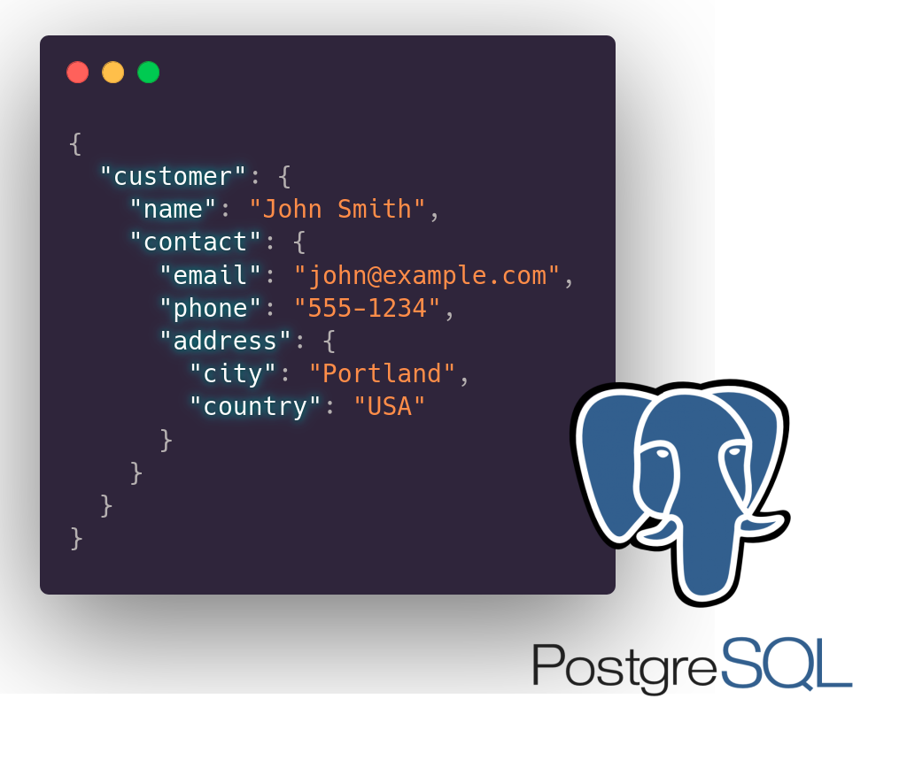

**Object-oriented or relational? You’ve seen this battle in your projects.** For many years, we tried to fit the business data, which is usually grouped by business use case, into a normalised table structure. Sometimes it fits better, sometimes worse. We learn to cheat it with [Object-Relational Mappers](/en/in_the_defence_of_orms/). They fixed some issues but created others.

**Then [document databases appeared, trying to look at this perspective from a different angle](/en/key-value-stores/).** They tried to accept that real-world data is fuzzy and usually doesn’t follow the rigid structure, but it’s semi-structured. It's the classic dilemma: rigid schemas that ensure data integrity but resist change, versus flexible document stores that adapt easily but sacrifice guarantees.

Still, those databases didn’t give us the consistency guarantees we were comfortable with, like transactions, isolation levels, etc.

**PostgreSQL added the JSONB column type to answer the question:** _**"Can we have both?"**_**.**

Then other databases like MySQL and SQLite followed.

Let’s discuss today how it works, and if it’s the actual answer.

## Introduction

**First, terminology: the B in JSON stands for Binary**. PostgreSQL also has a JSON type, but they’re different implementations:

-   **JSON stores data as text,** requiring parsing on each operation.

-   **JSONB uses a binary representation**.

**The binary format of JSONB enables efficient indexing and querying and eliminates the need for repeated parsing.** The downside is that it takes up more storage space (as it stores not only text but also metadata) and loses the exact formatting and ordering of the original JSON input. That’s usually acceptable, but worth knowing.

## JSONB Under the Hood: Not Just JSON Storage

**You can think of a JSONB column as a table inside the column. Each path to property can be seen logically as a different column.**

To visualise this conceptual model, imagine if our database could access any path directly without scanning the entire document:

```text
+----+---------------+--------------------------+--------------------+
| id | customer.name | customer.contact.address | email              |
+----+---------------+--------------------------+--------------------+
| 1  | "John Smith"  | "Portland"               | "john@example.com" |
+----+---------------+--------------------------+--------------------+
```

Of course, that’s a bit of an oversimplification.

PostgreSQL doesn't create these virtual columns, but the binary representation effectively allows it to access paths directly without scanning the whole document. This approach provides several benefits:

1.  Path traversal is much faster than parsing text

2.  Fields can be indexed individually

3.  Query performance is more predictable

When Postgresql stores a JSONB document, it doesn't simply dump JSON text into a field. It transforms the document into a binary representation.

Have a look on the following JSON:

```json
{
  "customer": {
    "name": "John Smith",
    "contact": {
      "email": "john@example.com",
      "phone": "555-1234",
      "address": {
        "city": "Portland",
        "country": "USA"
      }
    }
  }
}
```

This hierarchical structure could be flattened into a set of paths for each nested structure:

```text
Path: customer.name = "John Smith"
Path: customer.contact.email = "john@example.com"
Path: customer.contact.phone = "555-1234"
Path: customer.contact.address.city = "Portland"
Path: customer.contact.address.country = "USA"
```

**The goal is: to performantly read a specific field without parsing the entire document.** How does it achieve it? To understand it, let’s discuss…

## PostgreSQL JSONB Implementation

### Storage Internals

**JSONB's document is stored as a hierarchical, tree-like structure of key-value pairs, each containing metadata about its type and actual data.** To enable versioning, it begins with a “magical” single-byte header that identifies the format's version (currently version 1) and a header with metadata.

**When new JSON is stored, it has to be parsed and converted from text to key-value pairs. This conversion happens through a process called "tokenisation**".

For example, using our customer data example:

```json
{
  "id": "cust_web_123",
  "email": "web_user@example.com",
  "source": "website",
  "web_data": {
    "first_visit": "2023-03-12T15:22:47Z",
    "utm_source": "google_search"
  },
  "contact": {
    "phone": "+1234567890"
  }
}
```

Would be tokenised and stored with internal tree-like structures tracking:

```text
Root: Object {
  Count: 5,
  Children: [
    Key: "id",
    Value: String "cust_web_123",

    Key: "email",
    Value: String "web_user@example.com",

    Key: "source",
    Value: String "website",

    Key: "web_data",
    Value: Object {
      Count: 2,
      Children: [
        Key: "first_visit",
        Value: String "2023-03-12T15:22:47Z",

        Key: "utm_source",
        Value: String "google_search"
      ]
    },

    Key: "contact",
    Value: Object {
      Count: 1,
      Children: [
        Key: "phone",
        Value: String "+1234567890"
      ]
    }
  ]
}
```

**Of course, it’s a bit simplified form, but you can think that each array element is actually a different node, and the index in the array is just a nested path.** Each key and value in a JSONB document is stored with its data type and metadata. For objects and arrays, PostgreSQL maintains counts and offsets to child elements.

**PostgreSQL's JSONB tokenisation is sneaky. It not only parses data but also preserves the actual data types of values.** Each value in the binary format includes a type that identifies whether it's a string, number, boolean, null, array, or object. Thanks to that PostgreSQL can:

-   ensure that data maintains its semantic meaning,

-   enable indexing,

-   enable type-specific operations (like numeric comparisons),

-   avoid type conversion when not needed.

**What’s more, it’s not limited to JSON types.** It distinguishes different numeric types (integers, floating-point) and handles string data with character encoding.

So, when you search for:

```text
customer_data->'customer'->'contact'->'address'->>'city'
```

PostgreSQL can navigate directly to that specific token without scanning the entire document. It uses the described hierarchical structure, and gets the exact value with the type.

### Internal Path Representation

PostgreSQL uses path extraction operators (_\->_ and _\->>_) for querying the data inside JSON.

**When PostgreSQL encounters such query, it:**

1.  Parses the path into individual segments.

2.  Locates the root object or array in the binary structure.

3.  Each path segment computes a hash of the key.

4.  Uses the hash to look up the corresponding entry in the structure.

5.  Navigates to the next level if needed.

6.  Extracts and returns the value in the requested format.

This algorithm is heavily optimised for typical access patterns. For simple path expressions, PostgreSQL can retrieve values with near-constant time complexity, regardless of document size. However, the performance characteristics become more variable for more complex expressions, especially those involving arrays or filtering.

The algorithm also has specific optimisations for handling arrays differently from objects. Arrays are stored with implicit numeric keys, and PostgreSQL includes specialised operations for array traversal and element access. This becomes important when dealing with large arrays or performing operations like _[jsonb\_array\_elements()](https://www.postgresql.org/docs/current/functions-json.html)_.

**Understanding this internal path representation explains why some JSONB queries perform better than others.** Operations that align with PostgreSQL's internal traversal algorithm (like direct path access to deeply nested values) can be remarkably fast, while operations that require scanning or restructuring (like complex filtering within arrays) might perform less optimally.

**Read more in the [documentation about JSON Functions and Operators](https://www.postgresql.org/docs/current/functions-json.html).**

## JSONB in practice

To see how JSONB actually works, let's discuss a scenario that manages customer data.

Here's how a typical customer model might look in TypeScript:

```typescript
interface Customer {
  id: string;
  email: string;
  source: string;
  name?: string;

  // Different structure depending on acquisition channel
  // At least one of these will be present per customer
  web_data?: {
    first_visit: string;
    utm_source: string;
    browser: string;
    pages_viewed: string[];
  };

  mobile_data?: {
    device: string;
    os_version: string;
    app_version: string;
    notification_token: string;
  };

  crm_data?: {
    account_manager: string;
    company: string;
    department: string;
    role: string;
    meeting_notes: string[];
  };

  contact: {
    phone?: string;
    address?: {
      city: string;
      country: string;
      postal_code?: string;
    };
  };

  purchases: Array<object>;
}
```

If you tried to model it with relational tables, you'd face a classic data modelling challenge. You'd end up with either:

-   **A complex set of tables with joins:** _Customer\_Web_, _Customer\_Mobile_, _Customer\_CRM_ with relationships between them.

-   **A wide table with mostly NULL values:** A single table with columns for every possible field across all sources.

With JSONB, you can implement this in PostgreSQL without forcing every customer profile into the same rigid structure:

```sql
CREATE TABLE customers (
    id TEXT PRIMARY KEY,
    email TEXT UNIQUE NOT NULL,

    customer_data JSONB NOT NULL
);
```

This allows storing profiles with wildly different shapes while keeping common fields queryable. The SQL implementation might look like:

```sql
INSERT INTO customers (id, email, customer_data) VALUES
-- Web customer
('cust_web_123', 'web_user@example.com',
'{
    "id": "cust_web_123",
    "email": "web_user@example.com",
    "source": "website",
    "name": "Alex Johnson",
    "web_data": {
        "first_visit": "2023-03-12T15:22:47Z",
        "utm_source": "google_search",
        "browser": "Chrome 98.0",
        "pages_viewed": ["/products", "/pricing", "/blog/postgresql-tips"]
    },
    "contact": {
        "phone": "+1234567890",
        "address": {
            "city": "Portland",
            "country": "USA",
            "postal_code": "97201"
        }
    },
    "purchases": [
        {
            "product_id": "hosting_basic",
            "amount": 9.99,
            "date": "2023-04-01",
            "subscription": true
        }
    ]
}'
),

-- Mobile customer with different structure
('cust_mob_456', 'mobile_user@example.com',
'{
    "id": "cust_mob_456",
    "email": "mobile_user@example.com",
    "source": "ios_app",
    "mobile_data": {
        "device": "iPhone 13",
        "os_version": "iOS 16.2",
        "app_version": "3.4.1",
        "notification_token": "eyJhbGdvcml0aG0iOiJITUFDLVNIQTI1NiIsIml"
    },
    "contact": {
        "address": {
            "city": "Berlin",
            "country": "Germany"
        }
    },
    "purchases": [
        {
            "item_id": "premium_subscription",
            "recurring": true,
            "interval": "monthly",
            "price": 14.99,
            "currency": "EUR",
            "payment_method": "apple_pay"
        },
        {
            "item_id": "in_app_coins",
            "package": "large",
            "quantity": 5000,
            "price": 49.99,
            "currency": "EUR",
            "payment_method": "apple_pay"
        }
    ]
}'
)
```

Despite the varying structures, you can still query across all customer types:

```sql
SELECT
    id,
    email,

    customer_data->>'source' AS source,

    COALESCE(
        customer_data->'web_data'->>'first_visit',
        customer_data->'mobile_data'->>'app_version',
        customer_data->'crm_data'->>'account_manager'
    ) AS source_specific_data,

    customer_data->'contact'->'address'->>'city' AS city,

    jsonb_array_length(customer_data->'purchases') AS purchase_count

FROM customers
WHERE (customer_data->'contact'->'address'->>'country') = 'USA';
```

Le’ts have a look first on_WHERE (customer\_data->'contact'->'address'->>'country') = 'USA'_ statement.

When getting such WHERE query, PostgreSQL does following steps:

1.  Computes the path _contact.address.country_ for each document

2.  Extracts the string value at that path

3.  Compares it to the literal _'USA'_

With a traditional JSON text column, this would require parsing the entire document. With JSONB, PostgreSQL can navigate directly to the relevant portion of the binary structure.

The data in the SELECT statement is processed similarly.

PostgreSQL also has syntactic sugar called JSON\_TABLE see more in the [documentation](https://www.postgresql.org/docs/current/functions-json.html#FUNCTIONS-SQLJSON-TABLE).

## Indexing and Performance Optimisation

**Thanks to the binary, hierarchical structure we just described, PostgreSQL can index JSONB data.** It also offers several index types, each with distinct use cases. It’s worth knowing their pros and cons.

### GIN Indexes

**[The GIN (Generalized Inverted Index)](https://www.postgresql.org/docs/current/gin.html) is PostgreSQL's primary weapon for speeding up JSONB queries.** A GIN index creates index entries for each key and value in your JSONB documents, making it particularly effective for containment checks and path existence.

Creating a GIN index is straightforward:

```sql
CREATE INDEX idx_customer_data ON customers USING GIN (customer_data);
```

**When PostgreSQL builds this index, it:**

1.  Iterates through every JSONB document in the table

2.  Extracts each key and value pair at every level of nesting

3.  Creates index entries for each key and for each scalar value

4.  Organises these entries in a tree structure optimised for lookups

The resulting index is usefull for certain operations like:

```sql
-- Find all customers with specific tags (contains operator)
SELECT id FROM customers WHERE customer_data @> '{"tags": ["premium"]}';

-- Find all customers with a specific field (existence operator)
SELECT id FROM customers WHERE customer_data ? 'promotion_code';

-- Find all customers with any of these fields (any existence operator)
SELECT id FROM customers WHERE customer_data ?| array['discount', 'coupon', 'promotion_code'];
```

These queries can use the GIN index directly without extracting paths, making them highly efficient even with large datasets. The execution plan would show something like:

```text
Bitmap Heap Scan on customers  (cost=4.26..8.27 rows=1 width=32)
  Recheck Cond: (customer_data @> '{"tags": ["premium"]}'::jsonb)
  ->  Bitmap Index Scan on idx_customer_data  (cost=0.00..4.26 rows=1 width=0)
        Index Cond: (customer_data @> '{"tags": ["premium"]}'::jsonb)
```

However, GIN indexes have significant drawbacks:

1.  They can be large, sometimes larger than the table itself.

2.  They can slow down write operations.

3.  They require more maintenance (vacuum).

4.  They don't help with range queries or sorting.

For each key or scalar value, the GIN index maintains a posting list of row IDs where that element appears. These posting lists are compressed and optimised for fast intersection operations, which is why containment checks are so efficient.

When PostgreSQL executes a containment query like:

```text
customer_data @> '{"status": "active", "type": "business"}
```

It:

1.  Looks up the posting list for the key "status" with value "active"

2.  Looks up the posting list for the key "type" with value "business"

3.  Computes the intersection of these posting lists

4.  Returns the matching row IDs

This set-based operation is highly efficient compared to extracting and comparing values from each document.

### B-Tree Indexes for Extracted Values

**For simpler cases where you frequently filter on a specific JSON path, creating a [B-Tree index](https://www.postgresql.org/docs/current/btree.html) on an extracted value is often more efficient:**

```sql
-- Index for a specific extracted field
CREATE INDEX idx_customer_source ON customers ((customer_data->>'source'));
```

This creates a traditional B-Tree index on the extracted string value. Internally, PostgreSQL treats this as an expression index - it computes the expression _(customer\_data->>'source')_ for each row and indexes the result.

The execution plan for a query using this index would show:

```text
Index Scan using idx_customer_source on customers  (cost=0.28..8.29 rows=1 width=32)
  Index Cond: ((customer_data->>'source'::text) = 'website'::text)
```

These indexes:

-   Are much smaller than GIN indexes,

-   Have less impact on write performance,

-   Support range queries and sorting,

-   Only help with queries that exactly match the indexed expression.

What’s more, you can also use it to set up unique constraints and get the same strong checks as for regular tables!

Understanding the internal mechanisms helps explain why you might want different index types for different query patterns.

### Expression and Partial Indexes

For more specific query patterns, you can combine these approaches:

```sql
-- Location-based index for frequently filtered fields
CREATE INDEX idx_customer_country ON customers ((customer_data->'contact'->'address'->>'country'));

-- Specialized conditional index for specific customer types
CREATE INDEX idx_web_utm ON customers ((customer_data->'web_data'->>'utm_source'))
WHERE customer_data->>'source' = 'website';
```

The partial index only indexes rows where the condition _customer\_data->>'source' = 'website'_ is true. This makes the index much smaller while still accelerating queries for web customers:

```sql
-- Query that can use the partial index
SELECT id FROM customers
WHERE customer_data->>'source' = 'website'
AND customer_data->'web_data'->>'utm_source' = 'google';
```

Internally, PostgreSQL maintains separate metadata about which index portions apply to which queries. The query planner uses statistics about data distribution to decide whether to use an index or not, which explains why sometimes PostgreSQL might choose a sequential scan even when an index exists.

Suppose we have a table with 1 million customer records, and we frequently run queries to find customers from specific countries:

```sql
-- Without an index, this requires scanning all records
SELECT id FROM customers
WHERE customer_data->'contact'->'address'->>'country' = 'Germany';
```

The execution plan would show:

```text
Seq Scan on customers  (cost=0.00..24053.00 rows=10000 width=32)
  Filter: ((customer_data->'contact'->'address'->>'country'::text) = 'Germany'::text)
```

After adding an appropriate index:

```sql
CREATE INDEX idx_country ON customers ((customer_data->'contact'->'address'->>'country'));
```

The execution plan becomes:

```text
Index Scan using idx_country on customers  (cost=0.42..341.50 rows=10000 width=32)
  Index Cond: ((customer_data->'contact'->'address'->>'country'::text) = 'Germany'::text)
```

This can reduce query time from seconds to milliseconds. But the choice between GIN and B-Tree indexes isn't always obvious. If we frequently need to find customers with specific combinations of attributes, a GIN index might be better:

```sql
-- Query that benefits from a GIN index
SELECT id FROM customers
WHERE customer_data @> '{"contact": {"address": {"country": "Germany"}}, "status": "active"}';
```

Performance is good enough for most typical cases, and if you don’t have a huge amount of data, the performance of JSONB with indexing is similar to traditional columns.

Still, if it’s worth knowing that JSONB:

-   Can perform worse for simple single-value lookups: Traditional columns with B-Tree indexes typically outperform JSONB path extraction,

-   can perform better for retrieving complete complex objects. Avoiding joins can lead to significant performance advantages,

-   Has variable performance for analytical queries: Depending on indexing strategy, can be either much faster or much slower than normalised data

**While JSONB offers flexibility, it has performance characteristics you should understand, especially for large documents**. PostgreSQL applies [TOAST (The Oversized-Attribute Storage Technique)](https://www.postgresql.org/docs/current/storage-toast.html) compression to JSONB documents exceeding 2KB, storing them outside the main table in a TOAST table. This introduces retrieval overhead, as accessing TOASTed data requires additional I/O operations and CPU time for decompression.

**A common anti-pattern is storing large arrays or deeply nested structures in a single JSONB document.** For example, storing an entire order history with hundreds of orders in a customer document might seem convenient, but it leads to document bloat, poor query performance, and contention issues. The same applies to storing the whole contents of text documents.

Read more in [Postgres performance cliffs with large JSONB values and TOAST](https://pganalyze.com/blog/5mins-postgres-jsonb-toast).

## Other JSONB Features and Patterns

### Unique Constraints

You don't have to abandon all data validation when using JSONB. PostgreSQL allows you to enforce constraints on JSONB documents:

```sql
-- Ensuring required fields regardless of customer source
ALTER TABLE customers ADD CONSTRAINT valid_customer
CHECK (
    customer_data ? 'id' AND
    customer_data ? 'email' AND
    customer_data ? 'source' AND
    customer_data ? 'contact'
);

-- Source-specific validation
ALTER TABLE customers ADD CONSTRAINT valid_web_customer
CHECK (
    customer_data->>'source' != 'website' OR
    (customer_data ? 'web_data' AND customer_data->'web_data' ? 'first_visit')
);
```

These constraints leverage PostgreSQL's ability to check path existence and values within the binary representation. Internally, PostgreSQL evaluates these expressions during insert and update operations, using the same path traversal algorithms that power queries.

### JSON Path Queries

PostgreSQL 12+ introduces a powerful new way to work with JSONB through the SQL/JSON path language. This provides a more expressive syntax for complex data extraction:

```sql
SELECT jsonb_path_query(
    customer_data,
    '$.purchases[*] ? (@.amount > 10 && @.subscription == true)'
)
FROM customers;
```

This query finds all purchases that are subscriptions with an amount greater than 10. The path expression is evaluated against each document, and matching elements are returned.

Internally, PostgreSQL parses the path expression into an execution plan specific to JSON path traversal.

### Aggregation for Heterogeneous Data

JSONB works well with PostgreSQL's aggregation functions:

```sql
-- Find average purchase amount across all customers
SELECT AVG(
    (jsonb_array_elements(customer_data->'purchases')->>'amount')::numeric
)
FROM customers;

-- Group purchases by product type
SELECT
    COALESCE(p->>'product_id', p->>'item_id') AS product,
    COUNT(*)
FROM
    customers,
    jsonb_array_elements(customer_data->'purchases') AS p
GROUP BY
    product;
```

The _jsonb\_array\_elements_ internally unwraps the binary representation of the array, extracting each element as a separate JSONB value. This enables the array to handle optimisations in binary format, making it efficient even for large arrays.

### Hybrid Relational-Document Models

Of course, you can mix traditional columns with JSONB ones.

**For those columns that you know will always exist, or are the same, you can set up regular tables, and those with weaker schema, you can use JSONB.**

```sql
CREATE TABLE customers (
    id TEXT PRIMARY KEY,
    email TEXT UNIQUE NOT NULL,
    created_at TIMESTAMP NOT NULL DEFAULT NOW(),
    source TEXT NOT NULL,
    -- Common fields as columns
    -- Variable parts as JSONB
    source_data JSONB NOT NULL,
    contact_info JSONB NOT NULL,
    purchases JSONB NOT NULL
);
```

This hybrid approach gives you the best of both worlds: schema enforcement where it matters and flexibility where needed. It's often the most practical approach in real-world systems.

The hybrid aligns with PostgreSQL's internal implementation. Traditional columns can use the highly optimised columnar storage and indexing mechanisms PostgreSQL has refined over decades, while JSONB columns leverage the specialised binary representation for flexible data.

## Conclusion

**JSONB represents a practical compromise between rigid relational schemas and completely schemaless document databases.** It provides an excellent balance of flexibility and performance for most transactional data operations, and its filtering capabilities are sufficient for most business operations.

Of course, in scenarios requiring absolute top performance, like business analytics with complex filtering, data warehousing, or very high-throughput OLTP systems, traditional columns with specialised indexes often perform better. In practice, a hybrid approach works best: use traditional columns for fixed, frequently queried attributes and JSONB for variable parts of your data.

**Big strength of JSONB is handling schema evolution.** In traditional relational databases, schema changes often require adding columns with potential downtime, updating application code, and migrating existing data. These operations introduce risk and complexity, especially in production environments.

With JSONB, you can evolve your schema more gracefully. When business requirements change and you need to store additional data, you don't need to modify the database schema. Your application can simply start including new fields in the JSON documents it writes, and older documents without those fields continue to work fine.

I’m biased, but I extremely like JSONB and have used it in the past in my system. It can speed up development for line-of-business applications. Syntax can be a bit tricky, but once you learn it, or provide some wrapper it works like a charm.

That’s alos why I created Pongo. It’s a JS/TS library that uses a Mongo-like API but uses Postgres underneath, leveraging JSONB data type to get strong consistency benefits. See: [https://github.com/event-driven-io/pongo](https://github.com/event-driven-io/pongo)

Pongo treats PostgreSQL as a Document Database, benefiting from JSONB support. Unlike the plain text storage of the traditional JSON type, JSONB stores JSON data in a binary format. This simple change brings significant advantages in terms of performance and storage efficiency.

**See also my video where I explained internals of both Pongo and JSONB:**

`youtube: [Embedded video](https://www.youtube.com/watch?rel=0&autoplay=0&showinfo=0&enablejsapi=0&v=p-6fpV_GDEs)`

Read also more in:

-   [PostgreSQL Superpowers in Practice](/en/postgres_superpowers/)

-   [General strategy for migrating relational data to document-based](/en/strategy_on_migrating_relational_data_to_document_based/)

-   [Unobvious things you need to know about key-value stores](/en/key-value-stores/)

-   [Running a regular SQL on Pongo documents](/en/sql_support_in_pongo/)

-   [Marten - .NET Transactional Document DB and Event Store on PostgreSQL](https://martendb.io/)

Cheers!

Oskar

**p.s. Ukraine is still under brutal Russian invasion. A lot of Ukrainian people are hurt, without shelter and need help.** You can help in various ways, for instance, directly helping refugees, spreading awareness, and putting pressure on your local government or companies. You can also support Ukraine by donating, e.g. to the [Ukraine humanitarian](https://savelife.in.ua/en/donate/) organisation, [Ambulances for Ukraine](https://www.gofundme.com/f/help-to-save-the-lives-of-civilians-in-a-war-zone) or [Red Cross](https://redcross.org.ua/en/).
