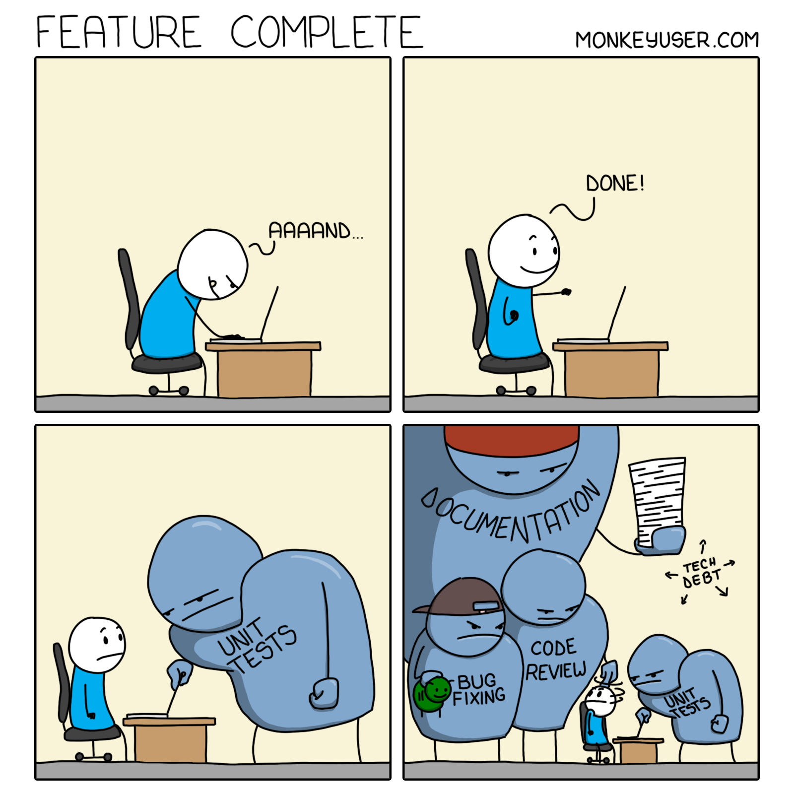

> "Business won't let us implement proper telemetry."
>
> "We can't write tests because there's no time."
>
> "The manager won't approve refactoring."
>
> "We don't have budget for proper CI/CD."
>
> "The deadline doesn't allow for documenting the API."

These excuses appear in development teams with the regularity of standups and coffee breaks. You’ve heard that numerous times, and I bet you also said it. Why? Because I did both.

Those phrases reveal a fundamental confusion about where business decisions end and technical decisions begin. They often mask our reluctance to take responsibility for our actions.

## Whose Decision Is It Anyway?

Let's cut to the chase: technical experts should make technical decisions. That's us. Or at least that’s our role.

You don't ask your manager for permission to create a new file, name a variable, or start a debugging session. You just do it. So why are we asking permission for implementing telemetry, writing tests, or cleaning up code?

**Delivering a feature doesn’t end with written code; this is just a part of it.**

Source: https://www.monkeyuser.com/2020/feature-complete/

**Like in the comic above, we often treat all other aspects as annoyances. That’s also how we explain it to the business people.**

Besides typing words on the keyboard, we should ensure that they make sense, form a feature of proper quality, that we can safely deploy them, and then later observe their behaviour. So testing, adding telemetry, etc., is part of the coding process; it shouldn’t be treated as some tedious additional stuff we need to do.

Mark Seeman's article ["The Programmer as Decision Maker"](https://blog.ploeh.dk/2019/03/18/the-programmer-as-decision-maker/) nails this point. As developers, we make hundreds of technical decisions daily. Every variable name, code structure, and design pattern choice is a technical decision we make without consulting management. And rightly so. That's not just part of our job, it IS our job. We're paid to apply our expertise to solve technical problems. We need to start acting like it.

## Requirements, Not Permissions

The key distinction lies in understanding the difference between requirements and implementation details.

**Business stakeholders should provide requirements and constraints, such as features, budgets, priorities and deadlines.** They represent the "what" and "when" of our work, but they shouldn't dictate the "how." The implementation details and technical approach fall squarely within our domain as technical professionals.

When a product owner says:

> _"We need this feature by next month"_

They probably don’t want to say: ignore quality (so _"skip writing tests"_ or _"don't bother with proper error handling"_). They're giving you a constraint within which you, as the technical expert, must make appropriate judgments and trade-offs.

If you genuinely cannot deliver quality work within the given constraints, that's when you go back to business, not to ask permission to "do it right." Still, to present business consequences in business terms, they can understand and evaluate. For instance

> _"If we proceed as requested, we'll likely see production outages within three months"_

is something a business stakeholder can assess, or:

> _"We'll be unable to quickly diagnose issues, resulting in extended downtime that will affect our SLAs"_

speaks to business concerns in a way they can grasp. Especially if we back it up with the previous cases like that.

Notice this difference from:

> _"We need more time for writing unit tests."_

One focuses on the business impact that stakeholders can weigh against other priorities; the other asks them to evaluate a technical practice they're not equipped to judge.

Then they can make a decision on changing the scope or delivery time.

**When we frame our concerns in technical terms, we're essentially asking non-technical people to make technical decisions, which is precisely what we then complain about.**

## The Role Confusion Problem

From my experience, when the roles and responsibilities between business and engineering are disturbed, the situation ends badly in the long run. The dysfunction typically follows a predictable pattern.

**It begins innocently enough. A developer asks a business stakeholder whether they should add tests or monitoring to a feature.** Not wanting to delay the timeline, the stakeholder says: "Let's skip that for now." The developer complies. The pattern repeats. Soon, the business stakeholder starts believing that making these technical decisions is part of their job. Meanwhile, developers, many of whom are oddly comfortable dodging accountability, keep pushing more technical choices upstairs.

**Over time, this creates a perfect storm of dysfunction. Business leaders make increasingly complex technical decisions that they fundamentally don't understand.** Developers build systems they know are flawed but can conveniently blame on "business requirements." The system gradually deteriorates under the weight of poor technical decisions. When it all eventually collapses, the finger-pointing begins in earnest. Nobody wins.

The truth is that this dynamic serves a perverse purpose for both sides. Business gets to feel in control of all aspects of the product, while developers get to avoid the hard work of making tough technical trade-offs under constraint. It's easier to implement what you're told, especially when you can blame the outcome on someone else's decisions.

## The Responsibility Dodge

The core issue here isn't really about business overreach. It's about developers actively looking for ways to avoid responsibility for the systems they build.

**"Business won't let me" is the perfect excuse in many ways.**

It's practically unverifiable in the moment. Who's going to call an emergency meeting to confirm whether the business actually prohibits proper error handling? It conveniently shifts blame upward to people who likely won't understand the technical implications anyway.

Moreover, it positions you as the helpless victim rather than the empowered expert you're supposed to be. It becomes a ready-made get-out-of-jail-free card when the system inevitably falls apart.

This responsibility avoidance tactic is so common because it works on multiple levels. It prevents you from doing extra work now – implementing proper monitoring or writing thorough tests takes time, after all. It shields you from blame later when problems arise, because you “wanted to do it right”, aye? It requires no confrontation or difficult conversations about trade-offs and priorities. And perhaps most comfortably, it lets you maintain the self-image of a "good developer" who "knows better" but is constrained by clueless managers who just don't understand quality.

Here's the uncomfortable truth: if you build a technical solution you know is flawed, you own that failure. You're supposed to be the expert. Your job isn't just to code what you're told—it's to find the best technical approach within given constraints. Sometimes that means making difficult trade-offs. Sometimes it means having uncomfortable conversations about what's truly necessary versus what can be deferred. But it always means taking responsibility for the technical implementation, not passing that responsibility upstairs.

Read also more in:

-   [On getting the meaningful discussions, and why that's important](/en/on-getting-the-meaningful-discussions/)

-   [Tech Debt doesn't exist, but trade-offs do](/en/tech-debt-doesnt-exist-but-trade/)

## Finding the Real Problem

In my article ["Bring me problems, not solutions!"](/en/bring_me_problems_not_solutions/) I discussed how business stakeholders often present us with solutions instead of problems. A classic example is:

> _"We need a web app for recording working hours."_

when the actual problem might be:

> _"HR needs accurate time records to process payroll."_

This happens constantly with technical decisions, too, but in reverse—we interpret business requirements as technical directives.

When someone says:

> _"We don't have time for telemetry!"_

They're not actually talking about telemetry. They probably don't even know what telemetry is. What they're saying is:

> _"We're worried about the deadline."_

**That's the real problem – a concern about timely delivery.** Your job as a technical expert is to recognise this translation error. Once you understand the actual concern—meeting a deadline—you can make informed trade-offs that address both the business need and technical integrity.

Perhaps you scale back the feature itself rather than the quality of its implementation. Maybe you implement it in phases, with the most critical functionality delivered first. Perhaps you can find ways to streamline other aspects of the work.

**The point is, you're making these decisions based on your technical expertise rather than asking business people to make them for you or, worse, assuming they've already made them through their requirements.**

Read more in:

-   [Follow the money to get a better design](/en/follow_the_money/)

## Making Trade-offs, Not Excuses

**When faced with constraints, we should not throw up our hands and say: "Business won't let me do it right." We should analyse requirements and make appropriate trade-offs, using our technical expertise to guide those decisions.** This is fundamentally different from simply cutting corners or delivering poor quality.

Consider what's necessary for system stability and reliability. Some aspects of software development aren't optional luxuries, they're essential to a functioning system. Basic error handling, data validation, and security controls aren't nice-to-haves. They're fundamental. On the other hand, some features can be simplified while still providing value. Perhaps an advanced search can be trimmed back to basic functionality initially. Maybe a dashboard can display essential metrics first, with additional views later.

Some work can be deferred without decreasing quality; not all technical improvements need to happen immediately. And often, there's a minimal viable version that would meet the immediate need while allowing for future enhancement. These are the kinds of nuanced trade-offs that technical experts should make.

**This isn't about cutting corners. It's about making expert judgments about what's technically crucial given the constraints.** Sometimes you'll need to scale back features, adjust timelines, or implement in phases—but you make these decisions based on your technical expertise, not by asking non-technical stakeholders to make them for you.

**If you're a senior developer or architect, take a hard look at what decisions you're punting upstairs that should be yours.**

Are you hiding behind "business won't let me" when you should be saying "I'm responsible for making this work within our constraints"?

Technical leadership isn't just about knowing the right technical choice, it's about having the backbone to stand behind it. It's about using business requirements and constraints as parameters within which you operate, not excuses for poor quality.

It's about making expert technical decisions within those constraints, applying your knowledge and experience to find the best approach possible given the limitations.

**It means owning those decisions and their consequences, both good and bad.** When things go well, you share the credit. When they go poorly, you accept responsibility rather than pointing fingers at "business requirements." It requires communicating regarding business impact, not technical details, so stakeholders can understand the actual consequences of various options without evaluating technical practices themselves.

And yes, it means having uncomfortable conversations about genuine business risks when necessary.

Sometimes, despite your best efforts, the constraints don't allow for a viable solution. In those cases, you need the courage to clearly articulate the business risks in business terms, not as a request for permission to "do things right," but as vital information for business decision-making.

As Grace Hopper famously said:

> "It's easier to ask forgiveness than it is to get permission."

So, own your technical expertise.

Make decisions with confidence.

And for everyone's sake, stop blaming "business" for your technical compromises.

Cheers!

Oskar

**p.s. Ukraine is still under brutal Russian invasion. A lot of Ukrainian people are hurt, without shelter and need help.** You can help in various ways, for instance, directly helping refugees, spreading awareness, and putting pressure on your local government or companies. You can also support Ukraine by donating, e.g. to the [Ukraine humanitarian](https://savelife.in.ua/en/donate/) organisation, [Ambulances for Ukraine](https://www.gofundme.com/f/help-to-save-the-lives-of-civilians-in-a-war-zone) or [Red Cross](https://redcross.org.ua/en/).
