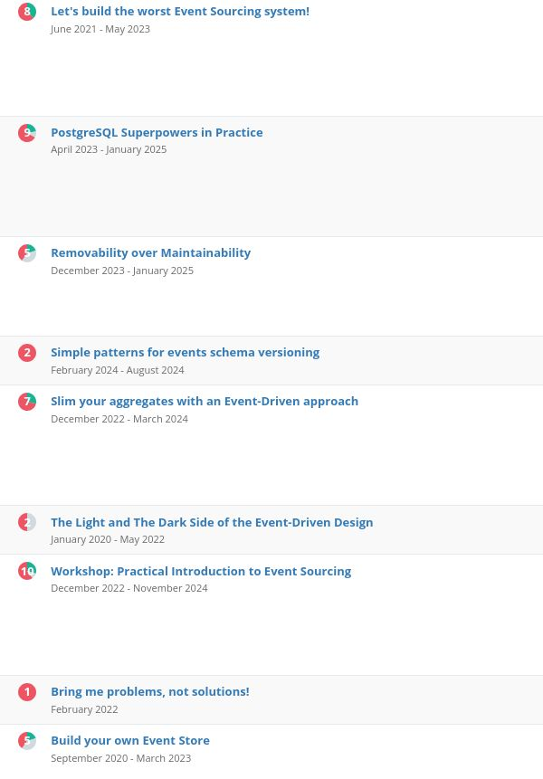
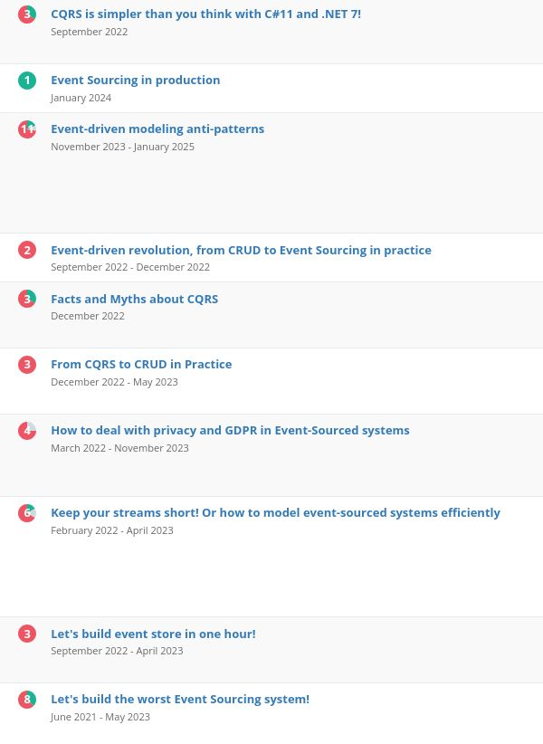
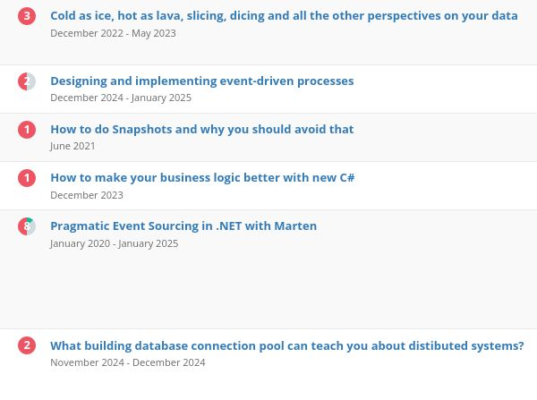

**Occasionally, I'm asked how to get to conferences (especially the bigger ones).**

**My secret recipe is to: just try.**  

**Many people are so afraid of being rejected that they're paralysed.** Impostor syndrome is kicking in. Then thoughts: " Those speakers know stuff much better," or maybe "You need to know The People to get into those conferences." That may be true, but...  

...but the magic is that there's no magic. If you don't try, if you won't send abstracts, if you won't be rejected numerous times, then you won't learn and won't get accepted.  

**To prove it to you, look at the screens below.** I did them from [Sessionize.com](https://sessionize.com/) - the most popular application for sending conference abstracts. I have been nominated as the most active speaker for the last two years.

**And hey, I should have also got the most rejected speaker badge.**  

So I'm not sure if I could give some advice on how to be accepted, but if I could, besides "just try", then:  

**1\. Work on the abstract and tell precisely what you want to show.** If you think that doing that will show too much, think twice about whether it's a really good topic for a talk.

**2.** **Ensure that your talk is aligned with the conference leitmotif.** For instance: sending C# related talk to Java conference won’t help. Same goes for sending talk related to specific tool or technology to architecture track or modelling conference. Align your topic with the audience. Or just don’t send it there.

**3\. Don't use GenAI tools to write it. Make a personal touch.**  

**4\. When you write it, ask a few folks what they think and how they understand it.**  

**5\. Make it engaging, not boring and not too lengthy.** Still, don’t make cheesy jokes, don’t be jumpy. You need to balance expressiveness with being on point.  

**6\. If you don't know how to do it, look at the abstracts of the talks that were accepted in previous years.** Don't look at celebrities, but at folks who are closer to you.  

**7\. It's best to back your abstract with links to your articles or recordings** so people can check how you explain stuff and what you'll show.

**8\. Don’t be afraid to be precise about your** _**special sauce**_**.** Many submissions write something like “I’ll show you what solution worked out for us and how we solved it”. Even though you know what it was, and believe it was great, people selecting the talks don’t know it. Explain briefly the solution and why it’s worth showing, and use examples. If you're afraid that you’ll show the audience too much of the essence in two sentences, then again, ask yourself if it’s really a topic for a talk.

**9\. Before getting to a big stage, it’s good to make your way through user groups and smaller conferences.** It helps you get used to the stage, gather feedback, hone your speaking skills, and get your name recognised. Having such experience will help you to be accepted.

**10\. Don’t take rejection personally.** As you saw, I’m constantly rejected, there are conferences that are always rejecting me. Some conferences have hundreds of submissions, you not always need to have a good talk, good abstract but also luck. So it’s not about you, it may be about abstract, but not about you. If you want to get there: analyse what you coud do better, try again, rinse, repeat.

**And most importantly: just try.  

Rejections will happen, but acceptance also. Sooner or later.**

At least that’s how it was for me.

**And hey, if you’re at the conference, be it as an attendee or a speaker, I’m happy to talk with you in person.** I’ll be speaking at three conferences next month on three conferences:

-   [Techorama](https://techorama.be/),

-   [Event Centric](https://2025.eventcentric.eu/),

-   [Devoxx Poland](https://devoxx.pl/).

See you there?

Cheers!  
Oskar

**p.s. Ukraine is still under brutal Russian invasion. A lot of Ukrainian people are hurt, without shelter and need help.** You can help in various ways, for instance, directly helping refugees, spreading awareness, and putting pressure on your local government or companies. You can also support Ukraine by donating, e.g. to the [Ukraine humanitarian](https://savelife.in.ua/en/donate/) organisation, [Ambulances for Ukraine](https://www.gofundme.com/f/help-to-save-the-lives-of-civilians-in-a-war-zone) or [Red Cross](https://redcross.org.ua/en/).
