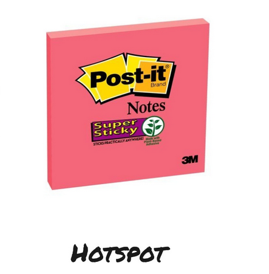

**I've been [facilitating the EventStorming sessions](/en/training/) for years now, and something keeps catching my attention.**

While teams naturally focus on mapping out those orange event sticky notes (the backbone of any EventStorming session), they often **underestimate the power of two critical elements: Hot Spots and Notes.**

For those less familiar with [EventStorming](https://www.eventstorming.com/), it's a workshop technique developed by [Alberto Brandolini](https://www.avanscoperta.it/en/trainer/a-brandolini/) that helps teams map complex business domains. You gather relevant people in a room, roll out a long paper on the wall, and start mapping out what happens in your system using different colored sticky notes. Orange ones represent domain events - the facts that have happened in your system and that domain experts care about. These events form the primary narrative of your process.

Who are “relevant people”? Obviously, domain experts, decision makers, and we, technical people, who’ll be trying to solve business problems with 0s and 1s.

If you’re looking for a quick intro, check this talk by Kenny Baas-Schwegler:

`youtube: [Embedded video](https://www.youtube.com/watch?rel=0&autoplay=0&showinfo=0&enablejsapi=0&v=WvkBKvMnyuc)`

**Still, no intros today, as today, I want to discuss the red and white sticky notes that don't always receive the recognition they deserve.**

## Why Meetings Get Stuck

Most of us have been in technical meetings that start with good intentions but descend into circular discussions. You gather smart people in a room to map out a process, but an hour in, everyone's debating some detail nobody fully understands. Half the room checks emails two hours in, while the other half argues about edge cases.

Or all people are engaged and moving along smoothly until we hit some complicated requirements. The discussion can quickly devolve into speculation. For example, nobody in the room knows the exact regulatory requirements, but instead of admitting this, people make conflicting assertions with increasing confidence. Forty minutes later, zero progress is made and the energy in the room is killed.

I hit this problem repeatedly in my early EventStorming sessions until I started taking Hot Spots and Notes more seriously.

## Hot Spots to the rescue

Hot Spots are those bright red sticky notes that mark areas of uncertainty or disagreement.

Notes, typically white, capture assumptions, decisions, or context discovered during the session.

Source: https://github.com/ddd-crew/eventstorming-glossary-cheat-sheet?tab=readme-ov-file#core-concepts

What makes these tools valuable isn't that they're somehow more important than events (they’re not!), it's that they give teams a structured way to handle the unknown without derailing progress.

When I started explicitly encouraging teams to use Hot Spots, sessions immediately became more productive. Instead of pretending to know everything, team members would place a Hot Spot on the timeline whenever they hit uncertainty:

> "Not sure if this requires manual approval"

Hot Spot!

> "Do we need to store this data for compliance?"

Hot Spot!

> "System integration point unclear"

Hot Spot!

This small change had profound effects. Sessions that previously ground to a halt now maintained momentum. We could acknowledge gaps without getting stuck in them.

## The Power of Documented Assumptions

Using the derailed workshop example mentioned earlier, it could be handled differently if we put more effort into noting issues and assumptions.

When the regulatory question was hit, someone could put a Hot Spot labelled:

> "Compliance requirements for trade verification?"

Then, a note was added stating:

> "Assuming 24-hour verification window is required for now."

**That ten-second action could save an hour of circular discussion.** We would document our uncertainty and our working assumption, then continue mapping.

When the compliance team later clarified the actual requirement (e.g., 48 hours for certain trade types), we would have a clear record of how this impacted our model. The risk of proceeding with an assumption would still pay off by maintaining session momentum.

## "If It's Not on the Board, It Doesn’t Exist!"

**I've watched too many important decisions evaporate as soon as meetings end.** A team spends twenty minutes reaching an agreement, but since nobody wrote it down, they end up having the exact same conversation weeks later.

It’s worth having a rotation seat for the note-taker. Of course, everyone can (and should be putting them), but someone who focuses on ensuring that all agreements are on board is essential.

Then, you’re ensuring that good, long discussions that end in consensus or compromise won’t be lost. Whenever something important is said or agreed upon, capture it on a white Note and put an arrow to which it relates. These can be invaluable during implementation, preventing numerous repeated debates.

Thanks to that, it could save you some endless meetings. When you start to argue about something, someone can point to the wall and say:

> ”We already decided this three weeks ago.'"

## Working Around Missing Stakeholders

Let's be honest, it's hard to get everyone with crucial domain knowledge in the same room for a full day. Subject matter experts are usually the busiest people in the organization.

I faced this with multiple teams redesigning their processes. Managers who understood the requirements could only be available in a short timeframe. Rather than trying to cram everything into that half-hour, you could run your session without him, but place Hot Spots everywhere we had questions only he could answer.

Of course, that’s far from perfect. You’re risking that your assumptions will be invalidated and you demotivated. Still, when you’re not new to the domain, but have already spent some time, then those chances will get smaller. It’s still better to have progress than tell [“Business Won't Let Me!”](/en/business-wont-let-me-and-other-lies/) or “We don’t have time for that!”.

Management should appreciate your efforts and your respect for their time. The result could be that you could have a focused discussion when they finally get their time. Instead of wasting management's limited availability with a rambling overview, you could point to specific Hot Spots:

> "We need to understand exactly when reconciliation happens,"

or

> "Is manual approval required for settlements over €50,000?"

The Hot Spots should become a question collection mechanism, ensuring you make the most of limited stakeholder time.

## Getting Stakeholders Interested

**And here's something unexpected I discovered: Hot Spots are great for bringing reluctant stakeholders into the process.**

A team I was coaching couldn't get their Product Managers to participate. They had mapped their system but were stuck on several critical decisions.

Instead of giving up, they brought the EventStorming artefacts to his office, with Hot Spots clearly marking where they needed his input. Seeing the complexity visualised - and the specific places where his expertise was needed - changed his perspective entirely. The visual representation communicated the challenges in a way no meeting agenda could have.

Not only did he help resolve our immediate questions, but they also joined the next session, bringing insights that significantly improved their model.

## Making This Work in Practice

If you want to get the most from Hot Spots and Notes in your sessions:

Put the sticky notes where everyone can reach them. I distribute red and white stickies at multiple points along the modelling wall and explicitly tell participants (repeatedly!) they can add them anytime without asking permission.

Start with more rather than fewer. It's easier to close a Hot Spot that turns out to be simple than to recover from a derailed session because someone pretended to know something they didn't.

Review them periodically during the session. I typically pause after completing major process sections to look at accumulated Hot Spots. This helps determine which we can resolve immediately, which need investigation, and which might affect areas we haven't modelled yet.

Assign owners to post-session Hot Spots. Make sure someone is responsible for finding answers to unresolved questions before they become implementation blockers.

Include Hot Spots and Notes in your documentation. These often contain the most crucial insights from the session - the areas of uncertainty or assumptions that could make or break your implementation.

## Changing How Teams Handle Uncertainty

What I value most about Hot Spots and Notes isn't just how they improve workshops - it's how they change team culture around uncertainty.

In technical discussions, we often feel pressure to know everything immediately. Hot Spots create permission to say, _"I don't know yet"_ while still making progress. They transform uncertainties from conversation-killers into clearly defined next steps.

I've seen teams evolve from hiding what they don't know to actively hunting for uncertainties as valuable information. Questions become assets rather than liabilities.

If you're incorporating EventStorming into your toolkit, don't underestimate these powerful elements. They might not get as much attention as domain events, but in my experience, they often separate a productive modelling session from a frustrating stalemate.

**Check also my other resources around EventStorming:**

-   [Webinar about Implementing Distributed Processes](https://www.architecture-weekly.com/p/webinar-3-implementing-distributed)

-   [Webinar with Radek Maziarka on Modularisation with Event Storming Process Level](https://www.architecture-weekly.com/p/webinar-9-radek-maziarka-modularization)

And [15 tips on how to run meetings effectively](/en/fifteen_tips_on_how_to_run_meetings_effectively/).

Cheers!

Oskar

**p.s. Ukraine is still under brutal Russian invasion. A lot of Ukrainian people are hurt, without shelter and need help.** You can help in various ways, for instance, directly helping refugees, spreading awareness, and putting pressure on your local government or companies. You can also support Ukraine by donating, e.g. to the [Ukraine humanitarian](https://savelife.in.ua/en/donate/) organisation, [Ambulances for Ukraine](https://www.gofundme.com/f/help-to-save-the-lives-of-civilians-in-a-war-zone) or [Red Cross](https://redcross.org.ua/en/).
