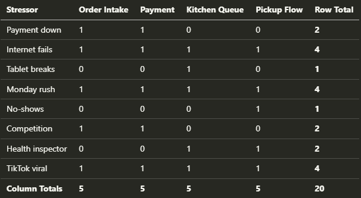
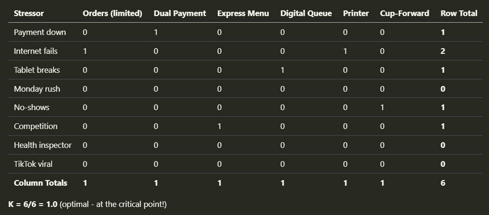

**I was sitting in a dark room at NDC Oslo when Barry O'Reilly started talking about lightbulbs.** One hundred thousand of them, to be exact, all interconnected, each one either on or off. It was an odd way to start a talk about software architecture, but by the end, my mind was blown. What he presented wasn't just another framework—it was a completely different way of thinking about how we build systems.

`youtube: [Embedded video](https://www.youtube.com/watch?rel=0&autoplay=0&showinfo=0&enablejsapi=0&v=0wcUG2EV-7E)`

For years, I've advocated for proper risk analysis. I wrote about it in ["The Risk of Ignoring Risks"](/en/risk_of_ignoring_risks/)—how we need to think upfront about finding risks for our solutions, probability assessments, and mitigation plans. I still believe in all of that. But Barry's Residuality Theory added a dimension I hadn't considered.

**Taking risks is okay as long as we're prepared for them.** In the article mentioned, I explained the [risk register](https://en.wikipedia.org/wiki/Risk_register), a tool that can be helpful for analysing risks. It is a simple table where we write down all risks associated with our solution.

We write the probability in the lines and the degree of risk in the columns. By multiplying these two data, we get a result that tells us how much we should focus on a given risk. If we find out that our risks are very probable and the consequences of their occurrence are severe, we need to take action and make a corrective design decision upfront.

If the risk is unlikely and has little consequence, we can treat it lightly. Usually, however, it is somewhere in the middle. We should write down what we will do when the risk occurs (e.g., when we have 100,000 requests per second).

**Risk analysis assumes you can identify what might go wrong.** You list payment processor outages, network failures, scaling issues. You rate them by probability and impact. You prepare.

But what about the things you never thought of? What about when TikTok makes your coffee shop go viral? What about when a health inspector shows up during your morning rush? What about when your competitor opens next door with half-price drinks?

**Residuality Theory asks a different question.**

Instead of:

> "What risks should we prepare for?"

It asks:

> "What happens to our system when ANY stress hits it?"

The difference is subtle but profound. Risk Matrices help us prepare for known unknowns, while Residuality Theory helps us build systems that survive unknowns.

**Barry O'Reilly developed the residuality theory, a rebellious approach to software architecture that focuses on designing systems that withstand unexpected stresses and changes.** This isn’t just philosophy. It is based on actual complexity science. Those 10,000 lightbulbs represent any complex system where components influence each other. The key insight is that systems move from stable (predictable but rigid) to a critical point, becoming chaotic (unpredictable cascading failures) as connections between components increase.

Many software starts chaotic—everything depends on everything else. The goal is to reduce coupling and the chain reaction of failures, until you hit a sweet spot where your system can adapt without collapsing.

Unlike traditional architectural approaches that design systems from a static, component-based perspective, **Residuality Theory views software architecture as a collection of "residues", the elements that survive after a system experiences stress.**

**The fundamental concept of residuality theory is random simulation.** In a complex business system, it is impossible to accurately make point predictions about what will change, when it will change, how it will change, how often, and what things will change along with it.

We can't predict the future of our software systems, and anyone who claims they can should make you skeptical.

In Residuality theory, instead of trying to guess what might go wrong, we deliberately imagine random scenarios that could break our system, even outlandish ones we don't think will happen.

Think of it as stress-testing your architecture with unexpected challenges:

-   What if our database provider goes bankrupt?

-   What if our main content creator removes all their material?

-   What if a regulatory change forces us to restructure our entire user data model?

-   What if Godzilla attacks our data centre? Yes, even that case.

By testing our architecture against a wide range of random stressors, we build systems that survive not just the problems we can anticipate, but also the ones we can't imagine yet. Residuality theory pushes us past these mental blocks by making unexpected scenarios a central part of the design process.

The result: software that withstands surprises better than traditionally designed systems.

**Residuality Theory has four main concepts:**

-   **Stressors** - Unexpected events that challenge your system (technical failures, market changes, regulatory shifts),

-   **Residues:** The elements of your design that survive after stressors hit,

-   **Attractors**: States that systems naturally tend toward when under stress,

-   **Incidence Matrix**: A tool to visualise relationships between stressors and components

**The general process looks as follows:**

1.  Brainstorm a wide range of potential stressors (including extreme ones).

2.  Map these stressors against your system's components.

3.  Identify which components are most vulnerable.

4.  Design solutions that will survive the stressors.

5.  Test your design against new, unforeseen stressors.

6.  Rince & repeat!

## Let’s try it by example!

**Imagine a local coffee shop chain building a mobile app where customers can order and pay for coffee in advance and pick it up when ready.**

**The Goal is simple:** reduce wait times and in-store crowding.

The traditional approach would be to design each component. We could come up with something like:

-   **Order Intake** - receiving orders,

-   **Payment Processing** - charging customers,

-   **Kitchen Queue** - showing baristas what to make

-   **Pickup Flow** - customer collection.

**With Residuality Theory, you start by imagining stressors, all kinds of them, even ridiculous ones.** The list could look as follows:

-   Payment provider outage (Stripe API down)

-   Shop internet fails (router/ISP issue)

-   Barista drops tablet (screen shattered)

-   Monday 7:45 AM rush (40 orders in 15 minutes)

-   Customer no-shows (orders made but not collected)

-   Competing shop offers 50% off (customer flight)

-   Health inspector arrives during rush (disruption)

-   TikTok makes our "secret menu" viral (unexpected demand)

**Next, you map what breaks when each stressor hits.** This can be eye-opening. When the shop's internet fails, orders can't come in, payments can't be processed, the kitchen can't see orders, and customers don't get notifications. Everything fails together. The same is true for Monday rush - total system meltdown. Or when our local coffee chain goes viral _thanks to_ some TikTok influencer.

The pattern becomes obvious. Your beautifully designed components are so tightly coupled that certain events cause complete collapse.

**In Barry's terms, your system has the Attractor** - a state it naturally falls into - called "everything is on fire." So yes, the negative one.

**You can see that clearly when filling in the Incident Matrix:**

States that systems naturally tend toward when under stress

-   **Total Meltdown** - Internet failure or viral rush affects all components (rows with 4s),

-   **Payment-Order Death Spiral** - Payment and orders always fail together (coupled in 5/8 stressors),

-   **Kitchen Blindness** - Orders paid, but the kitchen can't see them,

-   **Waste Accumulation** - System works, but no-shows create hidden losses

Now, here's where it gets interesting. Traditional thinking says add redundancy, get backup internet, beefier servers, and more staff. With Residuality Theory, you should still consider that. Yet the focus is different: redesign so components can fail independently.

**The solutions, what Barry calls Residues, aren't always technical.** That internet outage? Sure, you could get expensive backup connections.

Or you could create "Internet Down Tuesday", when systems fail. Walk-ins get 20% off, and the failure could be turned into a marketing event.

Is the morning rush overwhelming everything? Don't try to scale all systems. Create an express menu from 7 to 9 a.m. with only five drinks. A simpler menu means faster service and less system load. The constraint becomes a feature.

Customers ordering but not picking up? Instead of eating the loss, create a 15-minute rule where unclaimed drinks go to waiting customers who need a pick-me-up. Waste becomes community goodwill.

**After applying these changes, measure again. The tight coupling is broken.** The updated Incident Matrix could look as follows:

We added some new components:

1.  Technical:

    -   Dual payment providers (Stripe + Square),

    -   Receipt printer backup,

    -   Staff hotspot failover.

2.  Business:

    -   "Internet Down Tuesday" - 20% off walk-ins when the system fails,

    -   Express menu 7-9 am (only 5 drinks available),

    -   15-minute auto-donation policy for unclaimed drinks

    -   WiFi sharing agreement with the bookstore next door,

    -   "Regulars board" - an analogue backup for frequent customers

**Thanks to that, we not only tech-arounded the issue, but we also changed the overall process to be resilient.** Rush hour doesn't crash everything because the express menu prevents overload. Internet outages don't cascade because you've accepted failure as a valid state and made it profitable. Payment provider issues only affect payments, not the entire order flow.

This isn't about preventing failures. It's about building systems that degrade gracefully, sometimes benefiting from failure. The express menu you created for rush hour could become your differentiator against competitors. The community cup program builds customer loyalty.

If we repeat this analysis again and again, we’ll notice that we also have positive attractors. Some of the Residues that came up as a result of solving the stressors’ impact are also solving cases for the new ones!

## Summary

Of course, all of that requires collaboration between IT and business. Still, nowadays, IT is Business. The old split is obsolete already. If we don’t work together but remain in our positions, throwing the ball over the fence, we’ll play the telephone game instead of the real design.

Design is not created in a vacuum.

**Don’t be an architecture astronaut. Don’t work in a vacuum.**

In my opinion, Residuality Theory doesn’t kill risk analysis. We still need to find them, but without limiting ourselves and claiming that we know what we don’t know. It forces us to do our homework. What components fail together? What states does my system naturally fall into? What survives when things go sideways?

**This approach acknowledges something important: we can't predict everything. The world is messy**. Competitors appear, social media goes viral, inspectors show up, and equipment breaks. Instead of pretending we can plan for it all, we build systems that adapt and survive.

We should stop pretending we can control everything.

Risk analysis says:

> "Prepare for what might happen."

Residuality Theory says:

> "Build systems that handle what you didn't prepare for."

Since that talk, I've started looking at systems differently. I started thinking more about the simulation aspect. It’s also kind of more aligned with how other architects work. The real architects work: before they build something, they perform stress analysis to understand if the building won’t fall.

I’m not an expert in Residuality Theory. I hope to see Barry within the next two days at Techorama and that he won’t bash my humble notes here!

You should check out Barry’s talk and read his book [Residues: Time, Change, and Uncertainty in Software Architecture](https://leanpub.com/residuality?utm_source=architecture-weekly.com).

And most importantly, play with it, make dry runs, just like I did in this article. It’s a fun exercise that can bring you many insights into our work and your system design.

When you build for chaos, you stop fearing it!

Check also my other article in a similar spirit to what I described today:

-   [Removability over Maintainability](/en/removability_over_maintainability/)

-   [Tech Debt doesn't exist, but trade-offs do](/en/tech-debt-doesnt-exist-but-trade/)

-   [Bring me problems, not solutions!](/en/bring_me_problems_not_solutions/)

-   [Business Won't Let Me and other lies we tell to ourselves](/en/business-wont-let-me-and-other-lies/)

-   [Webinar with Gojko Adzic on designing product development experiments with Lizard Optimization](/en/webinar-23-gojko-adzic-on-designing/)

Cheers!

Oskar

**p.s. Ukraine is still under brutal Russian invasion. A lot of Ukrainian people are hurt, without shelter and need help.** You can help in various ways, for instance, directly helping refugees, spreading awareness, and putting pressure on your local government or companies. You can also support Ukraine by donating, e.g. to the [Ukraine humanitarian](https://savelife.in.ua/en/donate/) organisation, [Ambulances for Ukraine](https://www.gofundme.com/f/help-to-save-the-lives-of-civilians-in-a-war-zone) or [Red Cross](https://redcross.org.ua/en/).
