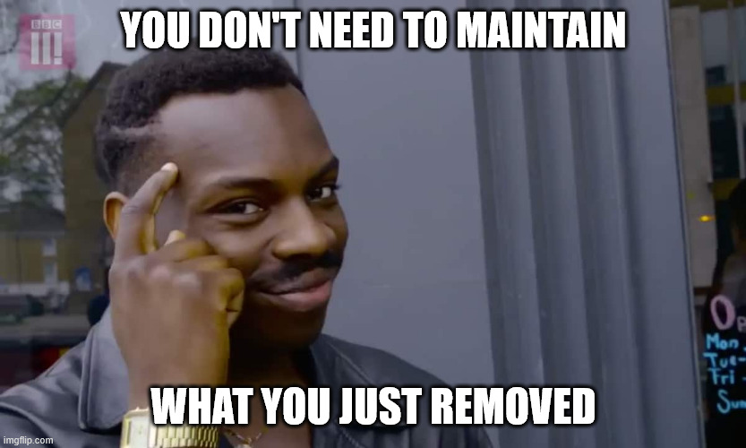

Welcome to the new week!

Let’s get back to the story I told in [Why to measure and make our system observable? How to reason on chaotic world](https://www.architecture-weekly.com/i/150202094/a-clickbait-feature-goes-rogue).

**I was working on another migration from on-premises to the cloud.** The product and sales teams decided to bait the current customers by exposing full-text capabilities for on-premise system search through the cloud. Teams added a change that continuously synchronised data from on-premises to the cloud. Then, it was indexed in Elasticsearch and exposed through the API on the web and mobile.

Then boom bada bing, bada boom. Big announcement to all on-premise customers that they can now enable it for free and use it through our new Cloud services. Of course, most of the customers enabled it. For free is a decent price, right?

**So, great success?**

We didn't have the proper business metrics, so we have to add them.

**And guess what! Our full-text indexing of on-premises data appeared to account for around 90% (or more) of the spending.** Then we compared it with the business usage of the Cloud search API feature, and you know where it is going.

Only one customer was using it. Rarely.

Before I close the curtain, for this story, I'll add that when we asked the client if they were okay with removing this feature, they immediately waved their hands and said: _“Yeah, kill it; we don't need it”_.

**If we'd done the metrics upfront, we'd still need to remove our feature, but we'd have prepared for that and done it earlier, without wasting so much money.**

It’s yet another example that we’re wasting more time and code on maintaining things t’re not needed from a product perspective, instead of addressing the technical issues.

We're not wasting time coding too slowly; we're wasting time doing stuff that doesn't matter. How to do it better, then?

Understanding the business and product scenery is crucial. Otherwise, we'll be doing useless work. Understanding business is a foundation for the proper tradeoff analysis.

So it’s not IT **VS** Business but IT **AND** Business, as IT **IS** a Business nowadays.

Once we realise and agree that working hand in hand with business is beneficial, we can start to collaborate on business metrics.

We can define measurable metrics before starting, not just vague goals. Thanks to them, we can avoid redundant work and redundant costs, knowing when our feature wasn't successful, and we can kill it.

And that's, of course, tricky, but we can learn that.

## Killer metrics to the rescue

Killer, not because they’re so great, but because we define when we can kill the feature.

Let’s discuss it with the example when the business tells **"build email digest feature"**. Perhaps they also provide more specifics on how it should work, you could start implementing it. Maybe that would even work, but without understanding why, you may end up in the same scenario as I’ve had with on-premises indexing and full-text search in the cloud.

**If you want to understand** _**The Why**_**, you could ask:** _"What specific user behaviour are we trying to change? What's our current retention data? Do we know why users don't return?"_

**Business could answer:** _"Users sign up but forget about us. We want them to come back weekly."_

A bit better, but still not perfect, as it still tells more about _The What_ than _The Why_.

**You could follow up with:** _“Thank you for expanding, could you also tell me more on why do we want them to return more often?”_

<strong>Business could answer: “</strong>It’s nice when people are buying stuff on our E-Commerce platform, but it’s much more efficient if those who buy goods have already repeated that. They’re much more likely to buy stuff than the totally new users. If we offer them customised weekly recommendations through email, they can make additional purchases.

Now we’re talking! Still, we should not be satisfied with knowing The Why.

We should also know The When. The When to kill this feature. Yes, before even starting to work on it.

**We could continue with:** _"Thank you, now I have a clear understanding on the need. I’d like to understand also more on the current use behavior. Do you know how often do users currently return? What engagement do our existing emails get? Do you know the research how email digests perform for similar products?"_

**Business comes back:** _"In average, 40% return weekly now. Our newsletter gets 5% click-through. Found studies showing weekly digests increase return rates by 20-30%."_

_**You collaborate:**_ _"Great, thanks for clarification. What would we do if users started to cancel their subscriptions when they began receiving more emails? What would be the satisfying factor of increased traffic? What would we do if there’s no change? I’ll need to perform exact calculations, but we’ll need to use an external email provider that ensures proper delivery through spam filters, etc. That stuff costs. Plus, we’ll need to postpone other features we have in the pipeline.”_

Probably both you and the business will need to do their homework, math, etc. But the side effects of that are that you’re already starting to see the reality, so whether this feature is useful or not and whether there’s a financial reason to do it this way.

**One of the side effects is that you can kill this idea immediately or change the way you implement it.** Or you may come up together with an educated…

**Killer metric**: _If weekly returns don't improve by at least 5% within 2 months, or if the unsubscribe rate exceeds 8% within that timeframe, we kill it immediately._

And that’s great, as we’re investing in [Removability over Maintainability](/en/removability_over_maintainability/). Thinking about [Residuality, we discussed a week ago](/en/residuality-theory-a-rebellious-take/). You don’t need to maintain what you just removed!

Still, you can think now:

> _That’s great Oskar. I love it, but my business won’t cooperate._
>
> _My business people would tell me: "Just build the email digest feature."_

That’s, of course, a challenge, and it can be a showstopper. Still, we can try to do at least the homework on our side. Maybe we can’t gather all the data, but we can definitely gather some data.

We can:

-   **Check our analytics:** current user return patterns, email open rates, and signup-to-usage conversion

-   **Check your SLA/SLO and customer commitments,** they can tell you what you have to fulfil.

-   **Mine production data:** server logs showing user behaviour patterns, telemetry data on feature usage, database queries to find drop-off points

-   **Look at 3-5 direct competitors:** Do they have similar features? How prominent are they?

**We could suggest a small experiment first:** "Let's try manual weekly emails to 100 users for 3 weeks to see engagement before building the full feature".

Of course, we should be careful not to spend too much time so we’re not punished. Still, when we gather some, we can come back with real numbers.

**We could tell:** _"Based on my quick research on current usage data, 40% of users return weekly. Our logs show most users only check the app once after signup. Check also this link, this research shows that we can get above 5%. I checked the pricing of our e-mail providers and this will be the additional cost of sending more e-mails. What would you say if we tried sending manual weekly emails to 100 users for 3 weeks to see engagement before building the full feature? Then we could gather more data. Or if you’re sure then maybe we could target 5% improvement, and if that doesn’t happen in 2 months, we discuss whether to keep this feature?”_

Managers like numbers, and when we speak to them using business terms. Even if they don’t like it when we push back, they appreciate it when they can use our numbers to discuss with their managers. As managers of managers, they appreciate it when people provide them with precise information.

Of course, can’t tell that it works, but you can at least try, aye?

So when business tells you ["Bring me solutions, not problems!" - we should respond "Bring me problems, not solutions!".](/en/bring_me_problems_not_solutions/) Make them define the actual problem before you build anything.

The positive outcome of such metrics and measuring usage is that when we discover we haven't reached the expected outcomes, we may decide to drop this feature and not maintain it at all.

**We should not treat removing features as our personal failure, but we should accept the evolution of our software.**

We should accept that our current work has a finite lifespan and acknowledge that even if we remove something, it could bring us business value.

This is the essence of prioritising removability. Success isn't measured by how long code lasts, but by the value it creates during its lifetime

If we understand our product and the environment we’re in, it’d be easier to break it down into removable parts.

Funnily, if we remove stuff, then we won’t need to maintain, and those that are left will also be easier to maintain as they will have naturally shaped boundaries.

Read also more in:

-   [Removability over Maintainability](/en/removability_over_maintainability/)

-   [Why to measure and make our system observable? How to reason on chaotic world](/en/why-to-measure-and-make-our-system/)

-   [Residuality Theory: A Rebellious Take on Building Systems That Actually Survive](/en/residuality-theory-a-rebellious-take/)

-   [So you want to break down monolith? Read that first.](/en/so-you-want-to-break-down-monolith/)

-   [Tech Debt doesn't exist, but trade-offs do](/en/tech-debt-doesnt-exist-but-trade/)

Cheers!

Oskar

**p.s. Ukraine is still under brutal Russian invasion. A lot of Ukrainian people are hurt, without shelter and need help.** You can help in various ways, for instance, directly helping refugees, spreading awareness, and putting pressure on your local government or companies. You can also support Ukraine by donating, e.g. to the [Ukraine humanitarian](https://savelife.in.ua/en/donate/) organisation, [Ambulances for Ukraine](https://www.gofundme.com/f/help-to-save-the-lives-of-civilians-in-a-war-zone) or [Red Cross](https://redcross.org.ua/en/).
