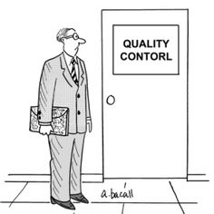

Welcome to the new week!

I've been seeing the same discussion popping up across tech forums and social media lately: is QA dead?

> _"The testing market is ending.”_

Some argue.

> _"AI will handle whole testing soon."_

Others chime in.

This conversation has been going in circles for years, long before AI became everyone's favourite scapegoat.

I think that the real question isn't whether AI will replace testers. It's whether we've ever understood what good testing looks like.

## Why This Debate Even Exists

The reason we're having this conversation at all comes down to how our industry has treated testing roles over the past decade. Companies marketed testing as the _"easy entry point"_ into the tech industry.

> _“Anyone can click through an interface and report bugs. No coding required! Perfect for career changers."_

This created an army of "clicker" testers who went through the same manual scenarios without understanding the underlying systems or business logic.

When developers, especially backend developers, worked with these teams, they naturally concluded that testing was mindless work they could do better themselves.

However, here's the interesting psychological aspect. When someone tells you your code has bugs, you can feel that they’re criticising your work. The natural human response? Get defensive.

> _"What does this person know? I wrote this code, I understand it better than anyone."_

It's easier to dismiss the messenger than admit you might have missed something. [We’re again too attached to our code, treating bugs in it as a personal thing](/en/killer-metrics-or-why-you-should/).

**Developers (especially backend ones) work in clean, logical systems with well-defined inputs and outputs.** They write unit tests that verify their code works exactly as intended. From their perspective, what more could you need?

Here's what I've observed: developers often test what they built, not what should have been built. They verify their implementation matches their understanding of requirements. They rarely question whether those requirements made sense or whether their interpretation was correct.

I've seen projects with 100% code coverage and comprehensive test suites still ship with obvious UX problems, business logic gaps, and integration issues that become apparent the moment real users interact with the system.

**All tests passed, product still sucked.**

## The Automation Illusion

The push toward test automation made this worse. Automation is great for repetitive, well-understood scenarios, but there is a fundamental misunderstanding about what it can and cannot do.

Automated tests catch regressions and verify that known scenarios continue to function as expected. They're ineffective at identifying new problems, challenging assumptions, or understanding user needs. They test exactly what you tell them to test, nothing more.

When developers write automated tests, they're encoding their own assumptions about how the system should work. If those assumptions are wrong, the tests will happily pass while shipping broken experiences.

## QA Isn't Just Testing

Here's one of the biggest misconceptions: QA equals testing. Tests are just one piece of quality assurance. Real QA thinking should start during design discussions, continue through development, and extend to release and beyond.

This is not only testing, but ensuring a proper flow, user experience and correlation between functionalities.

QA also ensures dedicated time and focus on exploring what can go wrong. As developers, we are often focused on the feature we are currently working on. Being in the zone, focused on delivering stuff, we may miss pieces that are essential for the overall quality.

As a manager, I always tried to involve QA engineers in planning sessions from day one. Their input on early phases, with their different perspectives, brought significant value. It helped to strengthen the design before any code was written, which meant we could fix potential issues in the design rather than discovering them weeks later.

This early involvement matters because it's exponentially cheaper to fix problems in design than in code. When a test engineer identifies a user flow issue during design review, you adjust the flow and design accordingly. When they find it during testing, you're looking at code changes, testing cycles, and delayed releases.

Quality should be baked into every development stage, not bolted on at the end. A good test engineer helps teams think about edge cases during requirements gathering, advocates for testability during architecture discussions, and ensures quality considerations are part of every technical decision.

## Dev-Sec-QA-Ops pipe dream

Of course, I’m not trying to say that developers are not responsible for finding similar flows. We do, we all do. Still, it’s about the specialisation. I’m questioning whether we can all be great at everything.

**This reminds me of the backend versus frontend debate. In theory, everyone should be full-stack.** In practice, while most developers can work on both sides, very few are equally strong at both. The thinking patterns and skills are different enough that a healthy portion of specialisation usually produces better results.

The same principle applies to quality assurance. Should every developer care about quality? Obviously. Should everyone write tests for their code? Of course. But does that mean we don't need someone who specialises in thinking about quality?

I don't think so. Just as having a frontend specialist ensures better user experiences, even when backend developers can write JavaScript, having someone whose primary focus is on quality helps ensure better products, even when all developers prioritise testing.

**The key is integration, not separation. The most effective teams I've worked with had test engineers as full team members, not external consultants.** They participated in standups, reviews, architecture discussions, and retrospectives. They weren't handed requirements to verify—they helped shape those requirements from a quality perspective.

We don't expect developers also to be designers, product managers, and infrastructure specialists. We recognise these require different ways of thinking.

Testing, real testing, not mindless clicking, requires specialised knowledge. Understanding how users actually behave, designing test scenarios that uncover edge cases, and thinking about system-wide interactions. These are skills that take time to develop.

The problem is that our industry confuses "anyone can click a button" with "anyone can design effective test strategies." They're completely different things.

**I’ll also highlight that we should not have a horizontal QA team. A horizontal responsibility split is a pathology, in my opinion.** I’ve never seen it working in the long term. We should aim to have self-organising teams capable of delivering the complete feature. I believe that also includes QA engineers.

## The Path Forward

The solution isn't eliminating testing roles or making developers responsible for everything. It's stopping the hiring of unqualified people into testing positions and treating testing as the specialised engineering discipline it actually is.

**This means working with test engineers who can code, understand system architecture, automate routine tasks, and focus their intelligence on problems that actually require human intelligence.** More importantly, it means involving these specialists from the very beginning.

When test engineers are embedded in teams from day one, participating in design discussions and helping shape requirements, the entire quality conversation changes. Instead of finding expensive problems after they're built, you prevent them from being built at all.

**Developers also need to check their egos and recognise that having someone specifically focused on finding problems in their work is valuable, not threatening.** The best developers I know actively seek this feedback because they understand it makes their products better.

The market for unqualified clickers is ending, and that's good. But the market for skilled test engineers who think systemically about quality? That's not going anywhere, AI or no AI.

Our products are getting more complex, users are more demanding, and systems are more interconnected. Having someone whose job is thinking about all the ways things can go wrong - from the very beginning of development - isn't a luxury. It's basic common sense.

Still, I get that our industry is not shaped by common sense and rationality, but by narratives and trends. It may be that GenAI would be a justification for CEOs to drop the QA Engineer role. Still, if that happens, our product quality and user experience will definitely be hurt by that.

Cheers!

Oskar

**p.s. Ukraine is still under brutal Russian invasion. A lot of Ukrainian people are hurt, without shelter and need help.** You can help in various ways, for instance, directly helping refugees, spreading awareness, and putting pressure on your local government or companies. You can also support Ukraine by donating, e.g. to the [Ukraine humanitarian](https://savelife.in.ua/en/donate/) organisation, [Ambulances for Ukraine](https://www.gofundme.com/f/help-to-save-the-lives-of-civilians-in-a-war-zone) or [Red Cross](https://redcross.org.ua/en/).
