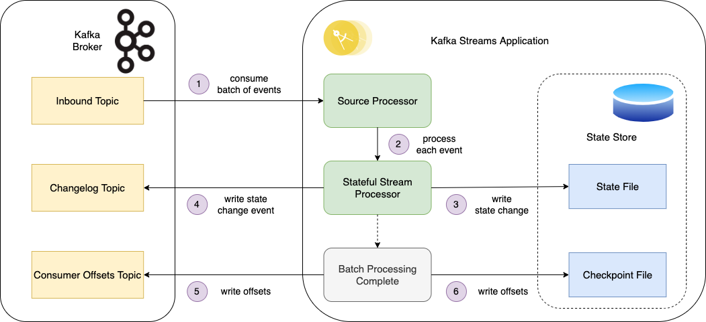
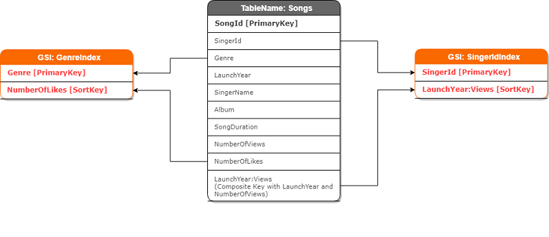

In 2016, the Kafka team faced a problem that illustrates a fundamental challenge in distributed systems design. Users kept asking:

> "How do I query the current state of my data without replaying the entire log?"

If you're tracking user balances through a stream of transactions, you shouldn't need to replay millions of events just to find out someone's current balance.

The problem was that Kafka's storage was optimised for sequential log consumption and was inefficient at point queries.

## The Cost of Specialisation

Building your own storage engine means making specific trade-offs. Kafka's log storage uses sequential writes to append-only segment files, enabling high throughput.

We discussed the details already in:

-   [How Kafka Producer Works internally](/en/how-a-kafka-like-producer-writes/)

-   [Kafka Consumers: Under the Hood of Message Processing](/en/kafka-consumers-under-the-hood-of/)

-   [Understanding Kafka's Consumer Protocol: A Deep Dive into How Consumers Talk to Brokers](/en/understanding-kafkas-consumer-protocol/)

-   [How does Kafka know what was the last message it processed? Deep dive into Offset Tracking](/en/how-does-kafka-know-what-was-the/)

**Consumers read these segments sequentially, often using zero-copy transfers directly from the file system cache to the network.** But this design makes point queries expensive. Want to find a specific user's latest state? You'll need to scan through potentially gigabytes of log data. There's no index because indexes would require random writes, which would hurt the sequential write performance that makes Kafka useful for streaming.

This is the paradox of specialised storage: the optimisations that make you successful also constrain your options. Your users chose your system because it excels at one thing, but success brings diverse use cases. They've already invested in your system, their data lives there, and they don't want to set up another piece of infrastructure just to run different queries.

## The Kafka State Store Solution

The Kafka team had three options:

1.  Add indexes to the log storage (degrading its sequential write performance).

2.  Tell users to export data to a database (increasing operational complexity).

3.  Build a separate storage tier optimised for point queries.

**They chose option three.** Around this time, the Kafka team was developing Kafka Streams, a stream processing library. One of its features fit the state query need: embedded state stores.

**So the team built [Kafka Streams](https://kafka.apache.org/documentation/streams/), a Java library that processes data from Kafka topics.** They embedded a completely different database inside these processing applications. That database is [RocksDB](https://rocksdb.org/), an embedded key-value store that [Facebook originally built for fast local storage](https://engineering.fb.com/2013/11/21/core-infra/under-the-hood-building-and-open-sourcing-rocksdb/).

Unlike Kafka's append-only logs, RocksDB uses an [LSM-tree structure](https://en.wikipedia.org/wiki/Log-structured_merge-tree) that's optimised for random reads and writes. You can look up any key instantly without scanning through unrelated data. By embedding RocksDB inside each stream processor, they created local "state stores" that could answer point queries.

This architecture means that your Kafka messages flow through a Java application that maintains a local database of the current state. If you're tracking user balances, the application reads transaction events from Kafka and updates each user's balance in its local RocksDB. Now you can instantly query any user's current balance, without replaying the log.

**However, you've created a new problem: the RocksDB instance is local to a single machine.** If the machine fails, you lose the state. So Kafka added yet another component: a changelog topic.

Source: [https://www.linkedin.com/pulse/kafka-streams-state-store-rob-golder/](https://www.linkedin.com/pulse/kafka-streams-state-store-rob-golder/)

Every state store write also produces an event for this changelog. Now you have durability, but look at what your "index" has become:

1.  The original message in the input topic.

2.  The state store update in RocksDB.

3.  The changelog event for durability.

**This write amplification continues to grow. The changelog topic itself gets replicated across brokers for fault tolerance.** If you have multiple state stores for different query patterns, each needs its own changelog. A single business message might trigger a dozen physical writes across the system.

## DynamoDB's Similar Challenge

**The DynamoDB team at AWS faced a similar problem. DynamoDB's storage is optimised for partition key access: you can retrieve any item instantly if you know its partition key.** The system achieves this through consistent hashing and partition-specific storage optimisation.

**But users wanted to query by other attributes.** _"Find all orders placed yesterday"_ or _"Get all items with status='pending'"_ required scanning entire tables, which was expensive and slow.

**DynamoDB's solution was [Global Secondary Indexes](https://docs.aws.amazon.com/amazondynamodb/latest/developerguide/GSI.html), or GSIs. The name suggests they're just indexes, but the implementation tells a different story.** A GSI is actually a complete, separate DynamoDB table. It has its own partitions, capacity units, and replication. When you write to the main table, DynamoDB captures that change in DynamoDB Streams and asynchronously replicates it to each GSI.

Source: [https://aws.amazon.com/blogs/database/how-to-use-dynamodb-global-secondary-indexes-to-improve-query-performance-and-reduce-costs/](https://aws.amazon.com/blogs/database/how-to-use-dynamodb-global-secondary-indexes-to-improve-query-performance-and-reduce-costs/)

It's not an index in any traditional sense; it's a derived table that happens to be automatically maintained.

1.  The main table write.

2.  DynamoDB Streams event.

3.  Asynchronous writes to each Global Secondary Index table.

Your "index" needs its own capacity planning. It can throttle independently of your main table. Each GSI has its own replicas and its own failure modes. The write amplification is proportional to the number of query patterns you support.

## Why Secondary Indexes Work Differently in Distributed Systems

**In a traditional single-node database, a secondary index is an additional data structure that enables the efficient retrieval of records without requiring a full table scan.** Think of a phone book: the main data is sorted by last name, but you might also want a separate index sorted by phone number. When you look up a phone number, you check the number index, find the person's name, and then jump to their complete entry in the main book.

Databases implement this using B-trees, which are like hierarchical directories. To find a value, you start at the root and follow pointers down through intermediate nodes until you reach the leaf containing your data. This gives you logarithmic lookup time: finding one record among a million takes only about 20 comparisons, not a million.

**The crucial part is that in a single-node database, updating the main table and its indexes happens atomically.** When you change someone's phone number, the database updates both the main record and the phone number index in one transaction. Either both succeed or both fail.

**Distributed systems can't work this way. You cannot atomically update multiple data structures across different nodes.** The network can partition, nodes can fail, and coordinating updates would require distributed transactions that destroy performance.

Instead of fighting this constraint, both systems adopted eventual consistency. Secondary indexes become eventually consistent views of the primary data, maintained through asynchronous replication.

These aren't indexes in the traditional sense. They can be entirely different storage systems with their own:

-   Partitioning schemes

-   Replication strategies

-   Consistency models

-   Failure recovery procedures

-   Capacity planning requirements

When someone says "add a secondary index" to a distributed system, they're really saying "build and operate another storage system”.

## How These "Indexes" Actually Work

**Starting with Kafka State Stores: when you query a state store, you're querying that local RocksDB instance I mentioned.** The critical design decision is co-partitioning. Kafka ensures all events with the same key go to the same partition, and that partition is processed by one specific task. If you're tracking user balances, all events for user "12345" go to the same place, and the state for user "12345" lives in the RocksDB instance on that same machine.

This co-partitioning is elegant but creates operational complexity. When your application wants to query a user's balance, it needs to know which machine holds that user's state. Kafka maintains a directory of which keys live where through its group membership protocol. The Interactive Queries API uses this directory to route queries to the correct instance. During failures or rebalancing, queries might fail or return stale data from standby replicas.

But what happens when that machine fails? That's where the changelog topic comes in. Every update to the local RocksDB also produces an event to a special Kafka topic. If the machine dies, a new instance can rebuild the entire state by replaying this changelog. It's durability through replication, but notice the cost: every state update is written twice, once to RocksDB and once to Kafka.

**DynamoDB's GSIs work through a similar async replication pattern but with different trade-offs.** Remember, a GSI is a complete DynamoDB table. When you write to the main table, DynamoDB captures that change in DynamoDB Streams (essentially a change data capture log) and asynchronously propagates it to your GSIs.

**Notice that word "asynchronously".** Your write to the main table succeeds immediately, but the GSI updates happen later, typically within one to typically within one to two seconds under normal load (however this can stretch to minutes or more if the GSI is under-provisioned or the table is experiencing heavy writes). This lag is fundamental: updating synchronously would require coordinating across multiple partitions, which would significantly impact DynamoDB's performance.

GSIs can also be sparse, meaning only items with the indexed attribute appear in the index. If you index on "email," items without an email field won't exist in that GSI. This saves storage but means you need to understand which queries each GSI can actually serve.

Both systems chose different points in the design space based on their constraints. Kafka prioritised keeping related data together through co-partitioning, accepting the complexity of query routing. DynamoDB prioritises flexibility, allowing GSIs to have completely different partition keys than the main table, while accepting higher eventual consistency lag and capacity management overhead.

## Understanding Write Amplification

**Once you understand these architectures, you can calculate the true cost of query flexibility.** In DynamoDB, if you have a main table with three GSIs, every single item write becomes four separate writes: one to the main table and one to each GSI. Each of these writes is then replicated (typically three times) for durability. So your single logical write has become twelve physical writes across the infrastructure.

**Kafka Streams faces a similar multiplication.** When a message arrives, you write it to the output topic (three replicas), update the local state store, and write to the changelog topic (another three replicas). If you maintain two different state stores for different query patterns, add another changelog topic. One business event can easily trigger nine or more physical writes.

Each write serves a purpose: the original for durability, the indexes for queries, the replicas for fault tolerance. The amplification factor directly correlates with the query flexibility you're providing.

## Living with Distributed Indexes

Running these systems in production reveals their operational reality. The most critical metric becomes replication lag: how far behind are your indexes? In DynamoDB, your GSIs typically lag one to two seconds behind the main table. Under heavy write load, this can stretch to minutes. Kafka state stores face similar challenges during rebalancing, when partitions move between machines, and changelog replay can take hours.

Because of this lag, you need to design applications differently. A user might update their profile and immediately query it through a GSI, retrieving their old data. Your code needs to handle this gracefully, perhaps by reading from the main table when freshness matters. Some teams implement "read your writes" patterns, tracking recent updates client-side.

Capacity planning becomes multidimensional. It's not enough to provision for your write rate; you need to account for the amplified rate across all indexes. A DynamoDB table handling 1,000 writes per second with three GSIs needs 4,000 write capacity units total. Miss this calculation, and your indexes will throttle, lag will increase, and queries will return increasingly stale data.

Recovery scenarios add another layer of complexity. When a Kafka Streams instance crashes, its replacement must replay the entire changelog to rebuild state. For large state stores, this can take hours. DynamoDB faces similar challenges when adding a new GSI to an existing table: it must backfill the entire index, potentially processing billions of items.

## When to Pay the Secondary Index Tax

Given these costs, when do secondary indexes make sense in distributed systems? It depends on your alternatives. If users need to find orders by customer ID and your only option is scanning terabytes of data, the write amplification suddenly looks reasonable. If queries are rare or can tolerate minutes of latency, maybe a periodic batch job is better.

You need to understand the full cost model from the start. Adding an index means multiple storage systems, eventual consistency in your application logic, multiplied infrastructure costs, complex recovery procedures, and new operational playbooks. Sometimes these costs are worth it. Sometimes you're better off telling users to adjust their query patterns.

Successful teams treat each secondary index as a long-term commitment. They prototype with real workloads to understand the amplification factor. They build tooling to monitor lag and alert on degradation. They educate developers about eventual consistency. Most importantly, they push back on speculative indexes, adding them only when the use case is clear and the alternative is untenable.

This pattern appears everywhere in distributed storage:

-   Elasticsearch adds doc values for analytics queries

-   Cassandra implements materialised views

-   MongoDB maintains separate index structures per shard

-   Even PostgreSQL separates heap and index storage

**They all face the same constraint: you can't modify specialised storage to support different query patterns without ruining its original performance characteristics.** So you build separate storage tiers, accept the write amplification, and manage the complexity.

Each system optimises for its specific use case. Kafka keeps data co-partitioned, so related state lives on the same machine. DynamoDB allows completely different partitioning schemes between main tables and GSIs, maximising query flexibility. Elasticsearch builds multiple specialised structures for different query types. Each choice reflects the system's priorities, but the fundamental trade-off remains the same.

In distributed systems, there's no such thing as "just" adding an index. There's only building and operating another storage system, accepting the write amplification, and managing the complexity. Sometimes that trade-off is worth it. But now you understand why it's a trade-off at all.

**As users of those tools, we need to understand that there’s no magical glue. We can’t cheat physics.** Before we choose to use secondary indexing capabilities, we should analyse if we really need them, as they are usually also second-class citizens in those tools. They can still be a good choice, as they can cut our application code, but sometimes it’s just better not to bend the tool to scenarios that it wasn’t designed for and solve the challenge differently.

I hope that this article will help you in better understanding what you’re signing for!

Cheers!

Oskar

**p.s. Ukraine is still under brutal Russian invasion. A lot of Ukrainian people are hurt, without shelter and need help.** You can help in various ways, for instance, directly helping refugees, spreading awareness, and putting pressure on your local government or companies. You can also support Ukraine by donating, e.g. to the [Ukraine humanitarian](https://savelife.in.ua/en/donate/) organisation, [Ambulances for Ukraine](https://www.gofundme.com/f/help-to-save-the-lives-of-civilians-in-a-war-zone) or [Red Cross](https://redcross.org.ua/en/).
