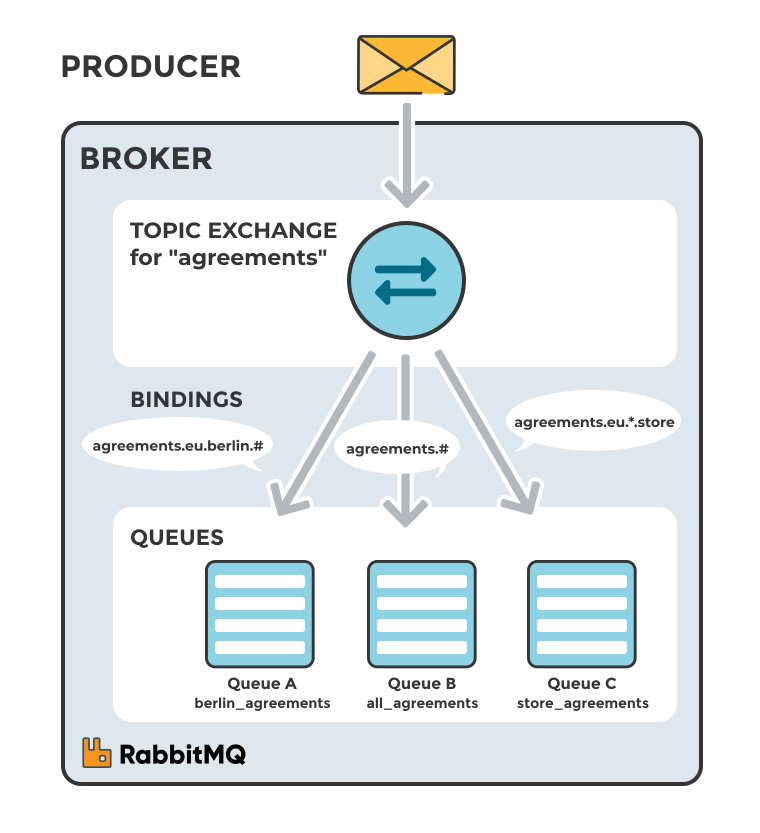
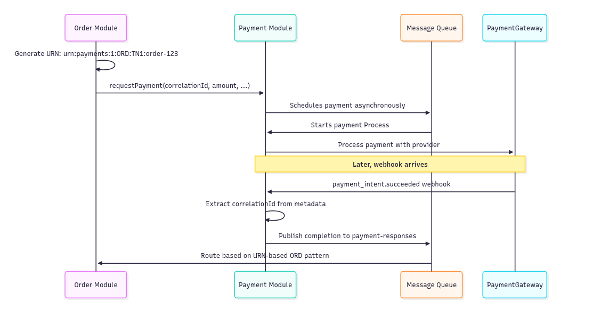

**In distributed systems, we face a fundamental tension between module communication and module autonomy.** Our modules need to exchange information and coordinate actions, yet we want each module to evolve independently without forcing changes across the entire system. This tension becomes evident in event-driven architectures, where modules communicate through events and messages.

Consider a typical e-commerce platform. The payment module needs to process requests from orders, handle reimbursements, manage subscriptions, and potentially deal with dozens of other payment scenarios. Each connection point between modules represents a potential coupling that can ripple through the system when requirements change.

**The traditional approach involves modules directly referencing each other through event types, API endpoints, or shared data structures.** This creates a web of dependencies where adding a new module or changing an existing one requires coordinated updates across multiple teams.

What if we could enable modules to communicate without knowing about each other's existence? What if a payment module could process requests from any source without being programmed to handle specific scenarios?

**We’ll explore today how predictable identifiers, specifically Uniform Resource Names (URNs), provide an elegant solution to this challenge.**

By structuring identifiers in a predictable format, we enable infrastructure-level routing and correlation without module-specific logic. This approach transforms tightly coupled systems into collections of autonomous services that communicate through well-defined patterns rather than explicit dependencies.

## Why Generic Modules Matter

**Payment processing in modern applications rarely involves direct credit card handling.** Instead, we integrate with payment service providers like Stripe, PayPal, Square, etc. Each provider offers different APIs, webhook patterns, and state machines. A payment module serves as an abstraction layer, wrapping these external services to present a unified interface to the rest of our system.

**Consider what a typical payment module handles. It translates internal payment requests into provider-specific API calls.** It manages authentication tokens and API keys for multiple providers. It handles webhook signatures and payload verification. It normalises responses across different providers, mapping various status codes and error messages into a consistent format. It implements retry logic and circuit breakers for provider outages.

**This wrapper pattern makes sense from a separation of concerns perspective.** Business modules shouldn't need to understand Stripe's payment intent flow or PayPal's authorisation and capture model. They should simply request a payment and receive a result.

However, making this wrapper truly generic presents challenges. Different parts of our system need payments for different reasons. An order needs payment before fulfilment. A subscription needs recurring payments. A marketplace needs to split payments between vendors. A reimbursement needs to refund previous payments. Each scenario has unique requirements, yet they all need the same underlying capability: moving money.

**The key insight is that payment processing, at its core, involves the same operations regardless of the business context.** Whether we're charging for an order or processing a reimbursement, we're essentially creating a financial transaction with an amount, currency, and customer. The challenge lies in building a payment module that can serve all these scenarios without becoming coupled to any of them.

Modern payment providers like Stripe have recognised this pattern. Their Payment Intents API offers a standardised approach to handling various payment scenarios.

## The Coupling Problem - Payment Module Example

Let's examine how coupling emerges in a traditional event-driven architecture. Imagine our payment module listening for events from various parts of the system:

```
interface OrderCreated {
  type: 'OrderCreated';
  orderId: string;
  customerId: string;
  amount: number;
  currency: string;
}

interface ReimbursementRequested {
  type: 'ReimbursementRequested';
  reimbursementId: string;
  originalPaymentId: string;
  customerId: string;
  amount: number;
  reason: string;
}

interface SubscriptionRenewalDue {
  type: 'SubscriptionRenewalDue';
  subscriptionId: string;
  customerId: string;
  amount: number;
  planId: string;
  nextBillingDate: Date;
}

interface MarketplacePurchaseEvent {
  type: 'MarketplacePurchase';
  purchaseId: string;
  buyerId: string;
  splits: Array<{
    vendorId: string;
    amount: number;
    commission: number;
  }>;
}
```

The pseudocode for handling that could look as follows:

```
class PaymentModule {
  constructor(
    private eventBus: EventBus,
    private paymentProvider: PaymentProvider
  ) {
    // The payment module must know about every event type
    this.eventBus.subscribe('OrderCreated', this.handleOrderCreated.bind(this));
    this.eventBus.subscribe('ReimbursementRequested', this.handleReimbursementRequested.bind(this));
    this.eventBus.subscribe('SubscriptionRenewalDue', this.handleSubscriptionRenewal.bind(this));
    this.eventBus.subscribe('MarketplacePurchase', this.handleMarketplacePurchase.bind(this));
  }

  private async handleOrderCreated(event: OrderCreatedEvent) {
    const result = await this.paymentProvider.createPayment({
      amount: event.amount,
      currency: event.currency,
      customerId: event.customerId,
      metadata: { orderId: event.orderId }
    });

    // Must publish order-specific response event
    this.eventBus.publish({
      type: 'OrderPaymentCompleted',
      orderId: event.orderId,
      paymentId: result.id,
      status: result.status
    });
  }

  private async handleReimbursementRequested(event: ReimbursementRequestedEvent) {
    // Different logic for reimbursements
    const result = await this.paymentProvider.createPayment({
      paymentId: event.originalPaymentId,
      amount: event.amount,
      reason: event.reason,
      metadata: { reimbursementId: event.reimbursementId }
    });

    // Different response event type
    this.eventBus.publish({
      type: 'ReimbursementProcessed',
      reimbursementId: event.reimbursementId,
      refundId: result.id,
      status: result.status
    });
  }

  private async handleMarketplacePurchase(event: MarketplacePurchaseEvent) {
    // Yet another response event type
  }

  // More handlers for each business scenario...
}
```

This design creates multiple problems.

**First, the payment module must know about every business module that needs payments.** When a new feature requires payment processing, we must modify the payment module to handle its specific event type and business rules.

**Second, each integration requires custom logic.** Orders might need immediate capture, subscriptions need scheduled billing, and marketplaces need split payments. The payment module becomes a collection of business-specific handlers rather than a generic payment service.

**Third, response handling creates reverse dependencies.** The payment module must know how to notify each requesting module, publishing module-specific completion events. This doubles the coupling surface area.

The release train problem becomes apparent when we trace a simple change. Suppose the order module needs to add a discount field. This requires updating the OrderCreatedEvent structure, modifying the payment module's handler to process discounts, changing the response event structure, and coordinating deployment of both modules. What should be a simple change to order processing ripples through the entire system.

Testing becomes increasingly complex as the payment module accumulates dependencies. Unit tests must mock events from every integrated module. Integration tests require coordinating multiple modules. Adding a new payment scenario means updating test suites across multiple codebases.

The payment module also loses its generic nature. Instead of being a thin wrapper over external payment providers, it becomes an orchestrator of business logic. It knows that orders need immediate payment, reimbursements relate to previous transactions, and subscriptions recur monthly. This business logic properly belongs in the respective business modules, not in the payment infrastructure.

## Partial Solution: Command Pattern

One approach to reducing coupling involves exposing a command interface instead of listening for specific events. Rather than the payment module knowing about orders, reimbursements, and subscriptions, other modules send generic payment requests:

```
interface RequestPayment {
  amount: number;
  currency: string;
  customerId: string;
  description?: string;
  metadata?: Record<string, any>;
}
```

And handle it like:

```
class PaymentModule {
  // Generic payment processing - knows nothing about business context
  async requestPayment(command: RequestPayment): Promise<PaymentResult> {
    // Just wraps the payment provider
    const result = await this.paymentProvider.processPayment({
      amount: command.amount,
      currency: command.currency,
      customerId: command.customerId,
      description: command.description,
      metadata: command.metadata
    });

    return {
      paymentId: result.id,
      status: result.status,
      amount: result.amount,
      currency: result.currency
    };
  }
}
```

This inverts the dependency. Instead of the payment module depending on other modules' event types, other modules depend on the payment module's command interface. The payment module no longer needs to be aware of orders or reimbursements; it simply processes payment requests.

Now, business modules can use this generic interface:

```
class OrderModule {
  async processOrder(order: Order) {
    const paymentResult = await this..requestPayment({
      amount: order.total,
      currency: order.currency,
      customerId: order.customerId,
      description: `Order ${order.id}`,
      metadata: {
        orderId: order.id
      }
    });

    if (paymentResult.status === 'succeeded') {
      await this.markOrderAsPaid(order.id, paymentResult.paymentId);
    }
  }
}
```

**However, this solution introduces new challenges. In distributed systems, payment processing often happens asynchronously.** Stripe might take several seconds to process a payment. 3D Secure authentication requires user interaction. Webhooks arrive minutes or hours after the initial request. The requesting module needs to know when the payment completes, but how does the payment module notify the requester without creating a reverse dependency?

We could use callbacks or return addresses, but this reintroduces coupling in a different form. The payment module would need to understand how to communicate with each requesting module, whether through specific message queues, HTTP endpoints, or event types.

**We've simply moved the coupling problem rather than solving it.**

What we need is a way for modules to correlate requests and responses without explicit knowledge of each other. The requesting module should be able to say "process this payment" and later receive notification of completion without the payment module knowing anything about the requester. This requires a more sophisticated approach to identification and routing.

## Complete Solution: URN-Based Predictable Identifiers

[Uniform Resource Names (URNs)](https://en.wikipedia.org/wiki/Uniform_Resource_Name) provide a standardised way to create globally unique, persistent identifiers. Unlike URLs, which specify location, URNs specify identity. By structuring these identifiers predictably, we can encode routing and correlation information directly into the identifier itself.

Consider this URN format for our payment system:

```
urn:payments:{version}:{source}:{tenantid}:{uniqueid}
```

Let's break down each component. The `payments` namespace identifies this as a payment-related identifier. The `source` indicates which module or system initiated the payment request. The `tenantid` enables multi-tenant routing at the infrastructure level. The `uniqueid` ensures global uniqueness, often incorporating timestamps or UUIDs. The `version` allows for format evolution while maintaining backward compatibility.

Here are concrete examples:

```
urn:payments:1:ORD:TN1:20240115-0jdfj93
urn:payments:1:RMB:TN1:20240115-ksd8234
urn:payments:1:SUB:TN2:20240115-mnb9821
urn:payments:1:MKT:TN1:20240115-poi8734
urn:payments:1:EXT:TN1:CRM1-jdj292
```

The first identifier represents a payment initiated by the order module (ORD) for tenant TN1. The second comes from the reimbursement module (RMB). The third originates from subscriptions (SUB) for a different tenant. The fourth is from the marketplace module (MKT). The fifth shows an external system (EXT) integration where CRM1 might be an external CRM's identifier.

**URNs offer several advantages over ad-hoc identifier schemes.** They follow [RFC 8141](https://www.rfc-editor.org/rfc/rfc8141.html), providing a well-documented standard. They're hierarchical, allowing for logical organisation and pattern matching. They're opaque to external systems while being meaningful to internal infrastructure. Most importantly, they're self-describing, carrying their own routing information.

The implementation requires careful consideration of field naming and placement. We could call this field `processId`, emphasizing its role in process correlation, or `correlationId`, highlighting its use in linking related operations. Some teams prefer `contextId` to indicate that it carries contextual information beyond simple identification.

Let's update our payment request to use URNs:

```
interface PaymentRequest {
  correlationId: string;  // The URN
  amount: number;
  currency: string;
  customerId: string;
  description?: string;
  metadata?: Record<string, any>;
}
```

And the implementation to:

```
class PaymentModule {
  async requestPayment(request: PaymentRequest): Promise<void> {
    // Process payment asynchronously
    await this.queue.publish('payment.requests', request);
  }

  private async processPaymentAsync(request: PaymentRequest) {
    try {
      const result = await this.paymentProvider.processPayment({
        amount: request.amount,
        currency: request.currency,
        customerId: request.customerId,
        metadata: {
          correlationId: request.correlationId,
          ...request.metadata
        }
      });

      // Publish response using URN for routing
      await this.publishResponse(request.correlationId, {
        paymentId: result.id,
        status: result.status
      });
    } catch (error) {
      await this.publishResponse(request.correlationId, {
        status: 'failed',
        error: error.message
      });
    }
  }

  private async publishResponse(correlationId: string, response: any) {
    // Infrastructure handles routing based on URN
    await this.queue.publish('payment.responses', {
      correlationId,
      ...response
    });
  }
}
```

## Implementation: RabbitMQ Routing

Let's implement this pattern using RabbitMQ to demonstrate infrastructure-level routing. [RabbitMQ implement various strategies to route messages between queues, they do it through Exchanges](https://www.cloudamqp.com/blog/part4-rabbitmq-for-beginners-exchanges-routing-keys-bindings.html).

**Exchanges are routing layers** that receive messages and route them to queues based on specific rules. They don't store messages.

**Queues are storage layers -** they buffer messages until consumers process them. Messages physically reside here.

Think of it as a postal system: exchanges are sorting facilities, queues are mailboxes. Publishers are unaware of mailboxes (queues); they simply send messages to the sorting facility (exchange) with an address (routing key).

We’ll use topic exchanges. They enable routing based on routing keys with wildcards, perfect for our URN structure.



Source: https://www.cloudamqp.com/blog/part4-rabbitmq-for-beginners-exchanges-routing-keys-bindings.html

First, we'll set up the infrastructure configuration:

```
class PaymentsMessagingConfiguration {
  async setupRouting(channel: Channel) {
    // Main exchange for payment responses
    await channel.assertExchange('payment-responses', 'topic', { durable: true });

    // Each module creates its own response queue
    await channel.assertQueue('orders-payment-responses', { durable: true });
    await channel.assertQueue('reimbursements-payment-responses', { durable: true });
    await channel.assertQueue('subscriptions-payment-responses', { durable: true });

    // Bind queues with routing patterns based on URN components
    // Orders module receives responses for payments it initiated
    await channel.bindQueue(
      'orders-payment-responses',
      'payment-responses',
      'payments.*.ORD.*.*'
    );

    // Reimbursements module receives its responses
    await channel.bindQueue(
      'reimbursements-payment-responses',
      'payment-responses',
      'payments.*.RMB.*.*'
    );

    // Tenant-specific routing for multi-tenant systems
    await channel.bindQueue(
      'tenant-tn1-payments',
      'payment-responses',
      'payments.*.*.TN1.*'
    );
  }
}
```

Now let's implement the complete flow from order creation through payment completion:

```
class OrderModule {
  async payOrder(orderId: string) {
    const order = await this.load(orderId);

    // Generate URN for this payment
    const correlationId = `urn:payments:1:ORD:${order.tenantId}:${order.id}`;

    // Request payment with URN
    await this.paymentsClient.requestPayment({
      correlationId,
      amount: order.total,
      currency: order.currency,
      customerId: order.customerId,
      description: `Order ${order.id}`
    });
  }

  async handlePaymentResponse(
    event: PaymentCompleted | PaymentFailed
  ) {
    const { correlationId, status, paymentId } = event;

    // Extract order ID from URN
    const urnParts = correlationId.split(':');
    const orderId = urnParts[5];

    // Update order based on payment status
    if (status === 'succeeded') {
      await this.markOrderAsPaid(orderId, paymentId);
    } else if (status === 'failed') {
      await this.markOrderAsPaymentFailed(orderId);
    }
  }
}
```

The payment module processes requests and publishes responses without knowing the source:

```
class PaymentModule {
  async onPaymentCompletedProviderWebhook(result: PaymentGatewayPaymentCompleted) {    
    try {      
      // Extract routing key from URN
      // urn:payments:1:ORD:TN1:123 becomes payments.1.ORD.TN1.123
      // to match RabbitMQ naming convention
      const routingKey = request.correlationId
        .replace('urn:', '')
        .replace(/:/g, '.');

      // Publish response using URN-based routing
      await this.channel.publish('payment-responses', routingKey, {
        correlationId: request.correlationId,
        paymentId: result.id,
        status: result.status
      });

    } catch (error) {
      const routingKey = request.correlationId
        .replace('urn:', '')
        .replace(/:/g, '.');

      await this.channel.publish('payment-responses', routingKey, {
        correlationId: request.correlationId,
        status: 'failed',
        error: error.message
      });
    }
  }
}
```

Here's the complete flow visualised:



## Additional Benefits

The predictable identifier pattern yields benefits beyond basic routing and correlation.

**Webhook correlation becomes straightforward when external systems call back.** Mature payment providers allow us to pass the external id or send custom metadata, including our URN. When a webhook arrives, we extract the correlation ID and route it back to the originating module without any hardcoded logic.

**Natural idempotency emerges from URNs.** The correlation ID itself can serve as an idempotency key, preventing duplicate payment processing when modules retry failed requests. This is especially valuable for payment operations where accidental duplicates can be costly.

**Infrastructure-level tenant routing becomes possible.** Since the tenant ID is embedded in the URN structure, the routing infrastructure can direct messages to tenant-specific queues or processing clusters without the payment module being aware of multi-tenancy concerns.

**Debugging and observability improve dramatically.** Every operation carries its correlation ID through the entire flow, making it simple to trace a payment from initiation through completion. Log aggregation tools can group all events by correlation ID, providing a complete view of each transaction.

**Most importantly, the payment module remains completely generic.** It processes payments without knowing whether they originate from orders, subscriptions, reimbursements, or any future module. This is the essence of an open host service: a truly autonomous module that provides its capability without coupling to its consumers.

## Security and Practical Considerations

While predictable identifiers offer numerous benefits, they also introduce security considerations. The structure itself reveals information about your system's organisation, potentially exposing module names and tenant identifiers to external observers.

Protect against identifier traversal attacks logically can look as follows:

```
class SecurePaymentHandler {
  async handlePaymentResponse(
    message: Message,
    context: RequestContext
  ) {
    const { correlationId } = message;

    // Validate tenant access
    const urnTenant = this.extractTenant(correlationId);

    if (urnTenant !== context.tenantId) {
      throw new ForbiddenError('Access denied');
    }

    // Validation based on source
    const source = this.extractSource(correlationId);

    if (!context.allowedSources.includes(source)) {
      throw new ForbiddenError('Source not authorized');
    }

    // Additionally, you can store and verify correlation exists
    const exists = await this.correlationStore.exists(correlationId);
    if (!exists) {
      throw new NotFoundError('Invalid correlation');
    }

    // Process valid response
    return this.processResponse(response);
  }
}
```

Rate limiting can also leverage the URN structure:

```
class UrnBasedRateLimiter {
  async checkLimit(correlationId: string): Promise<boolean> {
    const source = this.extractSource(correlationId);
    const tenant = this.extractTenant(correlationId);

    // Different limits for different sources
    const limits = {
      ORD: 1000,  // Orders can make many payments
      RMB: 100,   // Reimbursements are less frequent
      EXT: 10     // External systems get lower limits
    };

    const limit = limits[source] || 50;
    const key = `ratelimit:${tenant}:${source}`;

    const count = await this.redis.incr(key);
    if (count === 1) {
      await this.redis.expire(key, 3600); // 1 hour window
    }

    return count <= limit;
  }
}
```

Consider encryption for sensitive components (or best avoid sending such):

```
class SecureUrnGenerator {
  generateUrn(source: string, tenantId: string, uniqueId: string): string {
    // Version 2 URNs use encryption
    const version = '2';

    // Encrypt sensitive parts
    const encryptedTenant = this.encrypt(tenantId);
    const encryptedId = this.encrypt(uniqueId);

    // Base64URL encode for safety
    const safeTenant = Buffer.from(encryptedTenant).toString('base64url');
    const safeId = Buffer.from(encryptedId).toString('base64url');

    return `urn:payments:${version}:${source}:${safeTenant}:${safeId}`;
  }

  parseSecureUrn(urn: string): ParsedUrn {
    const parts = urn.split(':');
    const version = parts[2];

    if (version !== '2') {
      throw new Error('Unsupported URN version');
    }

    return {
      source: parts[3],
      tenantId: this.decrypt(Buffer.from(parts[4], 'base64url')),
      uniqueId: this.decrypt(Buffer.from(parts[5], 'base64url'))
    };
  }
}
```

You can, of course, go further, support checksums, etc.

## Conclusion

**Predictable identifiers transform how modules communicate in distributed systems. By encoding routing and correlation information directly into identifiers, we enable true module autonomy.** The payment module example demonstrates this transformation clearly - from a tightly coupled system where the payment module must know about every business scenario, to a generic service that processes payments without knowing their source.

The key insight is that identity can carry meaning without creating coupling. URNs provide a standardised way to structure this identity, enabling infrastructure-level routing while maintaining module independence. The payment module processes generic payment requests and publishes responses using the correlation ID for routing. It never needs to know whether a payment is for an order, reimbursement, or subscription.

**This pattern extends beyond payments to any cross-module communication.** Any module that provides generic services - notifications, document generation, audit logging - benefits from predictable identifiers. The pattern is particularly powerful in event-driven architectures where asynchronous communication and webhook handling are common.

**Implementation requires thoughtful design choices around format, security, and infrastructure integration.** However, the investment pays dividends in reduced coupling, improved debugging, and easier system evolution. Teams can work independently, modules can be added or removed without system-wide changes, and the promise of microservice architecture finally becomes reality.

As systems grow in complexity, the need for autonomous modules becomes critical. Predictable identifiers offer a proven pattern for achieving this autonomy without sacrificing coordination. They represent a fundamental shift in how we think about module communication - from explicit contracts to emergent behaviour, from tight coupling to flexible collaboration.

**Are you already using URN-based strategies in your systems?**

Read also more in:

-   [Queuing, Backpressure, Single Writer and other useful patterns for managing concurrency](/en/architecture-weekly-190-queuing-backpressure/)

-   [Idempotent Command Handling](/en/idempotent_command_handling/)

-   [Ordering, Grouping and Consistency in Messaging systems](/en/ordering-grouping-and-consistency/)

Cheers!

Oskar

**p.s. Ukraine is still under brutal Russian invasion. A lot of Ukrainian people are hurt, without shelter and need help.** You can help in various ways, for instance, directly helping refugees, spreading awareness, and putting pressure on your local government or companies. You can also support Ukraine by donating, e.g. to the [Ukraine humanitarian](https://savelife.in.ua/en/donate/) organisation, [Ambulances for Ukraine](https://www.gofundme.com/f/help-to-save-the-lives-of-civilians-in-a-war-zone) or [Red Cross](https://redcross.org.ua/en/).
