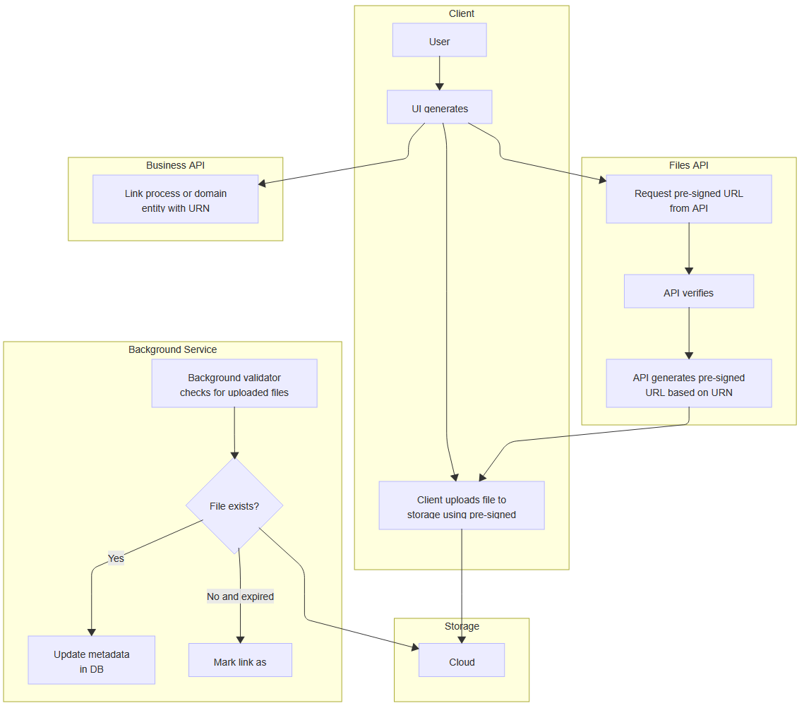

Users want to attach files and keep working. Systems need time to upload, store those files and link it to the specific process or entity.

**You have two choices: block the interface during uploads, or accept temporary inconsistency.**

I learned this while building a construction documentation system. Users attached blueprints to tasks, photos to safety reports, and contracts to milestones. Construction files can be pretty big, so we didn’t want users to have to wait for the upload and can’t do any tasks during that. We needed something better.

[The previous article showed how predictable ids can help in having module autonomy.](/en/predictable-identifiers-enabling/) We discussed [URNs (Unique Resource Names)](https://de.wikipedia.org/wiki/Uniform_Resource_Name) and took the payments module as an example. We used them to generate upfront correlation between other modules and payments. Thanks to that, we inverted the dependency. The payment module could expose a generic API without being aware of the other modules’ existence. Payments just had to know about the correlation id generated upfront and forward it through its own operations.

Document management faces similar coupling challenges, as well as concerns regarding network reliability and user experience.

**Let’s follow up and discuss today how predictable ids can also help in solving eventual consistency challenges.**

## Eventual Consistency vs Causal Consistency

Most of the time, we discuss strong consistency and eventual consistency.

**Most systems prefer to have strong consistency. You perform the operation, wait till it’s finished and then proceed.** We could handle uploads synchronously. User selects file → browser uploads to server → server stores file → server creates database record → server returns success. Simple, consistent, slow.

This creates problems:

-   Large files block the UI for minutes

-   Network interruptions force complete restarts

-   Servers become bottlenecks, streaming every byte through memory

-   Multi-gigabyte files can crash servers

Coupling user experience with implementation details can cause problems. Users don't care about moving bytes across networks. They selected the file - to them, it's attached.

Luckily, we learned that sometimes we have to live with an additional delay. Still, we should not stop that, as it’s a bit trickier than “a small delay”.

We usually assume that stuff will happen in a particular order, we just don’t know precisely when. And that’s actually something that’s called Causal Consistency. The difference between Eventual and Causal consistency is:

**Eventual consistency** - The system eventually reaches a consistent state. Order of operations doesn't matter. Create a link, then upload the file, or upload the file, then create the link - the result is the same. The system tolerates temporary inconsistency.

**Causal consistency** - Operations must respect cause and effect. You can't comment on a document before it exists. Effects follow causes.


Source: https://x.com/gregyoung/status/1101642600342265857

File uploads fit eventual consistency perfectly. When attaching a blueprint to a construction task, two things happen: storing the file and linking it to the task. The order is irrelevant. What matters is that both are completed eventually.

With eventual consistency for file uploads, we can show files as "attached" immediately. The actual upload happens in the background. Of course, we won’t be able to download them until the upload is finished, but the system continues working during the brief inconsistency.

## The URN Solution: Embracing Eventual Consistency

In our system, we decided to separate cloud storage from the actual application behaviour. Our files module was a generic one, similar to the discussed payments.

The reasoning, as in construction projects, is that you may have multiple places where someone can upload documentation, scans, and photos. We wouldn’t like to couple everything together. We just let specific modules to take care of linking files to their processes.

What’s more, we didn’t even want to have a direct relationship on the backend between files and the business module. File URNs were generated on the UI before uploading. The UI knows the context in which the file will reside before transferring bytes.

When users select a file, we could generate a URN immediately:

```text
urn:files:1:CONSTRUCTION:SAFETY_CHECK:DAILY_INSPECTION:site-photo.jpg
```

Structure breakdown:

-   `files` - namespace for documents

-   `1` - version for format evolution

-   `CONSTRUCTION` - initiating module

-   `SAFETY_CHECK` - business process

-   `DAILY_INSPECTION` - subprocess

-   `site-photo.jpg` - filename

The URN structure also helps detect duplicates. The user won’t be able to upload the same file twice, as the key is unique.

Ok, but how will we know where to upload the file when we just know some magic URN?

## Pre-Signed URLs: Direct Client-to-Storage Uploads

**Modern cloud storage providers offer pre-signed URLs, which are time-limited URLs that allow direct uploads without requiring permanent credentials.** Your server generates these URLs on demand, then hands them to the client. The client uploads directly to S3, Azure Blob Storage, or similar services.

But why are pre-signed URLs better than traditional browser uploads? With traditional uploads, your browser establishes a single HTTP connection to your server. If that connection drops - and on mobile networks, it will - the entire upload fails. The browser can't resume; it must start from scratch. Your server, meanwhile, has been holding that partial upload in memory, consuming resources for nothing. With Cloud, that can mean huge costs, as you’re paying for each byte transferred outside your network.

**Pre-signed URLs shift this burden to battle-tested cloud infrastructure.** [S3 presigned URLs](https://docs.aws.amazon.com/AmazonS3/latest/userguide/using-presigned-url.html) allow anyone with valid security credentials to create a URL that grants temporary access to upload an object. The URL is limited by the permissions of the user who created it. They provide:

-   **Automatic retry logic**: The storage provider retries failed chunks without restarting.

-   **Resumable uploads**: Large files can be uploaded using the multipart upload API.

-   **Global edge locations**: Files are uploaded to the nearest datacenter, reducing latency.

-   **Bandwidth optimisation**: Cloud providers have better peering agreements than your servers.

Are they secure? That’s, of course, depends on your requirements.

**Following the [dumb pipes, smart endpoints principle](https://martinfowler.com/articles/microservices.html#SmartEndpointsAndDumbPipes), we’re treating the resigned URL as a dumb pipe.** Our endpoint should be smart enough to ensure that we authenticate and authorise users to perform an operation.

For S3, generating a pre-signed URL requires only the target key and expiration. AWS documentation notes that: _["When you create a presigned URL, you must provide your security credentials and specify a bucket name, an object key, an HTTP method (PUT for uploading objects), and an expiration date and time."](https://docs.aws.amazon.com/AmazonS3/latest/userguide/using-presigned-url.html)_

The presigned URLs are valid only for the specified duration:

```typescript
async generatePresignedUrl(key: string): Promise<string> {
  const command = new PutObjectCommand({
    Bucket: this.bucket,
    Key: key
  });

  // URL expires in 1 hour
  return await getSignedUrl(this.s3Client, command, { expiresIn: 3600 });
}
```

[Microsoft Graph API](https://learn.microsoft.com/en-us/graph/api/resources/onedrive) offers similar capabilities through upload sessions. According to Microsoft's documentation: _["Create an upload session to allow your app to upload files up to the maximum file size. An upload session allows your app to upload ranges of the file in sequential API requests. Upload sessions also allow the transfer to resume if a connection is dropped while the upload is in progress."](https://learn.microsoft.com/en-us/graph/api/driveitem-createuploadsession?view=graph-rest-1.0)_ The implementation follows a similar pattern:

```typescript
async createUploadSession(path: string): Promise<UploadSession> {
  const response = await this.graphClient
    .api(`/drive/root:/${path}:/createUploadSession`)
    .post({
      item: {
        "@microsoft.graph.conflictBehavior": "rename"
      }
    });

  return {
    uploadUrl: response.uploadUrl,
    expirationDateTime: response.expirationDateTime
  };
}
```

This pattern removes re-streaming through your servers. We also benefit from a built-in storage provider’s replication. A user in Singapore uploading a 100MB video sends data to the nearest AWS edge location, not to your servers in Europe. Your server handles business logic instead of moving bytes around.

But now you can't track upload progress. So again, how do you know when the file arrives?

## The "Magic Folder" Pattern

We took inspiration from Microsoft Graph API “Special Folders”. It provides a sneaky pattern for addressing files by path. Per docs:

> _“Special folders provide simple aliases to access well-known folders in OneDrive without the need to look up the folder by path (which would require localization), or reference the folder with an ID. If a special folder is renamed or moved to another location within the drive, this syntax will continue to find that folder.”_

What are those special folders? Known from Windows folders like _Documents_, _Recordings_, _Photos_ etc.

Thanks to understanding the URN structure, we could design specific modules with separate paths to drives or buckets, simply mapping them logically in the backend to specific buckets. This could be either full conventional-based, or stored in a static config or database.

1.  No need to pre-create folder hierarchies.

2.  Files automatically organise by business context.

3.  Migration preserves logical structure.

4.  etc.

When combined with our URN approach, this creates a powerful system. A URN like `urn:files:1:CONSTRUCTION:SAFETY_CHECK:DAILY_INSPECTION:site-photo.jpg` maps directly to a storage path: `files/v1/construction/safety_check/daily_inspection/site-photo.jpg`. The storage provider creates any missing folders automatically, just like Microsoft's "magic folder" behavior.

In S3, this works because S3 doesn't actually have folders - it uses key prefixes that look like paths. When you upload to `files/v1/construction/safety_check/daily_inspection/site-photo.jpg` S3 treats the forward slashes as part of the object key. The AWS console displays these as folders for convenience, but they're just a naming convention. This flat structure with hierarchical naming gives us the benefits of organisation without the overhead of managing actual folders.

Instead of explicit registration:

1.  Generate URN

2.  Upload to the corresponding path

3.  The system finds a file through URN pattern matching

Modules query for files matching their patterns:

```typescript
class TaskModule {
  async getTaskWithAttachments(taskId: string): Promise<TaskWithFiles> {
    const task = await this.db.getTask(taskId);

    // Find all document links for this task
    const pattern = `urn:files:*:TASKS:*:${taskId}:*`;
    const links = await this.db.findDocumentLinks(pattern);

    // Return task with attachment metadata
    return {
      ...task,
      attachments: links.map(link => ({
        name: this.extractFileName(link.urn),
        status: link.status,
        uploadedAt: link.uploadedAt,
        downloadUrl: link.status === 'uploaded'
          ? this.generateDownloadUrl(link.urn)
          : null
      }))
    };
  }
}
```

The task module doesn't need to know about the upload process. It queries for documents matching its pattern. Whether those documents are still uploading, have been completed, or have failed, the module displays the appropriate status to users.

The "magic" works through convention. Upload the file to the correct path, and it will become visible to the relevant modules.

## Composition Through UI and Process-Based APIs

These patterns work well together. The UI generates URNs based on user context. Process-based APIs accept these URNs without knowing their origin. Storage services handle files based on URN patterns alone.

But what is task-based UI? Traditional CRUD interfaces are organised around data models: "Create Document", "Edit Document", and "Delete Document". Task-based UIs organise around user goals: "Submit Safety Report", "Approve Change Order", "Complete Inspection". Each interface shows only the actions relevant to that specific task.

This design provides the context needed for URN generation. When a safety inspector uploads a photo, the UI knows they're performing a safety inspection. It knows which site, which inspection type, and which date.

The flow works like this. We need a function to generate a derived URN. It can be either as dumb as this, or more likely a bit smarter:

```typescript
// Client-side URN generation
function generateFileUrn(
    module: string,
    process: string,
    subprocess: string,
    fileName: string
  ): string {

  const safeName = fileName.replace(/[^a-zA-Z0-9.-]/g, '_');
  return `urn:files:1:${module}:${process}:${subprocess}:${safeName}`;
}
```

Nevertheless, how creative we are in the mapping then we could use it as follows:

```typescript
async function createRemediationTask(violationId: string, contractorId: string, file: File) {
  const urn = generateFileUrn('CONSTRUCTION', 'SAFETY_CHECK', 'VIOLATION_${violationId}', file);

  // Immediately show the file as attached
  showFileAsAttached(urn, file.name);

  // Request upload URL from backend
  const { uploadUrl } = await api.requestUploadUrl(urn);

  // Create remediation task with photo reference
  await api.createRemediationTask({
    violationId,
    assignedTo: contractorId,
    attachments: [urn],
    dueDate: calculateDueDate(severity)
  });

  // Upload in background
  uploadInBackground(file, uploadUrl);
}
```

The backend tracks these uploads using link metadata:

```typescript
class DocumentService {
  async requestUploadUrl(urn: string, context: Context): Promise<{ uploadUrl: string }> {
    // Generate pre-signed URL using URN as the storage key
    const storageKey = this.urnToStorageKey(urn);

    // verify persmissions
    await hasPermissions(storageKey, context.user);

    const uploadUrl = await this.storage.generatePresignedUrl(storageKey);

    return { uploadUrl };
  }
}
```

Each component has one job. The UI handles user interaction and URN generation. The API manages business logic without dealing with file storage. The storage service handles bytes and pre-signed URLs. Clean separation of concerns through predictable identifiers.

## Cleanup and Validation

Accepting eventual consistency means accepting temporary inconsistency. But "temporary" needs boundaries. Sometimes just accepting uploads as they go is not enough. We may need an audit around it, and simply using path traversal as we did is not sufficient for you. Or you’d like to see also pending uploads, or perform an evaluation of file content before showing it to users (e.g., an anti-virus scan).

We could also keep an explicit track of document links together with metadata, store them in the database when we’re initiating, and upload metadata.

```typescript
interface DocumentLink {
  urn: string;
  uploadedAt?: Date;
  fileSize?: number;
  contentType?: string;
  status: 'pending' | 'uploaded' | 'failed';
  createdAt: Date;
  expiresAt?: Date;
}
```

We could either subscribe to the storage notifications (if they give us such) or just run a background service that validates uploads and cleans up failures:

```sql
class DocumentValidationService {
  async validatePendingUploads(): Promise<void> {
    // Find uploads pending for more than 15 minutes
    const staleLinks = await this.db.query(`
      SELECT * FROM document_links
      WHERE status = 'pending'
      AND created_at < NOW() - INTERVAL '15 minutes'
    `);

    for (const link of staleLinks) {
      const storageKey = this.urnToStorageKey(link.urn);
      const exists = await this.storage.checkExists(storageKey);

      if (exists) {
        // File uploaded successfully, update metadata
        const metadata = await this.storage.getMetadata(storageKey);
        await this.db.update('document_links', {
          urn: link.urn,
          status: 'uploaded',
          uploadedAt: metadata.lastModified,
          fileSize: metadata.size,
          contentType: metadata.contentType
        });
      } else if (link.expiresAt < new Date()) {
        // Upload expired, mark as failed
        await this.db.update('document_links', {
          urn: link.urn,
          status: 'failed'
        });
      }
    }
  }
}
```

The periodic job serves three critical functions:

**1\. Upload Status Reconciliation**: Files might upload successfully but the client fails to notify the server. Network issues, browser crashes, or users closing tabs can interrupt the completion callback. The reconciliation job discovers these "orphaned successes" and updates their status.

**2\. Dead Link Detection**: Users sometimes delete files directly from cloud storage. External tools, manual cleanup, or storage lifecycle policies can remove files the system expects to exist. The job detects these deletions and marks links accordingly, preventing 404 errors when users try to download.

**3\. Database Hygiene**: Failed uploads and deleted file records accumulate over time. The job purges old records (typically after 30 days) to prevent unbounded table growth. This matters at scale - millions of uploads can generate significant metadata that serves no purpose after a reasonable retention period.

The timing of these jobs requires careful consideration. Too frequently, and you waste resources checking files that rarely change. Too infrequently, and users encounter stale data. Most systems find 5-15 minute intervals work well. Critical systems might run more frequently with smart batching to limit resource usage.

We could also trigger a follow-up operation in through such job, notifying the outside world about the upload failure or completion.

## Provider Independence Through URNs

**Last but not least: URNs hide storage details.** The URN `urn:files:1:CONSTRUCTION:SAFETY_CHECK:DAILY_INSPECTION:site-photo.jpg` works whether files live in S3, Azure, or on-premises storage. For a testing environment, we could use a regular disk location.

**Migration becomes straightforward.** We just need to move files and provide the mapping function. Once the migration is made in the files module, we can just resolve them to a different place. The change will be opaque for other modules. The URN abstraction separates the system from storage details.

## Conclusion

The final flow looks as follows:



Choosing eventual consistency for file uploads improves user experience. Users attach files and continue working while uploads happen in the background. Perfect consistency would force them to wait.

Pre-signed URLs and predictable URNs make this possible. Files are uploaded directly to storage while the system tracks progress through link metadata. URNs provide routing and correlation without coupling. The system stays functional during the brief inconsistency window.

As we saw with the payment module in the previous article, predictable identifiers change how modules communicate. For file uploads, they also change how we handle consistency. Instead of forcing synchronous behaviour on an asynchronous process, we work with the distributed nature of the system. The architecture scales with load rather than against it.

Working with system constraints beats fighting them. Eventual consistency is an example of this.

Cheers!

Oskar

**p.s. Ukraine is still under brutal Russian invasion. A lot of Ukrainian people are hurt, without shelter and need help.** You can help in various ways, for instance, directly helping refugees, spreading awareness, and putting pressure on your local government or companies. You can also support Ukraine by donating, e.g. to the [Ukraine humanitarian](https://savelife.in.ua/en/donate/) organisation, [Ambulances for Ukraine](https://www.gofundme.com/f/help-to-save-the-lives-of-civilians-in-a-war-zone) or [Red Cross](https://redcross.org.ua/en/).
