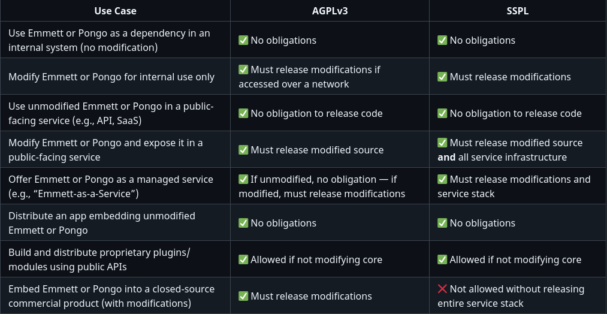

Welcome to the new week!

> Rug pull!

> Open Source drama!

> Yet another License change!

We’re being hit recently by headers on social media. And guess what, I’m also making a similar change in my OSS projects. And let me explain to you why.

**Using my projects as an example, I’ll try to explain to you the current OSS landscape and licensing details. And why you should care!**

## What's the story, Morning Glory?

I propose dual licensing Emmett and Pongo under [AGPLv3](https://www.gnu.org/licenses/agpl-3.0.html) and [SSPL](https://www.mongodb.com/legal/licensing/server-side-public-license). Users choose which license suits their needs. The intention is to establish clear, flexible licensing for users and due diligence to prevent exploitation, enabling a sustainable model for maintainers.

## Problem

Emmett has no license by design. Without an explicit license, anyone wanting to use it should ask permission or clarification. This was intentional, but not for gatekeeping. I didn't actually enforce that on anyone.

I kept it this way to avoid the trap of starting with a permissive license and later changing terms, which communities see as _["rug pull"](https://redmonk.com/jgovernor/2024/09/13/open-source-foundations-considered-helpful/)_.

Pongo uses Apache 2.0, allowing anyone, including cloud providers, to take the code, wrap it in their services, and sell access without contributing back.

From the beginning, I've been transparent: to work on Emmett and Pongo properly, I need to make them sustainable. This isn't theoretical. I maintained Marten for years, and despite its success, I couldn't make it financially sustainable. Licensing won't make it sustainable, so I don't plan to provide a paid license for the core code, but it's due diligence to set the right legal foundations.

Now, with contributors who've put significant work into these projects, I need to formalise a structure that's fair to them while creating the sustainability I've always said I needed.

## Background: The Pattern of Exploitation

The current Open Source model assumes symmetry between all users. But as David Whitney argues, in his NDC talk "Open-Source Exploitation", when there's a power imbalance between the largest organisations in the world and someone putting code on the internet, the organisation always benefits. When the OSI insists that cloud providers deserve equal treatment to individual developers, it forces projects into defensive positions.

The database world has experienced this firsthand:

### MongoDB's Stand (2018)

MongoDB thrived under AGPL until cloud vendors began offering MongoDB as a commercial service, keeping all revenue without contributing back. [MongoDB created SSPL with the intent](https://techcrunch.com/2018/10/16/mongodb-switches-up-its-open-source-license/): if you offer our database as a service, open source your entire service infrastructure or pay us.

AWS built DocumentDB, a proprietary MongoDB-compatible database. MongoDB protected itself but lost AWS as a user. They remain SSPL-only, never adding back an OSI-approved option.

### Elastic's Confrontation (2021)

Elastic's case reveals deeper issues. AWS offered Elasticsearch as a managed service and using the project name. Besides the similar sustainability issue as MongoDB had, that also created the confusion. The responsibility for fixes were conflated, and too often Elastic was blaimed for the issues that were specific to AWS Managed service.

The relationship deteriorated. Elastic switched from Apache 2.0 to dual licensing under SSPL and their proprietary Elastic License. AWS forked Elasticsearch to create OpenSearch, maintaining the Apache 2.0 license.

But here's the twist: [in 2024, Elastic added AGPLv3 as a third license option](https://ir.elastic.co/news/news-details/2024/Elastic-Announces-Open-Source-License-for-Elasticsearch-and-Kibana-Source-Code/default.aspx).

### Redis's Preemption (2024)

Similar twist happened to Redis. In March 2024, they [switched from BSD to dual licensing under SSPL and RSALv2](https://redis.io/blog/redis-adopts-dual-source-available-licensing/). Within weeks, the Linux Foundation announced Valkey, a Redis fork backed by AWS, Google, and others.

In 2025, [Redis added AGPLv3 with Redis 8, integrating features from their previously commercial Redis](https://www.theregister.com/2024/03/22/redis_changes_license/).

The pattern becomes clear.

### Why the Return to Open Source?

Elastic and Redis (but not MongoDB) added AGPLv3 after their license changes. Two reasons:

First, SSPL isn't recognised as open source by the OSI because it discriminates against offering software as a service. The OSI maintains that open source must treat all users equally—even when those users are trillion-dollar companies exploiting smaller projects.

Second, strategy. AGPLv3 allows projects to incorporate improvements from forks legally. You can't take BSD-licensed code from Valkey and add it to SSPL Redis. But between compatible copyleft licenses? That works. Yes, also if there's more than one license for the same code.

The dual licensing trend represents adaptation to this reality. It's not ideal, but it's pragmatic.

## The Licenses Explained

### Permissive Licenses: The Current Problem

Apache 2.0, MIT, and BSD say: take this code, do whatever you want, just give attribution. This generosity becomes vulnerability when cloud providers monetise your work without reciprocating.

### AGPLv3: Network Copyleft

[AGPLv3](https://www.gnu.org/licenses/agpl-3.0.html) extends GPL's copyleft to network use. If you modify AGPLv3 software and users interact with it over a network, you must provide the source code of your modifications.

"Users interacting over a network" means any service where users access the functionality—web applications, APIs, any network protocol. This applies only to modifications of the licensed software itself.

Many developers misunderstand this. They believe AGPLv3 requires open sourcing their entire application. It doesn't. If you build a banking system using Emmett, your business logic remains proprietary. Only if you modify Emmett's core event sourcing engine and expose that modified version as a service would you need to share those Emmett modifications.

### SSPL: Explicit Service Protection

[SSPL](https://www.mongodb.com/legal/licensing/server-side-public-license) takes AGPLv3 and replaces Section 13. The new text:

> if you make the functionality of the software available to third parties as a service, you must release the "Service Source Code"—all management software, user interfaces, APIs, automation, monitoring, backup systems, storage software, hosting software.

If AWS (or any other company) wants to offer "Emmett-as-a-Service," they'd need to open source their AWS infrastructure used to run it. For normal usage—building applications—SSPL behaves exactly like AGPLv3.

### The Fair-Code Movement

[Fair-code](https://faircode.io/) describes software that is free to use, has source code available, can be modified and distributed, but includes commercial restrictions. As [n8n explains](https://www.skool.com/content-academy/are-you-using-n8n-open-source-did-you-know-this), cloud providers capture value created by open source projects with little return to the original developers.

N8n created the [Sustainable Use License](https://docs.n8n.io/sustainable-use-license/), acknowledging that open source doesn't mean fair. Fair-code isn't a software license but a model where software is free to use and distribute, but commercially restricted by its authors.

We don't want a scenario like that:

This is not fair to anyone and is highly dangerous to users. From both the service continuity and [security perspectives](https://en.wikipedia.org/wiki/XZ_Utils_backdoor).

## The Proposal

Dual license Emmett and Pongo under AGPLv3 and SSPL. Users choose:

**AGPLv3 if**:

-   Your organization requires OSI-approved licenses,

-   You understand and accept network copyleft,

-   You want maximum compatibility with OSS tooling.

**SSPL if**:

-   You worry AGPLv3 might require open sourcing your application (it doesn't, but SSPL makes this clearer),

-   You want explicit protection that using Emmett/Pongo doesn't affect your application code,

-   You prefer the strongest terms.

This is explicitly pro-user. Those preferring OSI-approved licenses choose AGPLv3. Those wanting clearer terms choose SSPL. Those licences ensure that the core code of Emmett and Pongo remains open.

## Implementation

### License Files

There will be added License files explaining the licensing.

-   LICENSE-AGPL.txt ([GNU AGPLv3](https://www.gnu.org/licenses/agpl-3.0.txt))

-   LICENSE-SSPL.txt ([MongoDB SSPL](https://www.mongodb.com/legal/licensing/server-side-public-license))

-   LICENSE.md explaining dual licensing and selection

### Contributor License Agreement

To contribute code to Emmett or Pongo, people will need to sign a Contributor License Agreement. This ensures legal clarity and protects both contributors and maintainers. The key terms of the CLA are:

1.  **Rights Granted** - contributors grant the project a license to use, modify, and distribute your contributions under both AGPLv3 and SSPL. This allows users to choose either license and ensures consistency across the codebase.

2.  **Copyright** - Contributors retain full copyright over their contributions. The project does not take ownership of your work. Attribution will be maintained as required by both licenses.

3.  **Future License Options** - Contributors allow the project to add additional licenses in the future, provided your contribution remains available under AGPLv3 and SSPL. This flexibility enables adaptation to changing legal or strategic needs while preserving existing license paths.

4.  **Contributor Protection** - The CLA does not allow the project to relicense your work under more permissive or proprietary terms unless explicitly stated and agreed upon. The CLA applies only to the specific contributions you submit to this project.

**Why the CLA Is Needed?**

-   It ensures clear legal rights for all users of the code under both licenses.

-   It protects contributors from unintended license violations or uncertainty.

-   It supports a long-term strategy of sustainability and legal defensibility.

A link to the full CLA text will be provided in the project repository. Signing the CLA is required before pull requests can be merged. There will be CLA bot added to the GH pull request process.

## Sustainability Model

### Open Source Core

Emmett and Pongo core remains free under AGPLv3/SSPL. No gatekeeping for regular users.

### Paid Products

To fund development and make Emmett and Pongo sustainable, I plan to provide additional paid products and services. For instance:

-   Advanced tooling for observability, troubleshooting and monitoring,

-   Web UI for project documentation, messages visualization,

-   Advanced multitenancy, security and other enterpise features,

-   Additional integrations with Cloud/AI/ML tooling.

The separation clarifies responsibilities. Open source means community-supported. Paid means I'm accountable for maintenance and support.

I also want to offer support services and paid features prioritisation. But that can come under the regular contract terms.

## Personal Context

I maintained Marten for years. Despite adoption and success, I couldn't make it sustainable. Good intentions don't pay bills.

With Emmett and Pongo, I've been transparent from the start: these need to be sustainable for me to focus on them. Keeping Emmett unlicensed was deliberate, avoiding the permissive-to-restrictive transition that breaks trust.

Now, with meaningful community contributions, I'm formalising what I've always intended: a structure that's fair to contributors while enabling sustainable development.

## Risks and Trade-offs

### Fork Risk

Cloud providers may fork rather than negotiate. Valkey shows this is real. But maintaining forks requires resources and community work. They will need at least expose it as an open source, so we could get the improvements back..

### Adoption Barriers

Some organisations prohibit AGPL or SSPL. The dual approach maximises compatibility, but some potential users will be lost. Better sustainable development with narrower adoption than broad adoption of an abandoned project.

### Complexity

Two licenses can create confusion. Clear documentation and decision trees help, but they add friction. That's also why we're doing it transparently as an RFC.

### Trust

Even with transparency from the start, formalising licenses after contributions creates tension. The CLA process may deter some contributors.

## FAQ

### Can I choose either license for any use case?

Yes. You may choose to comply with either AGPLv3 or SSPL. You only need to comply with one license. The choice depends on your use case, compliance requirements, and comfort with the license terms.

### Do I have to open source my entire application if I use Emmett or Pongo under AGPLv3?

No. AGPLv3 requires you to open source modifications to Emmett or Pongo themselves if users interact with those modified versions over a network. Your application logic, domain models, and other services remain yours. You are not required to open source your entire stack.

### Can I write plug-ins or extensions to Emmett/Pongo and keep them proprietary?

Yes, if your plug-ins are separate modules that use public interfaces and do not modify the Emmett/Pongo codebase directly, you may keep them proprietary. However, if your extension modifies core internals or you redistribute a modified version, the license obligations may apply.

### Why offer SSPL if AGPLv3 already provides protection?

SSPL makes the service-use restrictions more explicit and comprehensive. It removes ambiguity around what counts as a modification, and helps organisations that want stronger language around SaaS offerings without worrying about copyleft infecting unrelated application code.

### What does SSPL require that AGPLv3 does not?

SSPL extends the copyleft obligation: if you offer Emmett or Pongo as a service to third parties, you must open source not only modifications to Emmett or Pongo, but all the infrastructure code used to run that service—monitoring, orchestration, authentication, deployment scripts, UI dashboards, etc. For internal use or building apps with Emmett/Pongo, SSPL behaves like AGPLv3.

### What counts as a "modification" under AGPLv3 and SSPL?

A modification includes direct changes to Emmett or Pongo source code - e.g., altering the event store engine, changing how projections work, or rewriting part of the message pipeline. Plug-ins or separate modules that interact with Emmett/Pongo through stable interfaces are generally not considered modifications, but consult legal counsel if uncertain.

### Is this open source?

Yes. AGPLv3 is an OSI-approved open source license. SSPL is source-available but not OSI-approved. The project remains open for use, modification, and distribution under AGPLv3.

## Conclusion

This dual licensing addresses goals I've had from the beginning: creating sustainable development conditions while keeping projects accessible to everyone but also preventing my (and other contributors)’) work from exploitation.

Will it work? MongoDB protected itself but faces ongoing community friction. Elastic and Redis found a middle path but spawned major forks. Projects staying permissively licensed often struggle with sustainability or watch cloud providers profit from their work.

I'm choosing to formalise now what I've always planned, with community input. The alternative—continuing without proper licensing or choosing permissive licenses—guarantees either abandonment or exploitation.

This isn't about getting rich or rug pull. It's about creating conditions where these projects can survive in the long term, serving users and enabling me to get the full focus on them. This is the intended win-win for both sides.

**I hope that this summary will also be helpful for you, even if you’re not planning to use Emmett or Pongo, and it will explain to you a bit more on the current OSS landscape.**

You can comment either here or through the RFC published in the Emmett repository: [https://github.com/event-driven-io/emmett/pull/260](https://github.com/event-driven-io/emmett/pull/260).

Feel also invited to join our [Discord Channel](https://discord.gg/fTpqUTMmVa) if you prefer chat.

Thank you in advance!

Cheers!

Oskar

p.s. **Ukraine is still under brutal Russian invasion. A lot of Ukrainian people are hurt, without shelter and need help.** You can help in various ways, for instance, directly helping refugees, spreading awareness, and putting pressure on your local government or companies. You can also support Ukraine by donating, e.g. to the [Ukraine humanitarian](https://savelife.in.ua/en/donate/) organisation, [Ambulances for Ukraine](https://www.gofundme.com/f/help-to-save-the-lives-of-civilians-in-a-war-zone) or [Red Cross](https://redcross.org.ua/en/).
