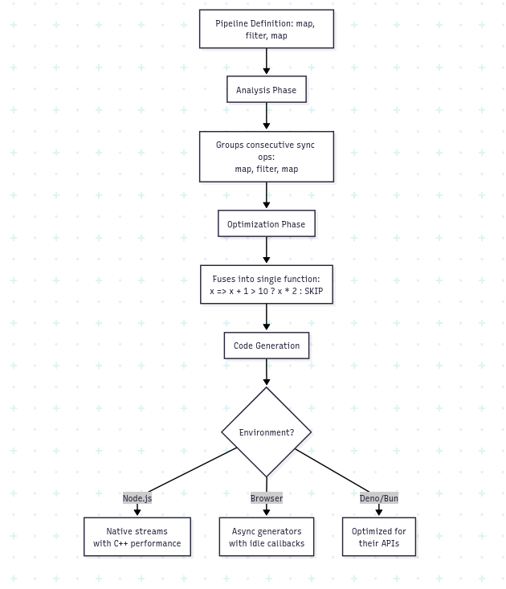

Welcome to the new week!

What does this streaming pipeline have to do with a programming language compiler?

```typescript
const deliveryPipeline = pipe(
  Async.map(async order => {
    const restaurant = await fetchRestaurantDetails(order.restaurantId);
    return { ...order, restaurant, timestamp: Date.now() };
  }),
  filter(order => order.restaurant.isOpen),
  Async.map(async order => {
    const [driver, route] = await Promise.all([
      findNearestDriver(order.restaurant.location),
      calculateRoute(order.deliveryAddress, order.restaurant.location)
    ]);
    return { ...order, driver, route };
  }),
  map(order => ({
    ...order,
    estimatedTime: order.route.duration + order.restaurant.prepTime
  }))
);
```

At first glance? Nothing!

This looks like a typical functional pipeline that processes food delivery orders. But here's what actually happens when you run this code: these operations don't execute immediately. Instead, they create a description of what should happen - a data structure that represents your intent. Then, a compiler transforms this description into optimised code tailored to your specific JavaScript environment.

This separation between declaring what you want and how it executes is the same fundamental principle that powers programming language compilers. When you write `int x = 5 + 3` in C, the compiler doesn't just translate it word-for-word to assembly. It might optimise it to `int x = 8`, or eliminate it entirely if `x` is never used. The compiler understands your intent and finds the best way to achieve it.

This same principle can apply to streaming pipelines. The pipeline definition above would just be data - a series of step descriptions. The actual execution would depend on where and how you run it.

## The JavaScript _Beautiful_ Mess

JavaScript's ecosystem perfectly illustrates why we need this approach. [Node.js has had streams](https://nodejs.org/api/stream.html) since the beginning - they're fast, battle-tested, and deeply integrated with the runtime. They power everything from file I/O to HTTP. But Node.js streams don't exist in browsers. Instead, browsers implement the [Web Streams standard](https://streams.spec.whatwg.org/) - a completely different API with different behaviour, different backpressure mechanisms, and different performance characteristics.

You might think:

> _"Great, let's use Web Streams everywhere since Node.js added support for them."_

But here's the reality: [Web Streams in Node.js](https://nodejs.org/api/stream.html) are a compatibility layer, not a native implementation. They're slower than Node.js streams, sometimes significantly so. The [polyfill for environments](https://github.com/MattiasBuelens/web-streams-polyfill) that don't support Web Streams? It's not fully compliant and has its own performance issues.

A naive implementation would force an impossible choice. Use Node.js streams, and your code won't run in browsers. Use Web Streams, and you sacrifice performance in Node.js. Use async generators as a lowest common denominator, and you lose the benefits of native streaming entirely. Try to support everything with runtime checks, and you end up with:

```typescript
async function processStream(source) {
  if (typeof window !== 'undefined' && source instanceof ReadableStream) {
    // Web Streams path
    const reader = source.getReader();
    // ... different processing logic
  } else if (source && typeof source.pipe === 'function') {
    // Node.js streams path  
    // ... completely different API
  } else if (Symbol.asyncIterator in source) {
    // Async generator fallback
    // ... yet another approach
  }
  // ... and this is just the beginning
}
```

This code quickly becomes unmaintainable. Each code path needs its own error handling, backpressure management, and performance optimisations. Worse, you can't easily apply optimisations like operation fusion because the implementations are so different.

As I explored in [my article about TypeScript's performance](/en/typescript-migrates-to-go-whats-really/), the key to JavaScript performance is keeping the event loop spinning and leveraging native APIs. But when those native APIs are incompatible across environments, we need a different approach.

This is where compilation comes in. Instead of writing environment-specific code, we write a description of what we want to happen. A compiler then transforms this description into the optimal implementation for each environment. Same API, different execution. Write once, optimise everywhere.

I'm building this approach into [Emmett](https://event-driven-io.github.io/emmett/getting-started.html)'s event processing system. **Let’s call it codename** _**FusionStreams**_**.**

As I outlined in [my workflow engine design](/en/workflow-engine-design-proposal-tell/), modern event-driven systems need to handle complex workflows - not just simple event handlers, but multi-step processes with error handling, compensation, and state management. These workflows need to run efficiently whether they're processing events on a server, updating projections in a browser, or handling commands at the edge.

## How Compilers Actually Work

Understanding how FusionStreams could work requires building it from the ground up. First, operations need representation as data:

```typescript
interface Step {
  type: string | symbol;
  fn?: Function;
  options?: any;
  isSync?: boolean;
}
```

When you write `map(x => x * 2)`, it doesn't execute anything. It returns a step description. This is crucial - by delaying execution, we can examine the entire pipeline before running it. We can see patterns and opportunities for optimisation that would be invisible if we executed operations immediately.

**The compilation process transforms these step descriptions into executable functions.** Traditional compilers work in phases:

-   lexical analysis,

-   parsing,

-   semantic analysis,

-   optimisation,

-   and code generation.

Our streaming compiler follows similar principles but is simpler.

During the analysis phase, the compiler examines the pipeline structure. It identifies consecutive synchronous operations, async boundaries, and error handling points. This is where the first major optimisation happens - sync operation fusion.

Consider this sequence:

```text
map(x => x + 1)
filter(x => x > 10)  
map(x => x * 2)
```

A naive implementation would create three function calls for each item, allocating intermediate objects and jumping between functions. The compiler recognises these are all synchronous and fuses them into a single operation. Instead of three function calls, you get one tight loop. No intermediate allocations. The event loop keeps spinning.

**This optimisation is only possible because we separated declaration from execution.** If each operation were executed immediately, we couldn't see the pattern. This is exactly how modern language compilers work - they analyse entire programs to find optimisation opportunities that aren't visible when looking at individual statements.

Early programmers wrote assembly directly. They counted cycles, allocated registers by hand, and knew exactly what the CPU would execute. As programs grew from hundreds to millions of lines, this approach collapsed under its own weight.

High-level languages offered an escape, but early compilers were disappointingly literal. They translated your C code line-by-line into assembly, producing results that ran slower than hand-optimised code. Programmers faced an uncomfortable choice: write maintainable code that ran slowly, or write fast code that was impossible to maintain.

**Modern compilers changed this equation. They don't translate - they analyse and transform.** When you write a for-loop that adds numbers, the compiler might recognise the pattern and replace it with a multiplication. It might notice your loop accesses memory sequentially and generate vector instructions. Or it might determine the result at compile time and replace the entire loop with a constant.



Each phase transforms the pipeline further from its declarative form into executable code. The analysis phase groups operations and identifies optimisation opportunities. The optimisation phase applies transformations like operation fusion. The code generation phase produces the final executable form tailored to the runtime environment.

**This evolution from direct execution to analysed transformation appears everywhere in software:**

-   **Java took this idea further with Just-In-Time compilation.** Your Java code compiles to bytecode, which the JVM then compiles again to machine code while your program runs, optimising based on actual usage patterns.

-   **Database query planners are compilers too.** They transform declarative SQL into execution plans, choosing between nested loops, hash joins, or merge joins based on table statistics and available indexes.

-   **.NET's LINQ doesn't execute queries directly.** When you write `customers.Where(c => c.City == "London").Select(c => c.Name)`, it builds an expression tree. The LINQ provider then compiles this tree - to SQL for databases, to objects for in-memory collections, or to web service calls for remote data.

-   **React's new compiler analyses your components to understand data flow and dependencies.** It then generates optimised code that eliminates unnecessary re-renders by compile-time analysis of which props actually affect rendering.

Each system recognised that separating "what you want" from "how to do it" enables optimisations impossible with direct execution. FusionStreams applies this same principle to streaming pipelines.

## From Theory to Implementation

Let's see how this works with a more complex operation. When processing multiple async operations, you might naturally reach for parallel execution:

```text
Async.map(async order => {
  const [driver, route] = await Promise.all([
    findNearestDriver(order.restaurant.location),
    calculateRoute(order.deliveryAddress, order.restaurant.location)
  ]);
  return { ...order, driver, route };
})
```

This works, but what happens when you need to process thousands of orders? Without concurrency control, you might overwhelm your services. You may replace it later with a new operator mapParallel for processing multiple items in parallel, passing multiple functions returning promises. The compiled version could then manage a pool of concurrent operations, reuse resources, and adapt its strategy based on the environment.

In Node.js, it might use worker threads for CPU-intensive operations. In a browser, it might use Web Workers or carefully time-slice execution to avoid blocking the UI. The declaration would stay the same, but the execution adapts.

**One powerful aspect of this approach would be extensibility.** Because operations are just data structures, users could define their own operations and register compilers for them.

For instance, real-world streaming pipelines rarely follow a simple linear flow. They branch, merge, and coordinate complex operations. The fanout pattern shows how compilation enables these sophisticated patterns while maintaining performance. When processing a food delivery order, you need to notify the kitchen, find a driver, and process payment simultaneously:

```text
fanout({
  kitchen: pipe(
    Async.map(order => notifyKitchen(order)),
    Sync.map(response => ({
      orderId: order.id,
      prepTime: response.estimatedMinutes
    }))
  ),

  driver: pipe(
    Async.map(order => findDriver(order.restaurant.location))
  ),

  payment: pipe(
    Async.map(order => chargePayment(order.payment))
  )
})
```

During compilation, this pattern transforms based on the environment's capabilities. If worker threads are available, each branch might run in true parallel. Without them, the compiler might use Promise.all for concurrent execution. In memory-constrained environments, it might process branches sequentially. The same declaration compiles to different strategies.

Want rate limiting? Define what it means declaratively, then provide compilers that implement it efficiently for each environment.

```typescript
const RATE_LIMIT = Symbol('rateLimit');

function rateLimit(requestsPerSecond: number): Step {
  return {
    type: RATE_LIMIT,
    options: { requestsPerSecond },
    isSync: true
  };
}
```

The rate-limiting compiler could use token buckets in memory for single-instance Node.js apps, Redis for distributed systems, or localStorage in browsers. The pipeline definition wouldn't change - only the compilation target.

Naive implementation could work as:

```typescript
builder.registerSyncCompiler(RATE_LIMIT, (step) => {
  const { requestsPerSecond } = step.options;
  let tokens = requestsPerSecond;
  let lastRefill = Date.now();

  return (item) => {
    const now = Date.now();
    const elapsed = (now - lastRefill) / 1000;
    tokens = Math.min(requestsPerSecond, tokens + elapsed * requestsPerSecond);
    lastRefill = now;

    if (tokens >= 1) {
      tokens -= 1;
      return item;
    }

    return {
      result: {
        ok: false,
        error: new Error(`Rate limit exceeded: ${requestsPerSecond} requests/second`)
      },
      context: item.context
    };
  };
});
```

**This extensibility would transform the system from a fixed library into a compilation framework.** Domain-specific operations could compile to efficient implementations. A database operation could compile to use connection pooling in Node.js but IndexedDB transactions in browsers. A caching operation could use Redis in production but memory in development.

## TLDR

**Building event-driven systems that work across various JavaScript environments presents a specific technical challenge.** Each environment has different APIs and performance constraints. The traditional solution - writing environment-specific code or using compatibility layers - leads to either maintenance headaches or performance compromises.

Compilation offers a different trade-off. By treating pipeline definitions as data to be transformed rather than code to be executed, you can generate environment-specific implementations from a single source. The complexity moves from runtime to build time, where it can be managed systematically.

**This approach works because it acknowledges that abstraction and performance don't have to conflict - they conflict when the abstraction exists at runtime.**

A compiler can understand that three consecutive map operations should become one function, that Node.js should use native streams while browsers use web streams, or we can fallback to async generators. These optimisations are mechanical transformations, not clever hacks.

The same pattern appears whenever systems process declarative definitions. SQL becomes query plans. GraphQL becomes resolver calls. Configuration becomes lookup tables. In each case, the transformation from declaration to execution provides an opportunity for optimisation that interpretation can't match.

For event-driven architectures, where the same business logic might run in vastly different contexts with vastly different performance requirements, this separation becomes essential. The alternative is maintaining multiple implementations or accepting suboptimal performance.

**Compilation provides a third path: write the logic once, optimise for each target when you need it.**

Cheers!

Oskar

p.s. **Ukraine is still under brutal Russian invasion. A lot of Ukrainian people are hurt, without shelter and need help.** You can help in various ways, for instance, directly helping refugees, spreading awareness, and putting pressure on your local government or companies. You can also support Ukraine by donating, e.g. to the [Ukraine humanitarian](https://savelife.in.ua/en/donate/) organisation, [Ambulances for Ukraine](https://www.gofundme.com/f/help-to-save-the-lives-of-civilians-in-a-war-zone) or [Red Cross](https://redcross.org.ua/en/).
