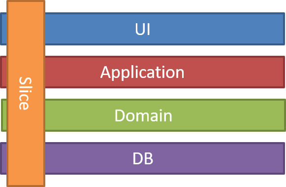
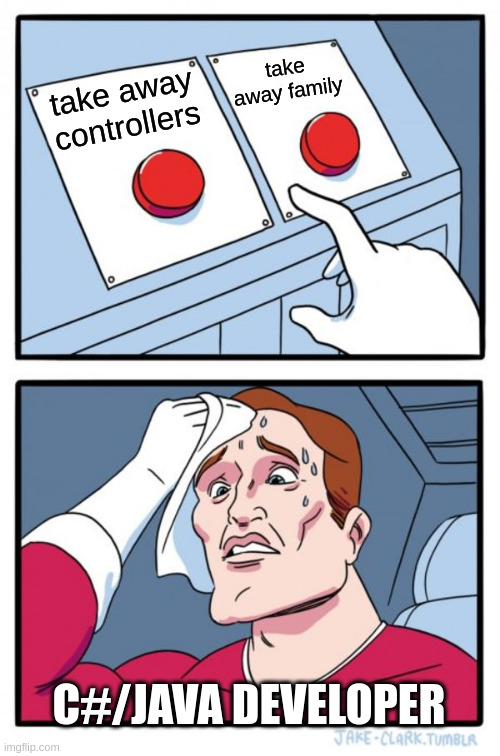

Welcome to the new week!

Vertical Slices in software architecture are pictured right now as the best thing since sliced bread. I won’t try to hide that, like it. I've written about CQRS and Vertical Slices over the years - [how to slice the codebase effectively](/en/how_to_slice_the_codebase_effectively/), shown [examples](/en/vertical_slices_in_practice/), and explained why [generic doesn't mean simple](/en/generic_does_not_mean_simple/), yet…

I still get questions about Vertical Slices Architecture (VSA). After a recent Discord discussion, I want to share some additional thoughts on how I see Vertical Slices Architecture, how it relates to CQRS, what different slicing strategies are, and (of course) the tradeoffs.

## What Vertical Slices Architecture actually is

Funnily, many people using the Vertical Slices term don’t even know who coined it. Jimmy Bogard did it. In the [original article](https://jimmybogard.com/vertical-slice-architecture/) contrasts traditional layered architecture with vertical organisation:

> _"In this style, my architecture is built around distinct requests, encapsulating and grouping all concerns from front-end to back. You take a normal "n-tier" or hexagonal/whatever architecture and remove the gates and barriers across those layers, and couple along the axis of change."_

He showed the famous image:



When you add or change a feature, you're touching many different layers - the UI, the models, the validation, the data access. Instead of spreading these changes across multiple horizontal layers, you could group everything related to that feature. As Jimmy puts it:

> _"Minimize coupling between slices, and maximize coupling in a slice."_

So Instead of:

```text
📁 controllers
  📄 ProductController.cs
  📄 OrderController.cs
📁 services  
  📄 ProductService.cs
  📄 OrderService.cs
📁 repositories
  📄 ProductRepository.cs
  📄 OrderRepository.cs
```

You organise more or less like:

```text
📁 ecommerce
  📁 products
    📁 create-product
      📄 createProduct.cs
      📄 createProductHandler.cs
    📁 update-product
      📄 updateProduct.cs  
      📄 updateProductHandler.cs
```

Each vertical slice can decide for itself how to best fulfil the request. Simple CRUD? Use a transaction script. Complex domain logic? Bring in aggregates and domain services. The architecture doesn't force a one-size-fits-all approach.

## Why I think VSA is rebranded CQRS

For me, Vertical Slices Architecture is essentially CQRS with more prescriptive guidance on how to cut your architecture.

Let's look at what CQRS actually says. [Greg Young's original definition](https://cqrs.wordpress.com/wp-content/uploads/2010/11/cqrs_documents.pdf) is simple:

> _"**Command and Query Responsibility** Segregation uses the same definition of Commands and Queries that Meyer used and maintains the viewpoint that they should be pure. The fundamental difference is that in CQRS objects are split into two objects, one containing the Commands one containing the Queries."_

Ok, well, it’s simple but can be confusing. What are those “objects”? Data structures? Tables? Nay, they’re services that are handling specific business requests. We should segregate handling into commands and queries. Commands run business logic, and queries return data without causing side effects (so no-no to state change).

Essentially, CQRS is an architecture pattern explaining how to structure our application based on the behaviour. (Read more of my thoughts in [CQRS facts and myths explained](/en/cqrs_facts_and_myths_explained/)).

And hey, wait! Isn't that already a vertical slice? Each command or query handler contains everything needed to process that specific request. The handler might talk directly to the database, or use domain objects, or call external services. The choice is encapsulated within that slice.

**The difference is that VSA is more explicit about this organisational principle and extends it beyond just the command/query split.**

It says: Don't just separate commands and queries, organise your entire codebase this way. Put the API endpoints, the validation, the business logic, and even the data access for a specific feature all in one place.

In my experience, when you properly apply CQRS, you naturally drift towards Vertical Slices. The patterns reinforce each other. CQRS gives you the conceptual split (commands vs queries), and VSA gives you the organisational principle (group by feature, not by technical concern).

## Two approaches to slicing

During our Discord discussion, I found myself drawing diagrams to explain two different approaches I've seen teams use successfully. Let me share them with concrete examples.

### Approach 1: Pure vertical slices

In this approach, each slice is completely self-contained:

```text
📁 room-reservations
  📁 reserving-room
    📄 reserveRoomEndpoint.ts    // ⬅️ API endpoint definition
    📄 reserveRoom.ts            // ⬅️ Business logic
  📁 confirming-reservation
    📄 confirmReservationEndpoint.ts
    📄 confirmReservation.ts
  📁 cancelling-reservation
    📄 cancelReservationEndpoint.ts
    📄 cancelReservation.ts
```

The endpoint file handles HTTP concerns and application logic:

```typescript
app.post('/api/reservations/:id/confirm', async (req, res) => {
  const reservation =
    await reservationRepository.findById(req.params.id);

  const confirmedReservation =
    confirmReservation(
      reservation,
      mapToCommand(req)
    );

  await reservationRepository.save(confirmedReservation);

  res.status(200);
});
```

The business logic is pure:

```typescript
function confirmReservation(
  reservation: Reservation,
  command: ConfirmReservation
) {
  const { confirmedAt, confirmedBy } = command;

  if (reservation.status !== 'pending') {
    throw new Error('Only pending reservations can be confirmed');
  }

  // some other business logic if needed

  return {
    ...reservation,
    status: 'confirmed',
    confirmedAt,
    confirmedBy,
    requiresPayment: daysBetween(new Date(), reservation.from) < 7
  };
}
```

Splitting the endpoint from business logic gives you:

1.  **Testing** - You can test business logic without any dependencies. Just pass data in, assert on the result.

2.  **Reusability** - The same business logic can be triggered from different sources (HTTP, message queue, CLI).

3.  **Focus** - The endpoint deals with infrastructure (database, external services). The handler deals with business rules.

4.  **Evolution** - When business logic grows complex, it's already separated and ready to expand.

If you need to extract this into a microservice, you copy the folder. Everything related to confirming reservations is in one place.

### Approach 2: Slices with a thin coordination layer

Sometimes you need some coordination - maybe all your reservation endpoints share authentication logic, or you want consistent URL patterns. Or maybe you’re a C# or Java developer, and taking away controllers is as hard (or harder) than taking your family away from you:



In this case, you might have:

```text
📁 room-reservations
  📁 api
    📄 reservationsController.ts // ⬅️ Thin routing layer
  📁 reserving-room
    📄 reserveRoom.ts            // ⬅️ Business logic
  📁 confirming-reservation
    📄 confirmReservation.ts
  📁 cancelling-reservation
    📄 cancelReservation.ts
```

The routes file acts as a facade, handling HTTP concerns and orchestration:

```typescript
export const reservationController = (app: Express) => {
  app.use('/api/reservations', authenticate);

  app.post('/api/reservations/:id/confirm', async (req, res) => {
    const reservation =
      await reservationRepository.findById(req.params.id);

    const confirmedReservation =
      confirmReservation(
        reservation,
        mapToCommand(req)
      );

    await reservationRepository.save(confirmedReservation);

    res.status(200);
  });

  // Other endpoints follow similar pattern
};
```

The business logic remains pure in each slice. The facade is purely about the entry point for the application logic and HTTP handling, while business logic stays in individual slices.

This facade serves several purposes:

-   It provides a consistent URL structure for all reservation operations

-   It handles cross-cutting concerns like authentication in one place

-   It maps HTTP concerns (status codes, headers) away from business logic

-   It makes it easier to see all available operations at a glance

**But notice - the facade is thin. It's not a "service layer" with business logic.** It's purely about HTTP-to-domain translation. The actual business logic remains in the vertical slices.

**Both approaches have tradeoffs.** The pure slices approach gives you maximum independence - each feature is truly isolated. But you might end up duplicating cross-cutting concerns like authentication or error handling. The facade approach gives you a central place to handle these concerns, but now you have coupling between the facade and the slices.

**Neither approach solves all problems.** With pure slices, you risk turning into a "[feature factory](https://medium.com/nick-tune-tech-strategy-blog/beyond-problem-and-solution-space-better-models-for-modern-product-development-4ad3d5d5cdc4)" where each feature is built in isolation without considering the overall system design. You might lose sight of the broader domain concepts because everything is scattered across independent slices. With the facade approach, you risk the facade growing into a bloated orchestration layer that knows too much about the domain.

The choice depends on your context. If you're building a system where features are truly independent (maybe different teams own different features), pure slices work well. If you need consistency across related operations, a thin facade can help without sacrificing the benefits of vertical organisation.

Jimmy Bogard actually goes further than just backend organisation - he suggests that slices can and should include the UI. A vertical slice can go from the user interface all the way to the database. If the goal is to minimise coupling between features, why stop at the API layer? But the difference in tooling, team skill sets between backend and frontend often makes this challenging, which is why many teams slice vertically on the backend while keeping a more traditional organisation on the frontend.

## CRUD and CQRS are orthogonal

People often ask if VSA or CQRS make sense for CRUD systems. They do. Your commands might be _OnboardUser, UpdateProductDefinition, and CancelSubscription_, but behind the scenes, they could be a typical Create, Update, and Delete implemented with Object-Relational Mapper. Naming is a key thing, as it already establishes a business process behind this action.

**Neither CQRS nor VSA require complex domain logic.** They're structural patterns that work for simple scenarios, too.

I’ve heard dozens of times that CRUD is simpler, and CQRS and VSA bring additional overhead. And I just can’t objectively see that if we follow the basic principles. Why is naming things based on the business process an overhead? Why does reflecting this flow explicitly in the code add additional work?

I understand that requires thinking about what we’re doing, asking business and ourselves: “What is the feature that we want to deliver?”. Still, from my perspective, that’s the thing we’re brought to the game. Building a model to solve the specific business problem. That starts with the naming and the structure.

If we name things closer to the business[,](https://www.youtube.com/watch?v=yV97QwC5gnE) we’re [giving yourself more options for future evolution](https://www.youtube.com/watch?v=yV97QwC5gnE).

At the beginning, things look simple, but when requirements come and the system evolves, quite often the system stops looking like a simple CRUD.

Vertical Slices can help in that, as you already established the split based on the features, start to think about them, but you can keep the implementation simple and evolve when you learn more about your domain.

## Feature folders and nested modules

Speaking about organisation, we should not mistake folder layout with software architecture, but it’s also good if your code reflects the emphasis you make in your design.

**As mentioned, Vertical Slices are focused on the specific business flow, yet… Beyond individual features, you need to organise at a higher level.**

The approaches I've shown so far work well for individual features, but what happens when your system grows? How do you organise dozens or hundreds of features without ending up with a flat, unmanageable structure?

Kamil Grzybek wrote an excellent article about [Feature Folders](https://www.kamilgrzybek.com/blog/posts/feature-folders), where he contrasts technical folders (Controllers, Services, Repositories) with business-focused organisation. His key insight is about cohesion.

**Elements that change together should live together. This principle directly reduces cognitive load.**

When you're working on a reservation feature, you don't need to keep a mental map of where the controller lives, where the service is, or where the repository might be. Everything is in the ReservingRoom folder. As Kamil puts it, this creates high cohesion because _"the elements inside a module belong together."_

In practice, this often means nesting your vertical slices within larger business modules:

```text
📁 reservations
  📁 room-reservations
    📄 api.ts                    // ⬅️ Public API of room reservations
    📁 reserving-room
      📄 reserveRoom.ts
      📄 reserveRoomEndpoint.ts
    📁 confirming-reservation
      📄 confirmReservation.ts
      📄 confirmReservationEndpoint.ts
    📁 cancelling-reservation
      📄 cancelReservation.ts
      📄 cancelReservationEndpoint.ts
  📁 group-reservations
    📄 api.ts                    // ⬅️ Public API of group reservations
    📁 creating-group-reservation
      📄 createGroupReservation.ts
      📄 createGroupReservationEndpoint.ts
    📁 assigning-rooms-to-group
      📄 assignRoomsToGroup.ts
      📄 assignRoomsEndpoint.ts
📁 billing
  📄 api.ts                      // ⬅️ Public API of billing module
  📁 invoicing
    📄 api.ts                    // ⬅️ Public API of invoicing
    📁 generating-invoice
      📄 generateInvoice.ts
      📄 generateInvoiceEndpoint.ts
    📁 sending-invoice
      📄 sendInvoice.ts
      📄 sendInvoiceEndpoint.ts
  📁 payments
    📄 api.ts                    // ⬅️ Public API of payments
    📁 recording-payment
      📄 recordPayment.ts
      📄 recordPaymentEndpoint.ts
    📁 processing-refund
      📄 processRefund.ts
      📄 processRefundEndpoint.ts
```

This creates a hierarchy where:

-   Top-level folders represent major business areas (reservations, billing)

-   Second-level folders represent subdomains or aggregates (room-reservations, invoicing)

-   Leaf folders represent specific use cases (reserving-room, generating-invoice)

The _api.ts_ files act as module boundaries, explicitly defining what's public and what module is exposing and what features it has.

This gives you encapsulation and focuses on the responsibility. Other modules can only use what you explicitly expose. When modules need to communicate, they do so through their public APIs - though you need to be careful about coupling. Direct synchronous calls between modules can create distributed transaction problems.

This gives you encapsulation without requiring separate packages or complex dependency management. Other modules can only use what you explicitly expose. Thus, the facade pattern still has its point with Vertical Slices.

**Such an approach scales naturally.** When you're working on invoicing, you're in the Billing/Invoicing folder. Everything related to invoicing is there. You don't need to jump between technical layers. The reduced cognitive load is dramatic - instead of thinking "where do I put this validation?" you think "I'm working on generating invoices, so it goes in GeneratingInvoice."

This also aligns with team organisation. The billing team owns the Billing folder. The reservations team owns the Reservations folder. Conway's Law works in your favour instead of against you.

## Starting simple

The initial structure matters less than your ability to evolve it.

Start simple. If you're building a proof of concept, don't create elaborate folder hierarchies. But structure your code so that evolution is possible. That's why I like CQRS even for simple systems - it gives you a place to put complexity when it inevitably arrives.

I've seen teams start with pure vertical slices and later add a coordination layer once they've identified patterns. I've seen the reverse, too - starting with controllers and gradually pushing logic into focused handlers. Both paths work because the team could evolve the architecture as they learned more about their domain.

The anti-pattern is the "big design up front" where you create elaborate abstractions for problems you don't have yet. Start with the simplest thing that could possibly work, but keep the path open for evolution.

**From my experience, slicing your code by features pays off much better and reduces the range of change than artificial cross-cutting splits by technical aspects.**

Ok, so why is CQRS and Vertical Slices pictured as such complex beasts?

## Semantic Diffusion: How good ideas get corrupted

[Martin Fowler coined the term](https://martinfowler.com/bliki/SemanticDiffusion.html) _[Semantic Diffusion](https://martinfowler.com/bliki/SemanticDiffusion.html)_ [back in 2006](https://martinfowler.com/bliki/SemanticDiffusion.html), describing what happens when:

> _"you have a word that is coined by a person or group, often with a pretty good definition, but then gets spread through the wider community in a way that weakens that definition."_

He compared it to the children's game where a message gets passed from person to person - each retelling adds distortions until the original meaning is lost. Popular terms suffer from this the most because they create longer chains of reinterpretation.

### How CQRS got diffused

CQRS is a perfect example of semantic diffusion in action. Greg Young's original definition was crystal clear: separate your objects into commands and queries. That's the entire pattern.

Somewhere along the way, CQRS accumulated baggage. Today, if you mention CQRS, people assume you mean:

-   **Two databases** - One for writes, one for reads. Greg never said this. You can do CQRS with a single table if you want.

-   **Event Sourcing** - Yes, they work well together, but CQRS doesn't require events at all. You can update the state directly.

-   **Eventual consistency** - Again, not required. Your read model can be updated synchronously in the same transaction.

-   **Message queues** - Kafka, RabbitMQ, whatever. Nope. You can do CQRS in a single process with direct method calls.

-   **Complex architecture** - People think CQRS means microservices, distributed systems, and architectural astronautics. It doesn't.

The original idea - separate commands and queries - is simple and useful. It's arguably simpler than mixing reads and writes in the same objects. But semantic diffusion has turned it into a boogeyman.

This simplicity enables multiple options and extensions. And that posed the risk we’re facing—the risk of misinterpretation.

### Vertical Slices turn for diffusion

I think that it’s actually good that Jimmy coined a new term instead of reusing CQRS. He (sub?)consciously tried to avoid Semantic Diffusion. But that didn’t help in getting this issue for VSA.

Now I'm watching the same thing happen to Vertical Slices Architecture. Jimmy Bogard's original description was clear: organise code by features, not by technical layers. Couple along the axis of change.

But already the corruption has begun:

-   **"You can't share any code between slices"** - Jimmy never said this. He said to minimise coupling between slices. Minimise isn't zero.

-   **"Every slice must have its own database table"** - Where did this come from? Slices can share storage.

-   **"You must copy-paste everything"** - No. You can extract common patterns when they prove themselves useful.

-   **"You need [MediatR](https://github.com/LuckyPennySoftware/MediatR)"** (in .NET) - VSA is an architectural pattern, not a library choice.

-   **"Slices must have exactly this folder structure"** - Missing the point entirely. The structure should emerge from your needs.

-   **"A vertical slice is an entire module"** - Some people argue that a vertical slice should be an entire business module (like "Billing" or "Inventory"). But Jimmy's original article talks about individual features - specific user requests. A single command or query. The confusion about granularity shows how far we've drifted from the source.

People teaching VSA often haven't read Jimmy Bogard's original article. Some don't even know who coined the term.

Even worse, some communities are developing their own interpretations where vertical slices mean something completely different (e.g. modelling processes).

Each person who retells the pattern adds new constraints, removes important nuances, or changes the meaning to fit their agenda.

### Why semantic diffusion happens

I think semantic diffusion happens because successful patterns attract attention. People want to be associated with them - _"we're doing CQRS"_ sounds more impressive than _"we separated our reads and writes."_ But most people learn about these patterns second or third-hand, and each retelling adds distortions.

The pattern also shifts from principles to prescriptions. Where Greg Young said "separate commands and queries," people hear "you must have two databases." Where Jimmy Bogard said "minimize coupling between slices," people hear "zero shared code allowed." Nuance gets lost in favour of absolute rules that are easier to remember and teach.

Framework authors and tool vendors contribute to this. They build "CQRS frameworks" or "VSA templates" that embed their own opinions and constraints. Soon, people can't distinguish between the pattern and the tool's implementation of it. The original simple idea gets buried under layers of accidental complexity.

Teams reject CQRS because they think it requires eventual consistency. Others implement complex event sourcing and messaging systems when all they needed was to put queries in different files from commands. Instead of asking "what problem are we solving?" teams ask "are we doing real CQRS?" as if there's a certification board checking their implementation.

## Closing thoughts

**Both CQRS and Vertical Slices Architecture are great patterns.** They're even more useful together - CQRS provides the conceptual model (separate commands and queries) while VSA provides the organisational principle (group by feature).

But their usefulness depends on understanding what they actually are, not what common application has made them into.

CQRS is _**just**_ about separating commands and queries. VSA is _**just**_ about organising by feature instead of the technical layer.

**I've noticed that it's easy to contribute to semantic diffusion without realising it.** You solve a hard problem with vertical slices, and suddenly, you're seeing it as the answer for every system. Before you know it, you're adding your own constraints and requirements that weren't in the original.

So next time someone tells you that CQRS requires event sourcing, or that VSA forbids shared code, ask where they read that. Most of the time, they didn't read it anywhere - they just heard it from someone who heard it from someone else.

So my final request is, if you want to learn about the pattern, try to get to the original sources. They're usually shorter and clearer than you think.

For instance:

-   [Greg Young - CQRS Documents](https://cqrs.wordpress.com/wp-content/uploads/2010/11/cqrs_documents.pdf)

-   [Jimmy Bogard - Vertical Slice Architecture](https://www.jimmybogard.com/vertical-slice-architecture/)

`youtube: [Embedded video](https://www.youtube.com/watch?rel=0&autoplay=0&showinfo=0&enablejsapi=0&v=oAoaMlS1PWo)`

Or check my take on CQRS:

`youtube: [Embedded video](https://www.youtube.com/watch?rel=0&autoplay=0&showinfo=0&enablejsapi=0&v=iY7LO289qnQ)`

Cheers!

Oskar

p.s. This article will also be published on [my blog](/en/). In the following weeks, I’m planning to centralise both this newsletter and my blog together. Stay tuned!

p.s. **Ukraine is still under brutal Russian invasion. A lot of Ukrainian people are hurt, without shelter and need help.** You can help in various ways, for instance, directly helping refugees, spreading awareness, and putting pressure on your local government or companies. You can also support Ukraine by donating, e.g. to the [Ukraine humanitarian](https://savelife.in.ua/en/donate/) organisation, [Ambulances for Ukraine](https://www.gofundme.com/f/help-to-save-the-lives-of-civilians-in-a-war-zone) or [Red Cross](https://redcross.org.ua/en/).
