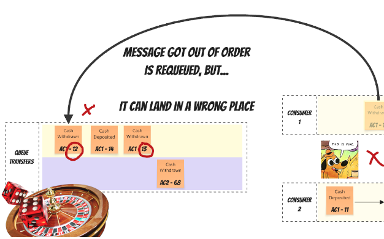
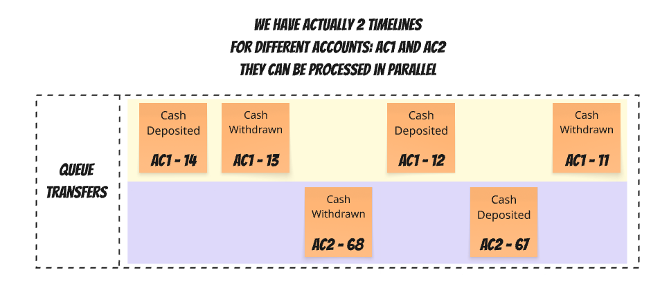
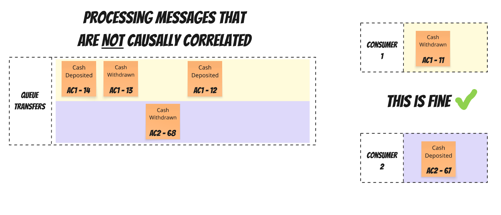
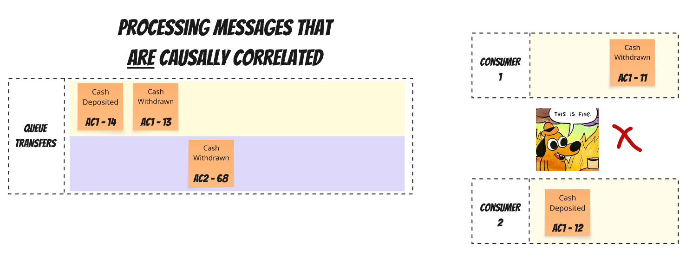
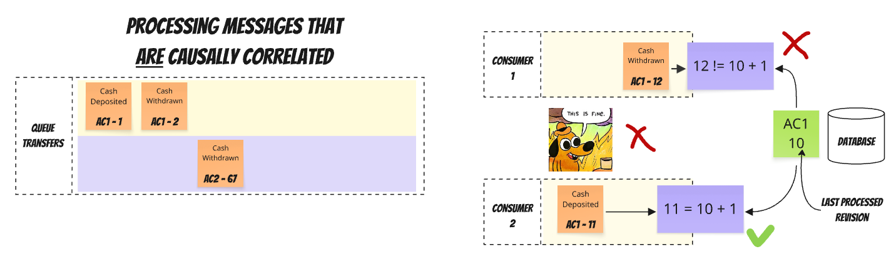
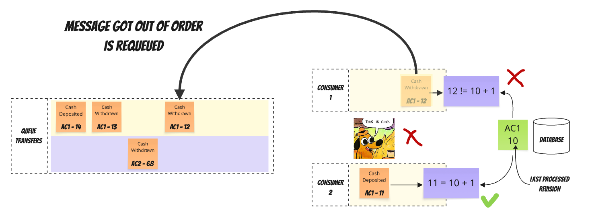
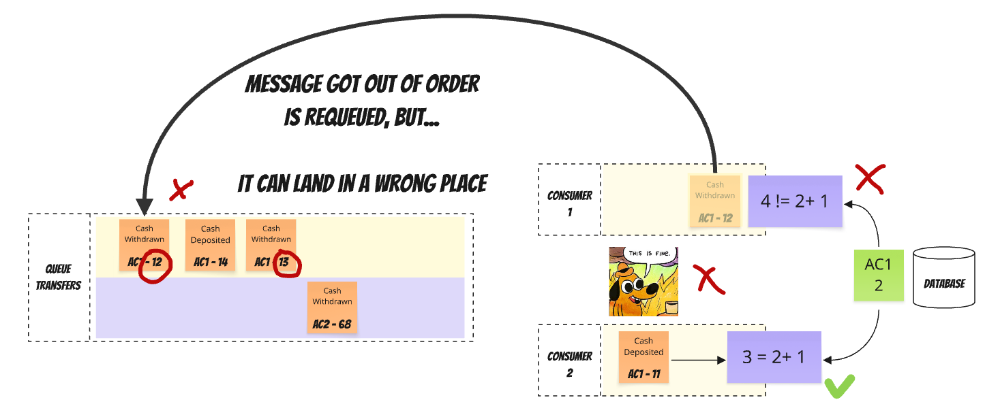

I'm always saying that there's a thin line between good and bad practice, and this thin line is named "Context". 

**That's also true for the (anti-)pattern I'm calling _"Requeuing Roulette"_**. Let's discuss it today, continuing the "race condition series":
- [Dealing with Race Conditions in Event-Driven Architecture with Read Models](/pl/dealing_with_race_conditions_in_eda_using_read_models/),
- [Handling Events Coming in an Unknown Order](/pl/strict_ordering_in_event_handling/).

What's the Requeuing Roulette? As the name suggests, this _technique_ involves putting a message back into the queue. It also (correctly) suggests that we're hoping for the best. And sometimes we may be lucky to be true.

The basic primitive for a messaging system is a queue. The producer is putting messages into the queue, and the consumer is getting them on the other end. If everything goes well, the consumer receives them in the order the producer put them (thus, a queue, like a queue in a shop).

If the consumer is not available, the messaging system will try to deliver messages and handle retries for us. 

We discussed it in detail in: 
- [Queuing, Backpressure, Single Writer and other useful patterns for managing concurrency](https://www.architecture-weekly.com/p/architecture-weekly-190-queuing-backpressure)
- [Ordering, Grouping and Consistency in Messaging systems](https://www.architecture-weekly.com/p/the-order-of-things-why-you-cant)
- [The Order of Things: Why You Can't Have Both Speed and Ordering in Distributed Systems](https://www.architecture-weekly.com/p/the-order-of-things-why-you-cant)
- [Dealing with Eventual Consistency, and Causal Consistency using Predictable Identifiers](https://www.architecture-weekly.com/p/dealing-with-eventual-consistency)

Ordering of processing works if we have a single consumer for a single queue. If we have more than one consumer, we lose the ordering guarantee. Why would we want to have more than one consumer? Obviously, to speed up processing. If messages in the queue are not causally correlated, then we can process them in parallel.

What does the smartass "causally correlated" even mean? For instance:
- depositing money into a bank account is causally correlated to opening it, as we can't deposit money if we don't open it.
- depositing money into a bank account is NOT causally correlated to other deposits, as we can deposit as much money as we have (of course, ignoring weird regulations),
- money withdrawal is causally correlated to depositing money and other withdrawals, as we need to check the balance, and they may impact it.
- Withdrawals and deposits are only causally correlated if they happen on the same bank account; other bank account operations can happen at any time.

You get the idea, aye?

So if we set up a queue to process money transfer events, then it could look as follows:

I assumed that we're following the advice from the [previous article](/pl/strict_ordering_in_event_handling/). Besides the event type and payload, we'd also pass the record revision, which represents the logical order of events. It comes from the number incremented with each change. Assuming we're publishing events after each successful business logic handling, it should be gapless. 

You may notice that our queue actually has multiple timelines for each causally correlated message sequence. If we simplify our considerations and assume that all events from a certain account are causally correlated, then we could visualise them as:

**It's fine** to process events that are **not** causally correlated, as by that we're increasing throughput, not trading off correctness:

But **it's not fine** to process messages from the same timeline in parallel, as we may get race conditions when the consumer processing the earlier message will be slower than the one processing the later message.

**We actually have two orders in messaging systems:**
1. **Queue Order:** The order messages are produced to the queue
2. **Processing Order:** The order messages are actually consumed and processed.

We already learned that we can detect the out-of-order processing by:
- [business rules or](/pl/dealing_with_race_conditions_in_eda_using_read_models/),
- [detecting the gap between the last processed revision and the event revision](/pl/strict_ordering_in_event_handling/).

We can also apply techniques like the [_Phantom record_](/pl/dealing_with_race_conditions_in_eda_using_read_models/), where we keep data as it comes and take the next steps only when defined conditions are met. And that's also what I'd recommend in general, but...

But I promised you to talk today about the _Requeuing Roulette_ (anti)pattern, aye? So let's do it!

If we're using tools like RabbitMQ, SQS and other classical messaging tooling (so not you Kafka! You're a streaming or log solution!), then we can put the message back in the queue. 

[RabbitMQ message ordering documentation states](https://www.rabbitmq.com/docs/semantics#ordering):

> Messages published in one channel, passing through one exchange and one queue and one outgoing channel will be received in the same order that they were sent. RabbitMQ offers stronger guarantees since release 2.7.0.
> 
> Messages can be returned to the queue using AMQP methods that feature a requeue parameter (basic.recover, basic.reject and basic.nack), or due to a channel closing while holding unacknowledged messages. Any of these scenarios caused messages to be requeued at the back of the queue for RabbitMQ releases earlier than 2.7.0. From RabbitMQ release 2.7.0, messages are always held in the queue in publication order, even in the presence of requeueing or channel closure.
> 
> With release 2.7.0 and later it is still possible for individual consumers to observe messages out of order if the queue has multiple subscribers. This is due to the actions of other subscribers who may requeue messages. From the perspective of the queue the messages are always held in the publication order.

The last paragraph seems promising, as it suggests the message will be put back before the next messages, since it was placed in the queue.

Unfortunately, it's only a best effort. [Another place in the documentation states](https://www.rabbitmq.com/docs/nack):

> When a message is requeued, it will be placed to its original position in its queue, if possible. If not (due to concurrent deliveries and acknowledgements from other consumers when multiple consumers share a queue), the message will be requeued to a position closer to queue head.

So in the worst case, it can even end up like that:

Then the fun will begin. Now we have two messages that we already see will be handled out of order, and we'll need to requeue them, hoping they land after the message we need to process as the next one. What if we have multiple messages like that? What if our consumer randomly fails when processing our message with revision 12, and we need to requeue it again? How lucky will it be with Requeuing Roulette?

As you can see, the more correlated our messages are and the more we'd like to parallelise them, the more likely we are to face Requeuing Roulette. Typically, we put messages into the same queue so we can process them in order.

## When Requeuing Roulette is helpful?

It can be useful if:
- We want to get the best parallelism for message processing, and ordering best effort is good enough for us.
- Our messages are most of the time not causally correlated or...
- Events for the same records/processes are not quickly published one after another, so we could safely retry message before the next one will arrive,
- Our consumers are stable, not failing too often.

As you see, those assumptions can be fragile and classical _famous last words_.

Of course, we can use one of the techniques like:
- RabbitMQ routing key, correlation id,
- AWS SQS message group id, visibility timeout, 
- Azure Service Bus sessions,
- etc. see [Ordering, Grouping and Consistency in Messaging systems](https://www.architecture-weekly.com/p/the-order-of-things-why-you-cant) for details.

Making this trade-off more in favour of the ordering guarantee or parallelism may reduce it to an acceptable level, but you need to be aware of the risk of an unexpected traffic spike or a different message distribution than you expected.

## Dangers of Requeuing Roulette

Even when order doesn't matter, requeueing has a hidden cost that becomes visible under load.

Suppose you reject the message with requeue set to true. In that case, it can be redelivered to your consumer almost instantly, resulting in a very high workload, since your consumer will reject it again.

Let's say you have a message that fails because a downstream service is down. You requeue it. It immediately returns to the consumer (maybe even the same one), fails again, and is requeued. This can happen hundreds of times per second. It can also swamp the slow consumer, preventing it from even recovering.

In the worst case, your CPU can be spent processing and requeueing the same 10 messages over and over, while thousands of processable messages sit behind them in the queue (because RabbitMQ will try to put requeued messages before the next messages).
 
## What about Kafka?

Well, in Kafka, this issue doesn't exist as Messages with the same record key go to the same partition, maintaining order within that partition while allowing parallel processing across partitions. 

So Kafka, for the win? Hold your horses!

Only one consumer from the consumer group can handle a specific partition. So, within a single partition, parallelisation isn't possible. If we map the RabbitMQ queue to Kafka's partition, then the conclusion can be that Kafka solved it by removing this feature.

Also, when we consume a message from the classical messaging system (like RabbitMQ), it will be removed from the queue. In a streaming solution like Kafka/Pulsar, etc., they will remain in the log until the [retention policy kicks in and drops old messages from the partition](https://event-driven.io/pl/gdpr_in_event_driven_architecture/#log-compaction).

Kafka maintains the offset of the last processed message in each topic partition. You don't need to requeue messages; you can just rewind the offset to an older position when you want to reprocess messages.

Read more in [Kafka Consumers: Under the Hood of Message Processing](https://www.architecture-weekly.com/p/kafka-consumers-under-the-hood-of)

## TLDR

The "requeueing roulette" is a symptom of trying to solve a distributed systems problem with a technical solution. 

The requeueing roulette is seductive because it promises something impossible: maintaining strict order in a distributed, concurrent system without sacrificing throughput. It's trying to cheat the fundamental trade-offs of distributed systems.

Still, cheating can take us far enough, but there's always a danger that we'll be caught and handcuffed. 

If you're considering using Requeuing Roulette, then consider the other techniques I described in previous articles. I'd treat Requeuing Roulette as a temporary solution and a tradeoff.

In my opinion, if you decide to use it, then the question isn't whether you'll abandon it, but how much pain you'll endure before you do.

The real skill isn't in making requeueing work - it's in understanding your actual ordering requirements and choosing the most straightforward solution that meets them. Often, that means accepting that perfect ordering is neither necessary nor worth its cost, especially in the long term.

Read also more in:
- [Dealing with Race Conditions in Event-Driven Architecture with Read Models](/pl/dealing_with_race_conditions_in_eda_using_read_models/)
- [The Order of Things: Why You Can't Have Both Speed and Ordering in Distributed Systems](https://www.architecture-weekly.com/p/the-order-of-things-why-you-cant),
- [Internal and external events, or how to design event-driven API](/pl/internal_external_events/),
- [Dealing with Eventual Consistency and Idempotency in MongoDB projections](/pl/simple_trick_for_idempotency_handling_in_elastic_search_readm_model/)
- [Queuing, Backpressure, Single Writer and other useful patterns for managing concurrency](https://www.architecture-weekly.com/p/architecture-weekly-190-queuing-backpressure)
- [Ordering, Grouping and Consistency in Messaging systems](https://www.architecture-weekly.com/p/the-order-of-things-why-you-cant)
- [The Order of Things: Why You Can't Have Both Speed and Ordering in Distributed Systems](https://www.architecture-weekly.com/p/the-order-of-things-why-you-cant)
- [Dealing with Eventual Consistency, and Causal Consistency using Predictable Identifiers](https://www.architecture-weekly.com/p/dealing-with-eventual-consistency).

Cheers!

Oskar

p.s. **Ukraine is still under brutal Russian invasion. A lot of Ukrainian people are hurt, without shelter and need help.** You can help in various ways, for instance, directly helping refugees, spreading awareness, putting pressure on your local government or companies. You can also support Ukraine by donating e.g. to [Red Cross](https://www.icrc.org/pl/donate/ukraine), [Ukraine humanitarian organisation](https://savelife.in.ua/pl/donate/) or [donate Ambulances for Ukraine](https://www.gofundme.com/f/help-to-save-the-lives-of-civilians-in-a-war-zone).
