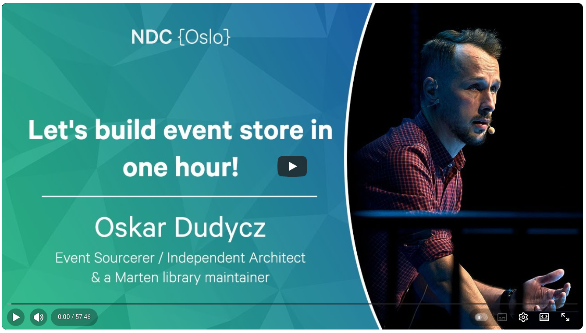
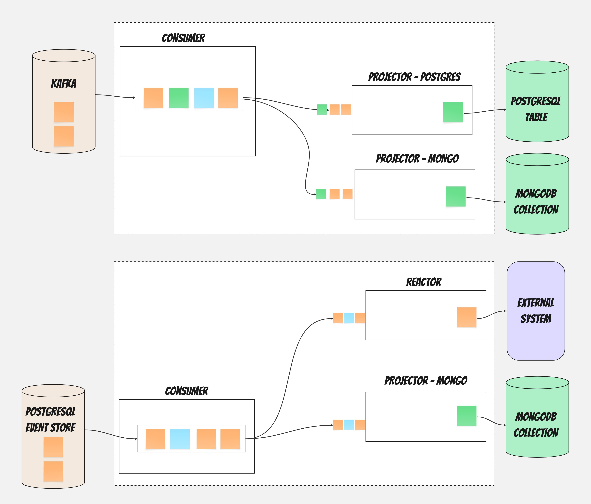

**Did you know that you can build an event store in one hour?** I even did it a few times on the conference stage. Actually, it took me usually around 25 minutes; the rest was mistyping, lame jokes and a bit of explanation. See:

[](https://www.youtube.com/watch?v=gaoZdtQSOTo)

**Yet, my final thought was: Kids don't do it at home.**

It's a fun coding exercise, but using the outcome in production? Not as much fun running and maintaining it. Why though? How hard can it be?

Event Sourcing systems have two phases: appending events and processing them afterwards. The write side gets most of the attention in tutorials and talks - commands, deciders, event stores, optimistic concurrency, as you saw, I'm also one to blame. 

Providing the guarantees on the write side is relatively simple, especially if you use a database like PostgreSQL as a storage. You need to provide features like:
- appending an event at the end of the stream,
- reading all events from the stream,
- a guarantee of the ordering within the stream,
- being able to read your writes,
- strong-consistent, atomic writes and optimistic concurrency.

That can be solved with knowledge about transactions, database design, etc. So again, why so hard?

The processing side is where systems often struggle as they grow. This is where the Event Sourcing solution becomes an Event-Driven Messaging tool. And if you've read my previous articles, you know that this can be tricky at times.

How do you reliably process events to build read models? How do you trigger side effects without losing messages? How do you scale processing independently from writes? How do you make it performant and run multiple handlers in parallel?

I've been working on the message processing architecture in [Emmett](https://github.com/event-driven-io/emmett) for a while now. I'll try to explain how I designed the split between Consumers and Processors, the problems it solves, and the tradeoffs involved.



## Why Split Consumers and Processors?

When processing messages, we already know that someone produced them. We're on the receiving end. Facts are already known; now we need to do something about them.

When we process them, do we care about the source? Typically, we take the information it gathers and reason about it. For instance, when we received an event indicating that a room reservation was made, we may need to send an email with details to the consumer, update the reservations dashboard, and generate a pro forma invoice. We may have specific logic, depending whether it came from our internal reservation platform or Booking.com, but we know the source from the message payload. 

That seems obvious, but it was an important realisation for me. When we're building a read model in MongoDB, we don't care if events come from PostgreSQL event store, EventStoreDB, RabbitMQ queue or Kafka topic. 

It needs events and the projection logic. Of course, it needs to know the guarantees around: delivery, ordering, idempotency, etc., but besides that? The message's source doesn't matter to its logic. 

Similarly, a component polling PostgreSQL for messages to publish them doesn't care what happens to those events - whether they update read models or trigger webhooks is irrelevant to polling logic.

These concerns are orthogonal. 

I realised that much of the complexity comes from coupling those two together. We wouldn't like to change our processing logic because of an internal change in how they're produced, or vice versa. I concluded that separating them means each can evolve independently. And I came with the initial idea for the split: Consumers and Message Processors.

**Consumers** are responsible for getting messages from a source and forwarding them to processors. Think of them as the "delivery mechanism." They handle the "where do events come from" concern. A consumer might connect to:
- A PostgreSQL event store, polling the events table,
- EventStoreDB, using push-based catch-up subscriptions,
- Kafka, consuming from topics,
- Any other message source you might have.

**Processors** are responsible for doing something meaningful with those messages. They handle the "what do we do with messages" concern. A processor might:
- Update a read model in PostgreSQL or MongoDB,
- Call an external API when certain events occur,
- Publish events to Kafka or fire webhooks,
- Trigger workflow steps or saga operations.

This separation follows Unix philosophy: small, focused components connected by simple interfaces. Each piece does one thing well. You can plug any processor into any consumer. This gives you flexibility that matters in practice:

- You can run the same projection logic against different event sources
- Adding new processors doesn't require changing consumer code
- You can test processors in isolation with fake event streams
- Consumers and processors can be scaled independently

Let me show you how this looks in practice.

## How Consumers Work

I deliberately decided to keep Consumers as dumb as possible. A consumer's entire job is:

1. Connect to a message source,
2. Poll messages in batches or subscribe to notifications (depending on the source specifics).
3. Forward them to all registered processors.
4. Go back to step 2.

That's it. No business logic. No complex state management. No decision-making about what to do with messages. Consumers are essentially routers.

Why this simplicity? I'm a simple guy; I like clear boundaries for responsibility. They help me reason about both how to use the tool and how to handle it when things go wrong. When message delivery breaks, you want to know exactly where to look. With a simple consumer, the question is binary: did it deliver messages or didn't it? There's no complex interaction between delivery logic and processing logic to untangle at 3 AM.

For EventStoreDB, the consumer creates a single subscription and fans out messages to all registered processors. For PostgreSQL, it polls the message table in batches, handling ordering guarantees (we'll get to why that later).

Here's what a basic consumer setup looks like for PostgreSQL :

```typescript
const consumer = postgreSQLEventStoreConsumer({
  connectionString,
  processors: [
    shoppingCartDetailsProjector,
    customerAnalyticsProjector,
    orderNotificationReactor
  ]
});

await consumer.start();
```

Set up looks accordingly for the other sources providing options specific for the source, e.g. for EventStoreDB store, you may want to provide the category stream name:

```ts
const consumer = eventStoreDBEventStoreConsumer({
  connectionString,
  from: { stream: '$ce-roomRservations', options: { resolveLinkTos: true } },
});
```

The consumer receives messages, batches them and forwards them to all processors. Each processor handles messages independently - they don't know about each other, and they don't need to.

## Why Batching Belongs to Consumers

Who decides how many messages to fetch at once? That's a tricky question. I think that batching can happen both at the consumer and processor levels. The consumer decides the batch size for the polling or receiving to tune the receiving throughput. The processor can either align with it, using those batches as a safe default or diverge to its specifics. Read more on [Why you should batch message processing in my other article](/en/batching_async_enumerable/).

Different message sources have different optimal batch sizes. PostgreSQL might be efficient with 100-row fetches. EventStoreDB subscriptions don't have built-in batching; they deliver events as they arrive. Kafka has its own batching semantics. These are all source-specific optimisations we should be able to apply without ending up with the lowest common denominator.

Processors, by default, can just receive batches and process them. Then they can decide whether to split batches into smaller chunks, group them into even larger chunks, or process them as single messages. For instance, PostgreSQL can handle random single updates pretty well, whereas [Elastic prefers batching updates](/en/projecting_from_marten_to_elasticsearch/).

## How Processors Work

If consumers are simple routers, processors are where the interesting work happens. They're the smarter ones in this relationship. A processor is responsible for:
- **Processing logic**: Actually doing something useful with events. Updating a read model, sending an email, calling an API.
- **Checkpointing**: Tracking which messages have been processed. This is crucial - without it, you'd reprocess everything from the beginning every time you restart.
- **Error handling**: Deciding what to do when processing fails. Retry? Skip? Stop everything?
- **Idempotency**: Doing their best to ensure that reprocessing the same event doesn't cause problems. Of course, still assuming that handlers should be idempotent, read more in [my other article](/en/idempotent_command_handling/),
- **Backpressure:** They need to be able to tell consumers that they cannot process more messages at the moment, and that the consumer needs to slow down delivery.

Those are general promises and common stuff for the message processing logic. Still, there are multiple reasons why you want to process incoming messages:

- **Read models (projections)** transform events into queryable state. For instance, shopping cart events - _ProductItemAdded_, _ProductItemRemoved_, _ShoppingCartConfirmed_ - need to become a document showing current items, quantities, and totals. Something your API can quickly return when a user opens their cart.
- **Reactions** trigger side effects after a business fact has happened. When a shopping cart is confirmed, you may want to send a confirmation email, notify the shipment module, and register a new order. These things need to happen, but they're not part of the core business logic.
- **Workflows** coordinate multi-step processes across multiple streams. An order might involve payment processing, inventory reservation, and shipping coordination - each with its own state and events.
- **Integration** means forwarding events to other systems. Other services in your systems might need to know about orders. External partners might need webhook notifications. You might publish to messaging systems for downstream consumers.

All of those processing needs a bit different ways to handle reliability, ordering, throughput, etc. Also, all tools we integrate with require a different approach: storing the read model in PostgreSQL will be _quite_ different from forwarding a message to Kafka. 

I wouldn't like to handwave all of those specifics and end up with the lowest common denominator. That's why I decided to group them into the following _archetypes_:
- projectors,
- reactors,
- [workflows](https://www.architecture-weekly.com/p/workflow-engine-design-proposal-tell),
- allow custom message processors to allow people to tune it fully to their needs,
- and in the future, stuff like forwarders, web hooks and others we find useful.

All of them should have a unified API that allows them to be plugged into different consumers, while also embracing differences in message processing and target API specifics.

That's also why each message processing target (PostgreSQL, EventStoreDB, MongoDB, InMemory, Kafka, SQS, etc.) will have its own implementations.

I believe that this focused responsibility, different archetypes, and specific implementations for different tools will strike the right balance between reusability and avoiding the lowest common denominator. We'll see if that's not a famous last words.

Read also more in:
- [My RFC for Workflow Processing](https://github.com/event-driven-io/emmett/pull/257/files)
- [How message pipelines can be technically implemented](https://www.architecture-weekly.com/p/compilation-isnt-just-for-programming).

The example projector can look like that:

```ts
const projection = pongoSingleStreamProjection({
  collectionName: shoppingCartsSummaryCollectionName,
  evolve,
  canHandle: ['ProductItemAdded', 'ShoppingCartConfirmed'],
  initialState: () => ({
    status: 'pending',
    productItemsCount: 0,
 }),
});


const postgreSQLProjector = postgreSQLProjector({ projection });
```

```ts
const reactor = postgreSQLReactor({
    processorId: 'order-notifications',
    canHandle: ['ShoppingCartConfirmed'],
    eachMessage: (event) => 
      emailService.sendOrderConfirmation(event.data.customerId);    
  }
```

## Native implementations of processors 

Different storage requirements require different capabilities, and getting proper guarantees might involve deeper knowledge. For instance, [Postgres sequences issues can impact your messaging guarantees](/en/ordering_in_postgres_outbox/). Those are cases where, when you're starting, you might not anticipate. Test environments may not even catch it; you might realise you're losing business data when you reach production. That's why it's, imho, better to have a tool that solves it rather than trying to maintain it on your own, making technical infrastructure something you need to keep working on instead of your business features. How does [Emmett](https://github.com/event-driven-io/emmett) solve them? Let's discuss them briefly. I'll try to expand in the future posts about the details.

## Resilience

What happens if the processor fails? By default, it stops processing. But only this one,  the consumer keeps pushing events to the other processors that can continue.  Consumer stops when all their processors are inactive.

Why? Consider this scenario: you have two processors, one updating MongoDB and another updating PostgreSQL. MongoDB becomes temporarily unavailable. Should that stop PostgreSQL updates?

Still, failure behaviour is configurable; your message handler can return:

- **void/ACK**: message processed successfully, continue to the next one.
- **SKIP**: Skip this message, useful for poison messages that consistently fail
- **STOP**: Stop this processor entirely.

Why have _skip_ separate from _ACK_?  Consider a poison message - a message that causes your processor to fail every time. Without _skip_, you have two bad options: fail forever (blocking all processing) or _ACK_ it (pretending you processed it). With _Skip_, you can move it to a dead-letter queue for investigation while continuing to process other messages.

For now, [Emmett](https://github.com/event-driven-io/emmett) doesn't support Dead Letter/Poison Message Queues out of the box, but they will be supported in the future. You could already append those events to some specific stream.

In upcoming releases, we'll also have configurable retry policies based on error type and other factors. Just like we already have for command handlers (e.g. to retry 3 times with exponential backoff for Optimistic Concurrency error).

There's no easy answer to when to stop and when to skip poison messages. Neither choice is universally correct. A financial system might need all-or-nothing semantics. A social media feed can tolerate inconsistency between views.

That's also why you can freely group processors within consumers. Best if they share similar resiliency and desired throughput characteristics. If they're very different, you can always spin up another consumer for the same source and process it differently.

## Checkpointing processing

In Emmett, **processors own their checkpoints**. Each processor independently tracks the last message it processed. The consumer doesn't maintain any checkpoint state.

When a consumer starts up, it asks all registered processors for their last processed position and starts polling from the earliest one. 

It has several benefits:
- **Independent progress**: Processors can move at different speeds. If your MongoDB projector is fast and your analytics processor can get slow at times, they each track their own progress. The slow one doesn't hold back the fast one.
- **Isolated failures**: If one processor's checkpoint storage fails, only that processor is affected. Others continue working.
- **Easy replay**: To rebuild a single projection, you just reset that processor's checkpoint. No need to coordinate with other processors or manage a global position.
- **Flexibility**: Processors can store checkpoints wherever makes sense - in the same database as their read model, in a separate checkpoint table, or anywhere else.
- **Capability to redistribute the load.** As mentioned in the previous points, if you observe that one of the processors is slower or demands more resources, you can freely deploy it separately in a different consumer, and it'll start where it left off.

The tradeoff? When a consumer restarts, it might poll events that most processors have already seen. If one processor is significantly behind, all processors receive those events again (they just skip them based on their checkpoints). This is why you should group processors by their typical processing pace - don't put a real-time dashboard projector and a monthly analytics batch processor on the same consumer.

## Backpressure: When Processors Can't Keep Up

Backpressure occurs when processors can't process messages fast enough for the consumer to deliver them. This is a real operational concern that needs explicit handling.

[Emmett](https://github.com/event-driven-io/emmett) doesn't support it at the moment, but here's what I'm thinking about it.

There are several strategies, each with tradeoffs:

**1. Ignore backpressure**: Consumer keeps polling and pushing regardless of processor state.
- Pro: Simple, maximum throughput when processors can keep up
- Con: Memory grows unbounded, possible OOM, cascading failures

**2. Stop on any slowdown**: If any processor signals it's overwhelmed, stop polling.
- Pro: Safe, no resource exhaustion
- Con: Slowest processor determines overall throughput

**3. Force synchronised pace**: All processors must process each batch before the next is fetched.
- Pro: All processors stay in sync, predictable memory usage
- Con: The Slowest processor becomes the bottleneck for all

**4. Slow down ingress**: Adaptively reduce polling rate based on processor feedback.
- Pro: Balances throughput and stability
- Con: More complex, needs tuning

**5. Rolling buffer**: Buffer messages up to a limit, retry delivery to slow processors.
- Pro: Absorbs temporary slowdowns, maximises throughput
- Con: Needs memory limits, complex failure handling

Different systems need different strategies. Real-time dashboards might use strategy 1 (drop messages rather than lag). Financial transactions might use strategy 3 (consistency over throughput). Event forwarding to Kafka might use strategy 5 (buffer temporary network issues).

I'm leaning toward making this configurable per consumer, with sensible defaults. The default would be a bounded buffer with adaptive polling slowdown.

## Scaling: Current State and Future Plans

For now, the big benefit of having dumb consumers is that you can scale them horizontally. Of course, this works for offset-based solutions like event stores and streaming tools like Kafka. It may not always work for systems that remove the message once it's handled. Still, current consumers are using only event stores as sources; Kafka will likely come next. 

You can group processors into consumers by that, reducing the number of polling jobs (one consumer polls/subscribes to one source).

I already mentioned batching, which should also increase the throughput.

Running multiple instances of the same processor causes conflicts. Both process the same events, update the same read models, and corrupt the state. [Emmett](https://github.com/event-driven-io/emmett) already has the basic capability to do [distributed locking](https://www.architecture-weekly.com/p/distributed-locking-a-practical-guide), but it's not fully plugged yet. This will come in future releases. 

For now, checkpointing can detect whether a newer checkpoint is already stored (which can suggest another processor is running) and stop processing.

The recommended approach is to run the consumer as a separate service from the API. Then you can scale it separately. You can also set replicas=1 for the specific consumer to ensure one instance.

## Rebuilding Projections

Event Sourcing enables rebuilding read models from events. Bug in projection? Fix code, rebuild. New read model? Populate from history.

With processor-owned checkpoints, you can either rebuild read model from scratch by:

1. Stopping the processor.
2. Delete read model data.
3. Reset the checkpoint to the beginning.
4. Restart processing.

Or doing blue greeen by:

1. Creating a new version of your storage (with Pongo, it's just adding a suffix or prefix to your collection name).
2. Start consumer since the beginning.
3. Check if read models are close enough, and stopthe  old processor
4. Start processing.

In [Emmett](https://github.com/event-driven-io/emmett) you have even some syntactic sugar on top of consumers and processors to make this easier:

```typescript
import { rebuildPostgreSQLProjections } from '@event-driven-io/emmett-postgresql';

const rebuilder = rebuildPostgreSQLProjections({
  connectionString,
  projection: shoppingCartsSummaryProjectionV2
});

await rebuilder.start();
```

This will spin up a new consumer; other consumers and processors continue normally, with their checkpoints unaffected. You can specify the position from which you want to start, and also whether to truncate the end storage.

We'll need more metrics like gap detection and distributed locking to make it more plug-and-play.

## Wrapping Up

The consumer/processor architecture in [Emmett](https://github.com/event-driven-io/emmett) is about making event processing concerns explicit and separable:

**Consumers** handle delivery - getting events from sources to processors. They're simple by design. When delivery breaks, you know where to look.

**Processors** handle processing - doing useful things with events. They own their checkpoints, track their own progress, and handle their own failures.

This separation gives you:
- Flexibility to mix and match consumers and processors,
- Independent scaling of different processing workloads,
- Isolated failure domains,
- Easy projection rebuilds,
- Testability at multiple levels.

The design makes tradeoffs explicit:
- Partial progress over all-or-nothing (configurable soon),
- Processor-owned checkpoints over global tracking,
- Simplicity in consumers, complexity in processors,
- Eventual consistency for async operations.

There's more to build - distributed locking, partitioning, better backpressure handling. There's still a lot to do, but I believe the foundation is there, and I know real applications are using it already.

I hope that this is a good food for thought, even if you're not using [Emmett](https://github.com/event-driven-io/emmett). I'm curious about your thoughts and feedback. I'll try to tackle those cases in more detail in dedicated articles.

If you have questions, feedback, or would like to help me speed up the planned stuff, come chat in the [Emmett Discord](https://discord.gg/fTpqUTMmVa). We have a small, but welcoming and awesome community.

Cheers!

Oskar

p.s. **Ukraine is still under brutal Russian invasion. A lot of Ukrainian people are hurt, without shelter and need help.** You can help in various ways, for instance, directly helping refugees, spreading awareness, putting pressure on your local government or companies. You can also support Ukraine by donating e.g. to [Red Cross](https://www.icrc.org/en/donate/ukraine), [Ukraine humanitarian organisation](https://savelife.in.ua/en/donate/) or [donate Ambulances for Ukraine](https://www.gofundme.com/f/help-to-save-the-lives-of-civilians-in-a-war-zone).
