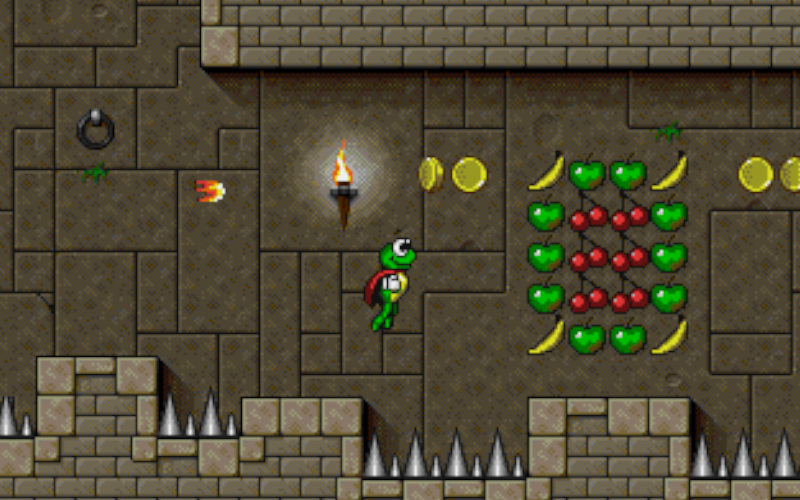

Let's start by asking you two questions.

1. **What [Super Frog](https://en.wikipedia.org/wiki/Superfrog) has to do with messaging?**
2. **When was the last time you wrote if statements in SQL?** If it's been a long time, have you at least seen them? If not, (don't) worry, you'll see them today.

Will it be a post about weird SQL usage? Not necessarily. 

**We'll talk today about checkpointing our processing.**



I've started my relationship with computers with games. I still have my Amiga 500. In those days, computers didn't always have a hard disk. You've got a bunch of diskettes with different chapters of the game. Not all of them were simple games; many were quite sophisticated, and it took some time to finish them. 

Yet they were dealing with limited diskette space, so it was best if they didn't have to use any of it. How can you then allow you to stop playing and return to the previous state? Or how to not force you to start from the beginning of the game when you fell from the platform, and well, you died? You died in the game, ofc, that at least you should be able to recover, right?

As mentioned earlier, the limited space on diskettes and the additional complexity that came with it led many game makers to adopt a simple solution: checkpoints with codes.

**After you passed a level, you got a code you could type when you started the game, and instead of starting from the beginning, you could go directly to the place where you left off.** That worked pretty well for the platform and race car games, since your game's storyline was always the same, immutable. If you had to go to level 27, the starting point and your character would always look the same. Of course, for RPG and strategy games, that's a different story.

Surprisingly, this parallel also matches the recovery from a business process failure. 

Let's say we're using message-based communication to streamline and make it more resilient. We don't want to make it vulnerable to scenarios where we store information in one system, our process dies, and we don't manage to notify the other parts.

We're using [Outbox pattern](/en/outbox_inbox_patterns_and_delivery_guarantees_explained/) to enable that technically. We're storing messages in the relational table within the same transaction, updating the state after running business logic. Thanks to that, either both states are updated, and the message is scheduled, or none of it is. We're getting (eventual) consistency thanks to that. 

Now we're on the receiving end, so where we were in the previous article with the explanation of [Consumers, Processors and all that jazz](/en/consumers_processors_in_emmett/).

Let's say that we're using PostgreSQL and our Outbox structure looks as explained in the [other article](/en/ordering_in_postgres_outbox/):

```sql
CREATE TABLE outbox(
   -- the autoincremented position of the message to respect the order
   position        BIGINT                    GENERATED BY DEFAULT AS IDENTITY PRIMARY KEY,
   -- used to detect gaps in numbering
   transaction_id  xid8                      NOT NULL,
   -- unique message id, which can be used for deduplication or idempotency
   message_id      TEXT                      NOT NULL,
   -- the message type, e.g. `TransactionRecorded`
   message_type    TEXT                      NOT NULL,
   -- serialised message data, e.g. to JSON
   data            JSONB                     NOT NULL,
   -- diagnostic information on when the message was scheduled
   scheduled       TIMESTAMP WITH TIME ZONE  NOT NULL    default (now())
);
```

As you can see, besides the message ID, type, and data, we're also storing the (global) position number and transaction ID (to ensure we don't skip in-flight transactions that have requested the global position number, read more [here for reasoning](/en/ordering_in_postgres_outbox/)).

Now we can be polling it with the query like:

```sql
SELECT 
     position, message_id, message_type, data
FROM
     outbox
WHERE
     (
          (transaction_id = last_processed_transaction_id
               AND position > last_processed_position)
          OR
          (transaction_id > last_processed_transaction_id)
     )
     AND transaction_id < pg_snapshot_xmin(pg_current_snapshot())
ORDER BY
    transaction_id ASC,
    position ASC
LIMIT 100;
```

Now, thanks to that, we can have the global ordering guarantee on the receiving end. We're trading a bit of performance for greater correctness. Not always acceptable, but for internal module communication or forwarding to the messaging system, that's usually more than enough.

That's also the place where we're back to our checkpointing. How do we know the last processed position?

By default, that's simple, we could either say:
- **start from the beginning** and use -1 or some other hardcoded position,
- **start from the end** and use the position of the last message in the table plus one.

Those cases can be fine when we need to handle all messages (e.g., adding a new process or reading a model), or when we don't care about the past and need to process the newest notifications.

Still, the reality is just like in the old games, we'd like to start somewhere in the middle, precisely where we left off.

We need one more table for storing our checkpoints. It can look as follows:

```sql
CREATE TABLE processor_checkpoints
(
   -- subscription name
   processor_id                     TEXT      PRIMARY KEY,
   -- information about the position of the last processed message
   last_processed_position          INTEGER   NULL,
   -- used to detect gaps in numbering
   last_processed_transaction_id    xid8      NOT NULL
);
```

Simple stuff: the processor ID should be unique and reflect the processor's logical name and the last processed position(s).

If that looks simple, then let me follow up with the next set of potentially simple questions:
- How to store it?
- When to store it?

If your answer is: "just do upsert statement", then you're kinda right, but that wouldn't be simple, it'd be over-simplification. At least if you'd like to run it in production.

Let's start with how. And, for that, let me bring you now the promised stored procedure with if statements, it's a bit simplified version from Emmett:

```sql
CREATE OR REPLACE FUNCTION store_processor_checkpoint(
  p_processor_id      TEXT,
  p_position          BIGINT,
  p_expected_position BIGINT,
  p_transaction_id    xid8
) RETURNS INT AS $$
DECLARE
  current_position BIGINT;
BEGIN
  -- Handle the case when p_check_position is provided
  IF p_expected_position IS NOT NULL THEN
      -- Try to update if the position matches p_check_position
      UPDATE processor_checkpoints
      SET 
        "last_processed_position" = p_position, 
        "last_processed_transaction_id" = p_transaction_id
      WHERE "processor_id" = p_processor_id AND "last_processed_position" = p_check_position;

      IF FOUND THEN
          RETURN 1;  -- Successfully updated
      END IF;

      -- Retrieve the current position
      SELECT "last_processed_position" INTO current_position
      FROM processor_checkpoints
      WHERE "processor_id" = p_processor_id;

      -- Return appropriate codes based on current position
      IF current_position = p_position THEN
          RETURN 0;  -- Idempotent check: position already set
      ELSIF current_position > p_expected_position THEN
          RETURN 2;  -- Failure: current position is greater
      ELSE
          RETURN 3;  -- Default failure case for mismatched positions
      END IF;
  END IF;

  -- Handle the case when p_check_position is NULL: Insert if not exists
  BEGIN
      INSERT INTO processor_checkpoints ("processor_id", "last_processed_position", "last_processed_transaction_id")
      VALUES (p_processor_id, p_position, p_transaction_id);
      RETURN 1;  -- Successfully inserted
  EXCEPTION WHEN unique_violation THEN
      -- If insertion failed, it means the row already exists
      SELECT "last_processed_position" INTO current_position
      FROM processor_checkpoints
      WHERE "processor_id" = p_processor_id;

      IF current_position = p_position THEN
          RETURN 0;  -- Idempotent check: position already set
      ELSIF current_position > p_expected_position THEN
          RETURN 2;  -- Insertion failed, row already exists with a greater position
      ELSE
          RETURN 3;  -- Default failure case for mismatched positions
      END IF;
  END;
END;
$$ LANGUAGE plpgsql;
```

Oooh, even by copy and pasting, I'm already tired; there's a fair reason why we're not doing that too often nowadays.

Let me untangle that for you:
1. We're trying to update the existing position or insert it if we're storing it for the first time.
2. If all went fine, we're returning 1 as a result to denote complete success.
3. If we saw that the checkpoint in the database had the same value, we're returning 0.
4. If we saw that the checkpoint is different from what was expected and further away from it, then we're returning 2.
5. Otherwise, we're returning 3, which means that the checkpoint is different from the expected and older.

Essentially, by passing the expected position, we can detect whether we:
- already handled the specific position,
- have some competing instance of our processor handling our data.

That's why we're doing this fancy dance with IF statements and a stored procedure.

Detection assumes that we have a global ordering processing guarantee (thus, tricky bits with transaction ID).

**It also shows why global ordering is useful.** 

By detecting that we've already handled a specific position, we can skip processing handling idempotency on the processor level.

By detecting that there's another processor with the same id processing messages, we can make it more resilient and detect the _noisy neighbour_ issue.

How would that look in the code? 

```ts
async function handleBatch(messageBatch: RecordedMessage[], context: ProcessorContext): Promise<BatchHandlingResult> {
  const { checkpoint } = messageBatch[messageBatch.length - 1].metadata;

  return context.pool.withTransaction(async (transaction) => {
    for (const message of messageBatch) {
      await context.onMessage(message);      
    };

    // No error was thrown: proceed to store checkpoint of the last processed message
    const result = await storeProcessorCheckpoint(transaction.execute, {
      processorId: context.processorId,
      newCheckpoint: checkpoint,
      lastProcessedCheckpoint: context.lastProcessedCheckpoint,
    });

    if(result.success) {
      await transaction.commit();
    } else {
      // no need to do here, either we already handled it
      // or we have a mismatch of expected and existing checkpoints
      await transaction.rollback();
    }

    return result;
  });
}

type ProcessorContext = {
  processorId: string;
  lastProcessedCheckpoint: bigint | null;
  onMessage: (message: AnyMessage) => Promise<void>;
  pool: ConnectionPool;
}

type BatchHandlingResult =
  | {
      success: true;
      newCheckpoint: bigint | null;
 }
  | { success: false; reason: 'IGNORED' | 'FURTHER' | 'OLDER' };

async function storeProcessorCheckpoint(
  execute: SQLExecutor,
  options: {
    processorId: string;
    newCheckpoint: bigint | null
    lastProcessedCheckpoint: bigint | null;
    partition?: string;
 },
): Promise<BatchHandlingResult> {
  const { result } = await single(
      execute.command<{ result: 0 | 1 | 2 | 3}>(
        SQL`SELECT store_processor_checkpoint(
            ${options.processorId}, 
            ${options.newCheckpoint}, 
            ${options.lastProcessedCheckpoint}, 
            pg_current_xact_id()
        ) as result;`,
      ),
    );

    return result === 1
      ? { success: true, newCheckpoint: options.newCheckpoint! }
      : { success: false, reason: result === 0 ? 'IGNORED' : result === 2 ? 'FURTHER': 'OLDER' };
};
```

As you can see, thanks to:
- global ordering,
- checkpoint detection, 
- storing checkpoint where our side effects will be stored,
- transactional capabilities of our end storage,

We can ensure that the entire batch is processed or not. We could even optimise it by storing the checkpoint first and not processing the business logic if there's a mismatch, then committing only if the logic succeeds.

We're getting by that generic idempotence check and detection of the noisy neighbour.

Of course, I still believe that [idempotence check should happen on the business logic side](/en/idempotent_command_handling/). But why not both? 

Being able to detect a noisy neighbour can help you automatically stop (or pause) one of the competing consumers and avoid inconsistency conflicts.

**What are the tradeoffs of this approach?**

1. This will work if we have a global ordering guarantee. Not many messaging solution gives us such. If we have a subscription-based outbox as explained, event store like [Emmett](https://github.com/event-driven-io/emmett), Marten or KurrentDB, Kafka, this will work, but not necessarily for solutions like RabbitMQ, SQS, Google Pub Sub, etc.
2. This works best if you have transaction capabilities. Batching updates generally improves performance, but sometimes can lead to long-lived transactions; beware of that. The subscription-based solution with a transaction ID also works best if your transactions are short. If they're open for a long time, it can cause delays.
3. Still, even without transactions, it will work fine, as long as you're fine with having retries more often. If the business logic fails and the checkpoint is not committed, it'll reprocess the already-handled messages from the previously stored messages. Which means that they can be handled more than once, but you should not lose any messages. You may also not fully benefit from the idempotence check for skipping already handled messages.

As always, the choice is yours.

Still, I hope that this article will show you why:
- having a global ordering guarantee can be useful,
- why and how to checkpoint your processing, how they relate to level codes from old games like Super Frog,
- What are the tradeoffs, and how to consider them,
- ...and that SQL IF statements are sometimes justified. But don't go wild with them!

**And hey, I also hope that's not something that you'd like to maintain on your own. There are mature tools to deal with such stuff, like Emmett, which implements this for you.**

What are your thoughts? Questions? Concerns?

Cheers!

Oskar

p.s. **Ukraine is still under brutal Russian invasion. A lot of Ukrainian people are hurt, without shelter and need help.** You can help in various ways, for instance, directly helping refugees, spreading awareness, putting pressure on your local government or companies. You can also support Ukraine by donating e.g. to [Red Cross](https://www.icrc.org/en/donate/ukraine), [Ukraine humanitarian organisation](https://savelife.in.ua/en/donate/) or [donate Ambulances for Ukraine](https://www.gofundme.com/f/help-to-save-the-lives-of-civilians-in-a-war-zone).
