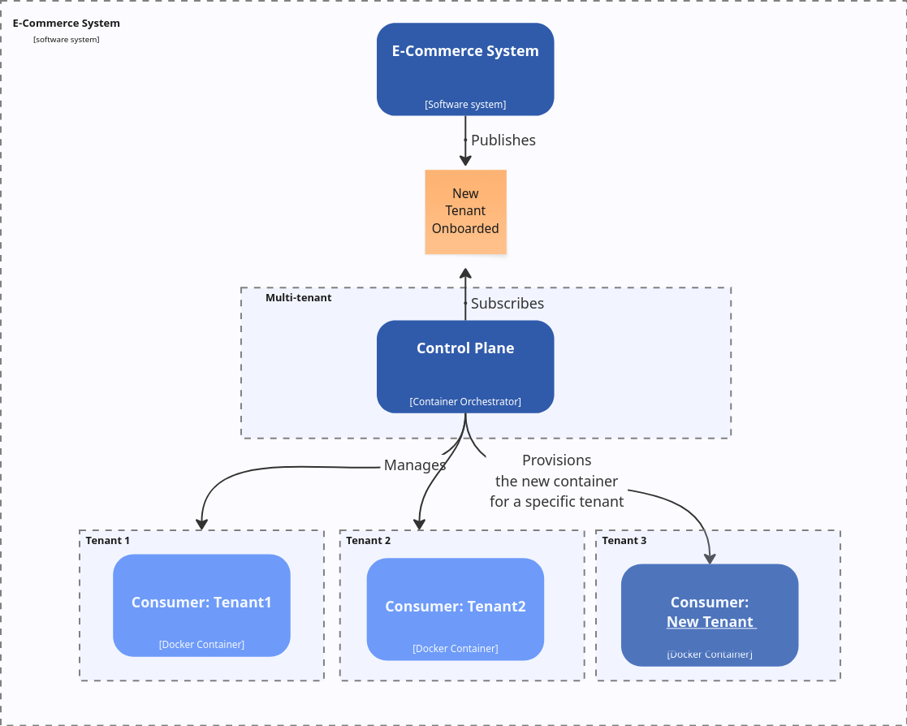
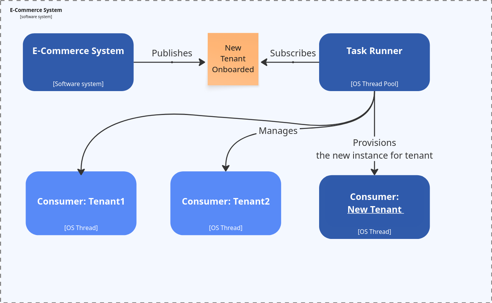

There are several reasons why I'm blogging. 

The first one is that I forget, and writing helps me to remember and organise my findings. 

The other is that I like to share my journey with the intention of sparing you, my dear reader, some of my struggles. 

Last but not least, it gives me the chance to learn from discussions inspired by them. It's always a chance to meet new perspectives, correct what I did or just trigger some recollection.

After the article about [consumer, processors and all that messaging jazz](/en/consumers_processors_in_emmett/), there was a great discussion on [Emmett Discord](https://discord.gg/fTpqUTMmVa), there were a lot of interesting threads there, but the one that inspired what you read today came from the [Ismael Celis](https://ismaelcelis.com/) question. Ismael was curious about:

## Distributing the workload dynamically between processors

And as that's something I haven't planned to deliver initially, but it's a great question, let me put down some notes on my plan around it.

Why would we want to distribute the workload dynamically? What does that even mean? 

Let's start from the classical approach. We can define projections that will build read models based on the upcoming events. In [Emmett](https://github.com/event-driven-io/emmett), it can look like that when [using Pongo as the storage tool](https://event-driven-io.github.io/emmett/getting-started.html#read-models):

```ts
const cartsSummaryProjection = pongoSingleStreamProjection({
  collectionName: shoppingCartsSummaryCollectionName,
  getDocumentId: (event) => event.data.shoppingCartId,
  evolve,
  canHandle: ['ProductItemAdded', 'ShoppingCartConfirmed'],
  initialState: () => ({
    status: 'pending',
    productItemsCount: 0,
 }),
})
```

This means that when the projection handles only _ProductItemAdded_ and _ShoppingCartConfirmed_ event types. It'll insert or update rows in the table based on the shopping cart id from the event data. 

We can plug this projection into a projector (the specific type of processor responsible for running projections).

```ts
const cartsSummaryProjector = postgreSQLProjector({ 
  processorId: 'shoppingCartSummary',
  projection: cartsSummaryProjection,
 });
```

And plug it into the consumer:

```ts
const consumer = postgreSQLEventStoreConsumer({
  connectionString,
  processors: [
    cartsSummaryProjector
  ],
});
```

Now, consumers will poll the PostgreSQL event store and pipe filtered events by type into our projector.

That's simple, we know the filtering criteria, as consumers will know which event types their processor(s) can handle.

Things get harder when we don't know those criteria upfront. When can that happen? What if we were building an e-commerce SaaS product that lets shop owners buy a subscription to run their shops? Then we won't know all of our tenants upfront. They will register as they go.

## What options do we have for such a multi-tenant setup?

The simplest option would be to add a custom filter that allows filtering events on the consumer by the tenant.

[Emmett](https://github.com/event-driven-io/emmett) doesn't support such a feature yet, but it could (and will at some point). We could extend our event metadata to contain the tenant and spin up a consumer for a dedicated tenant.

We could even wrap it into a dedicated function.

```ts
function tenantedConsumer(
  connectionString: string,
  tenant: string,
  processors: MessageProcessor[]) {
  return postgreSQLEventStoreConsumer({
    connectionString,
    processors,
    filterBy: (event) => event.metadata.tenant === tenant,
    projection,
  });
}
```

Of course, this wouldn't be fully dynamic, but we could make it dynamic at the infrastructure level, e.g., by passing the tenant ID from an environment variable and spinning up a new Container (e.g., a Kubernetes Pod). 

```ts
const consumer = tenantedConsumer(
  process.env.PG_CONNECTION_STRING,
  process.env.TENANT_ID,
  [ cartsSummaryProjector ],
);
```


We could also start a new job from the API endpoint, running it in the existing deployment; there are plenty of options. You can go wild and think about other ways.

Still, logically, they would look more or less like that. Either you're scaling horizontally and sharding physically, tenants



Or you're scaling vertically and running multiple tenants inside your box. Then, instead of spinning up new containers, you're spinning up new jobs (processes, threads, virtual threads, etc.).



That's nothing special for Emmett; other tools also do this, e.g., [Spring Boot Kafka concurrent listeners](https://docs.spring.io/spring-kafka/reference/kafka/receiving-messages/message-listener-container.html#using-ConcurrentMessageListenerContainer).

And hey, btw. there's one more reason why I'm writing about my Emmett design: to let you benchmark your design against it. Even if you're not planning to use it, then those are considerations for you either as:
- internal tooling creator,
- user of other OSS tooling, to check how they solved it.

**Separating tenants through sharding give you:**
- better option to scale and align the needs to the specific tenant workload,
- makes possible full separation in terms of networking, storage, etc.
- can be more costly.

**Separating tenants through partitioning the load inside one box:**
- is usually cheaper,
- easier to manage,
- doesn't give you a full separation and can fall into [Noisy Neighbour issue](https://learn.microsoft.com/en-us/azure/architecture/antipatterns/noisy-neighbor/noisy-neighbor).

So there's no golden rule to choose, it depends on your tooling, needs, etc.

You can, of course, have a mixed solution, so running most of the small tenants in the same box, and the one with bigger security needs gets a special setup. Especially that dynamic split doesn't have to be only per tenant. You can, e.g., have per region, per product range, per chain, etc.

Also, such a dedicated setup can work for a set number of dynamic options. If you have 1000 tenants, would you spin up 1000 containers or jobs? You can, but just because you can doesn't mean that you should. The more containers or threads you have, the more you pay for the coordination costs. At some point, it's better to group processing into a manageable range of containers or threads. 

**Ok, but how do we know which messages to process where? We could use a [consistent hash](https://en.wikipedia.org/wiki/Consistent_hashing).** I wrote about it in detail in [Understanding Kafka's Consumer Protocol: A Deep Dive into How Consumers Talk to Brokers](https://www.architecture-weekly.com/p/understanding-kafkas-consumer-protocol). 

Kafka, by default, partitions its data on the producer side. The topic represents a logical split (e.g. all messages from the E-Commerce module), and the partition represents physical layout. Consumer groups receive messages. Kafka guarantees that precisely one consumer from the consumer group will receive messages from the specific partition. If we have fewer consumers than partitions, then of course, we can get more partitions to handle. 

The pseudo code for distributing load to consumers could look as follows:

```ts
const partitionId = message.headers.partitionId;
const hash = consistentHashFunction(partitionId);
const consumerId = hash % totalNumberOfConsumersWithinGroup;
```

In our case, we could use the tenant id as the partition id.

Kafka's strategy is also simpler than we might need. The partitioning is done on the producer side. The producer sends a message to the topic that already has a certain number of partitions:

```ts
const hash =  consistentHashFunction(message.header.recordId);
const partition = hash % totalNumberOfPartitionsWithinTopic;
```

In our case, if we'd like to allow distribution by any property, we'd need to load the message, read the field we want to partition/shard on, and send it to the appropriate container or thread.

The mechanism can get pretty hefty. You'd need a more sophisticated mechanism to know where to spin up what, how to distribute the load between containers or threads, and to make it resilient. We're getting into the area of distributed consensus algorithms such as [Raft](https://raft.github.io/) and [Paxos](https://en.wikipedia.org/wiki/Paxos_(computer_science)). 

**Do I want to go into this area with Emmett?** Definitely not for free! I don't think that'd be even worth it, as we have mature solutions like Kafka, RabbitMQ, and other messaging systems that [implement such algorithms and specialise in that](https://cwiki.apache.org/confluence/display/KAFKA/KIP-500%3A+Replace+ZooKeeper+with+a+Self-Managed+Metadata+Quorum). I'd prefer to make it easier to forward messages to them and let them do the work.

What is definitely on the plate is the second option, which allows partitioned producers. You could define it as such:

```ts
const cartsSummaryProjector = postgreSQLProjector({ 
  processorId: 'shoppingCartSummary',
  projection: cartsSummaryProjection,
  partitionBy: (event) => event.metadata.tenant,
 });
```

Then the consumer would poll messages from all tenants, forward them to projectors, and the projectors would internally spin up [worker threads](https://nodejs.org/api/worker_threads.html) per tenant or group them by consistent hashing.

If we add to that distributed locking or [detecting conflicting checkpointing](/en/checkpointing_message_processing/) to ensure that there's only one worker instance handling messages for the processor and partition id, then this should be good enough for the majority of cases.

Keeping in mind the flexibility in which you can group (or not) projectors within consumers, you can define your own topologies.

What are your thoughts? How do you deal with such cases? Would you like me to expand more on some cases?

Or maybe you'd like to help me and [sponsor my work in this area in Emmett](https://github.com/sponsors/event-driven-io)? Then your project could also benefit faster from it!

Cheers!

Oskar

p.s. **Ukraine is still under brutal Russian invasion. A lot of Ukrainian people are hurt, without shelter and need help.** You can help in various ways, for instance, directly helping refugees, spreading awareness, putting pressure on your local government or companies. You can also support Ukraine by donating e.g. to [Red Cross](https://www.icrc.org/en/donate/ukraine), [Ukraine humanitarian organisation](https://savelife.in.ua/en/donate/) or [donate Ambulances for Ukraine](https://www.gofundme.com/f/help-to-save-the-lives-of-civilians-in-a-war-zone).
