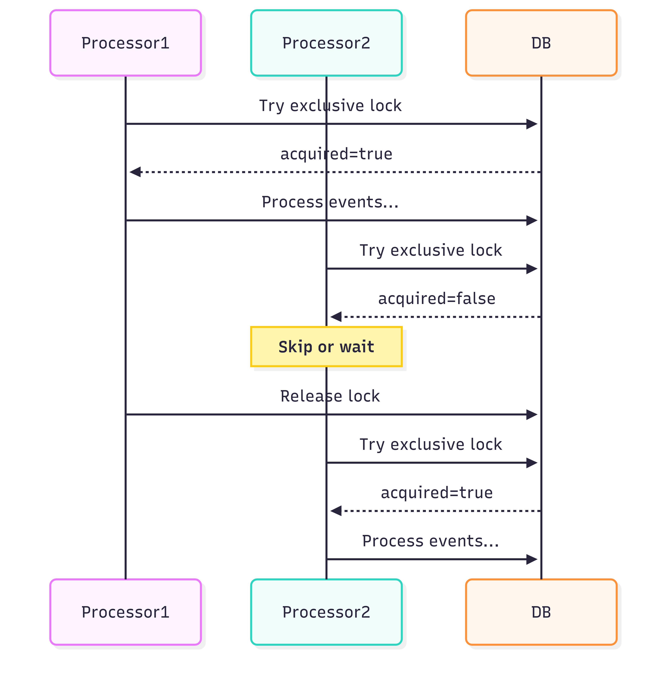

Let's make a soup today: a blog soup. We'll mix multiple ingredients like:

- events (obviously),
- read models,
- inline and async projections,
- rebuilding read models,
- backfilling new ones with data from existing events,
- scaling async processing horizontally,
- distributed locking,
- PostgreSQL and its Advisory Locks.

Sounds a lot? Well, the soup should be nutritious. 

In an event-driven way, after handling business logic, we record new facts and call them events. They gather information about what has happened. That brings many benefits, such as business observability by keeping a log of them. Especially if we're doing Event Sourcing, we can make the next decision based on them.

Typically, we're using events in two ways:
- reacting to them, triggering and integrating the steps of our business workflow,
- projecting them, and getting the flattened interpretation of our system state inside read models.

Such processing can happen asynchronously, but doesn't have to. If we're using a transactional database (like PostgreSQL, SQLite, or even MongoDB), we can update our read models in the same atomic transaction that stores new events. Such a process is typically called _inline projection_. Event stores like [Emmett](/pl/emmett_projections_testing/) and [Marten](/pl/projections_in_marten_explained/) allows that. Still, you can do the same if you're using [outbox pattern](/pl/outbox_inbox_patterns_and_delivery_guarantees_explained/), then you can achieve the same without Event Sourcing.

Inline processing is tempting because we're getting immediate consistency. Yet, there's no free lunch here. We're slowing down our event append as we need to process more, and our transactions will be open longer, which can cause deadlocks, etc. We also can't take advantage of batching event processing.

My thumb rule is that for single stream, simple projections, I prefer inline projections, but for more complex or workflow processing, I'd go with async.

The big benefit of a durable event log is that we can correct past mistakes and gain more insights from existing data. 

How does it look in practice? Let's say we initially had a basic read model that showed a summary of the specific shopping cart. In TypeScript this could look as follows:

```ts
type ShoppingCartSummary = {
  _id?: string;
  productItemsCount: number;
  totalAmount: number;
};
```

Besides the data, we also need a method that represents how we apply events on top of the existing state to get the next, evolved state. 

```ts
const evolve = (
  document: ShoppingCartSummary | null,
  event: ProductItemAdded | ProductItemRemoved,
): ShoppingCartSummary => {
  document = document ?? { totalAmount: 0, productItemsCount: 0 };

  switch (type) {
    case 'ProductItemAdded':
      return withAdjustedTotals({
        document,
        productItem: event.data.productItem,
        by: 'adding',
      });
    case 'ProductItemRemoved':
      return withAdjustedTotals({
        document,
        productItem: event.data.productItem,
        by: 'removing',
      });
  }
};

const withAdjustedTotals = (options: {
  document: ShoppingCartSummary;
  productItem: PricedProductItem;
  by: 'adding' | 'removing';
}) => {
  const { document, productItem, by } = options;
  const plusOrMinus = by === 'adding' ? 1 : -1;

  return {
    ...document,
    totalAmount:
      document.totalAmount +
      productItem.unitPrice * productItem.quantity * plusOrMinus,
    productItemsCount:
      document.productItemsCount + productItem.quantity * plusOrMinus,
  };
};
```

Sounds fine, but well, it may appear that either we, implementing it, or our business, through requirements, forgot about some requirements. Or we didn't forget anything, but just requirements evolved as they tend to always do.

What if we need to handle now also:
- Show the shopping cart status and show whether the shopping cart is open, confirmed or cancelled.
- not only show totals, but also a list of product items with their details.

Our new read model would look like:

```ts
type ShoppingCartSummary = {
  _id?: string;
  productItemsCount: number;
  totalAmount: number;
  status: 'Opened' | 'Confirmed' | 'Cancelled';
  productItems: ProductItem[];
};

type ProductItem = {
  productId: string;
  name: string;
  quantity: number;
  unitPrice: number;
}
```

And here we should ask ourselves the following questions:
- Is it really the same read model or another one that'll be used in another place in our UI? Maybe the initial just shows basic data in the menu bar, and this will be used as the summary before confirmation?
- If the read model is the same, then are you fine with downtime where you clean the old data, and reprocess events?
- If it's the new read model, do we need to backfill it with the old data?

There's no best practice here; we need to do the drill and be prepared for multiple options.

## Add new vs update existing.

In our case, my initial guess would be that this should be a new read model. We need to add significantly more data and new event handling for confirmation and cancellation.

You could say that:

> Why add a new read model with similar data? Can't we just do a subquery?

Of course, you can. I wrote about that more in [How to create projections of events for nested object structures?](/pl/how_to_create_projections_of_events_for_nested_object_structures/). This can make sense if those read models will always evolve together.

If you need to run multiple _views_ on the same read models, you're increasing coupling. As such, when you're rebuilding the read model, then potential downtime will impact both. Also, each time you adjust one view, ensure you haven't broken the others.

You're getting a smaller storage size, and potentially don't need to remember multiple read models, but are doing it just one.

My experience shows that optimising for the end storage until we check that it's too big isn't a good driver. Nowadays, storage is cheap, so my default is to keep read models separated, and also not reuse the same evolve logic. A bit of code duplication won't harm us, but we'll see benefits as our models evolve. We'll decrease the cognitive load.

Still, if those models are indeed the same, or we bet they'll constantly evolve together, then it could be fine to reuse them.

## In place update, blue/green rebuild and backfilling data

Ok, I was already using _rebuilding_ word multiple times. But how do we actually do it?

If you've read articles on [checkpointing](/pl/checkpointing_message_processing/) or [positions in event stores](/pl/lets_talk_about_positions_in_event_stores/),  you already know that each event in the event store/outbox can have its unique, monotonic position. We can subscribe to notifications about new events and process them one by one. That's how [consumers and processors](/pl/consumers_processors_in_emmett/) work in [Emmett](https://github.com/event-driven-io/emmett). Once we process a specific event, we can store the checkpoint in the end storage. This enables resilient failover when our processor dies for some reason. When we restart, we'll read the last processed checkpoint first and start listening for events from that point.

We could reuse this not only for failover but also for rebuilds. Instead of starting processing from the last known checkpoint, we could reset the checkpoint in our database to a specific point (e.g., the beginning of the log). Then we'll get recorded events again.

And this is the moment we need to decide whether to do an in-place update or a blue/green rebuild.

In-place means that we're the same storage target. We need to truncate it and then apply data from scratch, typically. The downside is that when we clear it, our read models won't be up to date with the current state of our event store. We already have newer events recorded, but our read models are empty. We need to fill them in.

The same happens when we create a new read model based on the existing events. When we create a new read model, it won't magically contain data from existing events.

Typically, we need to spin up a background worker (e.g., [Emmett consumer with a projector plugged in](/pl/consumers_processors_in_emmett/)) that pulls all events since the beginning and runs projection logic. Obviously, that means we need to run it asynchronously, and depending on the data size, we'll need to wait until it catches up. During that time, querying for the data will return outdated information - eventual consistency in practice.

That's why there's another option. Instead of truncating existing data, we can keep it as it is, or even keep updating it in the old form. Having that, we can build a new read model in parallel. This read model could have a different name, or just a suffix, e.g. V2, V2.0.1, whatever we find helpful.

Then, once this new read model catches up (so it has processed all events, or is close enough to the latest event with a defined threshold), we can switch queries from the old to the new read model storage.

This is actually the preferred way, but it's a bit more challenging when it comes to dynamically switching the query target. If you're using Pongo, that's not that hard, since you just switch the text-based collection name, which is just another table. But if you're using an ORM, adding a new table dynamically and mapping it can be much more challenging. 

## Concurrency issues while (re)building read models

To make it harder, eventual consistency is not the only challenge we'll face. We also need to deal with concurrency and parallel processing.

What should we do when a new event is appended while we're rebuilding/backfilling the inline projection? If we try to update the end storage in the middle of the processing, we can end up with an inconsistent or erroneous state.

Another issue is what to do if we're in a Kubernetes-like setup and don't have full control over the number of instances of the same service? Or what happens if we accidentally spin up multiple rebuild workers?

Then we're doomed, or at least the consistency of our read model data.

How do we solve it? Let me explain my plan for [Emmett](https://github.com/event-driven-io/emmett).

## Distributed Locking and PostgreSQL advisory locks

I encourage you to check my other article: [Distributed Locking: A Practical Guide](https://www.architecture-weekly.com/p/distributed-locking-a-practical-guide). Yet, don't worry, I won't leave you with Read-The-Fucking-Manual type of answer.

Distributed locks are a fundamental tool for coordinating concurrency across systems. We can use a central place, typically scalable on its own, that'll be used in multiple instances of our service, to ensure that exactly one can request a lock and run specific code.

In the mentioned article, I described multiple options and popular tools for handling that (e.g., Redis, Zookeeper, Kubernetes Replica Sets), as well as PostgreSQL and its Advisory Locks. Let me focus today on the last one and describe how I want to use it in [Emmett](https://github.com/event-driven-io/emmett)'s PostgreSQL projection handling.

PostgreSQL gives us two options for coordination.

**Row-level locks** lock individual table rows. You do _SELECT ... FOR UPDATE_, and anyone else trying to modify that row waits. The lock is tied to the specific row in a table.

```sql
BEGIN;
SELECT * FROM some_table WHERE id = @key FOR UPDATE;
-- make changes
COMMIT;
```

Such locks are straightforward, as we explicitly state what we want to lock. We could define the following table for projections:

```ts
CREATE TABLE IF NOT EXISTS emt_projections(
      version                       INT                    NOT NULL DEFAULT 1,  
      type                          VARCHAR(1)             NOT NULL,
      name                          TEXT                   NOT NULL,
      status                        TEXT                   NOT NULL,  
      PRIMARY KEY (name, version)
);
```

The background worker could lock the projection by a specific name and version and set the status to "rebuilding". Then, during handling the inline projection, we could use the same lock and check whether the status is "active"; if not, skip processing. Using a lock-in inline projection would also prevent the rebuilding process from starting, as they wouldn't acquire the lock. 

And that's a nuke option, as it would work but could create a performance problem. If every inline projection needs to grab a row lock on a coordination row, they will all be processed sequentially, one at a time. That's a throughput killer when you're appending thousands of events per second. Each of these append would require access to the lock for the specific projection type (e.g. our shopping cart summary), making not only updates but also event appends sequential. That's not acceptable for most cases.

**[Advisory locks](https://www.postgresql.org/docs/current/explicit-locking.html#ADVISORY-LOCKS)** are different. They're locks on arbitrary integers. PostgreSQL doesn't care what the integer means—it just manages who holds the lock. No table rows involved. It also allows two modes: exclusive or shared.

```sql
-- Shared lock: many can hold simultaneously
SELECT pg_try_advisory_xact_lock_shared(12345);

-- Exclusive lock: only one holder, blocks shared locks
SELECT pg_advisory_lock(12345);
```

Those locks are either scoped to an open connection session or an opened transaction (with _xact_ with name) and released automatically once they end.  

Shared locks allow multiple sessions to access the lock with the same value. Exclusive lock blocks both other exclusive locks and new shared locks. 

**This allows a design where shared locks are used for readers**, and exclusive locks for writers and maps directly to our problem:
- Inline projections take **shared** locks as they run concurrently, and just need to check if there's no async job updating these projections
- Rebuilds take **exclusive** locks - they block inlines and other instances of async processing.

We just need to do one more thing: since advisory locks take integers, we need to map our projection name and version to them. We can do it by a consistent hash algorithm, either in the application code or in PostgreSQL. 

PostgreSQL provides a built-in MD5 hash function. It's not perfect, as it's not a sophisticated hash, but it's fast enough and predictable. In our case, we won't have thousands of projections in our application, so the risk of a [hash collision](https://en.wikipedia.org/wiki/Hash_collision) is negligible. If you're still worried it's too high, we could store id in our projections table and use it instead of hash-mapping. Still, if we used md5 function, it could look as follows:

```sql
// shared for inline projections
SELECT pg_try_advisory_xact_lock_shared(
        ('x' || substr(md5(?), 1, 16))::bit(64)::bigint
) AS acquired;

// exclusive for inline projections
SELECT pg_try_advisory_xact_lock(
        ('x' || substr(md5(?), 1, 16))::bit(64)::bigint
) AS acquired;
```

Where as query param, we'd pass the joined projection name and its version.

Thanks to that, multiple inline projections can access the lock if it's not held exclusively by the async (re)building worker. Thanks to that, we're not blocking event appends because of the lock on the inline projections. 

An exclusive lock can be held only when there's no single inline projection being applied at the moment.

What's also cool is that advisory locks can be used with two strategies: fail fast when the lock is held, or wait for the lock to be released. The first option would be useful for inline projections, and the second for rebuilds.

Is that all? Well, not quite.

## Why advisory locks alone aren't enough

Advisory locks have a gap: they're session-scoped. If the connection holding the lock dies, the lock releases automatically. For most cases, that's fine and expected, but think through this scenario:

1. We have 1000 events in our event store.
2. Rebuild starts, acquires exclusive lock.
2. It truncates the projection and processes events 1-500.
3. Connection dies (network blip, out of memory kill, whatever).
4. Lock releases automatically.
5. Projection contains data only for events 1-500.
6. Inlines see no lock, start processing.
7. Inline applies event 1001, ending up with a potentially corrupted state (as there may be some events between 500 and 1001 that would impact the state).

Advisory locks can't persist across connection failures. We need to add something that does.

## The hybrid-locking approach

Emmett already maintains tables for tracking processors and projections. The relevant ones:

```sql
CREATE TABLE IF NOT EXISTS emt_projections(
    version         INT         NOT NULL DEFAULT 1,  
    type            VARCHAR(1)  NOT NULL,
    name            TEXT        NOT NULL,
    partition       TEXT        NOT NULL DEFAULT 'emt:default',
    kind            TEXT        NOT NULL, 
    status          TEXT        NOT NULL, 
    definition      JSONB       NOT NULL DEFAULT '{}'::jsonb, 
    PRIMARY KEY (name, partition, version)
) PARTITION BY LIST (partition);

CREATE TABLE IF NOT EXISTS emt_processors(
    last_processed_transaction_id XID8    NOT NULL,
    version                       INT     NOT NULL DEFAULT 1,
    processor_id                  TEXT    NOT NULL,
    partition                     TEXT    NOT NULL DEFAULT 'emt:default',
    status                        TEXT    NOT NULL DEFAULT 'stopped', 
    last_processed_checkpoint     TEXT    NOT NULL,    
    processor_instance_id         TEXT    DEFAULT 'emt:unknown',
    PRIMARY KEY (processor_id, partition, version)
) PARTITION BY LIST (partition);
```

The _status_ column in the projections table can do what advisory locks can't: persist status between connection crashes. Even if the connection dies, _status = 'rebuilding'_ stays in the table. Inlines could check this and skip processing.

The processor's table tracks checkpoint progress. When a rebuild runs, it updates _last_processed_checkpoint_ as it goes. If it crashes and restarts, it can resume from where it left off rather than starting over. 

Potentially, we could reuse the processor's table, but having a dedicated projection table could also be useful for diagnostics (e.g., storing the projection definition) and for switching queries when a new projection version catches up. We could select the highest active projection version.

Having that, the query checking if the inline projection should be processed or skipped could look as follows:

```sql
WITH lock_check AS (
    SELECT pg_try_advisory_xact_lock_shared(
        ('x' || substr(md5($1), 1, 16))::bit(64)::bigint
    ) AS acquired
),
status_check AS (
    SELECT status = 'active' AS is_active
    FROM emt_projections
    WHERE partition = $2 AND name = $3 AND version = $4
)
SELECT
    COALESCE((SELECT acquired FROM lock_check), false) AS acquired,
    COALESCE((SELECT is_active FROM status_check), true) AS is_active;
```

Two checks, both must pass:
1. Can we get a shared advisory lock? Fails if a rebuild holds exclusive.
2. Is the projection status 'active'? Fails if it's 'rebuilding'.

Then for async (re)building worker:

```sql
WITH lock_check AS (
    SELECT pg_try_advisory_lock(
        ('x' || substr(md5($1), 1, 16))::bit(64)::bigint
    ) AS acquired
),
ownership_check AS (
    INSERT INTO emt_processors (
        processor_id,
        partition,
        version,
        processor_instance_id,
        status,
        last_processed_checkpoint,
        last_processed_transaction_id
    )
    VALUES ($2, $3, $4, $5, 'running', '0', '0'::xid8)
    ON CONFLICT (processor_id, partition, version) DO UPDATE
    SET processor_instance_id = $5,
        status = 'running'
    WHERE emt_processors.processor_instance_id = $5 -- We already own it
       OR emt_processors.processor_instance_id = 'emt:unknown' -- Unclaimed
       OR emt_processors.status = 'stopped'  -- Previous instance finished or crashed
    RETURNING last_processed_checkpoint
)
SELECT
    COALESCE((SELECT acquired FROM lock_check), false) AS acquired,
    (SELECT last_processed_checkpoint FROM ownership_check) AS checkpoint;
```

Together Advisory locks prevent the race at the transition point where the connection was closed, and the rebuilding job is restarting. The status check handles crash recovery

The rebuild acquires the exclusive lock *before* updating the status. It waits for in-flight inlines (which hold shared locks) to finish. 

If the checkpoint is null, the UPDATE matched no rows, then another instance owns the processor and is actively running. Back off.

If both succeed, you own the lock and the processor. The checkpoint tells you where to resume from (with a fallback to the beginning). Only then does it flip the status and start async processing.

If the rebuild crashes, the lock is released, but the status remains 'rebuilding'. Inlines check status and skip.

## The scenarios walkthrough

As a single good image speaks more than thousands of words, let me give you some diagrams to summarise how it works.


**1. During inline projection while event appends:**
- Each inline projection grabs a shared lock before applying,
- Multiple inlines can run concurrently (shared locks are compatible),
- Projection updates happen normally.


**2. When a rebuild starts:**
- Rebuild grabs an exclusive lock (waits for any in-flight inlines to finish),
- Marks projection as "rebuilding",
- New inlines see the lock or status and skip,
- Rebuild processes all historical events,
- Marks the projection as "active" and releases the lock,
- Inlines resume.


**3. If rebuild crashes:**
- Lock releases automatically
- Status stays "rebuilding"
- Inlines keep skipping until another rebuild completes


**4. Multiple async processors:**
- Each processor tries to acquire the exclusive lock,
- First one wins, others wait or skip,
- Guarantees that only one processor handles a projection at a time.



**5. When you add a new projection:**
- No status row exists yet,
- Inlines skip automatically,
- First rebuild creates the row and backfills data.

## TLDR

Just like making delicious soup, designing robust, fault-tolerant and performant distributed systems is not that easy. Building an event store is not that hard. But only if we exclude the async processing part.

I hope this walkthrough covers both the conceptual and practical aspects of handling projection rebuilds.

We used PostgreSQL and Advisory Locks, as PostgreSQL is cool and is a driving force in [Emmett](https://github.com/event-driven-io/emmett). But all the same principles apply to other tools and storage (with their specifics).

I explained why advisory locks and status columns complement each other:

- **Advisory locks** handle the fast path (in-memory, no disk I/O for normal operations) and prevent races at transition points (rebuild can't start until in-flight inlines finish)
- **Status column** handles crash recovery (persists across connection failures) and new projection bootstrapping (inlines skip until first rebuild completes)

Neither alone is sufficient. Together, they provide the guarantees we need without external infrastructure. Just PostgreSQL doing what PostgreSQL does.

The cost on the hot path is microseconds: one in-memory lock check, one indexed read on a tiny cached table. For most systems, that's an acceptable tradeoff.

I hope this article also shows you how to use distributed locking in practice. 

**Please tell me your thoughts and concerns, especially if you see any blind spots in this design!** You can do that in our [Emmett Discord](https://discord.gg/fTpqUTMmVa), come on in, we have a nice community! 

**If you're dealing with such issues, I'm happy to help you through consulting or mentoring. [Contact me](mailto:oskar@event-driven.io) and we'll find a way to unblock you!**

Or check also other related articles:
- [Emmett's Pull Request implementing described approach](https://github.com/event-driven-io/emmett/pull/286)
- [Guide to Projections and Read Models in Event-Driven Architecture](/pl/projections_and_read_models_in_event_driven_architecture/),
- [Distributed Locking: A Practical Guide](https://www.architecture-weekly.com/p/distributed-locking-a-practical-guide),
- [Consumers, projectors, reactors and all that messaging jazz in Emmett](/pl/consumers_processors_in_emmett/),
- [How to scale projections in the event-driven systems?](/pl/how_to_scale_projections_in_the_event_driven_systems/),
- [Checkpointing the message processing](/pl/checkpointing_message_processing/),
- [Let's talk about positions in event stores](/pl/lets_talk_about_positions_in_event_stores/).

Cheers!

Oskar

p.s. **Ukraine is still under brutal Russian invasion. A lot of Ukrainian people are hurt, without shelter and need help.** You can help in various ways, for instance, directly helping refugees, spreading awareness, putting pressure on your local government or companies. You can also support Ukraine by donating e.g. to [Red Cross](https://www.icrc.org/en/donate/ukraine), [Ukraine humanitarian organisation](https://savelife.in.ua/en/donate/) or [donate Ambulances for Ukraine](https://www.gofundme.com/f/help-to-save-the-lives-of-civilians-in-a-war-zone).
