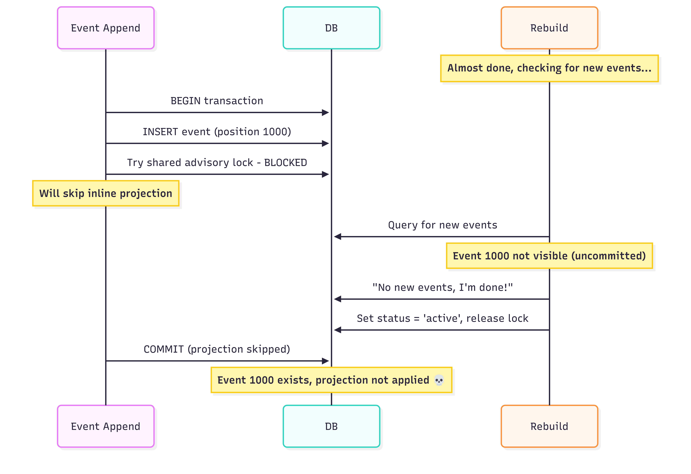
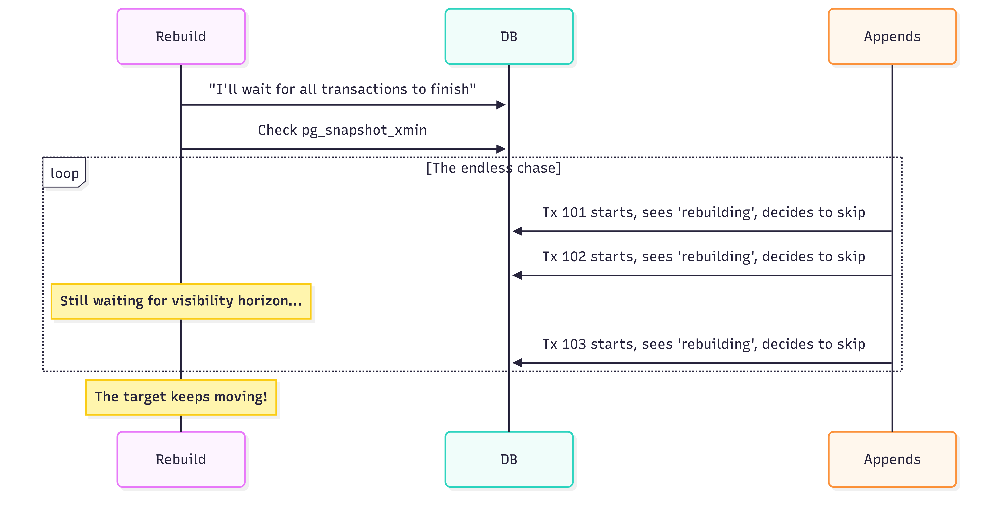
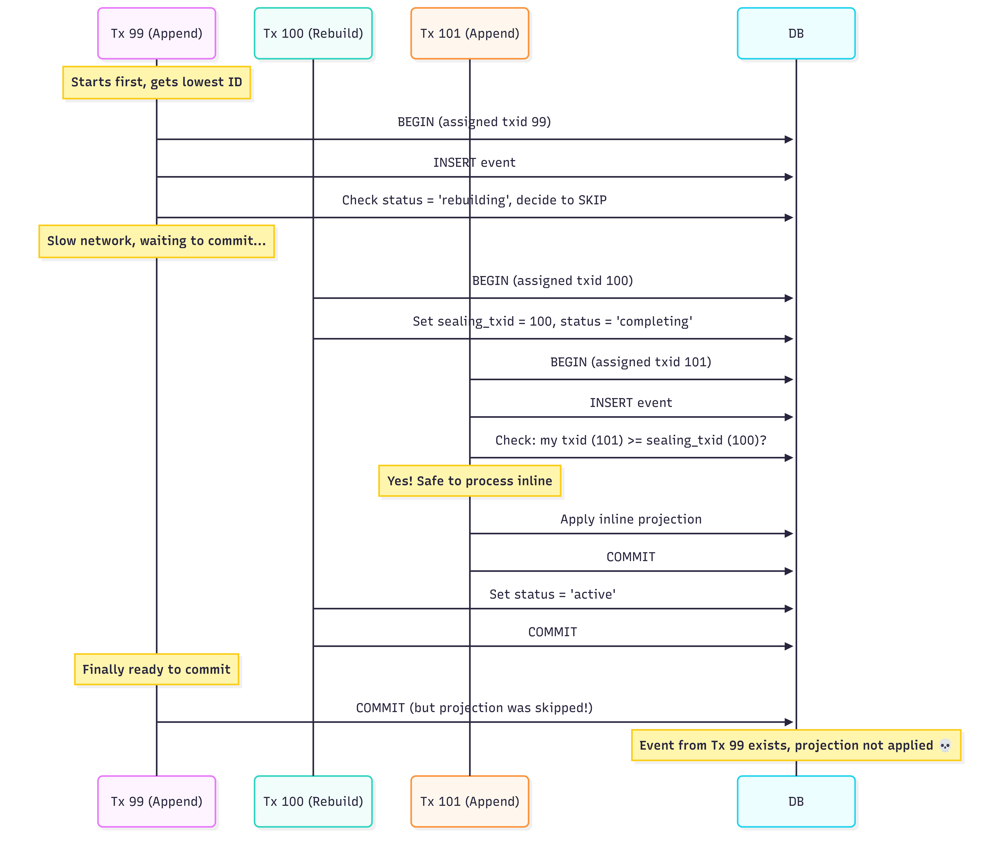
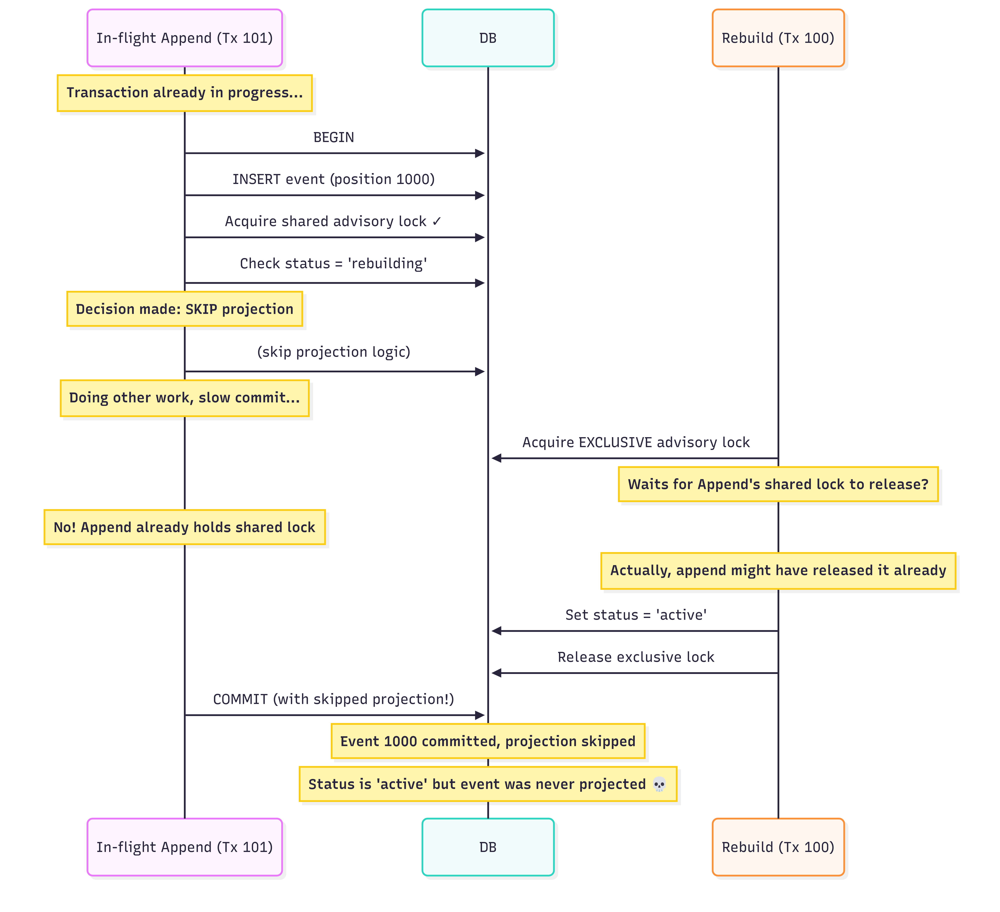
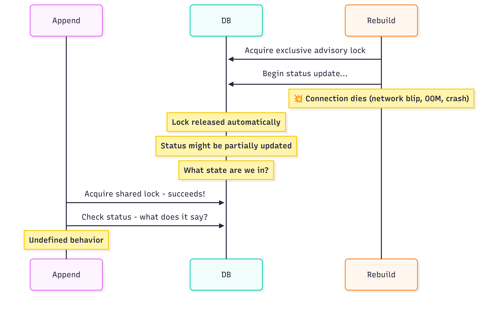
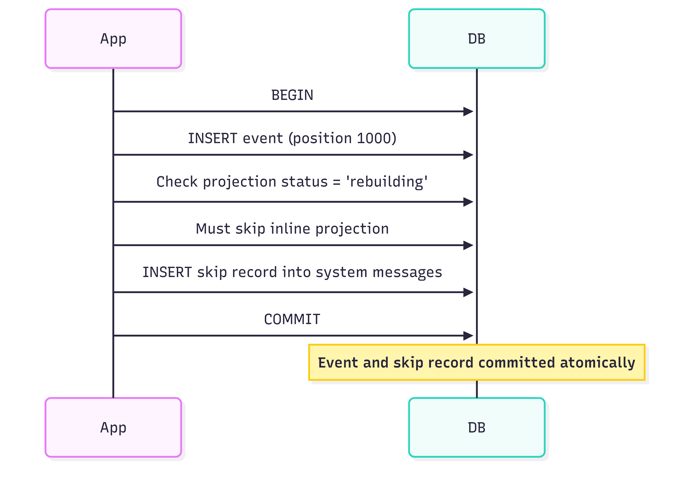
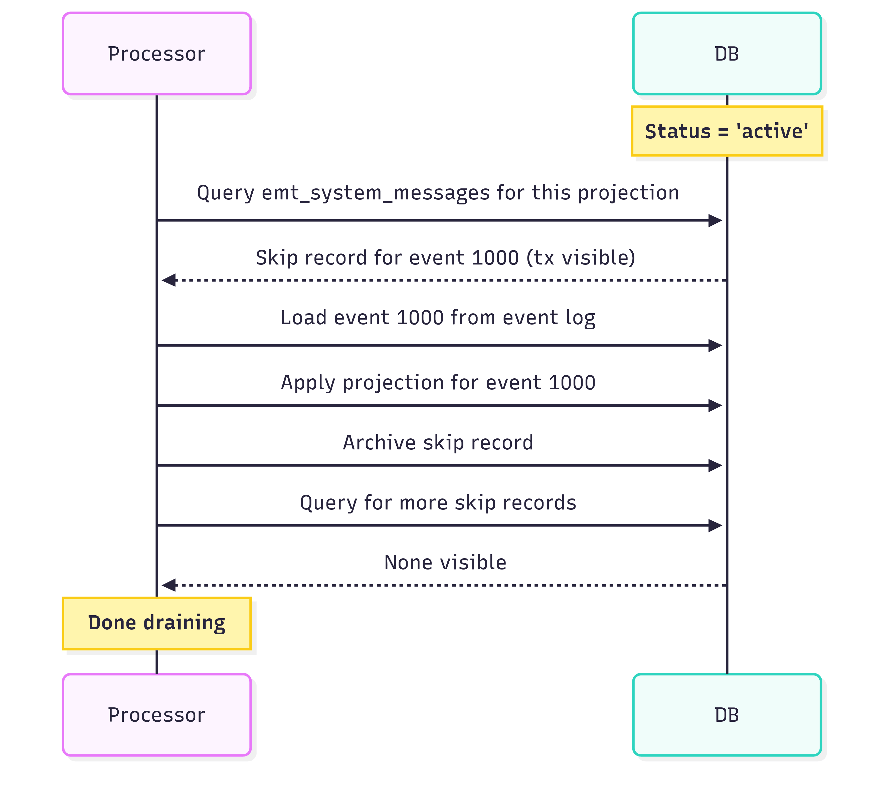

In the last article, I explained [how to rebuild Event-Driven Read Models in a safe and resilient way](/en/rebuilding_event_driven_read_models/). I asked readers to let me know if they find any blind spots in my design.

Well, I found one myself.

This article is about that edge case, but more importantly, it's about the rabbit hole I went down thinking about how to "fix" it. At the end of this hole, there is a nice learning about dealing with distributed systems. Sometimes the best engineering isn't about preventing all failures. It's about recognising your blind spots and making sure they don't catch you off guard.

## Everyone has a plan until they get punched in the mouth

Let me recap the situation described in [the previous article](/en/rebuilding_event_driven_read_models/). We're using PostgreSQL to store events and read models. We want to rebuild an inline projection, one that's applied in the same transaction as the appended event.

In the design from my previous article, during a rebuild, we:
1. Mark the projection as "rebuilding".
2. Skip inline projections (the rebuild process will catch up anyway).
3. Process all historical events.
4. Mark the projection as "active" again.

The hybrid locking strategy with advisory locks and status checks ensures that inline projections know when to skip and that only one rebuild runs at a time.

Sounds solid. Here's where it breaks:

The rebuild process checks for new events, sees none (because event 1000 is still in an uncommitted transaction), declares victory, and sets the projection to active. Meanwhile, the append transaction has already decided to skip the inline projection. When it finally commits, the event exists but was never projected. The rebuild process is done, and only new events will update the projection during the next update to the new event append.

We could handwave it with [it won't ever happen!](/en/no_it_can_never_happen/). But, well, under load, this will happen eventually. You might not even notice it, but it will. The timing window is small, but with enough throughput, it becomes a certainty.

## The Rabbit Hole of "Fixes"

My first instinct was to engineer my way out of this. Surely with enough clever coordination, we can close this gap?

Let me walk you through the rabbit hole.

### Attempt 1: Wait for In-Flight Transactions

PostgreSQL provides *pg_snapshot_xmin(pg_current_snapshot())* which tells us the oldest transaction that's still running. The idea: after processing events, wait until all potentially-skipping transactions have completed before marking the projection as active.

**Why it fails:** We don't know what we're waiting for. While we wait for existing transactions to complete, new transactions start and make their own skip decisions. The target keeps moving. We can never "catch up" because new skips happen while we're waiting for old ones to become visible.

### Attempt 2: Use Transaction IDs as Boundaries

PostgreSQL assigns monotonic transaction IDs to each transaction when it starts. This seems useful—what if we record a "sealing" transaction ID when we're ready to complete the rebuild, and use it to make decisions?

The logic would be:

When rebuild is ready to complete, record sealing_txid = current_transaction_id

Any event from a transaction with ID lower than the sealing point was "in flight" during rebuild, so it should be handled by async
Events from transactions with higher IDs started after sealing, so they can safely use inline projections (the read model will be ready)

Sounds reasonable? 

Here's why it doesn't work.

**The core problem: transaction ID order ≠ commit order.**

When a transaction starts, PostgreSQL assigns it the next available transaction ID. But transactions don't commit in the order they started. A transaction that started earlier (lower ID) might take longer to complete and commit after a transaction that started later (higher ID).

Let's trace through a concrete scenario:

Here's what happened:

1. **Tx 99** started first and got the lowest transaction ID. It inserted an event and decided to skip the inline projection (status was 'rebuilding'). But then it got slow—maybe network latency, maybe the application did other work.
2. **Tx 100** (the rebuild) started second, recorded *sealing_txid = 100*, and prepared to complete.
3. **Tx 101** started third. It checked: "Is my transaction ID (101) >= sealing_txid (100)?" Yes, so it assumed the read model was ready and processed its inline projection. It committed successfully.
4. **Tx 100** marked the projection as active and committed.
5. **Tx 99** finally committed. But it had already decided to skip the projection back when status was 'rebuilding'. That decision was made, the skip happened, and the event is now missing from the read model.

The fundamental issue: **we can't see uncommitted transactions.** When Tx 100 set the sealing point, it had no way to know that Tx 99 was still out there, holding an event that would skip projection. Transaction 99 is invisible until it commits, but by then it's too late.

You might think: "Just wait until all transactions before the sealing point have committed!" PostgreSQL even provides *pg_snapshot_xmin(pg_current_snapshot())* which tells you the oldest active transaction. But this leads us back to Attempt 1—while we wait, new transactions start and make their own skip decisions. The target keeps moving.

I wrote about this exact problem in [How Postgres sequences issues can impact your messaging guarantees](/en/ordering_in_postgres_outbox/). The same visibility challenges that affect outbox ordering apply here. Transaction IDs are useful for ordering within committed data, but they can't help us coordinate with transactions that haven't committed yet.

### Attempt 3: Lock Appends During Transition

What if we use advisory locks more aggressively? The idea: when rebuild is ready to complete, acquire an exclusive lock that blocks the entire append path. While holding this lock, flip the status to 'active'. No appends can be in progress during the flip, so no race condition, right?

Here's the proposed flow:
- Rebuild finishes processing historical events
- Acquire exclusive advisory lock (all new appends must wait)
- Set status = 'active'
- Release lock
- Waiting appends resume and sees 'active', processes inline normally

It should work. In theory. We're creating a synchronisation point where nothing can slip through. But there's a subtle problem: **the skip decision was already made inside the append transaction.**

An append transaction doesn't just check the lock and status at one instant. It does several things:
1. BEGIN transaction
2. INSERT the event
3. Try to acquire a shared advisory lock
4. Check projection status
5. Decide: process inline or skip?
6. Execute that decision
7. COMMIT

The decision in step 5 happens *inside* the transaction. If the transaction saw 'rebuilding' status, it was skipped. That decision is now part of the transaction's pending work. The transaction might be waiting to commit or doing other work, but the skip decision has already been made.

Our exclusive lock in the completion flow blocks step 3 - new transactions can't acquire the shared lock. But what about transactions that already passed step 5 and are just waiting to commit?

The timing here is tricky. Advisory locks in PostgreSQL can be either:
- **Transaction-scoped** (*pg_advisory_xact_lock*): released automatically when transaction commits
- **Session-scoped** (*pg_advisory_lock*): held until explicitly released or session ends

If we use transaction-scoped locks for inline projections (which makes sense—you want the lock tied to the transaction lifetime), then the append transaction might have already released its shared lock by the time we try to acquire an exclusive lock. The lock protected the status check, but the transaction is still running with its skip decision already made.

Even if we could perfectly synchronise the lock acquisition, there's another problem: **advisory locks are session-scoped, not durable.**

If the connection dies while holding the exclusive lock:
- The lock releases immediately (that's how advisory locks work)
- We might have partially updated the status
- The system is now in an unknown state
- Other transactions resume with potentially inconsistent data

We can't build reliable coordination on something that vanishes when connections fail. This is exactly why the original article combined advisory locks with persistent status checks—but that combination doesn't solve this particular race condition.

### TLDR on Attempts

Every "fix" follows the same pattern:
1. Identify a coordination point.
2. Discover there's a window before that point we can't see.
3. Try to close that window.
4. Create a new window somewhere else.
5. Repeat.

We're not solving the problem. We're relocating it.

So is it a bug in the initial design? Depending how you look on that. I see it as an example of fundamental property of concurrent systems. PostgreSQL's isolation guarantees mean uncommitted transactions are invisible to other transactions. That's a feature, not a bug - but it means there's always a window we can't see into.

## Stop Fighting, Start Tracking

After chasing my tail through various "solutions," I stepped back and asked a different question.

Instead of: *"How do we prevent events from being skipped?"* (which requires blocking appends or seeing into uncommitted transactions—both unacceptable because of performance, guarantees etc.)

I started to think on: *"How do we know when an event was skipped?"* and *"How do we ensure skipped events get processed eventually?"*

Both of these are solvable.

If we can't prevent skips from happening, let's make them visible. When an inline projection skips, it could record that it skipped in the same transaction as the event append.

If the append transaction rolls back, the skip record also rolls back (there's no event to worry about). If it commits, we have a durable record of exactly what was skipped.

In Emmett, I'm using a dedicated *emt_system_messages* table rather than reusing the regular *emt_messages* table or creating a simple "skipped events" table. This might seem like over-engineering—why not just create a simple table with projection ID and event position? Or why not just reuse the existing messages table?

**Why a dedicated system messages table?**

The regular *emt_messages* table is for business events—the actual domain events that drive your application. Mixing system-level concerns (like "this projection skipped this event during rebuild") with business events pollutes the event log and makes it harder to reason about.
A simple "skipped_events" table with just (projection_id, event_position) could be enough, but in the long term, it may be hard to maintain. As systems evolve, we'll have more cases where we might want to skip events. Plus, having system events recorded with all metadata gives us full observability of the internals of our system. We could even make tables for projections and processors' status, built as read models from system events! Still, let's hold our horses and get back to our use case.

The system messages table could mirror the structure of regular messages with:
- Global position sequencing (with all the transaction visibility handling from the [outbox ordering article](/en/ordering_in_postgres_outbox/))
- Transaction ID tracking for proper visibility checks
- Archiving support via *is_archived* flag
- Partitioning for performance

If we created a throwaway "skipped events" table, we'd need to solve all these problems again. We'd essentially be building a second event log with the same guarantees. 

The skip could be stored as a system message where:
- **Stream ID** = the projection identifier (name + version), so we can query all skips for a specific projection
- **Message data** = reference to the original event (sequence ID from the event log)
- **Message metadata** = processor ID, reason for skip, timestamp
- **Message type** = indicates this is a "skip during rebuild" system event

 **Won't this table grow too much? It may, but we can archive skip events when they're no longer needed.**

When the rebuild processor handles a skipped event, we could archive it. In Emmett, this means setting is_archived = true on the record. The table is partitioned by this flag. Archived records automatically move to a separate partition, which can even be on a different disk drive.

Why archive instead of delete?
- Audit trail: You can see what was skipped and when it was processed
- Debugging: If something goes wrong, you have history to investigate
- Idempotency: If a processor crashes and restarts, it won't reprocess already - archived skips

Later, we could define retention policies and clean up old archived records. We could do it more aggressively than for business events, since these are operational records, not business history. You might keep business events forever, but archived skip records only need to stick around long enough for debugging (days or weeks, not years).

The same processor that handles regular events for the projection could also process its skipped records. When it reads an event from the main event log and applies the projection, it also checks for and archives any corresponding skip record for that event position. This keeps everything in sync.

As mentioned, this also opens the door for other system events in the future - not just rebuild skips, but potentially failed projections, poison messages, or audit records. The infrastructure would already be in place, separated from the business event log.

## The Final Flow

Let me walk through how this works in practice, bringing together all the pieces.

### During rebuild

The projection status is 'rebuilding'. The async rebuild processor works through historical events from the beginning. Meanwhile, normal operations continue. Events are appended, and inline projections check the status. When they see 'rebuilding', they skip the projection but record a skip message in emt_system_messages within the same transaction.

### When rebuild catches up

The rebuild processor eventually reaches the current position where no new events are visible. At this point, it sets the status to 'active'. From now on, new appends will process their inline projections normally.

But what about those skip records? The events they reference exist, but their projections were never applied.

### Draining the skipped events

The rebuild processor (or a dedicated processor, or a manual trigger—your choice) now queries emt_system_messages for skip records belonging to this projection. Using the same transaction visibility rules from the outbox pattern (transaction_id < pg_snapshot_xmin), it only sees skip records from committed transactions.

For each skip record:

1. Find the referenced event in the event log (or use its data if stored in skipped event)
2. Apply the projection for that event
3. Archive the skip record (set is_archived = true)

The skip record and the event are committed in the same transaction. This gives us a simple invariant: if an event exists, either its projection was applied inline (status was 'active') or a skip record exists (status was 'rebuilding'). There's no third option where an event exists without a trace.

The drain process might find new skip records appearing. Transactions that were in flight during the status change, committed after we started draining. That's fine. We keep querying until no more visible skip records exist. They will stop appearing as we alread stopped rebuilding processor, so no more inline projections should be skipped.

The "drain skipped events" phase can be automatically triggered by finishing projection rebuild. It could be handled as the 2nd phase of rebuild processor, or triggering a dedicated one. It could be also just handled by a human initiating the drain.

This flexibility lets user choose the approach based on the specific operational requirements.

## The Dead Letter Queue Pattern

What we've built is essentially a **Dead Letter Queue (DLQ)**—a place where messages that couldn't be processed normally are stored for later handling.

This pattern exists in every serious messaging system:

- **Apache Kafka:** Dead Letter Topics for messages that fail consumer processing
- **RabbitMQ:** Dead letter exchanges for rejected or expired messages
- **AWS SQS:** Redrive policies that move messages to a DLQ after N failures
- **Azure Service Bus:** Built-in dead-letter sub-queues for each queue

The pattern is universal because all messaging systems face the same fundamental problem: sometimes messages can't be processed immediately, and you need a place to store them without blocking the rest of the system.

It's a topic in its own right, as it's not perfect and should be used cautiously. Many teams fail to apply them correctly. The DLQ becomes like a car alarm in a parking lot, technically signalling a problem, practically ignored by everyone. And that's what I see in many systems: teams set up DLQs and do nothing about them.

It starts innocently. You configure the DLQ "just in case." A few messages end up there during a deployment. Someone says, "We'll look at it later."

More messages accumulate. The DLQ becomes background noise—a number on a dashboard that nobody checks. Eventually, something critical lands there, and nobody notices until a customer complains.

That's why in the discussed design, skip records aren't meant to accumulate indefinitely. The rebuild processor drains them during completion. 

Retention policies clean up archived records after a reasonable period. If skip records exist for too long, that's a signal that something is wrong with the rebuild process - and users should know about it.

A DLQ is only helpful if it's monitored, processed, and understood why messages end up there. Otherwise, it's just a fancy way to lose data slowly rather than immediately.

## The Broader Lesson

This article isn't really about PostgreSQL advisory locks or projection rebuilding. It's about how we approach problems in distributed systems.

When we find a race condition, the instinct is to fix it. Add a lock. Add a check. Add a coordination phase. But each "fix" often just moves the race condition somewhere else. We went through three attempts—waiting for transactions, using transaction ID boundaries, locking appends—and each one failed for a different reason. We weren't solving the problem; we were relocating it.

At some point, I had to ask myself: am I making this system more reliable, or just more complicated?

The answer came when I changed the question. Instead of asking "how do I prevent events from being skipped?" I asked, "How do I know when an event was skipped, and how do I make sure it gets processed eventually?" 

The first question has no good answer, not without blocking appends, which defeats the purpose. The second question is straightforward: record the skip in the same transaction as the event, and process it later.

A system isn't trustworthy because it never fails. That's impossible for anything sufficiently complex. A system is trustworthy because you know when it can fail, how it will fail, and how to recover. The skip tracking approach doesn't prevent failures during the transition period. It makes them visible and recoverable. That's a stronger guarantee than complex coordination machinery with hidden edge cases.

**Sometimes the best engineering decision is to accept what you can't control and focus on what you can.** We can't control PostgreSQL's transaction visibility rules. We can't see into uncommitted transactions. We can't make the append decision and the rebuild completion atomic without stopping the world.

What we can control is recording skipped items, ensuring those skips are processed, and making the whole thing observable. That's enough.

The blind spot I found wasn't really about the specific race condition. It was a reminder that distributed systems have fundamental constraints we can't engineer around, at least not without trade-offs worse than the original problem.

Transaction isolation and concurrent systems mean we can't have zero-downtime rebuilds with perfect inline projection consistency and no coordination overhead, all at the same time. 

Something has to give.

What we get instead is explicit tracking of what was skipped, guaranteed eventual processing via the system messages table, observability into the transition period, and crash recovery that doesn't lose data. The read model might be briefly inconsistent during the transition, but we know exactly what's missing, and we have a clear path to fix it.

That's the kind of system I can reason about and trust.

---

**If you're dealing with similar challenges, I'm happy to help through [consulting or mentoring](mailto:oskar@event-driven.io).** You can also join the discussion in our [Emmett Discord](https://discord.gg/fTpqUTMmVa)—we have a nice community working through these exact problems.

Or check also other related resources:
- [Rebuilding Event-Driven Read Models in a safe and resilient way](/en/rebuilding_event_driven_read_models/)
- [How Postgres sequences issues can impact your messaging guarantees](/en/ordering_in_postgres_outbox/)
- [Guide to Projections and Read Models in Event-Driven Architecture](/en/projections_and_read_models_in_event_driven_architecture/),
- [Distributed Locking: A Practical Guide](https://www.architecture-weekly.com/p/distributed-locking-a-practical-guide),
- [Consumers, projectors, reactors and all that messaging jazz in Emmett](/en/consumers_processors_in_emmett/),
- [How to scale projections in the event-driven systems?](/en/how_to_scale_projections_in_the_event_driven_systems/),
- [Checkpointing the message processing](/en/checkpointing_message_processing/),
- [Let's talk about positions in event stores](/en/lets_talk_about_positions_in_event_stores/).

Cheers!

Oskar

p.s. **Ukraine is still under brutal Russian invasion. A lot of Ukrainian people are hurt, without shelter and need help.** You can help in various ways, for instance, directly helping refugees, spreading awareness, putting pressure on your local government or companies. You can also support Ukraine by donating e.g. to [Red Cross](https://www.icrc.org/en/donate/ukraine), [Ukraine humanitarian organisation](https://savelife.in.ua/en/donate/) or [donate Ambulances for Ukraine](https://www.gofundme.com/f/help-to-save-the-lives-of-civilians-in-a-war-zone).
