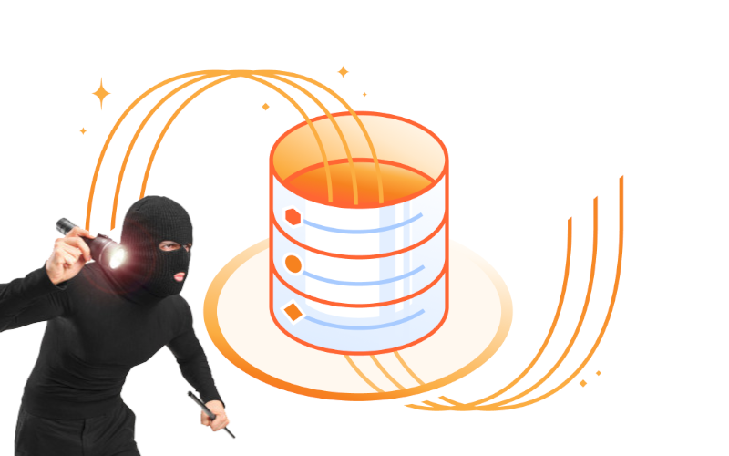

We're being told that software design is the art of making tradeoffs. But... Are we taught how to make them?

Not that it's easy to teach tradeoffs, it's a subtle art of explanation. You need to provide enough context and be precise so others don't treat tradeoffs as a general best practice. Because they're usually not such, they typically come from the muddy banks of the Wishkah River.

I think that a decent way is to tell the story. Not the fairy tale, but the specific tradeoff applied in practice. That's what I'm going to do today: tell you how I cheated on database transactions.

## Dumbo

Do you know Dumbo? Of course, flying elephant, such a sweetie. It's also a codename of my Open Source project. I didn't tell you about it so far, as it's a shared dependency for [Pongo](https://github.com/event-driven-io/pongo) and [Emmett](https://event-driven-io.github.io/emmett/getting-started.html), responsible for:
- connection pooling,
- safe connection lifetime management,
- handling transactions,
- migrations,
- SQL execution.

Not that small a scope for a Dumb tool, aye? Still, the intention is to make usage dumb, hiding the weirdness of a specific SQL database, so I solve it once and don't need to be constantly distracted thinking about it, but focus on:
- How to append and process events the best way in Emmett,
- How to make the best JSON handling and translation into specific SQL dialects in Pongo.

Dumbo usage is quite simple:

```ts
import { dumbo } from '@event-driven-io/dumbo';
import { pgDumboDriver } from '@event-driven-io/dumbo/pg';

const pool = dumbo({ connectionString, driver: pgDatabaseDriver });
```

You need to set up a specific database driver (e.g. _pg_ for PostgreSQL or _sqlite3_ for SQLite), as Dumbo now supports multiple relational databases.

Having that, you can do stuff like:

```ts
import { SQL } from '@event-driven-io/dumbo';

await pool.execute.batchCommand([
  SQL`CREATE TABLE test_users (id SERIAL PRIMARY KEY, name TEXT)`,
  SQL`INSERT INTO test_users (name) VALUES ('Alice'), ('Bob')`,
]);
```

And also do queries:

```ts
const count = pool.execute.query<{count: number}>(
  SQL`SELECT COUNT(*) as count 
      FROM test_users 
      WHERE ${SQL.in('id', userIds)}`,
);
```

It'll handle query parameterisation, data escaping, etc.

It can also handle transactions:

```ts
const users = await pool.withTransaction(async (tx) => {
  await tx.execute.command(
    SQL`INSERT INTO test_users (name) 
        VALUES (${firstUserName}), (${secondUserName})`,
  );

  return execute.query<User>(
    SQL`SELECT *
        FROM test_users 
        WHERE ${SQL.in('id', userIds)}`,
   );
});
```

As simple as this looks, you should already have the question about the first tradeoff I made in your head.

**Why on earth I think that's a sane move to write my own multi-database driver?!**

Well, I agree, that's not the best move at the first glance, but let me explain to you why in **MY** context this actually makes more sense:

1. Yes, there are tools like Knex, Kysely, Drizzle, etc. in Node.js land that handle similar stuff. They're nice, I really like them, I really do, but... But they are all big and are bringing a lot of their conventions, and when I'm building storage tools like Emmett and Pongo, I need to have more control. I don't want those tools and their limitations drive my architecture decisions. I also don't want to be surprised when the creator decides to drop working on it, or when I become a victim of a supply chain attack. Still, when I want a new kitchen table, I don't start by going to the forest with a saw. I'm still using existing database drivers, what's more I'm allowing people to choose the one they prefer. I just don't want to be driven (and also my users be driven) by some other higher abstraction tool.

2. Even with that, this decision can seem like a bold "how hard can it be?!" statement. And it is, but... But I've built, or was co-authoring, such tools in the past. Some were proprietary, some were Open Sourced (see [Weasel](https://github.com/JasperFx/weasel)). And they served me well.

3. And last but not least, the last point. Well, I only had those two above. OK, I can add that I didn't plan to make it a general-usage tool, just a small one for my needs.

So I did.

And here we're at the moment when I had to cheat on transactions because of those decisions.

## Cloudflare D1

All relational databases seem similar, but only until you start using them extensively, or until you need to write your own storage library. Then you learn stuff that not necessarily the stuff you'd like to spend time on. For instance:
- What's the difference between databases like PostgreSQL and single-threaded databases like SQLite or DuckDB, and how concurrent processing can be surprising
- or that sqlite3 only calls the first query, but the next silently ignores,
- etc.

Still, well, abstractions like Dumbo give the possibility to _massage_ such cases behind the scenes.

And then Cloud Databases and SaaS Databases came into play, like Cloudlfare D1.

I was motivated by the generous sponsorship from [Sam Hatoum](https://www.linkedin.com/in/samhatoum) to make supporting Emmett and Pongo a top priority. Thanks Sam, appreciate that! And I made it, but I had to cheat a bit.

Databases like Cloudflare D1 and Supabase expose databases as pay-as-you-go services. They optimise deployment, making it highly scalable, so you don't need to care about it. It's cost-effective for start-ups and scenarios when you're not under a huge load. If you are, then you'll need to pay more, but they also give you autoscaling at least.

They do it by exposing the database API through HTTP API, for instance [PostgREST](https://docs.postgrest.org/en/v14/). This gives them easier management around throughput, security, etc., as each call is made as an HTTP request through the exposed API.

Yet, that kills some options like: ekhm, transactions. The challenge with transactions is that they don't scale (that's why [MongoDB is WebScale](https://www.youtube.com/watch?v=b2F-DItXtZs)). They don't scale, as you'd need to open a transaction, do some freehand operations, and then commit or rollback. That means (typically) you need to keep a connection open during that time. If you're building SaaS, it's a no-go, because sneaky users would open it for a few hours, do crazy stuff, and kill your SaaS resources' utilisation.

But, boy, aren't transactions one of the selling points of relational databases? They do, so how to proceed?

**Then you need to cheat, as I did.**

## Repeatable reads, batches, etc.

Cloudflare D1 doesn't provide transaction data for the reasons I outlined, but it doesn't leave us without other tools. Those two tools to let me do the smoke and mirrors trick are:
- sessions,
- SQL batches.

What are sessions? [Per Cloudflare Docs](https://developers.cloudflare.com/d1/best-practices/read-replication):

> A session encapsulates all the queries from one logical session for your application. For example, a session may correspond to all queries coming from a particular web browser session. All queries within a session read from a database instance which is as up-to-date as your query needs it to be. Sessions API ensures [sequential consistency](https://developers.cloudflare.com/d1/best-practices/read-replication/#replica-lag-and-consistency-model) for all queries in a session.

Essentially, that means that we're getting [repeatable reads](https://jepsen.io/consistency/models/repeatable-read). So when we're starting specific sessions, they will be handled sequentially.

**And now, the second ingredient: Batches. Per [Cloudflare docs](https://developers.cloudflare.com/d1/worker-api/d1-database/#batch)**

> Sends multiple SQL statements inside a single call to the database. This can have a huge performance impact as it reduces latency from network round trips to D1. D1 operates in auto-commit. Our implementation guarantees that each statement in the list will execute and commit, sequentially, non-concurrently.
> 
> Batched statements are [SQL transactions](https://www.sqlite.org/lang_transaction.html). If a statement in the sequence fails, then an error is returned for that specific statement, and it aborts or rolls back the entire sequence.
> 
> To send batch statements, provide D1Database::batch a list of prepared statements and get the results in the same order.

So Cloudflare didn't allow us to do the full, freehand transaction, but they allowed us to send multiple statements that internally will be executed as a SQLite Transaction. When the request is handled, it'll open a transaction, run the statements, and return the results.

**Cool, let's mix this soup together, as having that, I decided to:**

1. Fail automatically if someone tries to create a transaction on Cloudflare D1 with an error: 

> D1 does not support SQL transactions (BEGIN/COMMIT/ROLLBACK/SAVEPOINT).  Use { mode: "session_based" } to opt-in to session+batch semantics, or use 'connection.execute.batchCommand() for atomic multi-statement execution.

Then they get clear information on the first try.

2. Allow users to explicitly open a session-based transaction by providing mode:

```ts
const users = await pool.withTransaction(
  async (tx) => {
    await tx.execute.command(
      SQL`INSERT INTO test_users (name) 
      VALUES (${firstUserName}), (${secondUserName})`,
    );

    return tx.execute.query<User>(
      SQL`SELECT *
              FROM test_users 
              WHERE ${SQL.in('id', userIds)}`,
    );
  },  
  { mode: 'session_based' }
);
```

When they do it, they will need to be aware of the limitations of the tool they have. So that this will internally create a D1 session, and only handle a single batch of operations properly. We're mimicking the sequential processing by the session-based repeatable reads capability. Still, we need to remember that we won't be able to roll back changes across multiple statements. Only a single command or batch command is an atomic operation. 

We can't, for instance, run a batch of updates, and fail the whole batch if one update didn't change any record. The batch will only fail if the database throws an exception. An exception can be in SQLite only called by a table constraint or trigger.

By making this choice to require explicit mode and naming it explicitly, I didn't manage to cover all cases, but at least made it safe, so people need to learn about this non-default behaviour and be more careful about it. When designing an API, it's usually better to start with a more strict option and do a bit of _"scarification"_ sometimes.

Still, when I implemented that in [Emmett](https://event-driven-io.github.io/emmett/getting-started.html) and [Pongo](https://github.com/event-driven-io/pongo), I intentionally used it to enable event appends, but document operations, etc.

If you'd like to try it, you can check Emmett's or Pongo's beta versions.

For Pongo, you can install it with:

```shell
npm install @event-driven-io/pongo@0.17.0-beta.21
```

And use it as:

```ts
import { d1PongoDriver } from '@event-driven-io/pongo/cloudflare';

const client = pongoClient({
  driver: d1PongoDriver,
  database,
  transactionOptions: { mode: 'session_based' },
});
```

Or in Emmett by installing:

```shell
npm install @event-driven-io/emmett-sqlite@0.43.0-beta.1
```

And use it as:

```ts
import { getSQLiteEventStore } from '@event-driven-io/emmett-sqlite';
import { d1EventStoreDriver } from '@event-driven-io/emmett-sqlite/cloudflare';

const eventStore = getSQLiteEventStore({
  driver: d1EventStoreDriver,
  database,
});
```

Still, even if you don't care about Emmett, Pongo, and my Open Source project, I hope that this will give you decent inspiration for your own tradeoffs analysis. 

I hope that you learned a bit about how design APIs work, how to check the guarantees of your tools and learn to walkaround them when you have to.

Cheers!

Oskar

p.s. **Ukraine is still under brutal Russian invasion. A lot of Ukrainian people are hurt, without shelter and need help.** You can help in various ways, for instance, directly helping refugees, spreading awareness, putting pressure on your local government or companies. You can also support Ukraine by donating e.g. to [Red Cross](https://www.icrc.org/en/donate/ukraine), [Ukraine humanitarian organisation](https://savelife.in.ua/en/donate/) or [donate Ambulances for Ukraine](https://www.gofundme.com/f/help-to-save-the-lives-of-civilians-in-a-war-zone).
