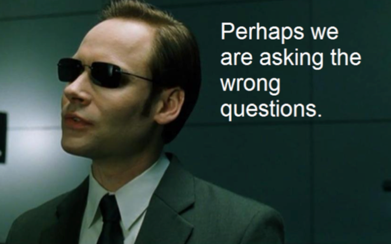

**Be careful what you wish for, because your wish may come true.**

What LLMs revealed is how many people in our industry don't like to code.

It's intriguing that now they claim and showcase what they "built with Claude", whereas usually that means they generated a PoC.

It's funny, as people still focus on how they're building, so it's all about the code. And if that's the message sent outside, together with the thought that LLMs are already better than "average coder Joe", then the logical follow-up question is: why do we need those humans in the loop?

**I think that most people look at the forest and see trees.** The current way of working with LLMs is not scalable. It's transition phase. I can't imagine calling myself an engineer and doing ONLY [stringly-typed](https://web.archive.org/web/20200217080706/http://blog.codinghorror.com/new-programming-jargon/) development with chat or markdown.

What I can imagine is getting help from it, and using those tools as a help for research, for generating the OUTPUT, still keeping me responsible for the OUTCOME.

Why am I saying that we're in the transition phase? As prompting in our natural language is not precise, it's verbose, and adding a translation layer between our freeform prompts and programming languages is a waste of time (and tokens, which LLM vendors love).

**I think that we'll still be coding, but with some other layer, as LLMs are good with structured input, like programming languages.** So we might need other programming languages than we have atm. Might we need different tools to evaluate LLMs' output to make it deterministic? Might we need a different approach for engineering to make it scalable? Might we need more?

Still, I don't see those discussions.

I mostly see: noise and celebrities who don't code showing their beautiful PoCs. And doing a mic drop about the end of coding. Just like PoC represents the whole Software Development Life Cycle.

**So, will we code or not?**

If the answer is yes, let's talk about what's next, then let's discuss how and when.

If the answer is not, then let's talk about how our job will change, ask if it's still engineering, etc.

Let's try to make our discussions more precise, more focused on the essence, and avoid them from becoming just a bunch of anecdotal evidence.

Noone outside our industry cares how we code unless it changes the cost, quality, or delivery time.

Let's discuss the impact that matters, rather than just the amount of code we produce (or not).

Now, guess who I am quoting:

> Imagine you’re a software application developer. Your programming language of choice (or the language that’s been foisted on you) is Java or Typescript. You’ve been at this for quite a while and your job doesn’t seem to be getting any easier.
>
> These past few years you’ve seen the growth of multiple incompatible architectures. Now you’re supposed to cope with all this and make your applications work in a distributed client-server environment. The growth of the Internet, the World-Wide Web, and “electronic commerce” have introduced new dimensions of complexity into the development process.
>
> The tools you use to develop applications don’t seem to help you much. You’re still coping with the same old problems; the fashionable new object-oriented techniques seem to have added new problems without solving the old ones.
>
> You say to yourself and your friends, “There has to be a better way”!
>
> **The Better Way is Here Now**
>
> Now there is a better way—it’s our new model. Imagine, if you will, this development world…
>
> - It’s still dead simple.
> - Your development cycle is much faster.
> - Your applications can be created across multiple platforms. Write your spec once, and you never need to port them—they will be recreated if you without your hand-rolled modification on multiple operating systems and hardware architectures.
> - Your applications are adaptable to changing environments.
> - Your end users can trust that your applications are secure, and you can use protection against viruses and tampering through security scans.
> 
> You don’t need to dream about these features. They’re here now. 

And also this from another source:

> When I started interviewing programmers in 2005, I would generally let them use any language or tool they wanted to solve the coding problems I gave them. 99% of the time, they chose Java.
>
> Nowadays, they tend to choose LLMs.
>
> Now, don’t get me wrong: there’s nothing wrong with LLN as an implementation tool.
>
> Wait a minute, I want to modify that statement. I’m not claiming, in this particular article, that there’s anything wrong with LLM as an implementation tool. There are lots of things wrong with it but those will have to wait for a different article.
> 
> Instead what I’d like to claim is that LLM is not, generally, a hard enough programming tool that it can be used to discriminate between great programmers and mediocre programmers. It may be a fine tool to work in, but that’s not today’s topic. I would even go so far as to say that the fact that LLMs aere not hard enough is a feature, not a bug, but it does have this one problem.

Well, I cheated you, but only a bit. I changed “Java” to “LLM ” and cut some phrases.

The first one is from [“The Java Language Environment”](https://www.stroustrup.com/1995_Java_whitepaper.pdf) by Sun Microsystems, introducing Java in 1995.

The second one was from Joel Spolsky’s [“The Perils of JavaSchools”](https://www.joelonsoftware.com/2005/12/29/the-perils-of-javaschools-2/blog) article, written in 2001.

Let me be clear. I’m not trying to do grandpa talk on the old days and claim that it’s the same old thing.

What I’m trying to say is that we were continuously introducing new abstractions into our development cycle to scale it. By scale, I mean: getting more people to deliver more code. Even Java was invented for precisely this goal. Yes, the one that’s together with craftsmanship madness presented as “the enterprisy complex environment”. In the early days, it was just said that it’ll make us dumber.

**The goal of abstraction is not to gatekeep but to allow us to reduce cognitive load.** We invented new languages to help us, but then added more components like a distributed environment, multiregion, because of globalisation. For the same reasons, we use cloud-native tooling so we don't have to deal with it.

Some of the architecture and security tools were commoditised by the cloud. We don’t need to think about much stuff we had to do before.

Will Claude-native do the same?

We don’t need to learn Assembler, C++, Lisp anymore; we have lost a lot of mechanical sympathy. We deal with higher abstractions, but we still engineer solution, we still code, is it a different coding? It is. Is it better or worse? Well, it is how it is. As Gerald Weinberg said:

> Things are the way they are because they got that way

And now the question is whether we’re fine with the way we’re doing stuff, and where we're getting to.

Personally, I don’t think that stringly-typed markdown or chat-based design will be the thing in the future.

Knowing how skilled we were always with:
- breaking down tasks into smaller chunks,
- writing precisely what we had in mind,
- thinking before doing,
- waging tradeoffs,

I'm optimistic about the Spec-Driven Design idea. It's going to be great.

Not.

If we want to call ourselves engineers, we need to put more structure and determinism.

I agree that reviewing all code generated by the GenAI is not sustainable.

But I also don’t think that generating tons of code is, in general, sustainable.

With the current state of the art we have, sure, that’s some solution to just generate based on the tools we have.

But let’s start to think what’s next.

Simon Wardley [brought an interesting point](https://www.linkedin.com/feed/update/urn:li:activity:7426977059677077504/):

> That said, it is fine for an entire culture to decide that producing outputs matters more than understanding mechanisms. You only have to compare the practical engineering of the Roman Empire and the loss of inquiry from science in the Hellenistic age to see this. When the Roman Empire collapsed, the practical knowledge embedded in those institutions (how to maintain aqueducts, how to produce certain grades of concrete) was lost remarkably quickly. Not because people decided to forget it, but because the knowledge was procedural, embedded in chains of practice rather than recorded as transferable understanding. When the chains of practice broke, that embedded knowledge went with them. We had to rediscover the art of inquiry (i.e. Science) to bring them back.

So if we don’t code, how do we hone our skills? How will newcomers from LLMSchools (using Joel’s terms) be able to decide whether something is wrong or right? I don’t think that you can be good on something without doing it.

The paradox with code is that it’s not an asset; it’s a liability. Some say that code doesn’t matter, only proper design. But how do you define _"proper design"_? Yes, code style doesn’t matter as long as it works as expected. But...

But code eventually matters, as that’s the source of truth for what’s on production. As Alberto Brandolini said:

> It's developers' (mis)understanding, not domain experts' knowledge, that gets released in production.

Now, it’s the developers’ and LLMs’ misunderstandings that are deployed to production, not the expert’s knowledge. Neither the markdown spec.

And coding is just one danger.

**Outsourcing thinking is an even more dangerous path, as:**

- If LLMs are doing everything, then what are humans for? Aren’t we cutting the branch on which we’re sitting?
- LLMs are statistical parrots. They repeat the most possible answer. Which means mediocre. This can still be fine enough for many cases, but for those we want to make a difference for? Definitely not.
- Just like we’re losing our coding skills by not doing them, we’re losing design skills by not practising them.

Of course, whatever happens, LLMs will stay with us. How and where it’s hard to say. Unless you have a Magic 8 Ball of 100% correct predictions. I don’t.

That’s why I’d like our industry to finally start mature discussions on the real impact. I would like us to stop acting like children, bragging about generating code and then claiming that code doesn’t matter.

I’d like to think about how to reshape our SDLC process and make it sustainable.

I’d like us to think about what tools we need, and how to change what we have.

If we won’t finally start to do it, then things will be the way they are because they got that way.

And it might not be what we wished for.

Cheers

Oskar

**p.s.** to kinda prove that I’m more sceptic and pragmatic than hater, I recently started playing with building an Agent with Emmett to better understand those tools. If you’d like to read about the findings and honest thoughts I have while doing it, please comment!

p.s.2. **Ukraine is still under brutal Russian invasion. A lot of Ukrainian people are hurt, without shelter and need help.** You can help in various ways, for instance, directly helping refugees, spreading awareness, putting pressure on your local government or companies. You can also support Ukraine by donating e.g. to [Red Cross](https://www.icrc.org/en/donate/ukraine), [Ukraine humanitarian organisation](https://savelife.in.ua/en/donate/) or [donate Ambulances for Ukraine](https://www.gofundme.com/f/help-to-save-the-lives-of-civilians-in-a-war-zone).