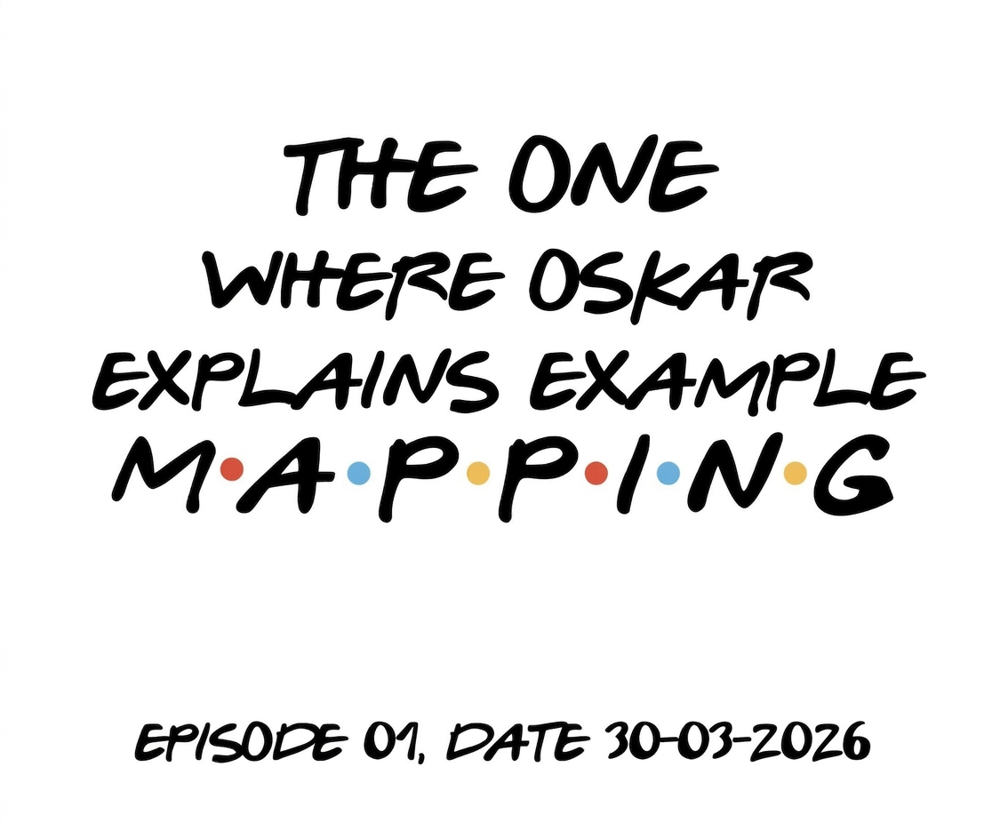
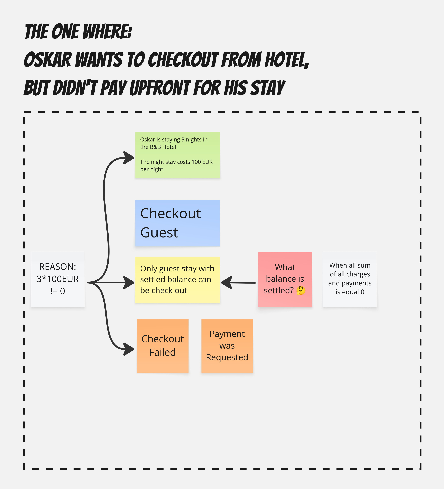
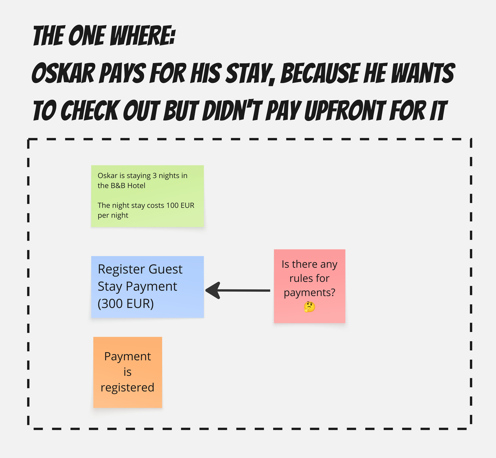
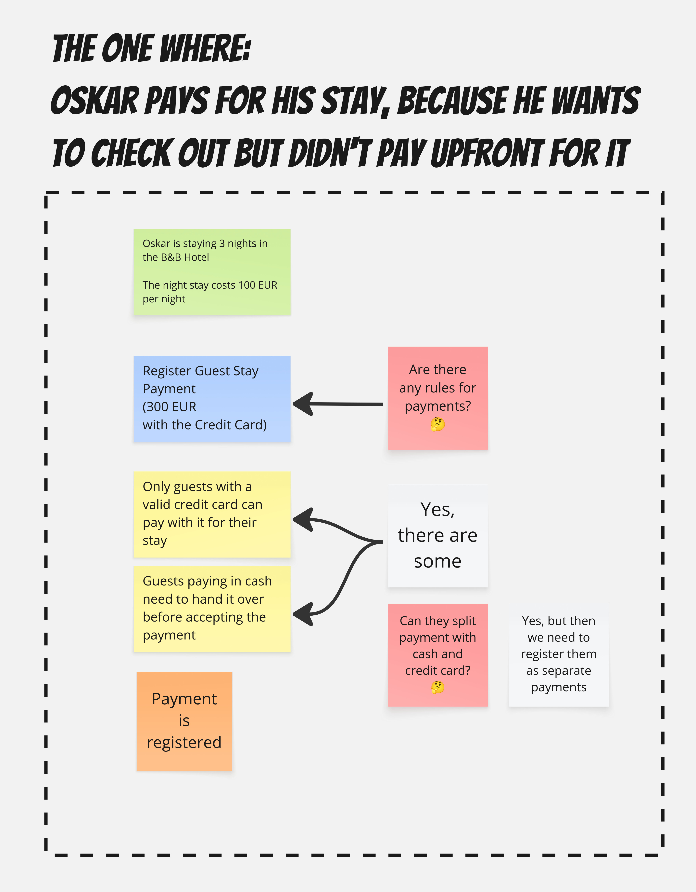
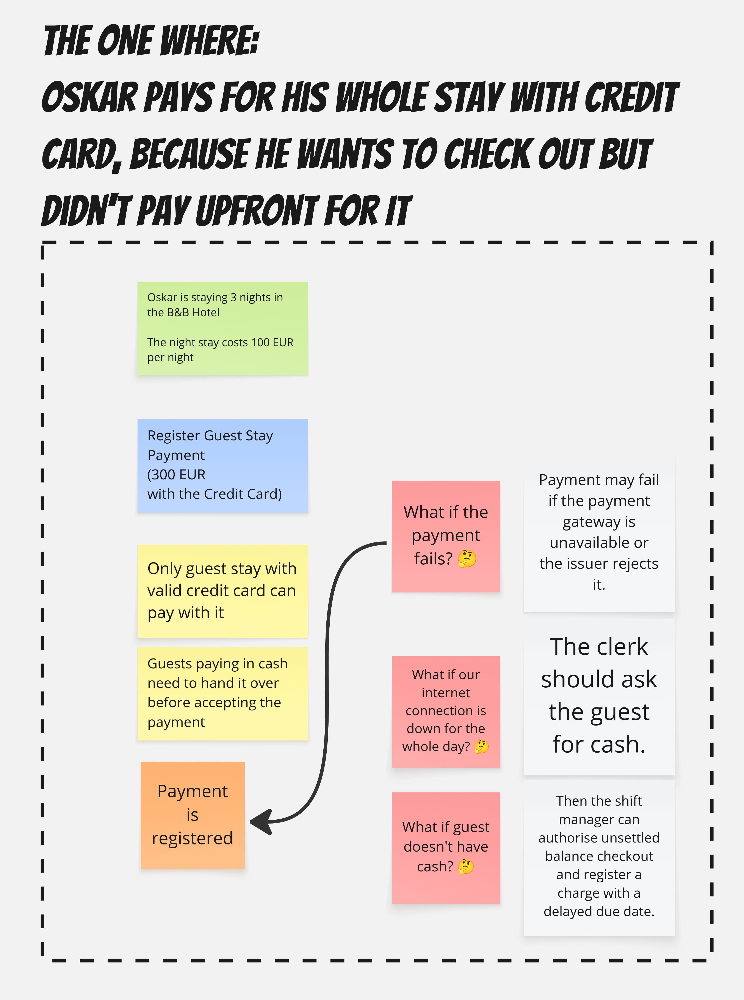
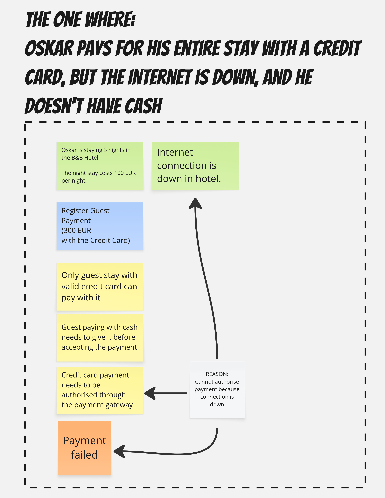
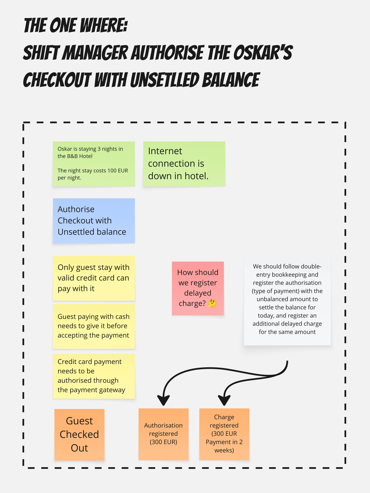
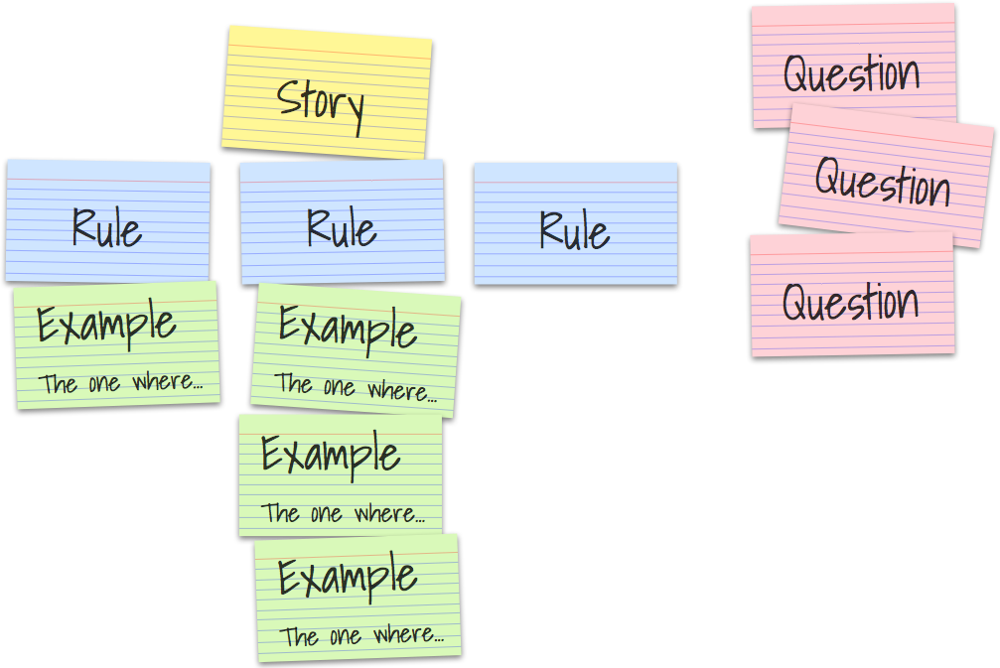

One of the first indications of getting old(er) is when people stop getting your movie or music references. Of course, based on this rule, some people are always old. That happens.

Recently, I realised during [my workshops](/en/training/) that referencing Friends is not so cool anymore. It started to happen when I was explaining the Example Mapping technique.

> It always starts with "The one where".
>
> Just like in Friends. 

I started to notice a bit slower head nodding and a bit more awkward smiles from the attendees. I repeated 

> "You know, like in Friends, the series titles episodes". 

And head-nodding stopped; only totally awkwardly polite smiles remained. Definitely, it wasn't The One Where Everybody Finds Out. So I finally asked, you weren't watching Frients, didn't you?

Obviously, the answer was:

> Emmm. NO.

Okay, then, if you don't know Friends or the Example Mapping technique, this will be The One Where You Find Out.

Let's say that we're working on the guest checkout feature for a hotel management system.

We could start by asking the business how it works. We could get an answer that:

> The guest approaches the desk and requests checkout. The clerk inquires about the quality of the products and services, and after receiving an answer, requests the room key. After gathering, the key clerk checks whether the balance is settled. If it's settled, then proceed with the checkout. Marking the stay as completed.

Sounds straightforward, but we should already have several questions popping up, e.g. what does it mean that "balance is settled"? We could get quick feedback that: 

> This means that the difference between the sums of all charges and payments is equal to zero.

Then we could try to come up with an example:

> Ah, so for instance, when guests haven't paid upfront for their stay, right?

Right. 

> Oh, then we need to charge them, right?

Right.

We could visualise what we discovered in the following way:

Now, this generated another flow for us. We have a new feature we weren't aware of: the guest's stay payment registration. Let's try to start this time from the visualisation.

It's the one Oskar pays for his stay, because he wants to check out but didn't pay upfront. The payment is registered, and we can try checking out again. Sounds fine, but we should ask whether there are any rules for payments. It may appear that:

> Yes, there are some, for instance:
> - Only guests with a valid credit card can pay with it for their stay,
> - Guests paying in cash need to hand it over before accepting the payment.

And hey, we just found out new business rules, let's put them on the board and update our flow to be more precise and reflect our scenario by adding a note that this scenario represents a guest paying with a credit card.

Now, what if the payment fails? Can it fail? Let's ask the business!

> Payment may fail if the payment gateway is unavailable or the issuer rejects it.

What if our internet connection is down for the whole day?

> The clerk should ask the guest for cash.

What if the guest doesn't have cash? 🤔

> Then the shift manager can authorise unsettled balance checkout and register a charge with a delayed due date.

Here's the updated flow. The one where Oskar pays for his entire stay with a credit card, but the Internet is down, and he doesn't have cash.

Now, we found out:
- **A new outcome**, failed payment, 
- **A new rule**, that we need Internet access to authorise credit card payment,
- **A new feature**, the shift manager can authorise unsettled balance checkout and register a charge with a delayed due date.

How would the authorisation look? How should we register a delayed charge?

> We should follow double-entry bookkeeping and register the authorisation (type of payment) with the unbalanced amount to settle the balance for today, and register an additional delayed charge for the same amount

The flow will look like:

And that's precisely how the Example Mapping session looks like. It’s a structured conversation format created by [Matt Wynne](https://mattwynne.net/about). You take a user story, gather a small group (usually a developer, tester, and someone from the business side), and spend around 25-30 minutes breaking it down together.

You don’t need a big setup, a huge ceremon, you don't need sticky notes, you can just use plain text like:

Given: Example
When: We use specific features
Then: Based on business rules, we get a specific outcome.

Business people don't need to give them to you in such form. You can use the interview as I showed above and note it on your own, while you're discussing stuff. It's also a nice way to collaborate and visualise your discussions. 

You don't even need to start with an interview; you can use the Example Mapping as a brainstorming tool to generate as many examples of your (part of the) system. Then, try to model it as you see fit and ask the business for clarifications in the preferred form. It can help facilitate discussion with your team, not only with business stakeholders.

It’s super helpful, as misunderstandings are expensive. When multiple people try to describe the same rule using real examples, you’ll quickly see where assumptions don’t match. Better to find that out in a 30-minute chat than after two weeks of coding the wrong thing.

It also works as a readiness check. Too many red cards? The story isn’t ready. Too many blue cards? The story is probably too big. If examples come easily and everyone nods along - you’re good to go.

There’s also more, as you can try to distil business rules based on the examples and outcomes the business describes.

It's worth noting that I cheated you in colours. The original looks like this:

Why did I change them?

Example Mapping plays nicely with other collaboration techniques like Event Storming. And if you're familiar with the Event Storming colour scheme, that's also the reason why I used it. I aligned them. See:

I'm typically using it during modelling sessions to:
- brainstorm (read more in [Start Alone, Then Together: Why Software Modelling Needs Solitary Brainstorming](https://www.architecture-weekly.com/p/start-alone-then-together-why-software)),
- challenging existing models with real-world examples,
- expanding the model with uncovered (through examples) use cases,
- finding business rules,
- helping with facilitation by looking at the model from a different perspective.

And hot spots and notes, as known from EventStorming, are super helpful here. Read also more in [The Underestimated Power of Hot Spots and Notes in EventStorming](https://www.architecture-weekly.com/p/the-underestimated-power-of-hot-spots).

What's more, if you look at the Given/When/Then pattern, you may notice that it works nicely with Behaviour-Driven Design. I already wrote that [Behaviour-Driven Design is more than tests](/en/behaviour_driven_design_is_not_about_tests/). How to do it? Check [here](/en/testing_event_sourcing_emmett_edition/). 

I'll also expand on it in the next articles. I'm doing the extreme Example Mapping with events, so stay tuned, the more will come.

For now, check also those materials:
- [Seb Rose - short, practical and actionable intro to Example Mapping](https://www.youtube.com/watch?v=EtoTML8cuko)
- [Kenny Baas-Schwegler - showing how to use Example Mapping with EventStorming](https://www.youtube.com/watch?v=WvkBKvMnyuc) 
- [An introduction by Matt Wynne himself](https://cucumber.io/blog/bdd/example-mapping-introduction/),
- [Other quick intro by Gojko Adzic](https://draft.io/example/example-mapping).

And most importantly, try it. Take one feature from your system, try to crunch it, or start your design session with this technique.

[Most of the teams I'm working with](/en/training/) are enjoying this technique, as it's a fun way to get quick, actionable outcomes.

Cheers!

Oskar

p.s. **Ukraine is still under brutal Russian invasion. A lot of Ukrainian people are hurt, without shelter and need help.** You can help in various ways, for instance, directly helping refugees, spreading awareness, putting pressure on your local government or companies. You can also support Ukraine by donating e.g. to [Red Cross](https://www.icrc.org/en/donate/ukraine), [Ukraine humanitarian organisation](https://savelife.in.ua/en/donate/) or [donate Ambulances for Ukraine](https://www.gofundme.com/f/help-to-save-the-lives-of-civilians-in-a-war-zone).
