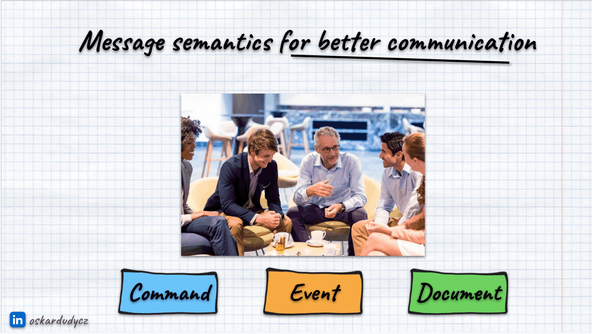

Have you ever heard phrases like.

> Just an update, the milk ran out. Someone finished it and put the empty carton back.

Or

> So everyone is aware, the meeting started 15 minutes ago.

Or

> Heads up: the coffee machine is empty again.

Or 

> It's fine, I already walked the dog. 

I'm sure you either heard or used such phrases.

We all know that there's some intention behind it. 

The intention is not to inform, but to trigger some action.

Formally, we're reporting on events to announce the facts, but in practice, they're passive-aggressive words. The real intention is to command someone.

We don't want to inform you that the trash bin is full, but we want someone to take it out. We don't want to inform you that the coffee machine requires a coffee bean refill, but we want someone to do it.

Passive-aggressive tone is the worst. It's toxic for both sides of the communication. Usually, it's just better to ask someone to do it. 

The same rule also works in Event-Driven Modelling. We should avoid passive-aggressive communication at all costs. 

**We should watch out for Passive-Agressive Events. So events that should be commands.**

I already warned you in past: [don't let Event-Driven Architecture buzzwords fool you](/en/dont_let_event_driven_architecture_buzzwords_fool_you/).

Event-Driven Architecture is an integration architecture style. We're trying to model our business processes so they run smoothly. For that, we prefer a non-blocking communication flow, with things happening in parallel at their own pace. The goal is to achieve autonomous components that reduce the time needed to understand them. That helps [maintain, or even replace them](/en/removability_over_maintainability/) as your business evolves.

And events are enablers for that. They notify of what has happened, allowing other components to interpret facts and take the next steps.

But... Let me show one more photo.

It's parliament, per the official definition: a room full of angry, shouting people.

**If we model our communication only in terms of events, our system will look just like that.** We'd just announce new facts in a passive-aggressive style and not be interested in what happens next. Oh, wait, are we really not interested? Actually, we are. If someone won't do what we expect with our information, we'll be even angrier.

[What's the difference between a command and an event?](/en/whats_the_difference_between_event_and_command/) Both are messages. They convey specific information: a command indicating intent to do something, or an event describing what happened. From the computer’s point of view, they are no different. Only the business logic and the interpretation of the message can distinguish between an event and a command.

And that's the main difference: commands can be rejected by the command handler. Events can only be ignored. 

If we send an event, we expect someone to be interested, but we don't know who or how many components will. We just inform.

This can easily change into passive-aggressive:

> I did my work, now it's your turn.

And here's the crucial moment. If we'll always have a single consumer for an event that needs to run the specific logic and expect to get the particular event back, then it should be a command. It's not an event, we don't inform. We just want someone to take the next specific step and let us know when they finish.

But hey, aren't we making our communication synchronous?

What does it even mean, synchronous or asynchronous? That's what [Sam Newman discussed in his great talk](https://www.youtube.com/watch?v=2LMEJ-WGFTk). The main conclusion is that synchronous vs asynchronous discussion is actually about blocking or non-blocking. And that's much broader than the technicalities of whether we call something in-process via an HTTP endpoint or a messaging system.

It's a common misconception that events are published through a messaging system (e.g. Kafka, RabbitMQ, SQS, WhateverQueue) and commands are sent through WebAPI.

Those are technicalities. As said, both events and commands are messages; we can send them through a messaging system or via HTTP (e.g., events via webhooks).

This misleading split stemmed from our expectation about handling, so we expected the command to wait for the result. For events, we don't expect a specific result, at least in theory.

**If we publish a specific event to the messaging system and expect a specific critical path of follow-up events, then we're not making our communication non-blocking. It's still sequential.** We cannot proceed until the expected sequence occurs.

Whether something is blocking or not is not established by the tools we use, but by how our business process looks.

Speaking about it. 

Let's get back to our favourite E-Commerce Order scenario (read more in [Predictable Identifiers: Enabling True Module Autonomy in Distributed Systems](https://www.architecture-weekly.com/p/predictable-identifiers-enabling)).

We could model it so we just publish the _OrderConfirmed_ event and passively-aggressively expect that others will take it from there. So:
- The payment module will initiate the payment.
- Inventory will start completing shipments.
- The notification module will send a confirmation e-mail.
- Fraud detection module will check if the order is not rigged.

Once we receive information about a successful shipment or payment registration, we can complete the order.

**You may notice two paths for order processing:**
1. **Blocking** - We need to wait for information about payments and shipments. This is our critical path.
2. **Non-blocking**- Order process shouldn't stop if the notification wasn't sent or the data warehouse wasn't able to process events. We'd like that to happen, but it's expected rather than critical.

Now, both payments can fail (if our customer doesn't have enough money), and the shipment may not be completed (if it's Black Friday, and multiple people are competing for the same product).

If that happens, as the ordering module, we also need to take action, for instance, do reimbursement if the shipment wasn't completed, and eventually cancel the order. 

If we're just focused on events, we tend to forget about _"negative"_ scenarios. If all communication is through events, then it's too easy to stay in I-Alread-Did-My-Job mode.

We may not notice that another module can actually say no:
1. Payment module can say: _Man, that's not going to happen, you've already run out of money_.
2. Shipment module can say: _Man, I'm sorry, but you weren't fast enough and we've run out of product_.

And both of those scenarios will block successful order completion.

If we don't foresee that and stay in passive-aggressive mode, this will have severe consequences: blocked orders, missed communication, and dissatisfied customers.

How to find such scenarios? [Doing Example Mapping during modelling can be a good option for that](/en/intro_to_example_mapping/).

Most importantly, we need to embrace the fact that some scenarios require direct, blocking communication, and others don't. Just like in real life, sometimes it's just more effective to tell someone to do something. We should avoid micromanagement and aim for autonomy, but not end up with anarchy.

In our case, it'd be better to have a coordinator ([workflow](/en/how_to_have_fun_with_typescript_and_workflow/), [saga, process manager](/en/saga_process_manager_distributed_transactions/), etc.) that publishes the _OrderConfirmed_ event for modules not on the critical path and sends commands like _RecordPayment_ and _InitiateShipment_.

By that, we're separating responsibilities and making explicit what should be explicit. This also helps in understanding the business process, as you have a central place to see the critical flow and get proper observability. 

Lacking tracing and observability of the business process is one of the most common issues [I see in my clients' projects](/en/training/). As said, if we don't want to end up with parliament instead of proper communication in our system, we need to be explicit about our intention.

Is that all? Not quite, there's one more message type we model as events that should not be events.

**Gregor Hohpe, in ["Enterprise Integration Patterns"](https://www.enterpriseintegrationpatterns.com/patterns/messaging/Message.html), besides [Event](https://www.enterpriseintegrationpatterns.com/patterns/messaging/EventMessage.html) and [Command](https://www.enterpriseintegrationpatterns.com/patterns/messaging/CommandMessage.html) defines one more message type: [Document](https://www.enterpriseintegrationpatterns.com/patterns/messaging/DocumentMessage.html).**

What's the Document? It's a state. Or to be precise: self-contained data we have at a certain point in time. We can store it, but we can also publish information about its new value.

That's probably why Martin Fowler frames it as [Event-Carried State Transfer](https://martinfowler.com/articles/201701-event-driven.html), and I don't like that term. For me, it's extremely misleading; it's not an event, as it doesn't tell of what has happened, but what has changed.

It's a common anti-pattern, a variation of [State Obsession](/en/state-obsession/). Too many people believe it's fine to connect the messaging system to the database, use tools like [Change Data Capture](https://en.wikipedia.org/wiki/Change_data_capture), and publish it automatically to others.

Still, we're ending up again in passive-aggressive communication:

> You have all you need. The whole state is in the _events_, just interpret it.

But how can you reason about what has happened if instead of _OrderConfirmed_ you get _OrderCreated_, _OrderUpdated_, _OrderDeleted_? 

You not only deal with [Clickbait Events](/en/clickbait_event/) but also have a leaking business abstraction. All consumers need to understand the internals of your processing to detect a specific type of change. I wrote about it in detail in [Internal and external events, or how to design event-driven API](/en/internal_external_events/).

Again, the loose coupling of the event-driven processing is only loose for producers; consumers need to adapt. This can lead to hidden coupling, where a change in the producer breaks consumer flows. And that's the worst type of coupling you can get.

**If we're making commands explicit, we're also making an explicit relationship between components.** It's no longer flattened to producer <=> consumer, where the producer always shapes the communication. Now, if the other component exposes a command, that's the driving force behind its behaviour. This helps to shape autonomy. In our case, we could make the Payment Module a generic module with a stable public API for registering payments, and an ordering module that requests them, in accordance with the Shipment Module. Fraud Detection could continue subscribing to events, as it already does. [Context Mapping](https://github.com/ddd-crew/context-mapping) can greatly help in finding those relationships.

## TLDR

We tend to be all about events these days, but they're not the only message types. In our systems, messages take various forms: Events, Commands, and Documents, each serving distinct purposes:

- **Documents are all about state transitions**, which are essential for syncing data across services but missing deeper business insights.
- **Commands represent a clear intent to act**, directed with an expectation of execution, and can be accepted or rejected.
- **Events are immutable facts**, announced without waiting for a response. They're like broadcasting news, hoping it catches the right ears.

Event-Driven Architectures enable loose coupling, but only for producers. To make consumers loosely coupled, we need to take extra steps, embrace different message types, and have them participate in modelling business processes.

If we go too far with an event-all-the-things communication style, we'll make our system a room full of shouting people, with a passive-aggressive communication style. Or just aggressive. 

In consequence, we won't know what's happening in our system, will see only noise, and will have a hard time making it reliable, observable and predictable. We should treat our messages as a communication contract, API and model their flow in a way that shapes our regular communication.

**So next time, ask yourself if your event shouldn't be a command. If it has always had a single consumer and you expect a specific event back, then it's probably so.** It's all about being clear about the intention, not lying to yourself and others.

I hope this article will equip you with the knowledge to fix that.

**If you're dealing with such issues, I'm happy to help you through consulting, [training](/en/training) or mentoring. [Contact me](mailto:oskar@event-driven.io) and we'll find a way to unblock you!**

**See also more in series about [event modelling anti-patterns](/en/anti-patterns/):**
- [State Obsession](/en/state-obsession/),
- [Property Sourcing](/en/property-sourcing/),
- [I'll just add one more field](/en/i_will_just_add_one_more_field/).
- [Clickbait event](/en/clickbait_event/),
- [Passive Aggressive Events](/en/passive_aggressive_events),
- [Should you record multiple events from business logic?](/en/one_or_more_event_that_is_the_question/),
- [Stream ids, event types prefixes and other event data you might not want to slice off](/en/on_putting_stream_id_in_event_data/).

**Check also more general considerations:**
- [Events should be as small as possible, right?](/en/events_should_be_as_small_as_possible/),
- [What's the difference between a command and an event?](/en/whats_the_difference_between_event_and_command/),
- [Internal and external events, or how to design event-driven API](/en/internal_external_events/),
- [Event Streaming is not Event Sourcing!](/en/event_streaming_is_not_event_sourcing/),
- [Don't let Event-Driven Architecture buzzwords fool you](/en/dont_let_event_driven_architecture_buzzwords_fool_you/),
- [How to design software architecture pragmatically](/en/how_to_design_software_architecture_pragmatically/),
- [How to deal with privacy and GDPR in Event-Driven systems](/en/gdpr_in_event_driven_architecture/).

Cheers!

Oskar

p.s. **Ukraine is still under brutal Russian invasion. A lot of Ukrainian people are hurt, without shelter and need help.** You can help in various ways, for instance, directly helping refugees, spreading awareness, putting pressure on your local government or companies. You can also support Ukraine by donating e.g. to [Red Cross](https://www.icrc.org/en/donate/ukraine), [Ukraine humanitarian organisation](https://savelife.in.ua/en/donate/) or [donate Ambulances for Ukraine](https://www.gofundme.com/f/help-to-save-the-lives-of-civilians-in-a-war-zone).
