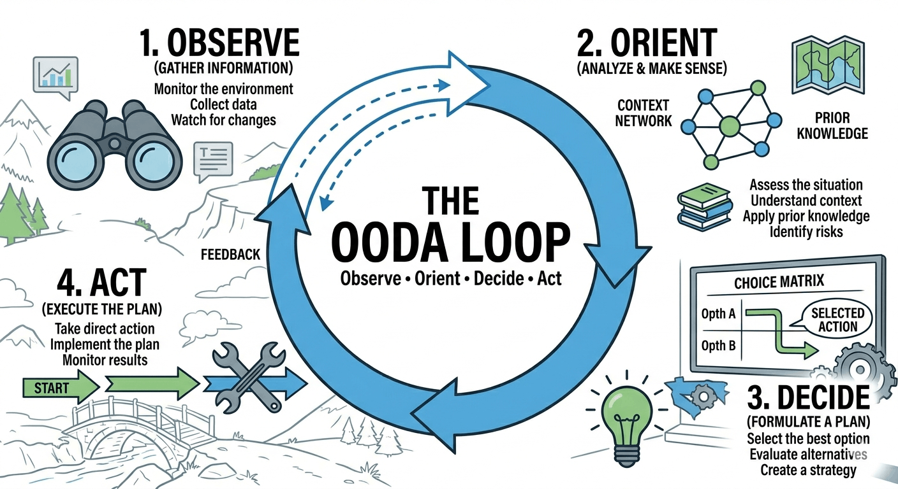

> Hey, have a look at what I made during the weekend. I had some time, grabbed a beer, turned on the computer and tried to code this feature. If I could do so much during the weekend, how much could you and your team do with it in 2 weeks?

It's almost a 1:1 quote of what I heard from the startup founder I worked with over 10 years ago. I'm sure that you've heard similar phrases from people you worked with. We all know the annoying type of person who doesn't code anymore but thinks, _"I still got it!"_. Then they threw a piece of stuff at you to _"just fine-tune it a bit and do final touches"_. Then they're the first ones to ask "Why so long?".

Nowadays, the Internet is full of such people. They shout about what they did with Claude or how much progress LLM tools have made. Some even predict the end of coding. I already wrote that [this is wrong perspective](/en/the_end_of_coding_wrong_question/). I won't repeat that, but I want to say that...

**Vibing isn't new and isn't always an issue.**

I'm saying that LLM tools are an appraisal for ignorance. The more ignorant we are of the topic we're working with, the better we see the outcomes. And that, by itself, is not always bad, as there's [power in ignorance](/en/power_of_ignorance/) if we focus on getting it done with the simplest tools we have.

Still, this can be terrible if we fall in love too much with what we've vibed.

To understand why that "weekend beer" energy is both a superpower and a liability, we need to look at the OODA Loop.



Disclaimer, it's not a competition for Ralph Wiggum Loop. It's much older and generic.

Military strategist John Boyd developed the OODA loop (Observe, Orient, Decide, Act) for fighter pilots. In a dogfight, the pilot who cycles through these four stages the fastest and most accurately survives.

In software, the "dogfight" is the gap between your intent and the production-ready feature.

**OODA loop is built from four steps:**
1. **Observe** - This is the intake of raw, unfiltered information. In our world, this means looking at the state of the system.
2. **Orient** - This is the most critical and difficult stage. It's where you filter your observations through your experience, culture, and technical knowledge.
3. **Decide** - Based on your orientation, you formulate a hypothesis.
4. **Act** - You execute. 

Getting back to my favourite founder and LLM-based tools.

**The reason founder could build a PoC in a weekend while the team needed more than two weeks is that he bypassed the Observe and Orient phases. He went straight from a vague idea to Act.**

If we skip or brush past the observation step, it feels like lightning speed. If the fancy UI grid is there and it does something we wanted, we move on. We've outsourced Orientation to our own ego. It's too easy to assume that because we wrote it, it works.

**Observation is the intake of raw data.** In a professional environment, our eyes aren't enough. We need a Harness. If we don't have automations,  tests, integration tests, and pristine traces, we aren't observing the system; we're just looking at it. If the inputs are messy, our observation is clouded.

But real engineering, the kind that takes those "two weeks", is about closing the loop properly. That's also where we need different perspectives and knowledge sharing. 

**Orientation is where you process those observations.** This is the part where LLMs make us feel smarter than we are. If we don't understand how a database handles concurrent connections, our "orientation" of a generated script will be shallow. We'll see code that "looks" right, decide it's fine, and act by deploying it.

The "I still got it" crowd loves the Decide and Act phases because that's where the visible progress happens. LLM tools have made these phases nearly instantaneous. We can decide to build a feature and have the code for it in ten seconds.

The problem is that the faster we Act, the faster we need to Observe. If our "Act" phase takes seconds but our "Observe" phase requires a manual weekend of clicking around and drinking beer, our OODA loop is broken. We're just generating a pile of stuff that we haven't actually verified.

**That's why the team usually needs more than an imaginary "two weeks".** They are not "fine-tuning" the single-brilliant-dude masterpiece. They are building the infrastructure required to make the OODA loop sustainable.

And to make that possible, they need to run the full loop: Observe, Orient, Decide, Act. And do it multiple times. That takes time, but it's required to assess the direction, automate what needs to be automated, and ensure they can iterate further and run this loop sustainably. That's critical for delivering the outcome at the expected pace.

Of course, there's a danger here, overfocusing on the Orient and Decide can lead to overengineering, building stuff we don't need. That's where ignorance can be blissful, especially when we connect it with humility. Being humble about what we don't know and trying things the easiest way, then learning and making enhancements. Still, humility fails under deadline pressure. The harness doesn't.

Let me give you...

## The example

I'm adding proper Observability and Open Telemetry to [Emmett](https://github.com/event-driven-io/emmett) right now. I spent some time working on it and instrumented the first component: [Command Handling](https://event-driven-io.github.io/emmett/getting-started.html#command-handling).

Of course, I had tests to prove it works, but I don't trust them enough, and I wanted to try it on a real sample, since you never know until you run it. Even the best test suite won't tell you all.

So I decided to plug it into the [sample](https://github.com/event-driven-io/emmett/tree/main/samples/webApi/expressjs-with-postgresql). See if it works, how ergonomic the API is and how it fits conventions in this area.

To do it, I decided to use [Grafana stack](https://grafana.com/) and set it up with Docker Compose. So, stable, boring stack. Not going to lie, I vibed the config. Not that there are no docs, but I intentionally wanted to see the typical config people use.

If someone says LLM-based tools are great at proof of concepts, they don't run the stuff they vibed. If I made the observation based on the initial config, then an oriented decision would be that it won't work. Of course, then I did the typical back-and-forth, with the LLM tool doing some Linux command Voodoo to make it work. Once. Then, if you try to repeat it, you won't know how to do it without doing Voodoo again. 

Again, that's not much different from the other stuff we do. I'm sure that you had multiple cases, when someone didn't use Continuous Deployment tools, but clicked through Azure, AWS, GCP portal, deployed the stack, and then there was no trace on how to set it up again (e.g. to have a different environment for testing or demos for customers).

**So, we need a harness, we need a leash to keep our process on track.**

How to do the harness? My advice is to start simple. We may ask LLMs to give us shell scripts, and we may ask them to run them multiple times. We also need experience and knowledge of what we want to achieve and the tools we use. It's fine not to remember all the YAML config to set up the Grafana stack, but it's not fine not to understand why you even use it, how it relates, and how to set it up.

Still, our first loop can close on the first working solution, even a manually vibed one. But that's not even a PoC. We need to automate them.

I asked LLM to take notes on what issues it had, and it solved them. Then, based on that, I asked to research how to code it in TypeScript. And to use tools I know, used in past, validating if there are no new more modern ones. For instance, I was a big fan of [Gulp.js](https://gulpjs.com/) and [Bullseye](https://github.com/adamralph/bullseye) in the past, but they're mostly dead. I wanted to have something in the same spirit, using native, maintained tooling.

I ended up with the following tools:
- [execa](https://github.com/sindresorhus/execa) for running shell scripts,
- [native fetch](https://developer.mozilla.org/en-US/docs/Web/API/Fetch_API) for calling http endpoints,
- [native Node.js test tools](https://nodejs.org/api/test.html) for checking if the stack works as expected.

Then I asked it to create the script to automate the shell Voodoo they did to make Grafana stack and Docker Compose work. 

**Essentially, it should:**
1. Run Docker Compose script starting up services (Grafana, Prometheus, Loki, Tempo, PostgreSQL, etc.). 
2. Wait for them to check when they're ready (it usually takes some time).
3. Start the application and make a request.
4. Check if the predefined dashboard with Emmett metrics appears, and shows expected traces and metrics.

Initial diagnostic tools looked like that

```ts
async function fetchWithDiag(label: string, url: string, init?: RequestInit) {
  const res = await fetch(url, init);
  if (!res.ok) {
    const body = await res.text().catch(() => '(could not read body)');
    console.error(`\n  ✗ ${label} → HTTP ${res.status}\n  body: ${body}\n`);
  }
  return res;
}

async function diagnoseCollector() {
  const text = await fetch(URLS.otelCollectorMetrics)
    .then((r) => r.text())
    .catch(() => 'unreachable');
  const emmett = text
    .split('\n')
    .filter((l) => l.startsWith('emmett_') && !l.startsWith('#'))
    .slice(0, 5);
  console.log(
    emmett.length
      ? `\n  collector /metrics (emmett lines):\n  ${emmett.join('\n  ')}`
      : '\n  collector /metrics: no emmett_* lines found',
  );
}

async function diagnosePrometheus() {
  const json = await fetch(
    `${URLS.prometheus}/api/v1/label/__name__/values`,
  )
    .then((r) => r.json() as Promise<{ data: string[] }>)
    .catch(() => ({ data: [] as string[] }));
  const emmett = json.data.filter((n) => n.startsWith('emmett_'));
  console.log(
    emmett.length
      ? `\n  Prometheus emmett_* metrics: ${emmett.join(', ')}`
      : '\n  Prometheus: no emmett_* metrics found yet',
  );
}

async function diagnoseLoki() {
  const labels = await fetch(`${URLS.loki}/loki/api/v1/labels`)
    .then((r) => r.json() as Promise<{ data?: string[] }>)
    .catch(() => ({ data: [] as string[] }));
  console.log(`\n  Loki labels: ${(labels.data ?? []).join(', ') || '(none)'}`);
}

async function diagnoseDockerLogs(service: string, lines = 10) {
  const { stdout } = await execa('docker', [
    ...COMPOSE,
    'logs',
    '--tail',
    String(lines),
    service,
  ]).catch(() => ({ stdout: '(could not get logs)' }));
  console.log(`\n  docker logs ${service} (last ${lines}):\n  ${stdout.split('\n').join('\n  ')}`);
}
```

Are they pretty? No. Can they be improved? Yes. Do they have to be improved at this specific moment? No.

The setup uses test infrastructure

```ts

const CLEANUP = process.env['CLEANUP'] === '1' || process.env['CLEANUP'] === 'true';
const CLEANUP_AFTER = process.env['CLEANUP_AFTER'] === '1' || process.env['CLEANUP_AFTER'] === 'true';
const NO_START = process.env['NO_START'] === '1' || process.env['NO_START'] === 'true';

// ─── configuration ───────────────────────────────────────────────────────────

const COMPOSE = ['compose', '-f', 'docker-compose.yml', '--profile', 'observability'];

const URLS = {
  app: 'http://localhost:3000',
  prometheus: 'http://localhost:9090',
  tempo: 'http://localhost:3200',
  loki: 'http://localhost:3100',
  grafana: 'http://localhost:3001',
  otelCollectorMetrics: 'http://localhost:8889/metrics',
};

// Fresh client per run — avoids stale cart state from previous runs.
const SERVICE_NAME = 'expressjs-with-postgresql';
const CLIENT_ID = randomUUID();
const CART_ENDPOINT = `${URLS.app}/clients/${CLIENT_ID}/shopping-carts/current/product-items`;
const CONFIRM_ENDPOINT = `${URLS.app}/clients/${CLIENT_ID}/shopping-carts/current/confirm`;

// Matches the .http file — unitPrice is resolved server-side.
const ADD_PRODUCT_BODY = JSON.stringify({ productId: randomUUID(), quantity: 10 });


before(async () => {
  console.log(`\n▶ client ID for this run: ${CLIENT_ID}\n`);

  if (NO_START) {
    console.log('▶ --no-start: skipping docker compose and app startup');
    return;
  }

  if (CLEANUP) {
    console.log('▶ --cleanup: killing port 3000 and tearing down stack (down -v)…');
    await execa('bash', ['-c', 'fuser -k 3000/tcp 2>/dev/null || true']).catch(() => {});
    await new Promise((r) => setTimeout(r, 500));
    await execa('docker', [...COMPOSE, 'down', '-v', '--remove-orphans'], {
      stdio: 'inherit',
    });
  }

  const stackReady = await fetch(`${URLS.prometheus}/-/ready`)
    .then((r) => r.ok)
    .catch(() => false);

  if (stackReady) {
    console.log('▶ observability stack already up — skipping docker compose up');
  } else {
    console.log('▶ starting observability stack…');
    await execa('docker', [...COMPOSE, 'up', '-d'], { stdio: 'inherit' });
  }

  console.log('▶ waiting for backends…');
  await waitFor(() => checkUrl('Prometheus', `${URLS.prometheus}/-/ready`), {
    timeout: 90_000, label: 'Prometheus',
  });
  await waitFor(() => checkUrl('Grafana', `${URLS.grafana}/api/health`), {
    timeout: 90_000, label: 'Grafana',
  });
  await waitFor(() => checkUrl('Tempo', `${URLS.tempo}/ready`), {
    timeout: 90_000, label: 'Tempo',
  });
  await waitFor(() => checkUrl('Loki', `${URLS.loki}/ready`), {
    timeout: 90_000, label: 'Loki',
  });

  // /health returns { status: 'ok', service: 'expressjs-with-postgresql' } —
  // checking service name lets us distinguish our app from other processes on :3000.
  const checkOurApp = () =>
    checkUrl('app /health', `${URLS.app}/health`, async (res) => {
      const json = (await res.json().catch(() => ({}))) as { service?: string };
      if (json.service !== SERVICE_NAME) {
        console.log(
          `    app /health: service="${json.service ?? '(missing)'}", expected="${SERVICE_NAME}"`,
        );
        return false;
      }
      return true;
    });

  const appIsOurs = stackReady && (await checkOurApp());

  if (appIsOurs) {
    console.log('▶ app already running and healthy — skipping npm start');
  } else {
    const portTaken = await fetch(URLS.app).then(() => true).catch(() => false);
    if (portTaken) {
      // Port is occupied but not by our app — stale process or unrelated service.
      console.error(
        '\n  ✗ Port 3000 is occupied by a process that is not this app.\n' +
          '  It may be a stale version of this app (connected to a wiped database)\n' +
          '  or a completely different service.\n' +
          '  Fix: run  npm run verify:observability:cleanup  to kill it and restart,\n' +
          '  or manually free port 3000.\n',
      );
      process.exit(1);
    }

    console.log('▶ starting app…');
    app = execa('npm', ['start'], { stdio: 'inherit' });

    await waitFor(checkOurApp, { timeout: 60_000, label: 'app /health' });
  }

  console.log('▶ setup complete\n');
});
```

As you see, nothing fancy, the cleanup is even simpler

```ts
after(async () => {
  if (app) {
    console.log('\n▶ stopping app…');
    app.kill('SIGTERM');
    await app.catch(() => {});
    console.log('▶ app stopped');
  }

  if (CLEANUP_AFTER) {
    console.log('▶ tearing down stack (down -v)…');
    await execa('docker', [...COMPOSE, 'down', '-v', '--remove-orphans'], {
      stdio: 'inherit',
    });
    console.log('▶ stack torn down');
  } else {
    console.log('▶ stack is still running');
    console.log('▶ to clean up: npm run verify:observability:cleanup');
  }
});
```

Having that we can run tests:

```ts

test('successful command returns x-trace-id header', async () => {
  const res = await fetchWithDiag('POST add product', CART_ENDPOINT, {
    method: 'POST',
    headers: { 'Content-Type': 'application/json' },
    body: ADD_PRODUCT_BODY,
  });

  assert.equal(res.status, 204, `Expected 204 — body logged above`);

  const header = res.headers.get('x-trace-id');
  if (!header) {
    console.error(
      '  ✗ x-trace-id missing — verify the wrapper app in src/index.ts ' +
        'adds it via @opentelemetry/api before mounting the emmett app',
    );
  }
  assert.ok(header, 'x-trace-id header missing');
  assert.match(header, /^[0-9a-f]{32}$/, `"${header}" is not a 32-hex trace ID`);

  traceId = header;
  console.log(`  trace ID: ${traceId}`);
});

test('OTel collector exposes Emmett metrics on port 8889', async () => {
  // Send a few more requests so metrics are definitely recorded.
  for (let i = 0; i < 5; i++) {
    await fetch(CART_ENDPOINT, {
      method: 'POST',
      headers: { 'Content-Type': 'application/json' },
      body: ADD_PRODUCT_BODY,
    });
  }

  try {
    await waitFor(
      async () => {
        let text: string;
        try {
          const res = await fetch(URLS.otelCollectorMetrics);
          text = await res.text();
        } catch {
          console.log('    collector :8889: connection refused');
          return false;
        }
        const emmettLines = text.split('\n').filter((l) => l.startsWith('emmett_') && !l.startsWith('#'));
        if (emmettLines.length === 0) {
          const allFamilies = [...new Set(text.split('\n').filter((l) => !l.startsWith('#') && l).map((l) => l.split('{')[0]))].slice(0, 5);
          console.log(`    collector :8889: no emmett_* metrics yet. Present: ${allFamilies.join(', ') || '(none)'}`);
          return false;
        }
        return true;
      },
      { timeout: 90_000, interval: 5_000, label: 'emmett metrics on collector :8889' },
    );
  } catch (err) {
    await diagnoseCollector();
    await diagnoseDockerLogs('otel-collector');
    throw err;
  }
});
```

I put it into a [single file](https://github.com/event-driven-io/emmett/blob/a937ff98ba39d3e504540886d8cd918843b28149/samples/webApi/expressjs-with-postgresql/src/observability.spec.ts) that can be run as a regular Node.js script. 

It already showed me (and Claude) that what they initially did wasn't working if you try to run it multiple times. It also showed that doing a full cleanup and rebuild, and making it reproducible, needs more work.

Is it done? Not yet; it takes too much time and resources to run it continuously throughout the pipeline. The code is a bit messy, so it needs to be organised. It's segmented into blocks, includes basic automation and tests, and has already gone through some failures to get it done.

Could I do it better? Sure, but that's not the point. I wanted to show you my findings during weekend vibing (without beer tho),the real, not polished iteration.

**The main idea behind OODA loops is not to be perfect, but to iterate quickly, gather feedback as soon as possible, learn from it, develop another theory, and verify it through action.**

It's not about vibing, but it's also not about analysis paralysis.

I hope you're now better equipped to think about when vibing, with beer or without, with LLMs or without, actually helps, and when it doesn't.

Vibe coding is just high-frequency steering. It only works if you have a Harness: a mechanical way to observe and orient, so you don't steer the whole project into a wall.

Act takes seconds now. Observe takes as long as it always did. Without a harness, you're not going faster; you're just making more stuff you haven't checked.

Harness is not magic, a new discipline, or the next buzzword; I hope I showed you that a bit in this article on what it may look like.

**So iterate fast, but wisely remembering to do the full loop.** It's great that LLMs can help us make Acting faster, but we should not skip other steps. We should aim for a fast feedback loop to iterate in the right direction and achieve continuous improvement, to deliver proper value.

Just like Vibing isn't new, we shouldn't abandon _”old”_ engineering practices. We should also not replace collaboration with solitary self-high fives.

Check also:
- [Emmett Pull Request with mentioned changes](https://github.com/event-driven-io/emmett/pull/335)
- [Interactive Rubber Ducking with GenAI](/en/interactive_rubber_ducking_with_gen_ai/)
- [The End of Coding? Wrong Question](/en/the_end_of_coding_wrong_question/)
- [A few tricks on how to set up related Docker images with docker-compose](/en/tricks_on_how_to_set_up_related_docker_images/)
- [Docker Compose Profiles, one the most useful and underrated features](/en/docker_compose_profiles/)

Cheers!

Oskar

p.s. **Ukraine is still under brutal Russian invasion. A lot of Ukrainian people are hurt, without shelter and need help.** You can help in various ways, for instance, directly helping refugees, spreading awareness, putting pressure on your local government or companies. You can also support Ukraine by donating e.g. to [Red Cross](https://www.icrc.org/en/donate/ukraine), [Ukraine humanitarian organisation](https://savelife.in.ua/en/donate/) or [donate Ambulances for Ukraine](https://www.gofundme.com/f/help-to-save-the-lives-of-civilians-in-a-war-zone).
