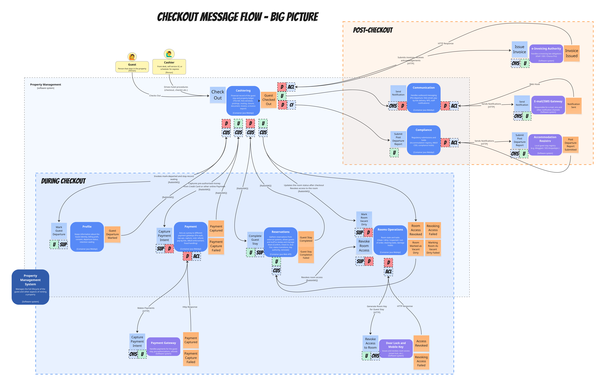
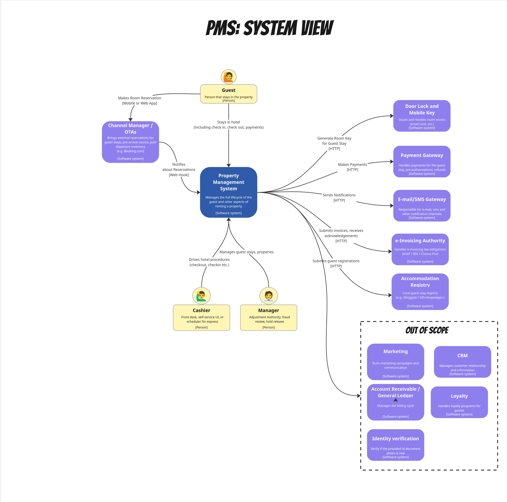
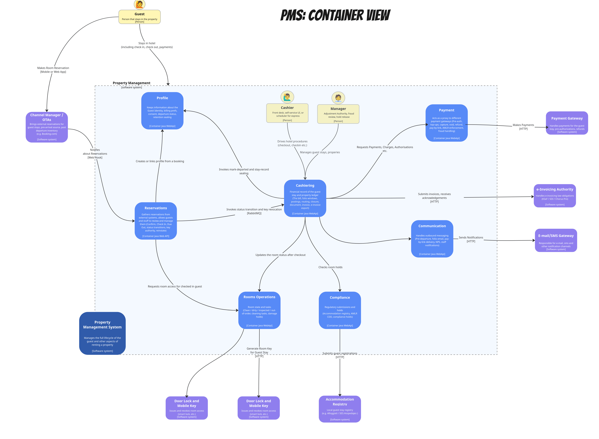
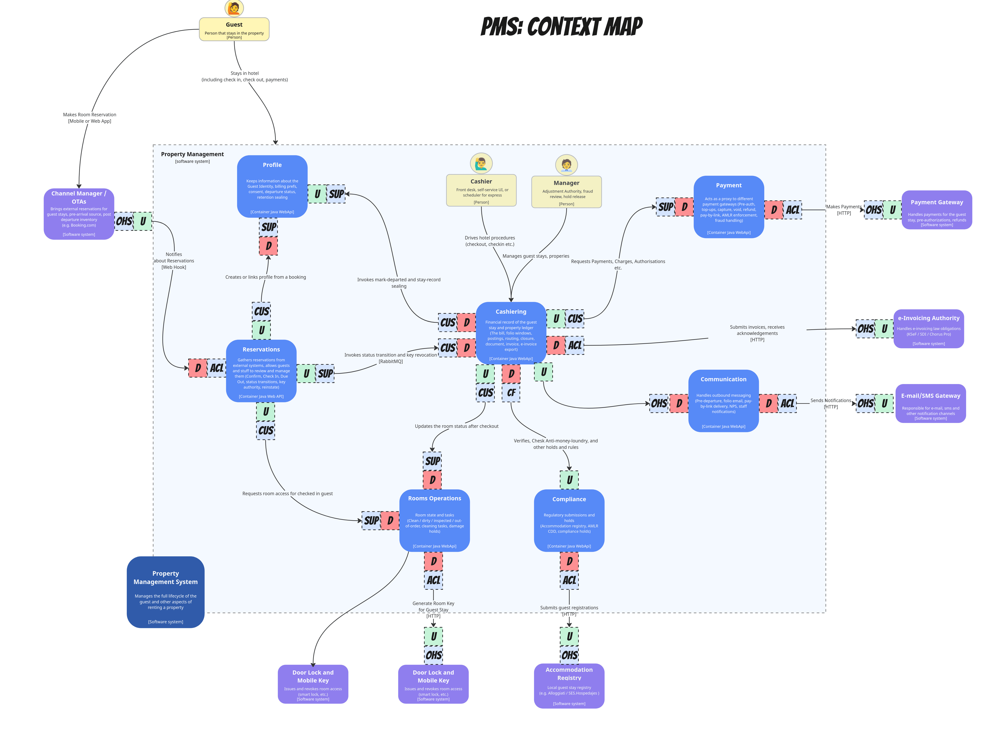

Many people believe there should be one, and only one, way to model software. I think differently, I like to mix different techniques.

For instance, I believe there’s a strong synergy between [C4 Model](https://c4model.com/), [Context Maps](https://github.com/ddd-crew/context-mapping), and [EventStorming](https://www.eventstorming.com/). They all allow us to look at the system from a different angle and act as simulations, providing different feedback on whether our model will fly.

Look below for the diagram I prepared for my upcoming [workshop](https://event-driven.io/en/training/).

It’s a C4 diagram showing containers in a hospitality system (so-called Property Management, where property means hotel).

A container gives quick feedback on how many pieces I’ll potentially need to manage and deploy, and it also shows me boundaries.

[Context Maps](https://github.com/ddd-crew/context-mapping) help in understanding how they relate to each other, which module or team has bigger leverage, and can force more on others. It can also show me the information flow and simulate which module will expose the API.

I can then take some business process and have a look at how the message flow will look. This can happen as an early simulation or after [EventStorming](https://www.eventstorming.com/) sessions.

Then C4 allow me to also look inside the container, show components if I need to understand more details. I can group containers if my bounded context has more of them.

How to start with it? Let me show you an example.

The starting point could be understanding the system's overall view; integrations with external systems usually introduce the most complexity. C4 System Diagram works well for that.

We see actors representing our system users and interactions with external systems. We can decide what integration is out of scope for now, and may come as the second step, but not for now. We can also show the current state as is, then in the second diagram show our vision of what we want it to be. Be creative, this is not a relational database, we don’t need to normalise it.

Then we may decide to dive into what we need to build to facilitate that, make a bet based on our current knowledge, zoom in and check the C4 Container view.

As mentioned, this can already be used both for static documentation and for discussions during a workshop, simulating the potential complexity and boundaries. Important to note: until it’s settled, it’s more than fine to show different versions, discuss them, and add notes and questions.

We may have concluded that C4 is fine, but it doesn’t capture all the important reasons we modelled it this way. Or during the workshop, it may not be clear how to discuss precisely how to break it down. [Context Maps](https://github.com/ddd-crew/context-mapping) can help in that.

They can give us information on which module is generic (Open Host), which module (or team) is more important (upstream), and which module or team has less leverage (Downstream). Which provides api or data (Supplier) and which one is using it (Consumer).

We could have a dedicated model only focusing, on that, but we could also capture it in the same one. It could look as follows:

We can even use colours, e.g., upstream as green and downstream as red. This can already give us feedback, e.g., that Cashiering is an important module for financial processing and that it is downstream of multiple modules. Maybe we can change it and redefine boundaries, or maybe live with it, but take some corrective actions.

We can also put more data and use a specific example of a process and have a look at the specific process, as shown in the original diagram:

This can also pinpoint some issues, e.g., a generic module, which is more likely to expose commands (see more on why in my article on Passive-Aggressive Events). We can see if we have all the needed ACLs defined, or which module acts as a coordinator.

Of course, keeping it all on the same diagram is not perfect; it’d be great if we had a tool that would enable zoom-in/zoom-out, link and enable/disable some of the details and notation. Then we can even better play with what we have. Maybe I should vibe such?

Nevertheless, I encourage you to try different techniques, experiment, and combine them. For instance, Example Mapping would, imho, play great here as an extension. I know that some use Wardley Maps or Domain Storytelling.

Start small, use existing techniques and tools, and try to see how you could benefit from mixing them. Show it to your friends and try to collaborate and have fun together.

[I even learned from Richard Gross that this has an even name: Model Storming](https://www.linkedin.com/feed/update/urn:li:activity:7461032293072195585?commentUrn=urn%3Ali%3Acomment%3A%28activity%3A7461032293072195585%2C7461050717479346176%29&dashCommentUrn=urn%3Ali%3Afsd_comment%3A%287461050717479346176%2Curn%3Ali%3Aactivity%3A7461032293072195585%29). So, crunching your design with different modelling techniques and coming up with some useful variations.

I have even more mashups like that. Tell me if you’d like me to expand on it or this part in the follow-up articles!

Also, if you did such experiments, please share them with me and others. Happy to see what you came up with.

Cheers!

Oskar

p.s. **Ukraine is still under brutal Russian invasion. A lot of Ukrainian people are hurt, without shelter and need help.** You can help in various ways, for instance, directly helping refugees, spreading awareness, putting pressure on your local government or companies. You can also support Ukraine by donating e.g. to [Red Cross](https://www.icrc.org/en/donate/ukraine), [Ukraine humanitarian organisation](https://savelife.in.ua/en/donate/) or [donate Ambulances for Ukraine](https://www.gofundme.com/f/help-to-save-the-lives-of-civilians-in-a-war-zone).
