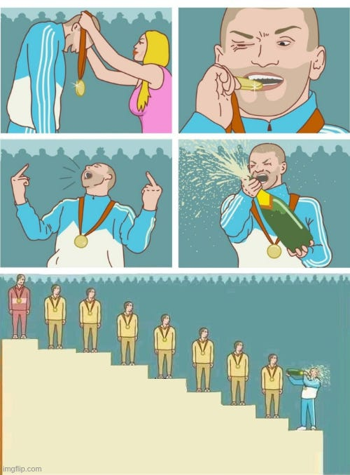
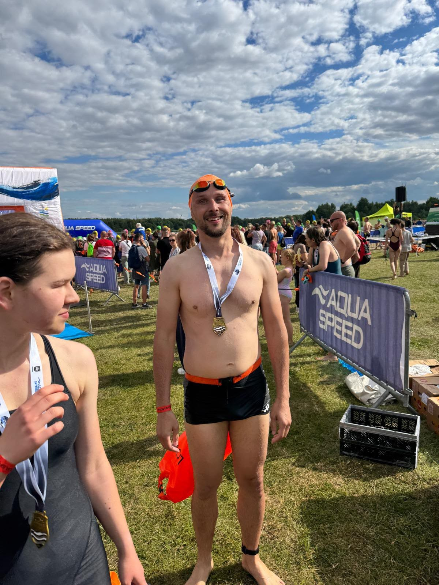

Work impacts how we live, and our lives impact how we do our work. My name is Oskar Dudycz, not Paulo Coelho, and today I’m not going to talk about software architecture or the event-driven world, but about the world in general, or to be precise, my world. I’ll let you say hello to it, but if you’re looking for a technical piece, that’s not happening today.

If this story were written in Fakt, Bild, or Sun, it could have been titled:

> Trained for 6 years. Finished as the last one.

That’d be almost true about what has happened to me. Almost would already be a lot for Fakt, Bild or Sun. Now, let’s go with the full story.

I’m a weird type of guy, I don’t have a driving license. And neither did I have it. I learned to ride a bike when I was 9 years old and got it for my First Communion. And I didn’t learn to swim till I was 35. Yes, that happened 6 years ago.

Did I have some trauma, like drowning? Nah, just didn’t happen. Maybe because my father couldn’t swim, maybe because I didn’t have motivation. Dunno, just didn’t happen.

Of course, not having certain skills can be fine; you can learn to live without them. You can even be considered a fashionable hipster. Some folks consider my lack of a driver’s license as a personal worldview stand. The fact that I like to cycle or ride a train suggests to some that I’m an ecologist. And don’t get me wrong, I like nature, I try to be a good citizen, but that’s not my main motivation.

This is just what I do, not who I am.

So am I a swimmer now? Well, it seems that I can swim now. I took classes from 2018 to 2019, then stopped for about 3 years, and got back into it when I signed my daughter up for swimming classes.

Now, when I say I’m practising swimming, everyone assumes I’m a triathlete preparing for a competition. And well, I’m not.

I don’t even like to swim much. I mean, it’s fine, I don’t mind, but it’s not that it’s my passion. I don’t have thoughts like:

> Hell, I’d like to swim now.

And I still have thoughts like:

> Hell, I’d play football now.

Which I don’t do, as I don’t play football anymore. Even though it was my passion for most of my life, I wasn’t talented at it, but I liked doing it. I even played as a junior for my hometown club (Miedź Legnica) and later in amateur leagues. And in those amateur leagues, I tore something called the _lateral patellar retinacula_. Actually, two of them, in both knees. Which means that my knees are unstable, and if I continued to play, it’d end up with some challenging surgery.

That also means that I had to decide to be unsuccessful somewhere else.

So, I’m an unsuccessful footballer and now an unsuccessful swimmer in the making.

I tried running and going to the gym, but it was always boring for me. I could do it for a few months, but then I quit. And off we go, for not training.

And I tried swimming.

Why? We don’t need to be capable of everything; it’s often a fine choice not to learn everything. At some point, a lack of certain skills can be limiting. You already know that it wasn’t my worldview to always have my feet on solid ground, but the main motivations were:
- It’s nice to do some swimming on holidays,
- It’s NOT nice to be a lame dad who can’t swim with his daughter,
- I kindaish always wanted to learn that, just didn’t happen,
- It’d be good to do some exercises, keeping in mind my sitting style of work,
- I had a swimming pool 10m by walk,
- I had and still have a great teacher. Thanks, Justyna!
    
So I started learning to swim again in 2024. It’s an interesting exercise when you learn something new as an adult. It’s more challenging because you’re overthinking rather than acting on your instincts. Or maybe your old habits are making your instincts unintuitional. It also shows how everyone has a different way of learning.

Take Breaststroke style (in Polish called “Żabka” - frog). Most people claim that it’s the easiest style to learn. For me? Madness, how much stuff you need to remember and coordinate: hands, back, legs.

It also shows how everything is connected. It appeared that I couldn’t do it properly because I wasn’t stretched enough. Only after I started stretching was I able to move my back and twist my legs correctly. Well almost. Almost in the Fakt, Bild and Sun way.

Ok, so I learned to swim kindaish. But the best progress I made was last year.

When we started the season in September, my coach told our group that we’d start competing. I said hell yeah, and Justyna took the irony for a real agreement. So it started.

It appeared that the shortest possible distance is 475 meters, which is around 19 swimming pool lengths. Ah, and it’s on the lake, deep for 22 meters. I didn’t know about that last part when I signed for it. I also didn’t know if I could swim for so long with the crawl style. I had probably a record of around 6-8 swimming pools.

And well, I made it.

Was I stupid or just dumb? I hope that neither of those. I used the best way to learn: practical and deadline-driven.

Instead of one training per week, I started doing two. I took some private lessons with Justyna and also started doing longer swimming sessions. Slowly but surely, I beat my record to 10, 15, 20, then 40.

Yes, it was stressful; yes, it required a patient, slow process, but it gave me at least the trust in myself that if I can swim 40, then I’ll probably make 19.

It also helped to do a real dry run in the lake and the sea. If you only swim in the swimming pool, you’ll be surprised how different swimming in a lake is.

The water is dirty; it’s super easy to lose your bearings and go in a longer circle than you should.

And guess what? The real competition brings even more surprises. The crowd of other swimmers is a challenge. Constant pushing on the start, distracting from catching the flow. Then stress, and moments of doubt about yourself. You can prepare for that, but only to some degree; the real learning comes through the next stage, which starts in competition.

Were I actually the last one? No, I was 53 out of 59. Seems I wasn’t all bad. Just half bad. I had 14m 20s time. My best on practice was 12m.

Still, not too bad for a guy who learned to swim at 35, if you ask me. I’m super proud of myself.

[My friend Damian](https://talesfrom.dev/about) (jokingly) told me that I should write this as

> “10 things I learned about EDA from practicing swimming and preparing for a competition”

And that’s not going to happen, but let me give an inspirational quote from the man, the legend, Michael Jordan:

> I don’t compete with other people. I compete with what I’m capable of.

And that’s what I did. Of course, Michael wasn’t competing with others, as he was the best, GOAT. I wasn’t competing, as I was one of the worst.

Yet, I was still much better than my past self. And I also achieved more than those who haven’t even tried.

Interestingly, I was sometimes perceived as humble, and sometimes as too self-assured. Maybe it comes from a common answer when someone asks me if I can do something:

> I don’t know; I haven’t tried it yet.

But I think that stems from my belief that we are all human. We’re not worse than others, but we’re also not better than others, which can be seen as bold or humble, depending on the focus of this belief.

We won’t know what we’re capable of until we try it. And when we do, we’ll already be much further than your past selves that haven’t tried.

I’m not trying to say that we can achieve everything; I probably won’t ever be a good swimmer. If I could achieve that, then anyone can. I’m not saying that’s going to be easy. It’s not. It requires time. And time is a precious resource. Not infinite. The best way to find it is to find it. But to do it, you need to set a priority, which means something else will become less important.

Pick wisely.

Should you also swim? Well, maybe. You definitely should do some exercises if you’re a developer like me. But precisely swimming? Up to you. Should you get a hobby other than work? Definitely.

Why did I write this article? A bit to brag, as I’m happy I made it.

Brag about being 53 out of 59 after 6 years of training? Seems so! You need to cherish small successes that, from the right perspective, appear to be big ones.

So, are there 10 things you can learn about software engineering from practising swimming and preparing for a competition?

I don’t know; you tell me.

Cheers!

Oskar

p.s. if you liked this one, check also:

- [Borys had the best dribbling](/pl/borys_najlepiej_dryblowal/),
- [How playing on guitar can help you to be a better developer?](/pl/how_playing_on_guitar_helps_in_being_better_developer/)
- [Don’t be like Ebenezer Scrooge. A few words about workaholism](/pl/a_few_words_about_workaholism/)
    

**p.s.2. Ukraine is still under brutal Russian invasion. A lot of Ukrainian people are hurt, without shelter and need help.** You can help in various ways, for instance, directly helping refugees, spreading awareness, and putting pressure on your local government or companies. You can also support Ukraine by donating, e.g. to the [Ukraine humanitarian](https://savelife.in.ua/en/donate/) organisation, [Ambulances for Ukraine](https://www.gofundme.com/f/help-to-save-the-lives-of-civilians-in-a-war-zone) or [Red Cross](https://redcross.org.ua/en/).
