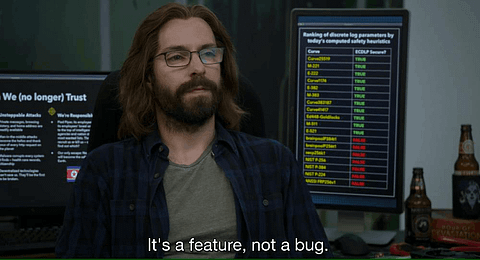

Every system ends up with bad data. Some of it comes from integrations, some from users doing things nobody predicted, and a good part of it comes from us, because we shipped a change that looked fine in review.

This is about what we can do on Tuesday morning, when someone from support writes: _“the price on this reservation looks wrong”_.

## The bug

Imagine we’re working on a hotel reservations system. Pricing there is fiddly: rate plans get revised, extras are added after booking, and the city sets the tourist tax on its own schedule.

Let’s say that the tourist tax used to be a single value in configuration, 4.50 per person per night, multiplied by nights and guests. That was enough for years, because the rate never moved.

Then the city announced an increase to 7.00 from 1 April. It appeared that one value can’t express that: a stay from 30 March to 2 April has nights on both sides of the boundary. So we added rates with validity periods and a lookup to resolve them, and shipped it on 12 March.

The lookup resolves the rate once per reservation, from the check-out date, and applies it to every night. For a stay inside a single period that gives the right answer, which is every case the tests covered. For a stay crossing 1 April, it charges 7.00 for the March nights too. Crazy, but well, that’s how life is sometimes.

A rate change has people checking numbers they’d normally trust, and on 19 March a front office manager reported that the projected tax for early-April arrivals doesn’t match what she gets counting by hand. We confirmed it and deployed a fix at 16:02 the same day.

Then the actual work starts. Which reservations are wrong, by how much, and what do we do about them?

## What we have, with state

Take the reservation support asked about. Seven nights, two guests, 27 March to 3 April, booked on 14 March, breakfast added two days later. Here’s the row:

```plaintext
| id    | check_in   | check_out  | rate_plan_id | total_amount | updated_at       |
|-------|------------|------------|--------------|--------------|------------------|
| 8f21  | 2026-03-27 | 2026-04-03 | RP-STD-2026  | 1358.00      | 2026-03-16 14:02 |
```

The total is wrong. What should it be? The row doesn’t say how the number was produced: no breakdown of rooms, extras and tax, no record of which nights got which tax rate, and no version on `rate_plan_id`, so we can’t tell which prices were in force on 14 March. `updated_at` says 16 March, which is the breakfast, not the booking.

So we recompute and write the migration:

It matches 1,240 rows. We run it at 17:30 on 19 March.

## What that migration does

Around 900 of those rows genuinely came from the broken build. The other 340 were booked before 12 March, had correct totals, and were caught because someone changed a room or added a note during the window. `updated_at` moves for all of that, and there’s nothing in the row that separates “this changed” from “this changed because of the bug”. We recalculate them along with the rest.

`recalculate_total` reads the rate plan as it stands today, and the plans were revised on 15 March for the season. RP-STD-2026 went from 180.00 a night to 205.00. For reservation 8f21 that means:

```plaintext
|         | before      | after migration   | correct  |
|---------|-------------|-------------------|----------|
| rooms   | 1260.00     | 1435.00           | 1260.00  |
| extras  | 168.00      | 168.00            | 168.00   |
| cityTax | 98.00       | 73.00             | 73.00    |
| total   | 1526.00     | 1676.00           | 1501.00  |
```

The migration fixed the tax and repriced the rooms. It did that to every reservation booked before 15 March, roughly 400 of them, and each guest gets a confirmation with a total higher than the one they agreed to.

## And then migration number two

Complaints reach us around 2 April, and we work out what happened. Now we need to put the room prices back. To do that, we need two things per reservation: the date it was booked, so we know which rate plan version applied, and what the total was before we touched it.

We have neither. `updated_at` reads `2026-03-19 17:30` for all 1,240 rows we updated, so it no longer distinguishes the ones we broke from the ones we fixed from the ones we shouldn’t have touched. `total_amount` holds the value our migration wrote. The booking date was never stored separately, and the only thing that used to approximate it was `updated_at`.

So migration two is written against data that migration one produced. We reconstruct booking dates from confirmation emails where we still have them, guess at the rest, and pick a `WHERE` clause that we hope covers the right subset. If we get that wrong, the input to migration three is the output of migration two. I’ve been on both ends of this, and it doesn’t get more pleasant.

We can prepare for this in a state-based system, of course. Keep the breakdown in a JSON column, store the rate plan version on the reservation, add a `price_history` table, add a `corrected_by` marker. I’ve done all of those. The catch is that we add each one after the incident that taught us to, on the table where that incident happened, and today’s incident is on a different table. What we’re building at that point is a partial event log, decided per column, under time pressure.

## The same bug, event-sourced

Here’s the stream for the same reservation:

```plaintext
| when         | event                        | data                                                       |
|--------------|------------------------------|------------------------------------------------------------|
| 14 Mar 09:40 | `ReservationInitiated`       | 27 Mar – 3 Apr, DBL, 2 guests                              |
| 14 Mar 09:41 | `RatePlanApplied`            | RP-STD-2026 v4, 180.00 / night                             |
| 14 Mar 09:41 | `ReservationPriceCalculated` | rooms 1260.00, cityTax 98.00, total 1358.00                |
| 14 Mar 09:41 | `ReservationConfirmed`       |                                                            |
| 16 Mar 14:02 | `ExtraAdded`                 | breakfast, 2 guests, 168.00                                |
| 16 Mar 14:02 | `ReservationPriceCalculated` | rooms 1260.00, extras 168.00, cityTax 98.00, total 1526.00 |
```

The corrupted value is cityTax, and it’s sitting there in plain sight. With two guests, a March night costs 9.00 in tax and an April night 14.00, so five March nights and two April nights come to 45.00 + 28.00 = 73.00. The event says 98.00, which is all seven nights at 14.00. Everything else in that event is right, and RatePlanApplied still says the booking was made at 180.00 a night under version 4, so we can calculate the correct total without reconstructing anything:

```plaintext
| What    | recorded | correct |
|---------|----------|---------|
| cityTax | 98.00    | 73.00   |
| total   | 1526.00  | 1501.00 |
```

That’s the difference from the table. The migration above went wrong because the inputs to the original calculation were gone, and here they aren’t. The 14 March event still says what it said on 14 March, whatever was appended later.

## Knowing which events to look at

The other half is metadata. Here’s the full event:

```json
{
  "type": "ReservationPriceCalculated",
  "data": {
    "reservationId": "8f21",
    "nights": [
      { "date": "2026-03-27", "room": 180.00, "cityTax": 14.00 },
      { "date": "2026-03-28", "room": 180.00, "cityTax": 14.00 },
      "...",
      { "date": "2026-04-02", "room": 180.00, "cityTax": 14.00 }
    ],
    "cityTax": 98.00,
    "total": 1358.00
  },
  "metadata": {
    "timestamp": "2026-03-14T09:41:12Z",
    "correlationId": "b31e...",
    "causationId": "a07c...",
    "userId": "booking-engine",
    "buildSha": "a4f9c2e",
    "schemaVersion": 3
  }
}
```

There’s one interesting metadata: `buildSha`. What is it? It’s the commit the service was running when it appended the event. It’s an environment variable and a few lines in whatever builds our metadata. On 19 March, it lets us query by the thing we actually care about:

```sql
SELECT stream_id, data, metadata
FROM events
WHERE type = 'ReservationPriceCalculated'
  AND metadata->>'buildSha' = 'a4f9c2e';
```

That returns 900 events, and they’re the 900 the broken binary produced. The 340 reservations that were merely touched during the same week don’t appear, because their price events came from a different commit.

The same metadata helps with the diagnosis. `correlationId` groups everything that came from one user action, and `causationId` chains back to the command that triggered this event. When the bad value comes out of a handler three hops from the request, that chain is how we find which request it was.

Without the SHA, we’re still ahead, because the position and timestamp of an appended event don’t move once it’s written. Still, I recommend to add the sha.

## Fix forward, don’t rewrite

The instinct is to go into the store and edit those events. I’d steer you away from that. Events are immutable, and, surprising as it sounds, having precise history, bugs included, is a valid scenario. It’s often the only way to see later what really went wrong. I put it this way in the migration section of [Simple patterns for events schema versioning](https://event-driven.io/en/simple_events_versioning_patterns/): _“you should not change the past... even including bugs, is a valid scenario.”_

Instead, we could append a corrective event:

```typescript
type ReservationPriceCorrected = {
  type: 'ReservationPriceCorrected';
  data: {
    reservationId: string;
    previousTotal: number;
    correctedTotal: number;
    reason: string;
  };
};
```

It’s the accountant’s move: we don’t rub out a ledger line; we post a correcting entry next to it. Then we rebuild the read models so the downstream views show the corrected total, and fix the bug so it stops producing new ones.

There’s a side effect that’s easy to miss. The correction is an event, so the next person to open this stream sees that a bug happened, when it was corrected and why. Nobody has to remember, and if we surface it in the UI, the front desk sees it too.

## If we get the correction wrong too

We might. Say our correction script has its own bug and writes 1501.00 as the room total rather than the reservation total.

The recovery is the same operation as before, because the 14 March events are still there. We read the original calculation, the rate plan version that applied, our correction and its `buildSha`, and we append a second correction computed from the same inputs we had the first time. Nothing we did on 19 March destroyed the material we need on 2 April.

That’s the loop from the state-based version broken. Each attempt adds a fact rather than replacing the evidence, so attempt three is calculated from the booking, not from attempt two.

## The customer already fixed it

Another reservation, four nights, two guests, 29 March to 2 April, at 210.00 a night. Rooms 840.00, tax charged 56.00, correct tax 41.00.

```plaintext
| when         | what                            |                                            |
|--------------|---------------------------------|--------------------------------------------|
| 14 Mar 09:41 | `ReservationPriceCalculated`    | cityTax 56.00, total 896.00, build a4f9c2e |
| 15 Mar 11:20 | guest calls the hotel           | "that's not what I was quoted"             |
| 15 Mar 11:26 | `ReservationPriceCorrected`     | total 839.00, by anna.k                    |
| 17 Mar 08:03 | `ReservationConfirmationResent` |                                            |
| 19 Mar 16:02 | we deploy the fix               |                                            |
| 19 Mar 17:30 | we run the bulk correction      |                                            |
```

Anna’s reason for that correction reads: _city tax recalculated to 41.00, 5% goodwill on rooms agreed with FO manager_. Our recalculation gives 881.00, and it’s correct by the pricing rules. Her 839.00 is also correct, because she took 42.00 off the rooms to settle an argument she was having on the phone.

If our bulk correction is a blind recalculation, at 17:30 it sets the reservation back to 881.00 and undoes her. The guest gets a third number in a third email and calls again. Support opens the reservation, sees the current total, and has no idea why it changed or that it was us. Anna’s note now describes a value that no longer exists.

With the stream, logically the check could look like in pseudo code (hey TS, no pun intended):

```typescript
const needsCorrection = (events: ReservationEvent[]) => {
  const bad = events.findIndex(
    (e) =>
      e.type === 'ReservationPriceCalculated' &&
      e.metadata.buildSha === BROKEN_BUILD,
  );

  if (bad < 0) return false;

  // someone already dealt with it, leave it alone
  return !events
    .slice(bad + 1)
    .some((e) => e.type === 'ReservationPriceCorrected');
};
```

Everything it skips goes on a list for a person to look at. If we’d rather model the goodwill as its own `DiscountGranted` event, the rule becomes “skip if any price-affecting event follows the bad one”, which is the safer version anyway.

We can write that check because the events are there to check. In the mutable model, a bug and a deliberate correction look identical: a number in a column. There’s nothing to branch on, unless we can reconstruct intent from an audit table, assuming the support tool writes to one.

We could do such a check and fix as part of the one-time async job; we could even generalise it and run it as the SQL migration, running it only if it wasn’t run. We could optimise it by loading multiple reservations at once, then doing bulk append, if our store allows that, but the logical work remains the same. The rest is mostly performance optimisation.

## Make the correction a feature



Better still, treat the corrective operation as a requirement and build it before we need it.

Ask the business _“how do you fix this today?”_. There’s almost always an existing answer: a form, a manager’s approval, a note in the folder. Model that. `CorrectReservationPrice` as a command, with permissions, validation and a mandatory reason, producing `ReservationPriceCorrected`.

Our bulk fix then goes through that command, with the same rules and the same events as when Anna runs it from the front desk. Nobody connects to the production database at 23:00.

And when the business says something can never happen, the follow-up is still: fine, how often?

There’s a harder version of this. I once watched a hotel checkout get stuck on a blocked financial account, which then jammed the entire night audit, with no way out except a migration or a hotfix. That’s the worst place to end up, telling a customer they can’t operate until we ship code. Bugs, bad data and stuck processes aren’t edge cases we can design away, which is the argument in [No, it can never happen!](https://event-driven.io/en/no_it_can_never_happen/): _“We cannot assume that we won’t have a bug, or our hardware or network won’t have any random failure.”_ And if there’s no way to correct something inside the application, someone will do it with an `UPDATE` at 23:00. Read the horror story described there.

And check [What texting your Ex has to do with Event-Driven Design](https://event-driven.io/en/what_texting_ex_has_to_do_with_event_driven_design/).

## “But now the history contains a bug”

Yes. The wrong price was real. It was shown to the guest, it went into a confirmation, it may have reached the invoice and the tax report. A log that shows only the corrected price can’t explain why the guest called.

If we need a clean stream later, for a regulator or a migration, still don’t edit in place. Copy and transform into a new stream, and keep the original.

None of this stops us shipping the bug, makes repricing 900 reservations free, or spares us the conversations with guests whose total changed twice.

What we get is better material to work with. We can name the events the broken build produced. We can read the value it wrote, with the inputs beside it. And we can see which reservations someone has already handled, and what they agreed to.

In a state-based system, fixing data overwrites the evidence we’d need to check whether the fix worked, which is how one migration ends up repairing the last one. Keeping the record of the mistake is what lets us check our own work afterwards.

Cheers!

Oskar

**p.s. Ukraine is still under brutal Russian invasion. A lot of Ukrainian people are hurt, without shelter and need help.** You can help in various ways, for instance, directly helping refugees, spreading awareness, and putting pressure on your local government or companies. You can also support Ukraine by donating, e.g. to the [Ukraine humanitarian](https://savelife.in.ua/en/donate/) organisation, [Ambulances for Ukraine](https://www.gofundme.com/f/help-to-save-the-lives-of-civilians-in-a-war-zone) or [Red Cross](https://redcross.org.ua/en/).
