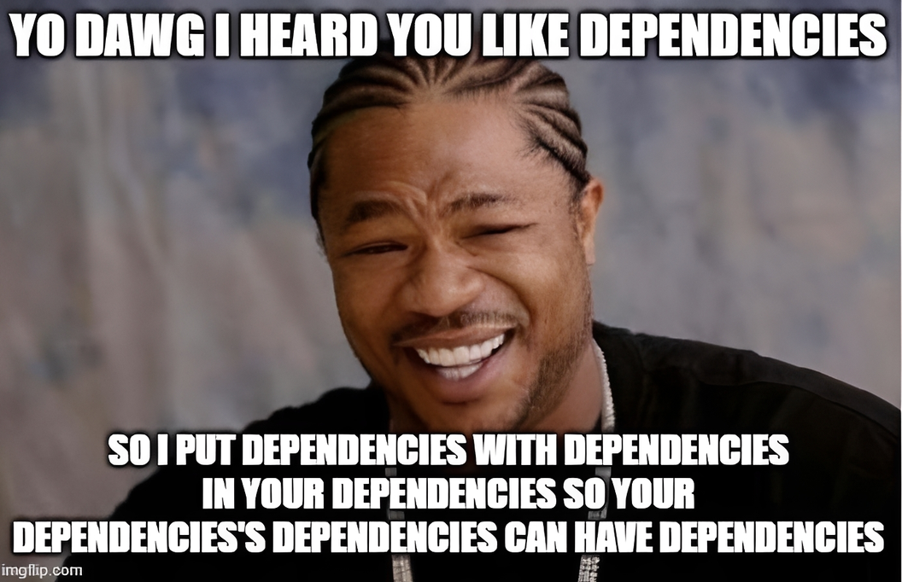

**A few questions about Vertical Slices come up again and again, and they're good ones.**

- If a slice cuts through all the layers, do we get a table per slice?
- If I've split the application into seven areas, are those seven bounded contexts, or seven slices of one? And does the answer change what they're allowed to know about each other?
- How can a "verify order" slice check what a "register order" slice wrote, if the two aren't supposed to know about each other?
- Where does the fetching code live when one screen needs data owned by another module, and the dependency rules block every place we could put it?
- Should a UI component know about the API call a neighbouring component makes?

For me, these are all versions of one question: **what does a slice do when it needs something from the outside world?**

Calling every area of an application a bounded context sets the bar for separation as high as it can go, because contexts are genuinely meant to be autonomous. Once you've done that, connecting any two of them looks like a violation, and the other questions have no legal answer.

The assumption doing the damage rarely gets stated because it feels too obvious: a slice ought to be self-contained, so needing something from elsewhere means the cut was wrong. I held it myself for a while.

I've written before about [how to slice the codebase effectively](/en/how_to_slice_the_codebase_effectively/) and shown [a worked module](/en/vertical_slices_in_practice/), and I listed "you can't share code between slices" as [one of the myths that grew around the pattern](https://www.architecture-weekly.com/p/my-thoughts-on-vertical-slices-cqrs). What I didn't do was show the positive answer. Minimise isn't zero, so what does the non-zero look like once you type it out?

Vocabulary is where this gets tangled, so let me start there.

## Slice, module, context

Three words that get used interchangeably, and I think a lot of the pain comes from that.

**A vertical slice is one piece of functionality, cut through the whole application.** For me, a slice is more a function than an entity. _"Verify a transport order"_ is a slice. It has a way in, some business logic, and whatever it reads and writes. If you're thinking of it as a thing with a lifecycle, you're probably thinking of an entity, which is a different concept that lives within the slice's reach rather than being the slice.

**A module is a logical grouping of slices.** Orders is a module. It holds registering an order, verifying it, confirming it, and listing what's pending. The grouping is a judgement call, and the criterion I use is what changes together.

**A bounded context, in DDD terms, is a linguistic barrier.** It's a set of functionality that the business uses the same vocabulary for, distinct from other contexts. In a given context, a word always means the same thing. Across contexts, the same word can mean something else entirely.

A frontend and a backend aren't two bounded contexts; they're two deployment targets. You can have one deployment for multiple contexts, and a single bounded context with multiple deployments. If a frontend feature is part of the bounded context and has backing WebAPI, then the business should use the same words across both. Two product listings that differ in which fields they show aren't two contexts either, since nothing about the vocabulary changes between them. Draw the line in either place, and you get the terminology without the boundary (or just a pure technical boundary), and then wonder why the _"contexts"_ need constant coordination.

Seven features of one application are almost always slices, or at most modules, sitting inside a single context. That's good news, because it means they were never obliged to be autonomous.

I'll be honest: I don't love the term "bounded context". It's imprecise in the original books and even more misleading in practice, because most people encounter it third-hand and take it to mean _"a big folder we agreed to keep apart"_. If the word causes arguments on your team, drop it and talk about which functionalities share a vocabulary. That usually works better.

Labels aside, what I do in practice is start from the functionalities we have to deliver, group them logically into components, and check that grouping against the UX map. Technological splits (a layer for data access, a layer for services, one for the frontend and one for the backend) have always ended badly in my projects. Business grouping usually held up longer.

## Slices boundaries in practice

Let's use the transport order. It gets registered, then verified, then confirmed, then settled. Verification means checking that the contractor and the driver actually exist in the carrier's own system, which is an external API we don't control.

It's tempting to model this as one `orders` row with a `status` column that moves `registered → verified → confirmed`, updated through a generic endpoint. That's how it usually starts, and the trouble begins there, because the endpoint that changes `status` also changes the pickup address and the contact phone. The system records that the order is verified. It doesn't record that anybody verified it.

Greg Young made this argument better than I will in [Task-Based UI](https://cqrs.wordpress.com/documents/task-based-ui/): when the client posts data-centric structures back and forth, the domain has no verbs, and the user's intent is lost on the way in. His point is that the client should tell the server to *do something*, so that the intent becomes the exact task for the backend expressed by the message we sent (rather than being inferred from a combination of fields mixed with the current state).

Naming the operation is also what gives you something to slice along. If every operation is "update the order", you have one feature and nothing to divide. Once you have `VerifyOrder`, `ConfirmOrder`, `RejectOrder`, you have folders, and each folder is named the way the business names the operation. This holds for plain CRUD systems too. The name is the value, and the underlying implementation can be a single `UPDATE`.

So we get:

```
📁 orders
    📁 verifying-order
    📁 confirming-order
    📁 registering-order
    📁 pending-orders
```

Which leaves the question I started with. Verification needs the carrier's system, and confirming needs to know what verification established. Where does that go?

The shape I use is a handler taking two arguments: its dependencies, then the message.

```ts
// orders/verifying-order/verifyOrder.ts

export type ContractorStatus = 'Active' | 'Unknown' | 'Suspended';
export type DriverStatus = 'Licensed' | 'Unknown' | 'Expired';

// Dependencies
export type CheckContractor = (id: ContractorId) => Promise<ContractorStatus>;
export type CheckDriver = (id: DriverId) => Promise<DriverStatus>;

// Handler
export const verifyOrderHandler = async (
  {
    getOrder,
    saveOrder,
    checkContractor,
    checkDriver,
  }: {
    getOrder: GetOrder;
    saveOrder: SaveOrder;
    checkContractor: CheckContractor;
    checkDriver: CheckDriver;
  },
  command: VerifyOrder,
): Promise<void> => {
  const order = await getOrder(command.orderId);

  const [contractor, driver] = await Promise.all([
    checkContractor(order.contractorId),
    checkDriver(order.driverId),
  ]);

  await saveOrder(verifyOrder({ ...command, contractor, driver }, order));
};
```

The first parameter is dependencies, and I think about it the same way I think about [React props](https://react.dev/learn/passing-props-to-a-component). The component declares what it expects; whoever renders it decides what to pass. Same here: the handler declares what it expects, and it has no opinion about where those functions come from: the same module, a different module, an HTTP client, or a stub.

The business logic underneath takes everything as data and returns a decision:

```ts
// orders/verifying-order/verifyOrder.ts

// Business logic
export const verifyOrder = (
  command: VerifyOrder & {
    contractor: ContractorStatus;
    driver: DriverStatus;
  },
  order: Order,
): Order => {
  if (order.status !== 'Registered')
    throw new Error(`Cannot verify an order in ${order.status} state`);

  if (command.contractor !== 'Active')
    throw new Error(`Contractor is ${command.contractor}`);

  if (command.driver !== 'Licensed')
    throw new Error(`Driver licence is ${command.driver}`);

  return {
    ...order,
    status: 'Verified',
    verifiedBy: command.verifiedBy,
    verifiedAt: command.now,
  };
};
```

Nothing here is fetched, so testing it means passing values in and checking what comes out. No mocks, no container, no database.

**There's no `ITransportManagementSystem` interface here with fifteen methods.** Pragmatically, you can pull the whole thing in, and plenty of codebases do, but I've come to prefer narrowing it: two functions, three cases each, defined in this folder, in this slice's language.

The carrier's system almost certainly has a richer model of a contractor than the three cases, including credit terms, insurance validity, certificate expiry dates, and territorial permissions. Verification only needs to know whether this order can proceed. Declaring the narrow type keeps the slice in its own vocabulary rather than importing someone else's, which is the bounded-context idea applied on a much smaller scale.

## Duck typing and dependencies

Nothing in the codebase declares that it implements `CheckContractor`. There's no `implements` clause anywhere. Any function of a compatible shape satisfies it. That means the type can live with the consumer, the slice that needs it, rather than with whoever ends up providing it.

So you can write the need, the handler, and the tests before anyone has decided who will serve it. Whether `checkContractor` becomes an HTTP call, a query against a table we replicate nightly, or a function returning `'Active'` for the first three weeks stays open. When an external shape doesn't match, you fit it or remap it at the point of supply, and neither side changes.

[Golang bets its whole dependency story on this](https://medium.com/@raafvargas/dependency-injection-in-go-35293ef7b6). Interfaces are satisfied implicitly, and the convention is that the consumer declares the interface it needs, sized to its use. Hence the proverb about the bigger interface being the weaker abstraction. `io.Reader` is one method, and half the standard library composes through it.

[Structural typing](/en/structural_typing_in_type_script/) gives us that in TypeScript, and I think it's underused by people arriving from C# and Java, where the habit is to define a nominal interface and hand it around.

**So where do the dependencies come from?**

Somewhere near the entry point, you create the real things once, build the small functions the handlers asked for, and pass them in:

```ts
// apps/api/composition.ts
const db = drizzle(process.env.DATABASE_URL!);
const carrier = carrierApiClient(process.env.CARRIER_API_URL!);

const contractorStatus =
  (client: CarrierApiClient): CheckContractor =>
  async (id) => {
    const contractor = await client.getContractor(id);

    if (!contractor) return 'Unknown';

    return contractor.suspendedAt ? 'Suspended' : 'Active';
  };

export const orders = {
  getOrder: getOrderFrom(db),
  saveOrder: saveOrderTo(db),
  checkContractor: contractorStatus(carrier),
  checkDriver: driverStatus(carrier),
};
```

That mapping function is where two vocabularies meet, and I like having exactly one place where that happens. Everything the carrier knows about a contractor collapses into three cases, in a file you can read in ten seconds.

The routes are then thin:

```ts
// apps/api/routes.ts
app.post('/orders/:id/verification', async (req, res) => {
  await verifyOrderHandler(orders, {
    orderId: req.params.id,
    verifiedBy: req.user.id,
    now: new Date(),
  });

  res.status(204).end();
});
```

That's the mechanism: partial application, done by hand, in a file whose job is to know about everything so that nothing else has to. No container, no registration, no lifetime scopes. In a monorepo, this file lives in `apps/`, and `packages/` holds slices that declare but never resolve. If you're using Nx, this is the composition point its boundary rules exist to protect. In other environments, where Dependency Injection Containers are out of the box, you can still use the same way; in .NET, you can use [the same pattern by injecting dependencies explicitly even to methods](https://jeremybytes.blogspot.com/2024/02/method-injection-in-aspnet-core-api.html).

The tests use the same shape:

```ts
const contractor = (status: ContractorStatus): CheckContractor => () =>
  Promise.resolve(status);

test('refuses to verify an order for a suspended contractor', async () => {
  const store = inMemoryOrderStore([registeredOrder]);

  await expect(
    verifyOrderHandler(
      { ...store, ...carrierStubs, checkContractor: contractor('Suspended') },
      verifyCommand,
    ),
  ).rejects.toThrow('Contractor is Suspended');
});
```

There's no mocking framework here, because there's nothing to mock. You can pass an in-memory implementation, a stub, or a real client pointed at a sandbox. The handler can't tell the difference.

## Everything outside the slice is external

**From inside a slice, there's one category of thing: external.** Another slice next door, the parent module, a different module, a third-party API, the database. All the same. The slice states a function type and doesn't ask where the implementation comes from.

That keeps the slice movable. Because it defines its own dependencies, changing the logical grouping later is a matter of what you inject, not a rewrite. If verification turns out to belong in its own module, or gets extracted into a service, the handler stays as it is. Testing in isolation comes out of the same property, as the test above shows, and I get it as a side effect rather than designing for it.

**None of this is about hiding the coupling.** For me, independence isn't a value in itself. I'd rather know the connections I need to have and be able to look at the code to see what it depends on and what it does. Hidden dependencies are still there, only harder to find. What I'm optimising for is cohesion, and explicit dependencies serve that.

**What about the module's public API?**

If you've read my [Architecture Weekly piece on VSA](https://www.architecture-weekly.com/p/my-thoughts-on-vertical-slices-cqrs), you'll have seen me recommend an `api.ts` per module, exposing what's public and hiding the rest. That may seem to contradict what I've just described.

They point in opposite directions across the same boundary. `api.ts` is what a module **offers**: the surface it's willing to support and that the module owns. `CheckContractor` is what a slice **asks for**: a need, owned by the consumer, expressed in the consumer's terms.

You want both, because they protect against different things. Without the module API, everything is reachable, and any internal change can break a caller you didn't know you had. Without consumer-declared needs, the consumer is coupled to the shape of whatever the provider decided to expose, including the parts it never calls.

The composition root is where the two meet. It takes what the module offers and adapts it to what the slice asked for. That adapter is a few lines, it lives in one place, and it's the only code that knows both vocabularies.

**Cycles stop being a problem.** Orders needs contractor standing. Pricing needs order history to work out volume discounts for the same contractor. That's a genuine mutual need, and if both modules import each other, you have a cycle. The compiler may tolerate it. Your boundary rules probably won't. This is the situation where the tooling forbids two modules at the same layer from referencing each other, and it's easy to conclude from that the design must be wrong.

The usual escape is to extract the shared parts into a common module. That works twice; then the common module becomes the place everything ambiguous lands, and changing it means changing everything.

But there's no cycle if neither module imports the other. Orders declares `CheckContractor`. Pricing declares its own:

```ts
// pricing/volume-discounts/orderHistory.ts
export type CompletedOrder = Readonly<{
  completedOn: Date;
  netValue: Money;
}>;

export type GetCompletedOrders = (
  contractorId: ContractorId,
  since: Date,
) => Promise<CompletedOrder[]>;
```

Two fields, because that's what a volume discount calculation uses. The composition root supplies a function that queries orders and maps the result down to that shape.

**Most module-level cycles I've run into were a shared concept whose owner hadn't been decided yet.** Declaring narrow needs lets you defer that decision rather than resolve it early and wrong. If it later turns out that contractor standing genuinely belongs in one place with a single definition, you'll know more by then, and moving it is cheap because only the adapters point to it.

If your dependency rules forbid the arrangement your domain wants, it's worth checking whether they're describing your design or your import graph. Rules that block a module from reaching another module are useful. Rules that block it because two files sit at the same "layer" are enforcing a layering you may have already outgrown.

## Two entry points, one feature

What if the same operation can be triggered two ways?

An order gets confirmed by a dispatcher through the UI. It also gets confirmed automatically when the carrier's system reports the assignment accepted. Same rule, different trigger, different surrounding logic.

Both files go in `confirming-order/`, side by side. I showed this pattern in [Vertical Slices in practice](/en/vertical_slices_in_practice/) using an API endpoint and an external booking event that share a single command handler. With dependencies declared per handler, the event-triggered one looks like this:

```ts
// orders/confirming-order/confirmOrderOnAssignmentAccepted.ts

export const confirmOrderOnAssignmentAccepted = async (
  { getOrder, saveOrder }: { getOrder: GetOrder; saveOrder: SaveOrder },
  event: AssignmentAccepted,
): Promise<void> => {
  const order = await getOrder(event.orderId);

  await saveOrder(
    confirmOrder(
      {
        orderId: event.orderId,
        confirmedBy: SystemUser,
        now: event.acceptedAt,
      },
      order,
    ),
  );
};
```

**The two handlers don't have the same dependencies.** This one has no carrier check at all, since the event came from the carrier and we already have the answer. The dispatcher-triggered version loads more, because it starts with less. The business logic is shared; the application logic isn't, and each entry point declares what it actually uses.

The same applies to what you reuse across slices. I'd reuse a policy or a calculator, say a pure function like `settlementFor(order, tariff)` used by both confirmation and settlement, before I'd reuse a whole handler. The pure function is a function of its arguments and cheap to share. Handlers differ in what they load, check and record, and that's the part that tends to change.

## Vertical Slices and Database

Back to the table per slice. Three separate things get conflated in that question.

**Business logic goes per entity or aggregate.** The rules about what states an order can be in and which transitions are legal belong to the order. One place, and every slice that decides about an order goes through it. Slices don't each get a private notion of what an order is.

**Read models go per query.** This is where a table per feature is right. The dispatcher's pending-orders board needs order number, contractor, pickup window and verification state, sorted by pickup time. Build a table that answers that. The settlement report needs something else and gets its own. Resist making a single query serve five screens by expanding columns.

**Database schemas go per module.** One for orders, one for pricing. A slice is a feature, not a persistence boundary. A schema per slice gives you migrations that correspond to nothing, and joins across five schemas to draw a single screen.

You can do all of this with one status column and an ORM. If you want the four distinct operations that currently collapse into `status = 'cancelled'` to stay distinguishable, appending them as facts is what [Event Sourcing](/en/vertical_slices_in_practice/) offers, and it composes well with this. Nothing above depends on it.

## Vertical Slices and Frontend

**Don't force a 1:1 mapping between the UI and the backend.** One screen is routinely composed of data gathered from several modules, and one user action can trigger operations in several. That mismatch is normal. GraphQL exists partly as an attempt to solve it, whatever you make of that as a solution.

A dispatcher board showing pending orders, contractor status and a confirm button touches three slices across two modules. Two reasonable arrangements:

Compose at the page. The page fetches from several endpoints and arranges the results, holding no business logic of its own. Components receive what they need as props and know nothing about where they came from, for the same reason that handlers take dependencies as arguments. A component that takes props is easy to move and easy to feed with a different implementation.

Or write a backend-for-frontend. If the screen needs it in one request, make a slice whose job is to serve that screen, depending on the others and stitching them together. It's still a slice; it's named after a screen because that's honestly what it is.

Which one depends on how much the round-trip costs you and how stable the screen is. Both beat growing one endpoint until it serves every screen you have.

The backend usually knows which operations are currently available for a given order, and the frontend is often re-deriving that from status fields. Returning the available actions with the data keeps that decision in one place. That's the part of HATEOAS I find useful, without the rest of the ceremony.

Splitting the frontend by kind of thing tends to look suspicious to me. Two listings that differ only in which fields they show are usually one feature with a parameter. Splitting by market or country is more often real, because it genuinely is a different application with different rules. It's hard to judge from a description; what I'd do is map the functionalities first and see which ones actually change together.

## TLDR

The question I started with was what a slice does when it needs something it doesn't own. My answer is that it declares the need and leaves it to something else to decide where it comes from.

Which comes down to:

- Everything outside the slice is external, whether it's the next folder or another system.
- Declare narrow function types where they're used, in your own vocabulary, rather than importing a wide interface.
- Compose by passing functions in, in one file, near the entry point.
- A module's public API and a slice's declared need are different directions of the same boundary, and the composition root adapts between them.
- Reuse policies and calculators; let handlers duplicate.
- Business logic per entity, read model per query, schema per module.
- Don't expect the frontend to mirror the backend.

None of this needs a framework, a container or a particular database. It's more about a convention applied consistently.

And your first grouping will still be wrong somewhere. Mine usually is. That's fine, as long as being wrong stays cheap, which is the argument for [removability over maintainability](/en/removability_over_maintainability/) and for keeping the couplings visible rather than tucked away. A slice that states its dependencies is one you can move.

**And the cherry on top: this approach helps LLM agents too.** Everything a feature needs sits in one folder, with a handful of function types crossing the boundary. To change how verification works, you open `verifying-order`. The command, the rules, both entry points and the tests are in it.

That was always the argument for grouping changes together: it reduces how much a person has to hold in their head. The same property determines how much can fit in a context window and how much of a codebase an agent has to read before it can safely change one behaviour. A layered structure that needs five folders touched for one feature costs an agent the same way it costs us, faster.

So it's an old argument that happens to have got more valuable.

Cheers!

Oskar

p.s. **If you're dealing with such issues, I'm happy to help you through consulting, [training](/en/training) or mentoring. [Contact me](mailto:oskar@event-driven.io) and we'll find a way to unblock you!**

p.s. **Ukraine is still under brutal Russian invasion. A lot of Ukrainian people are hurt, without shelter and need help.** You can help in various ways, for instance, directly helping refugees, spreading awareness, putting pressure on your local government or companies. You can also support Ukraine by donating e.g. to [Red Cross](https://www.icrc.org/pl/donate/ukraine), [Ukraine humanitarian organisation](https://savelife.in.ua/pl/donate/) or [donate Ambulances for Ukraine](https://www.gofundme.com/f/help-to-save-the-lives-of-civilians-in-a-war-zone).
