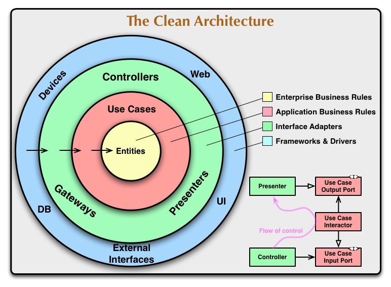
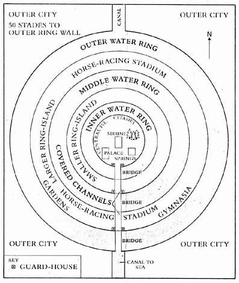

[I wrote on LinkedIn](https://www.linkedin.com/posts/oskardudycz_vertical-slices-their-ownership-and-external-activity-7492601542806609920-4Zkh?utm_source=share&utm_medium=member_desktop&rcm=ACoAAAN8Nx8B98JMAXELXW2GQXKrHtPuoimvwFc) that it seems that there are never enough articles on Vertical Slices. Each time I write a follow-up, there’s another follow-up needed. And guess what? After last week, I need another one!

[Adam asked me in the comments](https://www.linkedin.com/feed/update/urn:li:activity:7492601542806609920?commentUrn=urn%3Ali%3Acomment%3A%28activity%3A7492601542806609920%2C7492865005881679873%29&dashCommentUrn=urn%3Ali%3Afsd_comment%3A%287492865005881679873%2Curn%3Ali%3Aactivity%3A7492601542806609920%29):

> How do you see Fractal Architecture fitting into this approach? To me, it makes sense to place shared code in the smallest logical grouping of slices that use it, keeping it close to its usage while isolated from the rest of the application.

And to give you a proper answer, I need to start by telling you about the Aussie guy called John Sweller.


[In 1988, he coined an important term:](https://onlinelibrary.wiley.com/doi/epdf/10.1207/s15516709cog1202_4) **[Cognitive Load](https://onlinelibrary.wiley.com/doi/epdf/10.1207/s15516709cog1202_4)**[.](https://onlinelibrary.wiley.com/doi/epdf/10.1207/s15516709cog1202_4) He said:

> “Our working memory is only able to hold a small amount of information at any one time and that instructional methods should avoid overloading it in order to maximise learning”

When I was younger, I believed that I could multitask; I also bragged that I had such a good memory that when I started managing my calendar and taking notes, I got old. And yeah, it seems that I’m old now.

When our industry evolved from the machines responsible for calculations and highly specialised machines and their operators, and became a big, valuable industry, we started to have issues with scaling. Not only technical scaling of distributed systems, but most importantly, scaling the work delivery.

Our teams grew bigger, and more and more industries started to benefit from the automation that computers brought. Developers slowly stopped working in a narrow vertical structure with business folks, but became jacks of all trades and masters of none. Or actually, some had to become masters of the one: technology.

The pendulum swung, and we landed in the ~Helios~ Technology-centric world:



And yes, I know, in theory, the entities are “Enterprise Business Rules”, which means that business logic should be at the heart of our application, but effectively what you see, and where the emphasis is, are the layers. Even if you measure the surface of those layers, those technical layers are big enough that we can lose sight of what we are here for. And we’re here to deliver business value through software.

Of course, for organisations it was easier to tell:

-   hey, you don’t need to care what you do, just deliver this nicely looking UI,

-   just take care of those distributed services integration, ensure they work, and you don’t need to care what they do,

-   hey, you’re the chosen one, smarty pants, right? Yeah, you’ll work on the domain.

It was justifiable to some degree, since all of that required specific technical skills that took time to master. It was also easier to just throw people who were supposed to be “good enough” to solve cases. Learning domains takes time. For me, it was usually about a year before I felt comfortable enough to understand the business. So people hoped that breaking down the work by technical aspects would cut the onboarding time.

But well, it ended up as something explained by a similar diagram:



Yup, collapsed like Atlantis,

Why did this fail? I wrote about it in:

-   [What does Mr Bean opening the car have to do with programming?](/en/what_does_mr_bean_opening_the_car_have_to_do_with_programming/)

-   [What onion has to do with Clean Code?](/en/onion_clean_code/)

In short? It skyrocketed the cognitive load. Our architecture should be optimised to keep together things that change together. That way, we can work within a certain scope without jumping from one place to another. And that’s what working with layered architecture looks like.

To add one web api endpoint, you need to change presentation, application, domain, and storage layers, each kept entirely separately just for the sake of subjective cleanliness. Also, if you had to understand what you have to do to complete a feature that touches multiple other features, you need to have a PhD.

In general, the investigations looked like wanting to check the weather on your phone, and then realising 2h later that you just bought a skateboard after going through the path of reminiscences brought by doom scrolling on social media. And you still don’t know if it’s going to rain or not.

So the pendulum swung again. We like to bounce back and forth; just like a pendulum, we can’t stop somewhere in the middle. Many people are now claiming that we don’t need any layers, that we should be vertically aligned. So we should cut our applications down to only the business features. We don’t need any grouping; what we care about is being autonomous and delivering features separately.

The initial idea was nice, something like _“let’s get back to the roots and think differently, keeping the focus on business”_. Yet, we got semantic diffusion of the original idea, and what was heard the most was: no layers, just vertical features.

I explained that in detail in [My thoughts on Vertical Slices, CQRS, Semantic Diffusion and other fancy words](/en/my-thoughts-on-vertical-slices-cqrs/).

**Why is it an issue?**

Have you seen a huge backlog in Jira? Just a huge to-do list filled with tasks for some features.

How easy is it to understand what actually has to be done?

How do you manage the priority?

How do you understand dependencies, and why are those features actually added?

Typically, that’s where the Jirology starts, and that’s why we hate it. But the issue originates somewhere else.

Cynically, or using [Occam’s razor](https://en.wikipedia.org/wiki/Occam%27s_razor), the answer is simple. More or less how W. Edwards Deming framed it:

> A bad system will beat a good person every time.

If our goal is the same: scaling the development process and its output, then no matter what we change internally, which architecture we choose, it’ll diffuse into what we optimise for.

So, as always, breaking the business capability into a smaller set of features was how many architects and CEOs distributed the work and made it parallel. Faster rarely means better. Unless we’re in the race car industry.

**Also, for many software engineers, feature-based delivery was a way to simplify their lives.** They could write a vague ADR, with just a few sentences describing the idea. It’s easy to write something that sounds good, but without enough detail, it’s hard to tell the implications and the exact delivery plan.

Now, when you have the vague plan accepted, you can slowly, feature by feature, deliver lower-quality, simplistic solutions, backing this up with the claim that

> “Well, it’s done according to the specification we agreed on. We don’t have enough time to go again through this process. We need to deliver the feature.”

Sounds familiar? For me, too familiar. I have seen numerous cases where requirements drift one after another, slice by slice. And teams backing their next change with the previous one.

I’ve also seen numerous cases where teams felt really comfortable narrowly focusing on the exact features without even asking what the bigger picture is or why it was added. That led to, obviously, a maze, duplication of code and responsibility and lots of features that have had a hard time talking to each other.

Ok, so should our pendulum swing again, and should we get back to what, not my uncle, was praising?

**Again, maybe the answer is to finally stop somewhere in the middle and focus on the outcome instead of the output? So, the business outcome and the software product.**

Indeed, we should invest in decreasing the cognitive load and making our software easier to fit in our heads. We already learned that:

-   technical split is not great,

-   feature split is better but still far from great.

**Some time ago, two people I respect a lot started talking about Fractal Architecture.**

`youtube: [Embedded video](https://www.youtube.com/watch?rel=0&autoplay=0&showinfo=0&enablejsapi=0&v=1ZyR_tgGTp8)`

`youtube: [Embedded video](https://www.youtube.com/watch?rel=0&autoplay=0&showinfo=0&enablejsapi=0&v=t3rSCpcJzm0)`

I’m afraid to write about it, not to start counting where it becomes semantically diffused. But that’s important.

Mark Seemann also wrote a great book, [Code That Fits in Your Head](https://www.goodreads.com/en/book/show/57345272-code-that-fits-in-your-head). Check it out; it’s a simple book teaching on why code is important and design activity, and why we need to invest in fast feedback loops and simulations. Highly relevant nowadays. Much better than reading next-gen AI bros’ hot takes.

Nevertheless, the idea is that, indeed, if we want our software to do what it does, to deliver business value, we should focus on the business. Yet, to avoid ending up with the overfocus and feature factory (as we discussed), we should note that we could compose it. With the idea that big things are composed of small things.

Ok, enough philosophy; let’s get back to the original example from the previous article. We discussed the following e-commerce order features:

```text
📁 orders
    📁 verifying-order
    📁 confirming-order
    📁 registering-order
    📁 pending-orders
    📁 order-storage // 👈 look ma, technical concept!
```

Now, if we added a shopping cart, then it could look like:

```text
📁 shopping-carts
    📁 adding-product-item
    📁 removing-product-item
    📁 confirming-cart
    📁 clearing-cart
    📁 cart-storage // 👈 look ma, technical concept!
```

We could group that into the e-commerce module

```text
📁 e-commerce
    📁 shopping-carts
        📁 adding-product-item
        📁 removing-product-item
        📁 confirming-cart
        📁 clearing-cart
        📁 cart-storage
    📁 orders
        📁 verifying-order
        📁 confirming-order
        📁 registering-order
        📁 pending-orders
        📁 order-storage
```

If we zip that into the e-commerce system, we’d see:

```text
📁 e-commerce
    📁 shopping-carts
    📁 orders
```

We could continue to elevate that into, e.g. the whole ERP system with other modules like marketing, sales, etc. Each of them would have its own sub-modules.

```text
📁 erp
    📁 e-commerce
    📁 marketing
    📁 sales
```

Looks familiar?

Yes, the layout is the same as the order module. What’s more, this can also go down, so:

```text
📁 orders
    📁 verifying-order
        📁 anti-fraud-detection
            (...)
        📁 high-value-custome-verification
        📁 external-order-verification
    📁 (...)
```

It’s the same repeated pattern. Just like fractals, they’re chaotic in the sense that each fractal is different, just like each software product is different, but if we look carefully enough, then those chaotic patterns start to repeat themselves.


**So why isn’t that a standard if it’s so great and simple?**

Things get hard when you start thinking about cross-boundary splits and their dependencies.

We already discussed with the features factory that no-boundaries is not a solution. Even if we remove them all and make all things separate, they won’t magically become autonomous. They’ll still have dependencies, just hidden, which is the worst type of coupling you can have.

Let’s look again at this example

```typescript
import { type OrderStorage } from '../order-storage;

// Dependencies
export type CheckDriver = (id: DriverId) => Promise<DriverStatus>;

export type VerifyOrderDependencies = {
    storage: Pick<OrderStorage, 'getOrder' | 'saveOrder'>;
    drivers: {       
        checkDriver: CheckDriver;
    }
}

// Feature
export const verifyOrderHandler = async (
  {
    orderStorage: {
      getOrder,
      saveOrder
    },
    drivers: {
      checkDriver
    }
    checkContractor,
    checkDriver,
  }: VerifyOrderDependencies,
  command: VerifyOrder,
): Promise<void> => {
  const order = await getOrder(command.orderId);

  const driver = checkDriver(order.driverId),

  await saveOrder(verifyOrder({ ...command, driver }, order));
};
```

We declare explicitly what our feature needs.  

Why couldn’t we do the same for the whole module?

```typescript
import { verifyOrderHandler, type CheckDriver } from ‘verifying-order’;

// Dependencies
export type OrdersDependencies = {
    database: {
       connectionString: string
    },
    drivers: {       
        checkDriver: CheckDriver;
    }
}

// Feature
export const orders = async (
  props: OrdersDependencies,
  command: VerifyOrder,
): Promise<void> => {
  const db = drizzle(props.database.connectionString);
  const storage = ordersStroage(db);

  const verifyOrder = (command) => verifyOrderHandler(
    {
        // DEPENDENCIES
        drivers: deps.drivers, // 👈 EXTERNAL
        storage // 👈 INTERNAL
    },
    command
  );

  return {
     verifyOrder, // 👈 EXPOSES
  }  
};
```

See, we define:

-   **Dependencies**: what do we need from the outside world, e.g. where our data is stored (connection string) and how drivers are checked (from the outside world). Then we can feed that to child components using both external dependencies (e.g. drivers) and other internal components (e.g. storage).

-   **Capabilities:** what do we expose to the outside world (e.g. order verification, which may be used by other modules, or a dedicated API component wrapping orders).

We could do the same at the higher level and the lower level. Just like Fractals, or like Hive (as nicely put by Julien Topçu & Thomas Pierrain).

`youtube: [Embedded video](https://www.youtube.com/watch?rel=0&autoplay=0&showinfo=0&enablejsapi=0&v=JZBsy6PsCRY)`

Read also the article [Onion, Hexagonal, Clean or Fractal Architecture? All of them, and more!!](https://www.planetgeek.ch/2024/09/19/onion-hexagonal-clean-or-fractal-architecture-all-of-them-and-more/) where Urs Enzler explains how he mixes all of that together.

**And that’s also what the [C4 model](https://c4model.com/) is doing:** embracing different levels. Although it has a hard limit of 4, so it’s not a true fractal, which makes sense, since we should also be cautious about setting up paths that are too deep.

**Of course, that doesn’t mean we need to go crazy and define all dependencies this way.** If those are calls to inner module methods or some shared code, we can call it explicitly. Then we’re coupling those components together, but if it’s explicit and helps us tame complexity and make things more explicit, then why not?

Nevertheless, that’s why I don’t like jargon like “bounded context”, as it’s vague, but it’s presented as precise. I prefer to be “explicitly implicit” and just say that we’re composing the application from a component tree (or building a fractal).

Whether it’s a system, component, module, or slice, we can tackle that the same way. Of course, each will differ in responsibility, scope, etc., but as long as we have clear dependencies expressed as: here’s what we need, and a public API as: here is what you can get from us. We can freely compose our relationship.

**All of that allows us to keep our cognitive load at a level where what we see fits into our heads, and focus on the business features, not technicalities.** This helps us fight the forces we discussed today that push us to optimise for output rather than outcome.

Thoughts?  

Cheers!

Oskar

p.s. **Ukraine is still under brutal Russian invasion. A lot of Ukrainian people are hurt, without shelter and need help.** You can help in various ways, for instance, directly helping refugees, spreading awareness, putting pressure on your local government or companies. You can also support Ukraine by donating e.g. to [Red Cross](https://www.icrc.org/pl/donate/ukraine), [Ukraine humanitarian organisation](https://savelife.in.ua/pl/donate/) or [donate Ambulances for Ukraine](https://www.gofundme.com/f/help-to-save-the-lives-of-civilians-in-a-war-zone).
