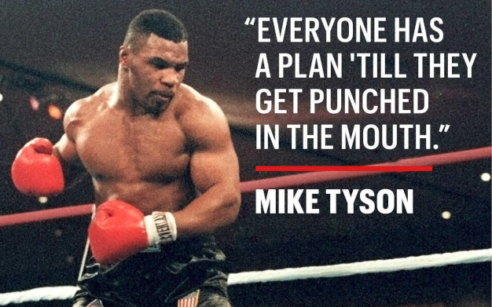
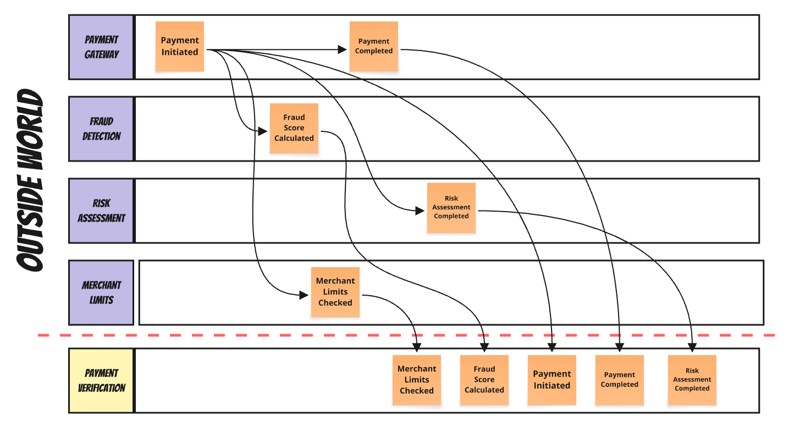
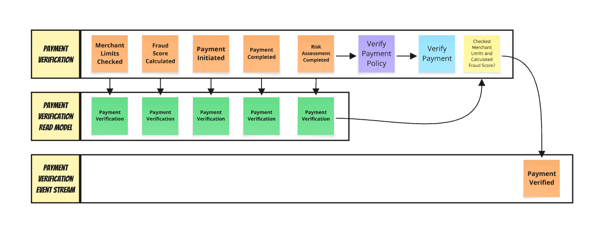

> My events came out of order! What should I do?!

**Are you familiar with the term "phantom record" and its benefits? No? Let me explain it to you today.**

**Everyone has a plan until they get punched in the mouth.** Design, architecture, and modelling are important, but it's the actual code that reaches production. That's also the place where we see all those nasty issues that we haven't foreseen, like: race conditions, eventual inconsistency, idemNotency, etc.



We realise that our BBC Architecture is just a Box-Box Cylinder on paper; in reality, things get messy. We go from a 2D layout to a 3D or even a 4D view. 

We see that our business processes are not so linear and predictable as we draw them. Of course, we have somewhere in the back of our mind that subprocesses can go in parallel, but somehow our tests go down the happy path. Then bugs and incidents come in.

We learn the hard way that real processes have delays; they run in parallel. For instance, when you process a payment, fraud checking, risk assessment, and merchant validation happen simultaneously. That's efficiency, not a flaw. 

And the sad part is that it's our role to provide this efficiency. Yelling at event-driven clouds won't help.

## Race Conditions in EDA

When we distribute our systems, we're getting better isolation of failure, we can deploy changes at a different pace, but... But we also get communication going at various paces. We can no longer get a unified view of the business actions in the order of appearance. Now each service has its own linearity. 

To integrate services predictably, we're using messaging tools. They provide us with durability, retries when the recipient is unavailable, and ensure that information flows and data are delivered effectively. Still, they're not magical creatures; they have their limits. We can't cheat physics.

Between one service and the other, we're putting in a queue. That's the place where we can achieve an ordering guarantee. Typically, one queue, one consumer means that we can achieve ordering. Still, not all tools are giving us that. 

Out of order issues may happen when the RabbitMQ queue has multiple consumers racing for messages. When we add consumers, we get better throughput, but we're risking ordering issues.

Out of order issues may also happen when you're using tools like SQS or Google PubSub, which only guarantee best-effort ordering. 

Or when your outbox pattern deletes processed messages and loses sequence.

Or when network delays shuffle carefully ordered streams. 

It's safe to say that you won't get any ordering guarantee between different queues. Since queues represent communication flows between modules, we should not assume strict ordering in cross-module communication.



## Events vs Rumours?

Continuing with the payment verification process example: Fraud module publishes to one queue. Risk assessment for another. The payment gateway to a third. Messages arrive at your module in the order your system received them, not the order they were created. Fraud detection service flags a high-risk payment at 10:00:01. The payment initiation event from the gateway, created at 10:00:00, arrives at 10:00:02. The fraud score arrives before the payment exists in your system. You might think sorting by timestamp solves this. It doesn't. Clock skew between services means timestamps lie. Each service node has its own time. It may be similar, but if you have a system with high throughput, the skew may be significant enough, causing more issues than actual help.

But, well, that's the same case when you're getting information from the outside world. You can get multiple friends sending you some news, you can get them at different paces, and read them in a different order. You may get obsolete news and then newer, but it can go the other way round. You're only sure of which you received those messages; to get the truth, you need to correlate that information and do fact-checking based on some rules (e.g. which source is more reliable, newer, etc). Then you can deduct the actual information.

We're saying that in the event-driven world, events are facts. But that's just half the truth.

Those events that we store/publish are facts for us, or at least represent the current state of our knowledge.

**The events from external systems are rumours at best. We need to interpret them to make them (our) facts.**

Ok, but what can we do? Sit and cry? 

Of course, we can do more. We'll discuss today a simple technique with Read Models that can take you far enough.

Let's say that you're using Event Sourcing in your system. You take all the messages coming from other systems, and you store them in your event store. 

Event Sourcing assumes you can rebuild state by replaying events in sequence. When `FraudScoreCalculated` arrives before `PaymentInitiated`, the payment doesn't exist. You can't apply a fraud score to nothing. You realise that when your carefully designed domain model throws exceptions. This should never happen, aye?

This isn't specific to Event Sourcing. Even if you don't use it but just update read models directly from events, you have the same problem. Your read model update handler for `FraudScoreCalculated` looks for a payment document to update. No document exists. The update fails.

Such issues are a recurring theme in my consulting, as they are a common concern for my customers. My advice is usually: Don't try to fight them. 

Store data as it arrives and "denoise" on your side. Interpret them and save your own "facts". Acknowledge the need for a [split between internal and external events](/en/internal_external_events/). Use an Anti-Corruption Layer (ACL) pattern to protect from external chaos.

## Read models as Anti-Corruption Layer

Read models can be used as such an ACL. A read model document can have a partial state, with optional fields that are filled as events arrive. You can process each event, updating the fields it can, ignoring those it can't, and making decisions based on the available data.

Let's explore how to apply this in practice using our payment orchestration scenario. Let's say we're gathering information about the payment verification process, displaying its state, and performing follow-up operations once the process is complete.

When we trigger payment, we need to correlate data from the external payment gateway with our own modules, which calculate fraud scores, check limits, and assess risk. 

We could define events using TypeScript, as:

```typescript
type PaymentVerificationEvent =
  | PaymentInitiated
  | FraudScoreCalculated
  | RiskAssessmentCompleted
  | MerchantLimitsChecked
  | PaymentCompleted
  | PaymentDeclined;
```
Having

```typescript
type PaymentInitiated = {
  type: "PaymentInitiated";
  data: {
    paymentId: string;
    amount: number;
    currency: string;
    gatewayId: string;
    initiatedAt: Date;
  };
};

type FraudScoreCalculated = {
  type: "FraudScoreCalculated";
  data: {
    paymentId: string;
    score: number;
    riskLevel: "low" | "medium" | "high";
    calculatedAt: Date;
  };
};

type RiskAssessmentCompleted = {
  type: "RiskAssessmentCompleted";
  data: {
    paymentId: string;
    riskScore: number;
    factors: string[];
    assessedAt: Date;
  };
};

type MerchantLimitsChecked = {
  type: "MerchantLimitsChecked";
  data: {
    paymentId: string;
    withinLimits: boolean;
    dailyRemaining: number;
    checkedAt: Date;
  };
};

type PaymentCompleted = {
  type: "PaymentCompleted";
  data: { paymentId: string; completedAt: Date };
};

type PaymentDeclined = {
  type: "PaymentDeclined";
  data: { paymentId: string; reason: string; declinedAt: Date };
};
```

Let's say the fraud system flagged the payment as high-risk before it even existed in your system. Approval happened before the risk assessment was completed. The example race condition can look as follows w

```
10:15:32.123 - FraudScoreCalculated (score: 85, high risk)
10:15:32.145 - PaymentInitiated (amount: $500)
10:15:32.167 - PaymentCompleted (approved by automated system)
10:15:32.201 - RiskAssessmentCompleted (risk: medium)
10:15:32.234 - MerchantLimitsChecked (within limits)
```

If we assume that things go as on the whiteboard, and handlers can't process events for non-existent payments, then we'll be the ones who get punched in the mouth by reality. They will fail to find documents to update. 

The first step is to embrace that we have a problem. Actually, it's not a problem, but rather a challenge - a scenario we just need to support.

We can start by defining a document that represents a payment's verification state. The document should include optional fields since you can't predict which event will arrive first. The projection function processes each event and updates this document, creating it if necessary.

It can look as follows:

```typescript
type PaymentVerification = {
  paymentId: string;
  payment?: Payment;
  fraudAssessment?: FraudAssessment;
  riskEvaluation?: RiskEvaluation;
  merchantLimits?: MerchantLimits;
  decision?: Decision;
  status: "unknown" | "processing" | "approved" | "declined";
  completionPercentage: number;
  lastUpdated: Date;
  dataQuality: "partial" | "sufficient" | "complete";
};

type Payment = {
  amount: number;
  currency: string;
  gatewayId: string;
  initiatedAt: Date;
};

type FraudAssessment = {
  score: number;
  riskLevel: "low" | "medium" | "high";
  assessedAt: Date;
};

type RiskEvaluation = {
  score: number;
  factors: string[];
  assessedAt: Date;
};

type MerchantLimits = {
  withinLimits: boolean;
  dailyRemaining: number;
  checkedAt: Date;
};

type Decision = {
  approval: "approve" | "decline";
  reason: string;
  decidedAt: Date;
};
```

Besides the optional data that we'll gradually fill as events arrive, we have some mandatory fields. The obvious one is paymentId, we need to be able to correlate upcoming data from events. If you have a look at them, all of them have such information. Thanks to that, we know which payments we are verifying. If we're missing it, then we won't be able to correlate upcoming data. Then we're indeed doomed.

Of course, sometimes things can get harder. We do not always have acertain id, sometimes some other data, like external id, idempotence key, correlation id, whatever id. Still, we need to have some field, or multiple fields that allow us to point to that for this event we need to update that document.

How do we update our read model? We need a function that takes the current state (or null if it doesn't exist) and the event we apply on top of it, returning the new state.

And yes, even if the data is not in the state we expect, we can always create the _**Phantom Record**_ that represents the best state we can in the conditions we have.

What if fraud scoring arrives first?

```typescript
case 'FraudScoreCalculated': {
  // assign data we have even if record doesn't exist.
  const existing = current ?? { paymentId: event.paymentId, status: 'unknown', completionPercentage: 0, lastUpdated: new Date(), dataQuality: 'partial' };

  if (existing.fraudAssessment && event.calculatedAt <= existing.fraudAssessment.assessedAt) {
    return existing;
  }

  const fraudAssessment: FraudAssessment = {
    score: event.score,
    riskLevel: event.riskLevel,
    assessedAt: event.calculatedAt,
  };

  if (event.riskLevel === 'high') {
    return {
      ...existing,
      fraudAssessment,
      status: 'declined',
      decision: {
        approval: 'decline',
        reason: `High fraud risk detected: score ${event.score}`,
        decidedAt: event.calculatedAt,
      },
      lastUpdated: event.calculatedAt,
    };
  }

  return {
    ...existing,
    fraudAssessment,
    lastUpdated: event.calculatedAt,
  };
}
```

I told you that you should not use a timestamp, but I did it on my own. We cannot always be prim and proper. When doing ACL, sometimes we can achieve just good enough results. If the event doesn't have any [logical timestamp](https://martinfowler.com/articles/patterns-of-distributed-systems/lamport-clock.html), then we need to live with what we have. Here, we're assuming that _FraudScoreCalculated_ always comes from the same source, and then we assume that timestamps have the chance to be consistent. With that, we can use them to see if we haven't already applied this information, or the newer one. If it's older, then we just don't make any changes. Sometimes you've got to do what you've got to do.

Now, lets have a look on the payment initiation when fraud scoring might have already completed:

```typescript
const evolve = (
  current: PaymentVerification | null,
  { type, data: event }: PaymentVerificationEvent
): PaymentVerification | null => {
  switch (type) {
    case "PaymentInitiated": {
      // take what we have or create a new one
      const existing = current ?? {
        paymentId: event.paymentId,
        status: "unknown",
        completionPercentage: 0,
        lastUpdated: new Date(),
        dataQuality: "partial",
      };

      return {
        ...existing,
        payment: {
          amount: event.amount,
          currency: event.currency,
          gatewayId: event.gatewayId,
          initiatedAt: event.initiatedAt,
        },
        lastUpdated: event.initiatedAt,
      };
    }
  }
  // (...) other cases for event types
};
```

If fraud scoring was completed first, _current_ already has fraud data. The handler merges payment details into the existing state.

We can also mark that in the field that I called _dataQuality_. It may not be the perfect name, but I used it to indicate that we can have a field that lets us decide whether data is as expected, or if we hit reality. Based on that, we can decide how to display it, or whether to display it at all. Thus, the name "phantom record". It may look like phantom as it's missing some data but it's the best data we have.

```typescript
case 'PaymentCompleted': {
  const existing = current ?? { paymentId: event.paymentId, status: 'unknown' as const, completionPercentage: 0, lastUpdated: new Date(), dataQuality: 'partial' as const };

  if (existing.fraudAssessment?.riskLevel === 'high') {
    return {
      ...existing,
      decision: {
        approval: 'decline',
        reason: `Approval attempted but overridden by fraud (score: ${existing.fraudAssessment.score})`,
        decidedAt: event.approvedAt,
      },
      lastUpdated: event.approvedAt,
    };
  }

  return {
    ...existing,
    status: 'approved',
    decision: {
      approval: 'approve',
      reason: `Approved by ${event.approvedBy}`,
      decidedAt: event.approvedAt,
    },
    lastUpdated: event.approvedAt,
  };
}
```

## Waiting for Dependencies

Some decisions need multiple pieces. The `MerchantLimitsChecked` handler waits for both fraud assessment and merchant limits. If we receive merchant limits first and don't have a fraud assessment yet, we simply store the information; the same applies if it goes the other way. When we eventually get both, we can make the final update, e.g. about the final payment approval or decline.

```typescript
case 'MerchantLimitsChecked': {
  const existing = current ?? { paymentId: event.paymentId, status: 'unknown' as const, completionPercentage: 0, lastUpdated: new Date(), dataQuality: 'partial' as const };

  const merchantLimits: MerchantLimits = {
    withinLimits: event.withinLimits,
    dailyRemaining: event.dailyRemaining,
    checkedAt: event.checkedAt,
  };

  const updated = {
    ...existing,
    merchantLimits,
    lastUpdated: event.checkedAt,
  };

  // Check if we now have BOTH critical pieces
  if (updated.fraudAssessment && updated.merchantLimits) {
    // Both present - can make final decision
    if (updated.fraudAssessment.riskLevel === 'high') {
      return {
        ...updated,
        status: 'declined',
        decision: {
          approval: 'decline',
          reason: 'High fraud risk',
          decidedAt: event.checkedAt,
        },
      };
    }

    if (!updated.merchantLimits.withinLimits) {
      return {
        ...updated,
        status: 'declined',
        decision: {
          approval: 'decline',
          reason: 'Exceeds merchant limits',
          decidedAt: event.checkedAt,
        },
      };
    }

    // Both checks pass - approve
    return {
      ...updated,
      status: 'approved',
      decision: {
        approval: 'approve',
        reason: 'Verified',
        decidedAt: event.checkedAt,
      },
    };
  }

  // Don't have both yet - stay in processing
  return {
    ...updated,
    status: 'processing',
    dataQuality: 'processing'
  };
}
```

And now we're reaching the grey matter, where this can become an anti-pattern. I even made this mistake when writing this article. I wrote initially, _"we can make the final decision"_, but then changed it to _"we can make the final update"_. Why?

## Projections, ACL responsibility and Workflows

I'm sure you've used or seen Anti-Corruption Layers. They're usually places where all the weird logic lands. We want to protect our core logic, pushing all hacks to one, hidden place. This strategy makes some sense; that's why it's called Anti-Corruption Layer. Yet...

Yet, we should not push it to the limits, as we'll end up with an unmaintainable beast. With the last example, we've reached or even passed the limits of what projection should be responsible for. The projection should just interpret upcoming information and store the result. It should not make decisions. Business logic is responsible for making business logic.

What we actually ended up with in the last step is a form of [process manager, or workflow](https://www.architecture-weekly.com/p/workflow-engine-design-proposal-tell), so a state machine that listens to events, gets its current state and makes further decisions. And what's the best way to inform the outside world about making new decisions? Well, producing a new event.

We could define an event as:

```typescript
type PaymentVerificationCompleted = {
  type: "PaymentVerificationCompleted";
  data: { 
    approval: "approve" | "decline";
    reason: string;
    decidedAt: Date; 
  };
}
```

As we're making decisions, let's be frank and rename _evolve_ function to _decide_ and produce a new event when we distilled it from the messy outside world?

It could look like that:


```typescript
const decide = async (
  current: PaymentVerification | null,
  event: PaymentVerificationEvent
):
  | PaymentVerification
  | { document: PaymentVerification; events: VerificationEvent[] } => {
  const existing = current ?? {
    paymentId: event.paymentId,
    status: "unknown",
    completionPercentage: 0,
    lastUpdated: new Date(),
    dataQuality: "partial",
  };

  switch (event.type) {
    // (...) other event handlers
    case "MerchantLimitsChecked": {
      const updated = {
        ...existing,
        merchantLimits: {
          withinLimits: event.withinLimits,
          dailyRemaining: event.dailyRemaining,
          checkedAt: event.checkedAt,
        },
        lastUpdated: event.checkedAt,
      };

      return tryCompleteVerification(updated, event);
    }
    case "FraudScoreCalculated": {
      if (
        existing.fraudAssessment &&
        event.calculatedAt <= existing.fraudAssessment.assessedAt
      )
        return existing;

      const updated = {
        ...existing,
        fraudAssessment: {
          score: event.score,
          riskLevel: event.riskLevel,
          assessedAt: event.calculatedAt,
        },
        lastUpdated: event.calculatedAt,
      };

      return tryCompleteVerification(updated, event);
    }
  }
};
```

We update the state and try to complete verification if we gathered both merchant limits and risk assessment. This could be encapsulated in a dedicated method, as the logic is the same now matter which event came first:

```typescript
const tryCompleteVerification = (
  current: PaymentVerification,
  event: PaymentVerificationEvent
):
  | PaymentVerification
  | { document: PaymentVerification; events: VerificationEvent[] } => {
  // Check if we now have BOTH critical pieces
  if (!updated.fraudAssessment || !updated.merchantLimits)
    // Don't have both yet - stay in processing
    return {
      ...updated,
      status: "processing",
      dataQuality: "processing",
    };

  const decision =
    updated.fraudAssessment.riskLevel === "high"
      ? {
          approval: "declined",
          reason: "High fraud risk",
          decidedAt: event.checkedAt,
        }
      : !updated.merchantLimits.withinLimits
      ? {
          approval: "declined",
          reason: "High fraud risk",
          decidedAt: event.checkedAt,
        }
      : {
          approval: "approved",
          reason: "Verified",
          decidedAt: event.checkedAt,
        };

  return {
    document: {
      ...updated,
      status: decision.approval,
      decision,
    },
    events: [
      {
        type: "PaymentVerificationCompleted",
        data: decision,
      },
    ],
  };
};
```

We're returning not only the new state, but also the new event. It can be published to the local module queue or just stored inside the event store.

**Essentially, we're making a chaotic outside world linear based on the order of our observations.** We can't change the outside world, but we can at least know why and where we've made our decisions.



This is actually the same pattern I showed during the webinar on modelling and implementing distributed processes:

`youtube: https://www.youtube.com/watch?v=uURh5ziGfb8`

We aggregate data until we have enough of it to make the next decision. Is it perfect? Nah, but sometimes best you can is good enough.

## When This Approach Works (And When It Doesn't)

This approach works when:

**Your business logic can handle partial data**: Payment approval can often proceed with fraud score and limits check, even if risk assessment is pending. E-commerce fulfilment can start when payment is confirmed, even if the recommendation engine results are still processing.

**Eventual consistency is acceptable**: The payment dashboard might show "processing" for a few hundred milliseconds while verification completes. Most business users can tolerate brief inconsistency in exchange for system responsiveness.

**Decisions can be corrected or refined**: A payment approved with partial data can be flagged for additional review when complete risk data arrives. An order can be expedited or delayed based on a complete customer analysis.

**You have clear business rules for conflicts**: When fraud assessment contradicts approval, fraud wins. When risk assessment arrives late, it updates data quality but doesn't reverse committed decisions.

This approach struggles when:

**Perfect consistency is required**: Financial accounting, legal compliance, and safety-critical systems often can't tolerate any inconsistency, even briefly.

**Business logic requires complete data**: Some decisions genuinely can't be made with partial information. Credit limit increases might require a complete financial analysis before any approval.

**Rollback costs are high**: If reversing a decision is expensive or impossible, you need stronger ordering guarantees before committing.

**Users can't tolerate uncertainty**: Some interfaces need to show definitive status immediately, not "processing" or "partial data available."

## Conclusion: Embracing the Chaos

**The world is chaotic, and we can stop the chaos, but we can stop fighting the chaos.** External events are rumours about what happened in other systems. Your read model can store the information you derive from those rumours. The evolve function processes whatever arrives, in whatever order, building state incrementally, making your local interpretation.

Undeniably, it's a workaround of some sort. But it's also an acknowledgement that distributed systems don't guarantee order across boundaries. When you can't control the topology, you adapt on your side. Store data as it arrives. Denoise in your projections. Create clean internal events for downstream systems.

Sometimes the proper solution is fixing your message topology. Route related events to the same partition. Use predictable identifiers for correlation. But when external systems constrain your options, when organisational boundaries limit your control, when legacy integrations force your hand - you've got to do what you've got to do.

Build your local models and live with partial state. Process events in any order. Make decisions with available data. That's how you build reliable systems on unreliable foundations.

**If you're dealing with such issues, I'm happy to help you through consulting or mentoring. [Contact me](mailto:oskar@event-driven.io) and we'll find a way to unblock you!**

Cheers!

Oskar

p.s. **Ukraine is still under brutal Russian invasion. A lot of Ukrainian people are hurt, without shelter and need help.** You can help in various ways, for instance, directly helping refugees, spreading awareness, putting pressure on your local government or companies. You can also support Ukraine by donating e.g. to [Red Cross](https://www.icrc.org/pl/donate/ukraine), [Ukraine humanitarian organisation](https://savelife.in.ua/pl/donate/) or [donate Ambulances for Ukraine](https://www.gofundme.com/f/help-to-save-the-lives-of-civilians-in-a-war-zone).
